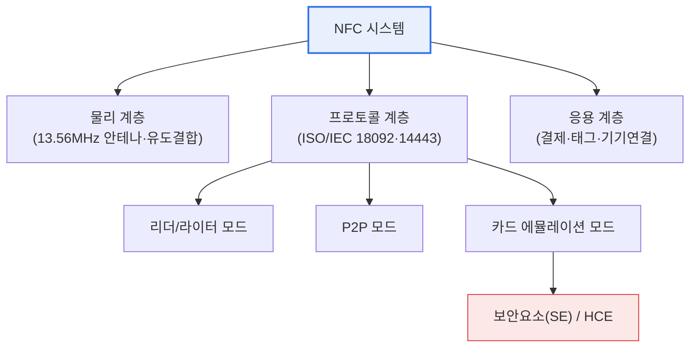
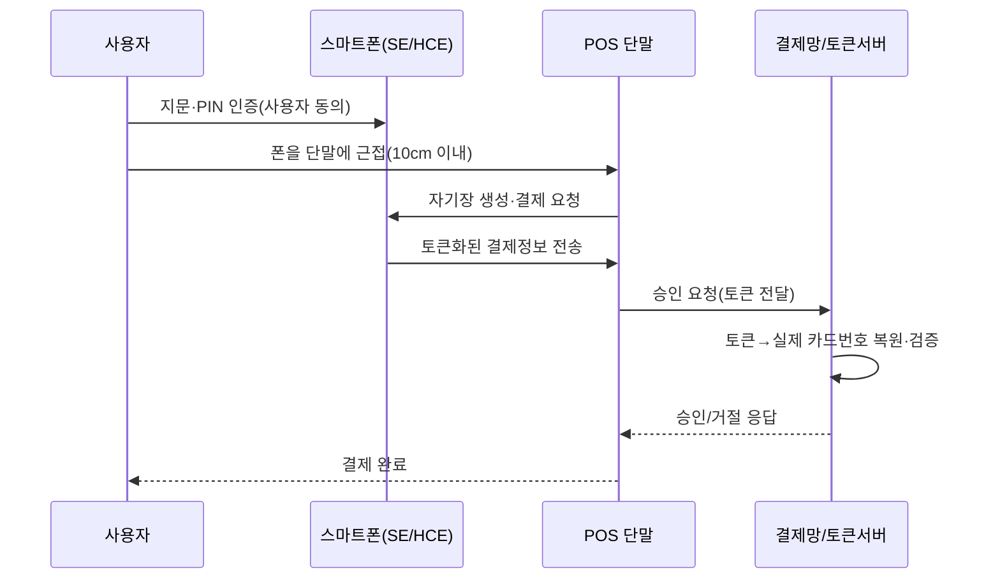

# NFC(Near Field Communication)

## 1. 개요

### 가. 정의
> **NFC(Near Field Communication)** 는 13.56MHz 주파수 대역에서 **약 10cm 이내의 극근거리에서만 무선으로 데이터를 주고받는** 비접촉식 근거리 통신 기술이다. RFID 기술을 기반으로 발전했으며, ISO/IEC 18092(NFCIP-1)와 ISO/IEC 14443을 표준으로 삼아 스마트폰에 내장되어 결제·태그·기기 연결의 사실상 표준이 되었다.

NFC를 이해하는 핵심은 '**도달 거리가 짧다는 것이 왜 단점이 아니라 장점인가**'이다. 대부분의 무선 기술은 더 멀리, 더 빠르게 도달하는 것을 목표로 삼지만, NFC는 정반대로 도달 거리를 의도적으로 10cm 이내로 제한했다. 10cm라는 짧은 거리는 사용자가 **의도적으로 기기를 가까이 대는 행위**를 요구하기 때문이다. 이 물리적 근접 행위 자체가 "나는 이 결제/인증에 동의한다"는 명시적 의사표시가 되므로, 별도의 복잡한 페어링·비밀번호 입력 없이도 직관적이면서 안전한 상호작용이 가능하다. 지하철 개찰구에 카드를 대는 순간의 자연스러움이 바로 이 설계 철학의 결과다.

이러한 설계는 '거리가 곧 보안'이라는 역발상에 기반한다. 통신 반경이 넓으면 공격자가 멀리서 몰래 신호를 가로채거나 위조할 수 있지만, 10cm 안에 물리적으로 접근해야 한다면 공격 난이도가 극적으로 올라간다. 즉 NFC는 물리적 제약을 보안 자산으로 전환한 대표적 사례이며, 이것이 Bluetooth·Wi-Fi 같은 장거리 기술과 구분되는 근본적 차별점이다.

### 나. 등장 배경 및 필요성
NFC는 2004년 소니·NXP(당시 필립스)·노키아가 결성한 NFC Forum을 중심으로 표준화가 추진되었다. 배경에는 교통카드·신용카드로 이미 대중화된 비접촉 스마트카드(RFID) 인프라를, **별도의 전용 카드 없이 스마트폰 한 대로 통합**하려는 산업적 요구가 있었다. 사용자는 지갑 속 여러 장의 카드를, 사업자는 카드 발급·배포 비용을 줄이고 싶어 했고, 스마트폰이라는 범용 단말이 그 통합의 그릇이 되었다.

특히 결제·인증 영역에서는 '빠르고, 오조작이 없으며, 사용자 의도가 분명해야 한다'는 세 가지 요구가 동시에 존재한다. NFC는 수십 ms의 연결 지연, 10cm의 명확한 조작 반경, 태그·카드·P2P를 아우르는 유연성으로 이 요구를 한꺼번에 충족했고, 그 결과 모바일 결제·출입통제·기기 간 간편 연결의 공통 인터페이스로 자리 잡았다.

### 다. 특징 및 동작 원리
NFC는 저전력·빠른 연결(수십 ms)이 특징이며, 능동(Active)과 수동(Passive) 모드를 모두 지원한다. 능동 모드에서는 양쪽 기기가 모두 자기장을 생성하고, 수동 모드에서는 한쪽만 자기장을 만들고 다른 쪽은 그 장에서 힘을 얻는다. 특히 **수동 태그는 자체 전원이 없어도** 리더가 만드는 전자기장에서 유도 전력을 얻어 동작하는데, 이 덕분에 배터리 없는 스티커 태그·플라스틱 카드가 가능하다. 예컨대 전시회 포스터에 붙은 얇은 NFC 스티커는 전원이 전혀 없지만, 폰을 대는 순간 폰이 만든 자기장에서 전력을 공급받아 URL을 전송한다.

통신은 **자기유도 결합(Inductive Coupling)** 방식으로 이뤄진다. 리더의 안테나 코일에 고주파 전류가 흐르면 13.56MHz의 교류 자기장이 형성되고, 근접한 태그 코일에 유도 전류가 발생한다. 데이터는 이 자기장을 부하 변조(Load Modulation) 등으로 변화시켜 전달하며, 전송 속도는 106/212/424 kbps 수준이다. 이는 대용량 파일 전송에는 느리지만, 결제 토큰이나 태그 URL 같은 수백 바이트 단위 데이터를 순식간에 주고받기에는 충분하다.

## 2. NFC 전체 구조와 동작 모드

먼저 NFC 시스템의 전체 구성을 개괄하면, 물리 계층(13.56MHz·안테나)-프로토콜 계층(ISO 표준)-응용 계층(결제·태그)으로 나뉘며, 스마트폰은 이 세 계층을 한 칩(NFC 컨트롤러 + 보안요소)으로 집약한다.

```mermaid
flowchart TB
  N["NFC 시스템"] --> HW["물리 계층<br/>(13.56MHz 안테나·유도결합)"]
  N --> PR["프로토콜 계층<br/>(ISO/IEC 18092·14443)"]
  N --> AP["응용 계층<br/>(결제·태그·기기연결)"]
  PR --> M1["리더/라이터 모드"]
  PR --> M2["P2P 모드"]
  PR --> M3["카드 에뮬레이션 모드"]
  M3 --> SE["보안요소(SE) / HCE"]
  style N fill:#e8f0fe,stroke:#2f6fed,stroke-width:2px
  style SE fill:#fde8e8,stroke:#d33,stroke-width:1px
```

NFC의 세 동작 모드는 스마트폰이 통신 과정에서 **어떤 역할을 맡느냐**로 나뉜다. 이 구분은 단순한 분류가 아니라, 같은 하드웨어가 상황에 따라 리더가 되기도 하고 카드가 되기도 하는 NFC의 유연성을 보여준다.

**가. 리더/라이터 모드** 에서 폰은 태그를 읽고 쓰는 리더가 된다. 능동 기기인 폰이 자기장을 만들고, 수동 태그가 그 안에서 데이터를 응답한다. 박물관 전시물 옆 태그를 찍어 해설을 불러오거나, 제품 포장의 태그로 정품 여부를 확인하는 것이 대표적이다. 이 모드의 핵심 가치는 '오프라인 사물에 디지털 정보를 연결'하는 데 있다.

**나. P2P(Peer-to-Peer) 모드** 에서는 두 능동 기기가 대등하게 데이터를 교환한다. 한쪽이 먼저 자기장을 만들면 다른 쪽이 응답하고, 역할을 번갈아 수행한다. 초기에는 안드로이드 빔을 통한 명함·사진 교환에 쓰였으나, 실제로는 Bluetooth·Wi-Fi Direct의 **연결 정보를 NFC로 먼저 교환(핸드오버)** 하고 대용량 전송은 고속 무선으로 넘기는 용도가 더 실용적이었다. 즉 NFC가 '악수'를 하고 본 대화는 Bluetooth가 맡는 구조다.

**다. 카드 에뮬레이션(Card Emulation) 모드** 는 가장 산업적 파급이 큰 모드다. 폰이 마치 신용카드·교통카드처럼 행세하여, 기존 결제 단말기(POS)가 폰을 물리 카드로 인식하게 한다. 삼성페이(비접촉)·애플페이·구글월렛의 결제가 모두 이 모드이며, 사무실 출입증·모바일 신분증도 여기에 속한다. 이 모드는 다시 결제 자격증명을 어디에 보관하느냐에 따라, 물리 칩인 **보안요소(SE)** 에 두는 방식과 소프트웨어로 처리하는 **HCE(Host Card Emulation, 안드로이드 4.4~)** 로 나뉜다.

| 모드 | 폰의 역할 | 자기장 생성 | 대표 활용 |
|---|---|---|---|
| **리더/라이터** | 리더(읽는 쪽) | 폰 | 포스터·제품 태그 조회, 정품 인증 |
| **P2P** | 대등한 교환 주체 | 번갈아 | 연결정보 핸드오버, 명함·파일 교환 |
| **카드 에뮬레이션** | 카드(읽히는 쪽) | POS 단말 | 모바일 결제·교통카드·출입증·신분증 |

## 3. 결제 처리 절차와 보안 아키텍처

카드 에뮬레이션 기반 모바일 결제가 실제로 어떻게 흐르는지를 단계로 보면, NFC의 보안이 '거리'뿐 아니라 '토큰화'와 '격리 보관'의 다층 구조 위에 있음을 알 수 있다.

```mermaid
sequenceDiagram
  participant U as 사용자
  participant P as 스마트폰(SE/HCE)
  participant T as POS 단말
  participant N as 결제망/토큰서버
  U->>P: 지문·PIN 인증(사용자 동의)
  U->>T: 폰을 단말에 근접(10cm 이내)
  T->>P: 자기장 생성·결제 요청
  P->>T: 토큰화된 결제정보 전송
  T->>N: 승인 요청(토큰 전달)
  N->>N: 토큰→실제 카드번호 복원·검증
  N-->>T: 승인/거절 응답
  T-->>U: 결제 완료
```

이 절차에서 주목할 점은 **실제 카드번호(PAN)가 단말이나 통신 구간에 전혀 노출되지 않는다** 는 것이다. 폰은 카드번호 대신 일회성·기기 종속적인 **토큰(Token)** 을 전달하고, 토큰을 실제 카드번호로 되돌리는 복원은 오직 결제망의 토큰 서버만 수행한다. 설령 통신이 가로채여도 공격자가 얻는 것은 재사용 불가능한 토큰뿐이므로 피해가 제한된다. 이것이 물리 카드 복제(스키밍)에 비해 모바일 결제가 구조적으로 안전한 이유다.

두 번째 방어선은 **격리 보관**이다. 결제 자격증명은 폰의 일반 저장소가 아니라, 하드웨어로 분리된 **보안요소(Secure Element)** 나 OS와 분리된 신뢰실행환경에 보관되어, 악성 앱이 접근하지 못한다. HCE 방식은 물리 SE 대신 클라우드 기반 토큰과 제한된 유효기간의 자격증명으로 위험을 낮춘다.

세 번째 방어선은 **사용자 인증**이다. 결제 직전 지문·얼굴·PIN으로 소유자 본인임을 확인하므로, 분실한 폰을 주운 사람이 그대로 결제할 수 없다. 결국 NFC 결제의 안전성은 '10cm의 물리적 근접 + 토큰화 + 하드웨어 격리 + 생체 인증'이라는 네 겹으로 구성된다.

## 4. RFID와의 비교

NFC는 RFID의 한 갈래지만 지향하는 목적이 다르며, 이 차이는 두 기술이 최적화한 '거리'에서 비롯된다. RFID가 수 미터 거리에서 다수의 물품을 동시에 빠르게 식별하는 **물류·재고 관리**에 최적화되었다면, NFC는 짧은 거리에서 안전하게 한 건을 처리하는 **결제·인증**에 특화되었다. 물류에서는 창고를 지나가는 팔레트 수백 개를 한 번에 읽어야 하므로 거리와 다중 인식이 중요하지만, 결제에서는 옆 사람 카드가 잘못 읽히면 안 되므로 오히려 거리가 짧아야 한다. 즉 같은 뿌리에서 나왔어도 요구가 정반대여서 설계가 갈린 것이다.

또한 NFC는 양방향 통신과 P2P를 지원해 두 능동 기기가 대화할 수 있지만, 일반적 RFID는 리더가 태그를 읽는 단방향에 가깝다. 이 양방향성 덕분에 NFC는 단순 식별을 넘어 협상·핸드오버 같은 복잡한 상호작용까지 소화한다.

| 구분 | NFC | RFID |
|---|---|---|
| **거리** | ≤10cm | 수 cm ~ 수 m(UHF는 최대 수십 m) |
| **주파수** | 13.56MHz(HF 고정) | LF(125kHz)·HF(13.56MHz)·UHF(860~960MHz) |
| **통신 방향** | 양방향(P2P 가능) | 주로 단방향 |
| **다중 인식** | 1:1 중심 | 다수 태그 동시 인식 |
| **주 용도** | 결제·태그·기기연결 | 물류·재고·출입·자산추적 |

## 5. 심화: 확장 활용과 최신 동향

NFC의 무게중심은 단순 결제를 넘어 **디지털 신원·모바일 키** 로 이동하고 있다. 대표 사례가 자동차 디지털 키다. Car Connectivity Consortium(CCC)이 표준화한 Digital Key는 폰을 자동차 키로 사용하되, 배터리가 방전되어도 열 수 있도록 근접·저전력에 강한 **NFC를 백업 채널**로 두고, 평상시 핸즈프리 진입은 UWB·BLE가 담당하는 조합을 채택했다. 즉 NFC는 '확실하게 대는 순간의 인증'이라는 강점 덕에 다른 무선기술과 역할을 분담하며 살아남는다.

모바일 신분증·전자여권 영역도 확장 중이다. 전자여권 칩은 ISO/IEC 14443 기반으로 NFC 리더가 읽을 수 있고, 모바일 운전면허증·디지털 신분증도 NFC 태깅으로 오프라인 검증을 지원하는 방향으로 발전하고 있다. 이는 '10cm 근접 = 본인 제시'라는 직관이 신원 확인 맥락에서도 그대로 유효하기 때문이다.

경쟁·보완 기술 관점에서 NFC는 QR결제·BLE·UWB와 공존한다. QR결제는 전용 하드웨어(NFC 안테나·SE) 없이 카메라만으로 가능해 소상공인 보급이 빨랐지만, 조준·스캔 과정이 필요해 '대는 순간 완료'되는 NFC의 즉시성에는 미치지 못한다. UWB는 수 cm 단위의 정밀 거리 측정으로 릴레이 공격에 더 강하지만 하드웨어 보급률이 낮다. 이처럼 각 기술은 트레이드오프가 뚜렷해, 단일 기술이 다른 기술을 완전히 대체하기보다 상황별로 병용되는 구도가 정착되고 있다.

보안 측면의 최신 화두는 **릴레이 공격(Relay Attack)** 대응이다. 공격자가 정상 폰과 정상 단말 사이의 통신을 중계 장비로 이어붙여 '거리 제약'을 무력화하는 공격인데, 응답 시간을 정밀 측정하는 **거리 한정(Distance Bounding)** 기법과, 앞서 언급한 UWB 정밀 측위 결합으로 대응이 강화되고 있다. 근거리라는 물리적 전제가 기술로 위조될 수 있다는 점에서, NFC의 '거리=보안' 공식은 부가적 검증으로 계속 보강되는 중이다.

## 6. 고려사항 및 시사점(기술사 관점)

1. **모바일 결제 생태계의 핵심 인프라이자 표준 인터페이스.** NFC는 별도 전용 카드·하드웨어 없이 스마트폰만으로 카드·교통·출입을 통합했다는 점에서 사용자 경험 혁신의 대표 사례다. 기술사 답안에서는 단순 통신기술이 아니라 '결제·인증 산업의 공통 플랫폼'으로 위상을 잡아야 한다.

2. **보안은 물리적 거리에만 의존하지 않는 다층 구조로 설계해야 한다.** 10cm 제약, 토큰화, 보안요소·HCE 격리, 생체 인증, 릴레이 공격 대응까지 계층별 방어가 결합되어야 실효적 안전이 확보된다. '거리가 짧으니 안전하다'는 단정은 릴레이 공격 앞에서 무너지므로 경계해야 한다.

3. **경쟁·보완 기술과의 역할 분담 전략이 중요하다.** QR(보급성)·BLE(연속성)·UWB(정밀 측위)와 트레이드오프를 이해하고, NFC는 '명확한 의도 표현이 필요한 인증·결제'에 배치하는 것이 합리적이다. 자동차 디지털 키처럼 다중 무선기술을 계층적으로 조합하는 설계가 실무 표준이 되고 있다.

4. **디지털 신원·모바일 키로의 확장에 대비한 상호운용성·표준 준수가 요구된다.** ISO/IEC 18092·14443, NFC Forum 태그 규격, CCC Digital Key 등 표준을 준수해야 이종 단말·인프라 간 호환이 보장된다. 신분증·차량키 등 고신뢰 영역으로 갈수록 표준 적합성과 인증체계가 도입 성패를 좌우한다.

5. **개인정보·프라이버시 관점의 통제도 병행해야 한다.** 태그 기반 위치·행동 추적, 스키밍 우려에 대비해 최소 수집·암호화·사용자 동의 절차를 설계에 포함해야 하며, 결제 이력 같은 민감정보의 보관·파기 정책이 함께 마련되어야 한다.

## 참고자료
- NFC Forum(표준·기술 개요): https://nfc-forum.org/
- ISO/IEC 18092(NFCIP-1): https://www.iso.org/standard/56692.html
- Car Connectivity Consortium — Digital Key: https://carconnectivity.org/digital-key/

---

> **한 줄 요약**: NFC는 *13.56MHz·10cm 이내 비접촉 근거리 통신* 으로, 짧은 도달 거리를 오히려 보안·직관성의 장점으로 삼아 리더·P2P·카드에뮬레이션 세 모드를 지원하며, 토큰화·보안요소(SE/HCE)·생체인증·거리한정의 다층 방어와 결합해 모바일 결제의 핵심이 되었고 디지털 신원·모바일 키로 확장되고 있다.
