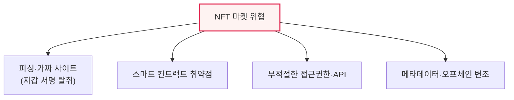

# NFT 마켓플레이스의 특성과 보안 취약점

## 1. 개요

### 가. 배경
> NFT(대체 불가능 토큰) 시장이 커지며 그 거래 창구인 **NFT 마켓플레이스가 해커의 주요 표적**이 되고 있다. NFT의 고유한 특성이 새로운 보안 위협을 낳으므로, 이를 이해하고 대응해야 한다.

NFT 마켓플레이스가 보안에 취약한 근본 이유는 '**NFT의 특성과 블록체인·웹의 결합 지점**'에 있다. NFT는 블록체인에 기록되어 위변조가 불가능하고 소유권이 명확하다는 강점이 있지만, 정작 거래를 중개하는 마켓플레이스는 일반 웹 서비스이고, 사용자의 자산은 개인 지갑(프라이빗 키)으로 통제된다. 여기서 취약점이 생긴다. 블록체인 위 NFT는 안전해도, 그 NFT를 사고파는 웹 애플리케이션이 해킹되거나, 사용자가 속아서 지갑 서명을 잘못하면 자산을 잃는다. 특히 블록체인의 '**되돌릴 수 없음**'이라는 특성은 양날의 검이다. 정상 거래는 안전하지만, 한 번 탈취된 NFT나 잘못 승인된 거래는 취소할 수 없어 피해가 확정된다. 즉 NFT 자체의 보안과 그것을 다루는 서비스·사용자의 보안은 별개이며, 후자가 실제 사고의 대부분을 차지한다.

### 나. NFT의 특성
| 특성 | 내용 |
|---|---|
| **대체 불가능성** | 각 토큰이 고유(1:1 식별) |
| **소유권 증명** | 블록체인에 소유·거래 이력 기록 |
| **비가역성** | 거래 취소·되돌리기 불가 |
| **오프체인 연계** | 실제 콘텐츠는 외부(IPFS 등)에 저장 |

## 2. NFT 마켓플레이스 보안 취약점

| 취약점 | 내용 |
|---|---|
| **피싱·서명 탈취** | 가짜 사이트로 지갑 서명 유도, 자산 탈취 |
| **스마트 컨트랙트 결함** | 컨트랙트 로직 취약점 악용 |
| **접근권한·API 취약** | 부적절한 인가로 무단 거래·조작 |
| **메타데이터 변조** | 오프체인 콘텐츠·링크 변조·소실 |
| **가짜 NFT·도용** | 저작물 무단 발행, 사칭 판매 |

특히 피싱으로 사용자의 지갑 서명(승인)을 탈취하면, 공격자가 사용자 자산을 합법적 거래처럼 이전할 수 있어 되돌릴 수 없다.

## 3. 대응 방안

| 구분 | 대응 |
|---|---|
| **마켓플레이스** | 웹 보안(WAF·인증), 스마트 컨트랙트 감사, API 접근통제 |
| **사용자** | 지갑 서명 신중(권한 확인), 피싱 사이트 주의, 하드웨어 지갑 |
| **NFT 자산** | 저작권·진위 검증, 오프체인 콘텐츠 무결성(IPFS 해시) |
| **거래 안전** | 이상거래 탐지, 승인 권한 최소화·회수 |

## 4. 고려사항 및 시사점

1. **비가역성이 위협을 증폭**한다. 블록체인 거래는 되돌릴 수 없으므로, 사후 복구가 불가능하다. 따라서 사전 예방(서명 신중·피싱 차단)이 무엇보다 중요하다.
2. **온체인·오프체인 보안의 분리**를 이해해야 한다. NFT 자체(온체인)는 안전해도 마켓플레이스(웹)·지갑(사용자)·콘텐츠(오프체인)가 취약하면 자산을 잃으므로, 전 계층을 통합 보호해야 한다.
3. **스마트 컨트랙트 감사가 필수**다. 컨트랙트의 취약점은 대규모 탈취로 이어지므로, 배포 전 전문 감사와 지속적 취약점 점검이 요구된다.

---

> **한 줄 요약**: NFT 마켓플레이스는 *비가역성·오프체인 연계 등 NFT 특성* 으로 인해 피싱 서명 탈취·스마트 컨트랙트 결함·API 취약점의 위협을 받으며, 온체인·마켓·사용자·오프체인 전 계층 보안과 컨트랙트 감사·사용자 서명 주의로 대응한다.
