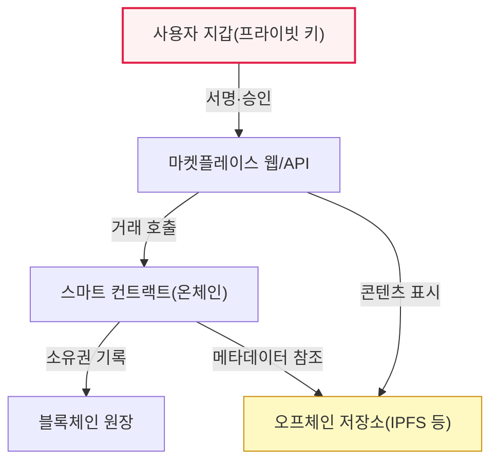
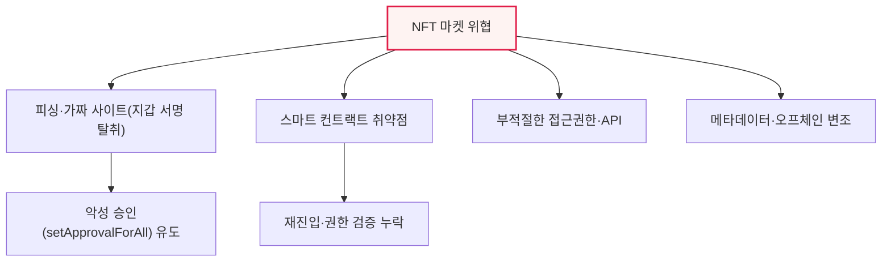

# NFT 마켓플레이스의 특성과 보안 취약점

## 1. 개요

### 가. 정의와 배경
> **NFT(Non-Fungible Token, 대체 불가능 토큰)**는 블록체인에 기록되어 각각이 고유하고 서로 대체할 수 없는 디지털 자산 증표이며, **NFT 마켓플레이스**는 이 NFT를 발행(minting)·거래·전시하는 온라인 플랫폼이다. 시장이 커지면서 이 거래 창구가 **해커의 주요 표적**이 되고 있어, NFT의 고유 특성이 낳는 새로운 보안 위협을 이해하고 대응해야 한다.

NFT 마켓플레이스가 구조적으로 보안에 취약한 근본 이유는 '**NFT의 특성과 블록체인·웹·사용자가 만나는 결합 지점**'에 있다. NFT는 블록체인에 기록되어 위·변조가 불가능하고 소유권이 암호학적으로 명확하다는 강점이 있지만, 정작 거래를 중개하는 마켓플레이스는 일반적인 웹 애플리케이션이고, 사용자의 자산 통제권은 개인 지갑의 프라이빗 키(private key)에 달려 있다. 바로 이 접점에서 취약점이 발생한다. 블록체인 위의 NFT 자체는 안전해도, 그것을 사고파는 **웹 서비스가 해킹되거나, 사용자가 속아서 지갑 서명(트랜잭션 승인)을 잘못하면 자산을 잃는다.**

특히 블록체인의 '**되돌릴 수 없음(비가역성)**'이라는 특성은 양날의 검이다. 정상 거래에서는 이중지불·거래 조작을 막는 강점이지만, 한 번 탈취된 NFT나 잘못 승인된 거래는 취소·환불이 불가능해 피해가 그대로 확정된다. 은행 계좌라면 이상거래를 사후에 정지·환수할 수 있지만, 온체인 거래에는 그런 '되돌리기 버튼'이 없다. 즉 **NFT 자체의 보안과 그것을 다루는 서비스·사용자의 보안은 별개**이며, 실제 사고의 대부분은 후자, 즉 마켓플레이스·지갑·사용자 행위 계층에서 발생한다는 점이 이 주제의 핵심 통찰이다.

### 나. NFT의 특성과 보안 함의
NFT의 네 가지 대표 특성은 각각 보안에 직접적인 영향을 준다. 표에 앞서 그 함의를 짚으면, **대체 불가능성**은 각 토큰이 고유 가치를 지녀 도난 대상이 특정된다는 뜻이고, **소유권 증명**은 이력이 투명하지만 동시에 자산 규모가 공개되어 표적이 노출된다는 양면성이 있다. **비가역성**은 앞서 본 대로 사후 복구를 원천 차단하며, **오프체인 연계**는 정작 값비싼 콘텐츠(이미지·영상)가 블록체인이 아닌 외부 저장소에 있어 그 지점이 별도의 공격면이 된다는 점을 시사한다.

| 특성 | 내용 | 보안 함의 |
|---|---|---|
| **대체 불가능성** | 각 토큰이 고유(1:1 식별) | 고가 자산이 특정되어 표적화 |
| **소유권 증명** | 블록체인에 소유·거래 이력 기록 | 투명하나 보유 자산·규모 노출 |
| **비가역성** | 거래 취소·되돌리기 불가 | 사후 복구 불가, 예방이 유일 대응 |
| **오프체인 연계** | 실제 콘텐츠는 외부(IPFS 등)에 저장 | 링크·콘텐츠 변조·소실의 공격면 |

## 2. NFT 거래 구조와 위협 지점

NFT 거래는 단일 시스템이 아니라 여러 계층이 연동되는 구조다. 사용자의 **지갑(프라이빗 키)**, 마켓플레이스의 **웹 프런트엔드·백엔드 API**, 온체인의 **스마트 컨트랙트**, 그리고 콘텐츠를 담는 **오프체인 저장소(IPFS 등)**가 하나의 거래 흐름을 이룬다. 아래 구조도는 이 계층들이 어떻게 이어지는지를 보여주며, 각 연결선이 곧 잠재적 공격 지점이 된다.

```mermaid
flowchart TB
  U["사용자 지갑(프라이빗 키)"] -->|서명·승인| W["마켓플레이스 웹/API"]
  W -->|거래 호출| SC["스마트 컨트랙트(온체인)"]
  SC -->|소유권 기록| BC["블록체인 원장"]
  SC -->|메타데이터 참조| OFF["오프체인 저장소(IPFS 등)"]
  W -->|콘텐츠 표시| OFF
  style U fill:#fef3f2,stroke:#e11d48,stroke-width:2px
  style OFF fill:#fef9c3,stroke:#ca8a04
```

이 구조에서 위협은 특정 한 곳이 아니라 계층별로 분산되어 나타난다. 위협의 유형을 계통도로 정리하면 다음과 같으며, 피싱·컨트랙트 결함·API 취약·메타데이터 변조가 네 축을 이룬다.

```mermaid
flowchart TB
  N["NFT 마켓 위협"] --> P["피싱·가짜 사이트(지갑 서명 탈취)"]
  N --> S["스마트 컨트랙트 취약점"]
  N --> A["부적절한 접근권한·API"]
  N --> M["메타데이터·오프체인 변조"]
  P --> P1["악성 승인(setApprovalForAll) 유도"]
  S --> S1["재진입·권한 검증 누락"]
  style N fill:#fef3f2,stroke:#e11d48,stroke-width:2px
```

### 가. 피싱·서명 탈취
실제 NFT 탈취 사고에서 가장 빈번한 경로가 **피싱을 통한 지갑 서명 탈취**다. 공격자는 유명 마켓플레이스나 인기 프로젝트를 사칭한 가짜 사이트·이메일·SNS 링크로 사용자를 유인한 뒤, "에어드롭 수령", "민팅 참여" 같은 그럴듯한 명분으로 지갑 연결과 서명을 요구한다. 문제는 사용자가 무심코 서명하는 트랜잭션이 사실은 자신의 NFT 전부를 공격자에게 전송·승인하는 내용일 수 있다는 점이다.

기술적으로 가장 위험한 것이 `setApprovalForAll` 같은 **광범위 승인(approval)** 함수다. 이 승인 한 번으로 특정 컨트랙트가 사용자의 해당 컬렉션 전체를 대신 이전할 권한을 얻는데, 지갑 UI에서는 이 의미가 직관적으로 드러나지 않아 사용자가 위험을 인지하기 어렵다. 승인을 탈취한 공격자는 이후 사용자의 개입 없이 언제든 자산을 빼갈 수 있고, 앞서 말한 비가역성 때문에 이전이 완료되면 되돌릴 방법이 없다. 2022년 대형 마켓플레이스 사용자들을 노린 대규모 피싱 사고가 이 방식으로 다수 발생해 사회적 경각심을 높인 바 있다.

### 나. 스마트 컨트랙트 취약점
NFT의 발행·거래·로열티 지급은 스마트 컨트랙트 코드로 자동 실행되므로, **그 코드의 결함은 곧 자금 탈취로 직결**된다. 대표적으로 외부 호출 중 상태 변경을 악용하는 재진입(reentrancy), 권한 검증 누락으로 임의 사용자가 관리자 기능을 호출하는 접근제어 결함, 정수 오버플로·로직 오류 등이 있다. 컨트랙트는 한 번 배포되면 수정이 어렵고(불변성), 공개되어 누구나 코드를 분석할 수 있어 취약점이 곧바로 공격에 노출된다. 따라서 배포 전 전문 감사(audit)와 형식 검증, 배포 후 버그바운티 운영이 사실상 필수다.

### 다. 접근권한·API 취약점과 메타데이터 변조
마켓플레이스의 백엔드 API에 **부적절한 인가(authorization)**가 있으면, 공격자가 타인의 리스팅을 수정하거나 무단 거래를 성사시킬 수 있다. 또한 앞서 강조한 오프체인 연계 문제로, NFT의 실제 콘텐츠와 메타데이터가 중앙화된 서버나 가변 URL에 저장되어 있으면 **링크 변조·콘텐츠 교체·서비스 종료로 인한 소실** 위험이 생긴다. 사용자는 값비싼 NFT를 샀지만 정작 가리키는 그림이 사라지거나 바뀌는 일이 실제로 발생한다. 이 때문에 IPFS의 콘텐츠 주소(해시) 기반 저장이나 Arweave 같은 영구 저장이 권장된다.

| 취약점 | 내용 | 주요 영향 |
|---|---|---|
| **피싱·서명 탈취** | 가짜 사이트로 지갑 서명·승인 유도 | 자산 무단 이전(비가역) |
| **스마트 컨트랙트 결함** | 재진입·권한검증 누락 등 로직 취약점 | 대규모 자금 탈취 |
| **접근권한·API 취약** | 부적절한 인가로 무단 거래·조작 | 리스팅 위·변조, 무단 판매 |
| **메타데이터 변조** | 오프체인 콘텐츠·링크 변조·소실 | 자산 가치 훼손 |
| **가짜 NFT·저작권 도용** | 저작물 무단 발행, 사칭 판매 | 이용자 기만·법적 분쟁 |

## 3. 대응 방안 (계층별 방어)

대응의 핵심 원칙은 앞서 본 위협이 계층별로 분산되어 있으므로 **방어도 계층별로 통합 구성**해야 한다는 것이다. 어느 한 계층만 강화하고 다른 계층이 뚫리면 자산을 잃기 때문이다. 마켓플레이스 사업자는 웹 보안과 컨트랙트 감사를, 사용자는 서명 습관과 지갑 관리를, 자산 측면에서는 무결성과 진위 검증을 각각 책임진다.

| 구분 | 대응 |
|---|---|
| **마켓플레이스** | 웹 보안(WAF·MFA 인증), 스마트 컨트랙트 감사·형식검증, API 최소권한·인가 강화, 이상거래 탐지 |
| **사용자** | 지갑 서명 전 권한 확인(`setApprovalForAll` 경계), 피싱 사이트·링크 주의, 하드웨어 지갑 사용, 미사용 승인 정기 회수(revoke) |
| **NFT 자산** | 저작권·진위 검증, 오프체인 콘텐츠 무결성(IPFS 해시·Arweave 영구저장) |
| **거래 안전** | 이상거래·비정상 승인 탐지, 승인 권한 최소화·자동 만료, 지갑-마켓 연동 시 화이트리스트 |

특히 사용자 교육이 가장 비용 대비 효과가 크다. 대부분의 실제 피해가 코드 해킹이 아니라 **사용자를 속이는 사회공학(피싱)**에서 비롯되기 때문이다. "서명하기 전에 무엇을 승인하는지 반드시 확인", "출처 불명 링크의 지갑 연결 금지", "미사용 승인 주기적 회수"라는 세 가지 습관만으로도 상당수 사고를 예방할 수 있다.

### 가. 마켓플레이스(사업자) 관점의 심화 대응
사업자 측 방어는 '웹 애플리케이션 보안'과 '온체인 로직 보안'을 모두 요구한다는 점에서 일반 웹 서비스보다 범위가 넓다. 웹 계층에서는 WAF·MFA·세션 보호 같은 전통적 통제에 더해, 지갑 연결 시 서명 대상 트랜잭션의 의미를 사용자에게 명확히 보여주는 **투명한 서명 UX**를 제공해야 한다. 백엔드 API는 최소권한 원칙에 따라 인가를 엄격히 검증하고, 리스팅·가격 변경 같은 민감 조작에는 소유권 확인과 재인증을 요구해야 한다. 온체인 계층에서는 컨트랙트를 배포 전 전문 감사·형식 검증하고, 배포 후에도 이상 트랜잭션 모니터링과 버그바운티로 상시 점검한다.

또한 마켓플레이스는 이용자 자산을 직접 보관하지 않더라도, 사칭·가짜 컬렉션·저작권 도용을 걸러내는 **큐레이션·검증 체계**를 갖춰야 한다. 위조 컬렉션이 정품처럼 노출되면 이용자 기만과 플랫폼 신뢰 훼손으로 직결되기 때문이다. 인기 컬렉션에 대한 검증 배지, 발행자 신원 확인, 신고·차단 프로세스가 대표적 장치다.

### 나. 사용자 관점의 심화 대응
사용자 측 최선의 방어는 **키 관리와 승인 관리**로 요약된다. 고가 자산은 인터넷과 분리된 하드웨어 지갑(콜드 월렛)에 보관하고, 일상적 상호작용은 소액만 담긴 별도 '핫 월렛'으로 분리하는 지갑 분리 전략이 권장된다. 승인 측면에서는 `setApprovalForAll` 같은 광범위 승인을 남발하지 않고, 필요한 만큼만 승인하며, 거래가 끝난 뒤에는 승인 조회·회수(revoke) 도구로 불필요한 권한을 정리해야 한다. 미회수 승인이 방치되면, 훗날 해당 컨트랙트가 침해될 경우 자신의 자산까지 위험에 노출되기 때문이다.

| 대응 계층 | 핵심 조치 | 방어하는 위협 |
|---|---|---|
| **키 관리** | 하드웨어 지갑, 핫/콜드 분리, 시드 오프라인 보관 | 키 탈취·유출 |
| **승인 관리** | 최소 승인, 정기 회수, 승인 현황 점검 | 광범위 승인 악용 |
| **거래 검증** | 서명 내용 확인, 도메인·URL 재확인 | 피싱 서명 탈취 |

### 다. 자산·콘텐츠 무결성 관점의 대응
NFT의 가치는 결국 그것이 가리키는 콘텐츠에 있으므로, **오프체인 콘텐츠의 영속성과 무결성**을 확보하는 것이 자산 보호의 마지막 고리다. 메타데이터와 실제 파일을 중앙 서버의 가변 URL에 두면 링크가 끊기거나 내용이 바뀔 수 있으므로, 콘텐츠의 해시가 곧 주소가 되는 IPFS(콘텐츠 주소 지정)나 영구 저장을 지향하는 Arweave에 보관하는 것이 바람직하다. 이렇게 하면 콘텐츠가 조금이라도 바뀌면 주소가 달라져 변조를 즉시 탐지할 수 있다. 아울러 발행 단계에서 저작권·진위를 검증해 무단 발행·도용을 걸러내야, 구매자가 '가짜를 산' 뒤 발생하는 분쟁과 손실을 예방할 수 있다.

## 4. 심화 — 최신 동향과 예상 출제 방향

최근 지갑·표준 진영은 사용자가 서명 내용을 더 잘 이해하도록 돕는 방향으로 진화하고 있다. **서명 내용을 사람이 읽을 수 있게 표시하는 서명 표준(예: EIP-712 구조화 데이터 서명)**과, 위험한 승인을 사전에 경고·차단하는 지갑 보안 확장, 승인 현황을 조회·회수하게 해주는 도구들이 확산되고 있다. 또한 자산을 코드 기반 계정(스마트 컨트랙트 지갑)으로 관리해 **키 분실·탈취 시 사회적 복구(social recovery)나 거래 한도·화이트리스트**를 적용하려는 계정 추상화(Account Abstraction, ERC-4337) 흐름도 주목된다. 규제 측면에서는 가상자산 이용자 보호와 자금세탁방지(AML) 요구가 강화되며 마켓플레이스의 KYC·이상거래 보고 의무가 커지는 추세다.

기술사 관점에서 이 주제는 "**NFT의 특성을 설명하고 그로부터 파생되는 마켓플레이스의 보안 위협과 대응을 논하라**", "**블록체인 비가역성이 보안에 미치는 양면성을 설명하라**", "**온체인과 오프체인 보안의 차이와 통합 방어 전략**" 형태로 출제되기 쉽다. 답안은 (1) NFT 4대 특성과 보안 함의, (2) 지갑·웹/API·컨트랙트·오프체인의 계층별 위협, (3) 피싱 서명 탈취가 실제 피해의 다수라는 실무적 통찰, (4) 계층별·예방 중심 대응을 엮어 전개하면 설득력이 높다.

## 5. 고려사항 및 시사점

1. **비가역성이 위협을 증폭하므로 예방이 유일한 대응**이다. 온체인 거래는 되돌릴 수 없어 사후 복구가 원천 불가능하다. 따라서 서명 전 확인·피싱 차단·승인 최소화 같은 사전 예방에 자원을 집중해야 하며, 사고 대응은 확산 차단·재발 방지에 초점을 둘 수밖에 없다.
2. **온체인·오프체인 보안의 분리를 이해한 통합 방어**가 필요하다. NFT 자체(온체인)가 안전해도 마켓플레이스(웹)·지갑(사용자)·콘텐츠(오프체인) 중 한 곳이 뚫리면 자산을 잃으므로, 전 계층을 하나의 위협 모델로 보고 통합 보호해야 한다.
3. **스마트 컨트랙트 감사와 형식 검증이 필수**다. 컨트랙트 결함은 개별 사용자가 아니라 프로토콜 전체의 대규모 탈취로 번지므로, 배포 전 전문 감사·형식 검증과 배포 후 버그바운티·모니터링을 상시 운영해야 한다.
4. **사용자 중심 위협에 대한 UX·교육 투자**가 핵심이다. 실제 피해의 다수가 코드가 아니라 사람을 속이는 피싱에서 나오므로, 지갑·마켓의 서명 UX를 '무엇을 승인하는지 명확히 보이도록' 개선하고 사용자 보안 교육을 병행해야 실효를 거둔다.
5. **규제·제도와의 정합성**을 고려해야 한다. 가상자산 이용자 보호법제, AML/KYC, 저작권 보호 요구가 강화되는 흐름에서, 마켓플레이스는 이상거래 탐지·신원확인·저작권 검증 체계를 갖춰 법적 리스크와 이용자 신뢰를 함께 관리해야 한다.

## 참고자료
- OWASP Smart Contract Top 10: https://owasp.org/www-project-smart-contract-top-10/
- Ethereum, "ERC-721 Non-Fungible Token Standard": https://ethereum.org/en/developers/docs/standards/tokens/erc-721/
- Ethereum, "EIP-712: Typed structured data hashing and signing": https://eips.ethereum.org/EIPS/eip-712

---

> **한 줄 요약**: NFT 마켓플레이스는 *비가역성·오프체인 연계 등 NFT 특성*으로 인해 피싱 서명 탈취·스마트 컨트랙트 결함·API 취약·메타데이터 변조 위협을 받으며, 온체인·마켓·사용자·오프체인 전 계층 통합 보안과 컨트랙트 감사·예방 중심 사용자 서명 관리로 대응해야 한다.
