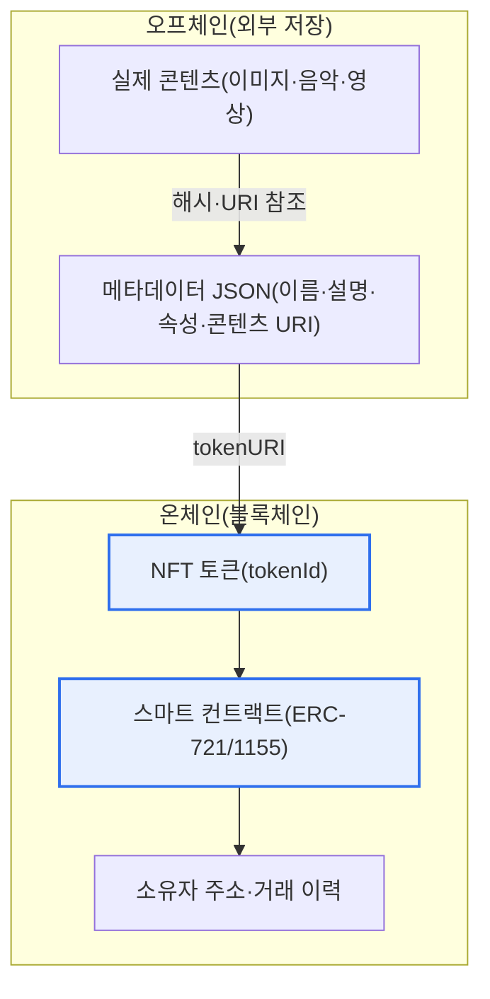
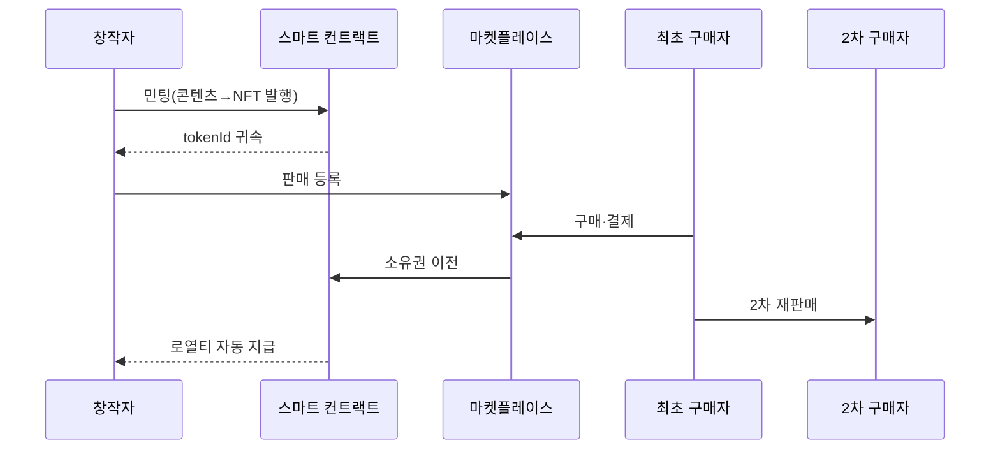

# 대체 불가능 토큰(NFT, Non-Fungible Token)

## 1. 개요

### 가. 정의
> **NFT(Non-Fungible Token)** 는 블록체인에 기록되어 **각각이 고유하고 서로 대체할 수 없는(Non-Fungible)** 디지털 토큰으로, 디지털·실물 자산(그림·음악·수집품·회원권 등)의 소유권과 진위를 위·변조 불가능하게 증명하는 수단이다.

NFT의 핵심 발상은 '**복제가 자유로운 디지털 세계에 진짜 원본과 소유권을 부여하는 것**'이다. 디지털 파일은 완벽하게 무한 복제되므로, 물리 세계의 '원본 한 점'이라는 개념이 성립하지 않았다. 누구나 같은 이미지를 내려받아 가질 수 있는 세계에서 "이것이 진짜 원본이고 그 주인은 누구인가"를 가릴 방법이 없었던 것이다. NFT는 블록체인이라는 분산 원장에 '이 자산의 현재 소유자는 누구이며 어떤 거래를 거쳐 왔는가'라는 기록을 위·변조 불가능하게 새김으로써, 복제본이 아무리 많아도 '소유권 기록의 원본성'을 보증한다.

여기서 '대체 불가능(Non-Fungible)'이 개념의 핵심이다. 대체 가능한(fungible) 자산은 같은 가치의 다른 개체로 자유롭게 교환된다. 1비트코인은 다른 1비트코인과, 만 원권은 다른 만 원권과 완전히 동일한 가치를 지녀 서로 바꿔도 무방하다. 반면 NFT는 각 토큰이 서로 다른 고유 자산과 1:1로 결속되어 있어 교환이 불가능하다. 내가 소유한 특정 작품의 NFT는 다른 사람이 소유한 다른 작품의 NFT와 결코 같지 않다. 이 고유성·불가분성 덕분에 그동안 희소성 개념을 적용하기 어려웠던 디지털 예술품·수집품·게임 아이템·멤버십에 '이 세상에 하나뿐' 혹은 '한정 발행'이라는 물리적 재화의 속성을 이식할 수 있게 되었다.

### 나. 등장 배경 및 필요성
NFT의 부상은 기술적 성숙과 시장의 요구가 맞물린 결과다. 기술적으로는 이더리움이 스마트 컨트랙트(자동 실행되는 프로그램 계약)를 대중화하면서, 소유권 이전·로열티 분배 같은 규칙을 코드로 원장에 심을 수 있게 된 것이 결정적이었다. 2017년 크립토키티(CryptoKitties)라는 수집형 게임이 이더리움 네트워크를 마비시킬 정도의 인기를 끌며 NFT의 대중적 가능성을 처음 보여주었고, 이를 계기로 고유 토큰 표준(ERC-721)이 정립되었다.

시장 측면에서는 창작·수집 활동이 디지털로 급속히 이동하면서, 창작자가 중개자(갤러리·플랫폼) 없이 직접 작품의 소유권을 판매하고 2차 거래에서도 지속적으로 로열티를 받고자 하는 요구가 커졌다. 기존 디지털 유통은 창작자가 최초 판매 이후의 재판매에서 아무런 대가를 얻지 못했으나, NFT의 스마트 컨트랙트는 '재판매될 때마다 원작자에게 일정 비율을 자동 지급'하는 로열티 구조를 코드로 강제할 수 있다. 이처럼 '디지털 자산에 소유권·희소성·지속 수익을 부여한다'는 필요가 NFT 확산의 동력이 되었다. 다만 이 로열티 강제는 마켓플레이스가 이를 존중할 때만 실효성이 있어, 이후 로열티 우회 논란으로 이어진다는 점은 뒤에서 다룬다.

## 2. 구조 및 동작 원리

NFT의 구조를 이해하는 핵심은 '무엇을 온체인에 두고 무엇을 오프체인에 두는가'이다. 아래 전체 구조도는 실제 콘텐츠·메타데이터·소유권 기록이 어떻게 계층적으로 연결되는지를 보여준다.

블록체인의 저장 비용은 매우 비싸기 때문에, 용량이 큰 이미지·음악 같은 실제 콘텐츠는 대개 IPFS(분산 파일 시스템)나 아위브(Arweave), 혹은 일반 서버 같은 오프체인에 둔다. 온체인에는 그 콘텐츠의 위치(URI)와 특성을 담은 '메타데이터'로의 링크, 그리고 소유권·거래 이력만을 기록한다. 이 계층 구조가 NFT의 강점(위·변조 불가능한 소유권 증명)과 약점(콘텐츠 자체의 지속성 취약)을 동시에 만들어낸다.

### 가. 스마트 컨트랙트와 토큰 표준
NFT의 실체는 블록체인 위에서 동작하는 스마트 컨트랙트다. 이 계약은 각 토큰에 고유한 식별번호(tokenId)를 부여하고, 어떤 주소가 어떤 토큰을 소유하는지 매핑을 관리하며, 소유권 이전(transfer)·발행(mint)·소각(burn) 같은 동작의 규칙을 코드로 정의한다. 대표 표준인 **ERC-721** 은 '토큰 하나하나가 서로 다른' 순수한 대체 불가능성을 구현한다. 반면 **ERC-1155** 는 하나의 컨트랙트에서 대체 가능 토큰과 대체 불가능 토큰을 함께 다루는 '멀티 토큰' 표준으로, 게임 아이템처럼 '같은 종류를 여러 개' 발행해야 하는 상황에서 가스비를 절감하는 장점이 있다.

표준화가 중요한 이유는 상호운용성 때문이다. 표준을 따르면 어떤 마켓플레이스·지갑이든 그 NFT를 동일한 방식으로 인식·거래할 수 있다. 만약 발행자마다 제멋대로 구현했다면 특정 플랫폼에서만 쓸 수 있는 파편화된 자산이 되었을 것이다. 표준 인터페이스가 NFT 생태계라는 시장을 성립시킨 토대인 셈이다.

### 나. 발행(민팅)과 소유권 이전
민팅(minting)은 콘텐츠를 NFT로 만들어 블록체인에 최초 등록하는 과정이다. 창작자가 메타데이터를 준비하고 컨트랙트의 발행 함수를 호출하면, 새 tokenId가 생성되어 창작자 주소에 귀속된다. 이때 이더리움 등에서는 네트워크 사용료인 가스비(gas fee)가 발생하는데, 네트워크 혼잡 시 이 비용이 수십 달러에 이르러 소액 창작물의 진입 장벽이 되기도 한다. 이를 완화하기 위해 실제 판매가 일어날 때 발행하는 '지연 민팅(lazy minting)' 기법이 쓰인다.

소유권 이전은 마켓플레이스에서 판매가 성립하면 스마트 컨트랙트가 대금 결제와 토큰 이전을 원자적으로 처리하는 방식으로 이루어진다. 모든 거래 이력이 원장에 남으므로, 특정 NFT의 최초 창작자부터 현재 소유자까지의 '출처(provenance)'가 투명하게 추적된다. 이 검증 가능한 출처야말로 미술품 진위 판별에서 NFT가 갖는 가장 실질적인 가치로 평가된다.

아래 표는 위에서 서술한 특징을 정리한 것으로, 각 항목의 근거는 앞선 문단의 설명에 있다.

| 특징 | 내용 | 실무적 함의 |
|---|---|---|
| 대체 불가능성 | 각 토큰이 고유(tokenId) | 희소성·1:1 식별 |
| 소유권 증명 | 온체인 소유·거래 이력 | 위·변조 불가 출처 추적 |
| 표준·상호운용 | ERC-721/1155 | 지갑·마켓 호환 |
| 스마트 컨트랙트 | 규칙의 코드화 | 로열티 자동 분배 |
| 오프체인 연계 | 콘텐츠는 외부, 소유권만 온체인 | 지속성 리스크 상존 |

## 3. 활용 분야 및 사례

NFT 거래의 전형적 흐름을 프로세스 관점에서 보면 아래와 같다. 이 세부 흐름도는 창작·발행에서 2차 거래·로열티까지의 생애주기를 강조한다.

디지털 아트·수집품 분야가 초기 시장을 이끌었다. 2021년 디지털 아티스트 비플(Beeple)의 콜라주 작품이 크리스티 경매에서 약 6,930만 달러에 낙찰된 사건은 NFT를 세계적 화두로 만들었고, 프로필 사진(PFP) 형태의 수집형 컬렉션이 커뮤니티 멤버십의 상징으로 거래되었다. 이는 NFT가 단순 소유를 넘어 '같은 집단에 속한다'는 정체성·소속감의 매개가 될 수 있음을 보여주었다.

게임 분야에서는 아이템·캐릭터를 NFT로 만들어 이용자가 실제 소유권을 갖고 게임 밖에서도 거래하는 P2E(Play to Earn) 모델이 등장했다. 다만 초기 P2E는 신규 유입 자금에 의존하는 구조적 취약성으로 다수가 붕괴했고, 이후에는 '재미'를 중심에 두고 소유권을 부가하는 방향으로 재편되고 있다. 회원권·티켓 분야에서는 콘서트 입장권이나 멤버십을 NFT로 발행해 위·변조와 암표를 방지하고, 소유자에게만 부가 혜택을 제공하는 방식이 시도된다.

가장 실용적 확장으로 주목받는 것은 **실물 자산 토큰화(RWA, Real World Asset)** 다. 부동산·명품·미술품·채권 같은 실물의 소유권·지분을 NFT로 표현해 진위 증명, 분할 소유, 거래 유동성을 높이는 방향이다. 예컨대 고가 명품에 NFT 형태의 디지털 보증서를 결합해 정품 인증과 소유 이력을 관리하는 사례가 늘고 있으며, 이는 투기적 이미지에서 벗어나 NFT의 무게중심을 '실질적 효용'으로 옮기는 흐름을 대표한다.

| 분야 | 대표 활용 | 사례·특징 |
|---|---|---|
| 디지털 아트·수집품 | 예술품·PFP 소유·거래 | 비플 6,930만 달러 낙찰 |
| 게임 | 아이템 소유·거래(P2E) | 재미 중심으로 재편 |
| 회원권·티켓 | 멤버십·입장권 증명 | 암표·위조 방지 |
| 실물 연계(RWA) | 부동산·명품 진위·분할소유 | 유동성·인증 강화 |
| 콘텐츠·음악 | 창작 로열티 자동화 | 2차 거래 수익 배분 |

## 4. 심화: 시장 부침과 규제·회계 동향

NFT 시장은 2021~2022년 초 폭발적 호황 이후 급격한 조정을 겪었다. 거래량과 평균 가격이 고점 대비 크게 하락하면서 '거품'이라는 비판이 제기되었는데, 이는 자산 자체의 결함이라기보다 실질 효용 없이 투기 심리에 의존한 초기 시장의 자연스러운 정리 과정으로 해석하는 시각이 우세하다. 이후 시장은 순수 수집·투기에서 앞서 언급한 RWA·티켓·멤버십·브랜드 로열티 프로그램 등 '효용 기반' 활용으로 무게중심을 옮기고 있다.

거버넌스·규제 측면의 쟁점도 부각되었다. 첫째는 **로열티 우회** 문제다. 창작자 로열티는 스마트 컨트랙트가 아니라 마켓플레이스의 정책에 의존하는 경우가 많아, 로열티를 무시하거나 선택적으로 만드는 플랫폼이 등장하며 창작자 수익 모델이 흔들렸다. 이는 '코드가 곧 법(code is law)'이라는 이상과 실제 시장 관행 사이의 간극을 드러낸 사례다. 둘째는 **증권성 판단**이다. NFT를 분할하거나 수익을 약속하는 형태로 판매하면 각국 감독당국이 이를 증권으로 볼 수 있어, 자본시장 규제의 적용 여부가 발행 구조 설계의 핵심 변수가 되었다.

국내에서도 가상자산 이용자 보호 관련 법제가 정비되는 가운데, NFT가 '가상자산'에 해당하는지 여부가 사안별로 논의된다. 일반적으로 순수 수집·감상 목적의 1점 NFT는 규제 대상 가상자산에서 제외되는 방향으로 논의되지만, 결제·투자 수단의 성격이 강하거나 대량·분할 발행되는 경우에는 규제가 적용될 수 있다는 점에서, 발행 목적과 구조에 따라 법적 성격이 달라진다는 점을 유의해야 한다(구체 적용은 관련 법령·유권해석에 따르므로 단정은 피한다). 회계·과세 측면에서도 보유·처분 손익의 인식과 세무 처리 기준이 정비되는 과정에 있다.

## 5. 고려사항 및 시사점(기술사 관점)

1. **오프체인 콘텐츠의 지속성 확보**: 소유권 기록은 온체인에 영구적이지만, 정작 콘텐츠가 일반 서버 URL을 가리키면 그 서버가 사라지는 순간 '소유권은 있으나 볼 그림은 없는' 상태가 된다. IPFS·아위브 같은 콘텐츠 주소 기반(content-addressed) 분산 저장과 온체인 해시 고정으로 무결성을 보증하고, 나아가 SVG 등으로 이미지를 온체인에 직접 저장하는 '완전 온체인' 방식까지 검토해야 한다. NFT의 신뢰는 소유권과 콘텐츠 지속성이 함께 확보될 때 완성된다.

2. **소유권과 저작권·이용권의 구분**: NFT를 산다는 것이 곧 저작권(복제·배포·2차적저작물 작성권)을 갖는 것은 아니다. 대개 소유자는 '해당 토큰의 소유'와 계약이 명시한 제한적 이용권만 얻으며, 저작권은 창작자에게 남는 경우가 많다. 이 구분이 불명확하면 무단 발행·도용·권리 분쟁이 발생하므로, 발행 시 이용 범위를 명시한 라이선스와 진위 검증 체계가 필수적이다.

3. **투기·사기·보안 위험의 관리**: 극심한 가격 변동성, 시세 조작(wash trading), 러그풀(먹튀), 피싱을 통한 지갑 탈취, 마켓플레이스 취약점 등 위험이 상존한다. 개인 키 관리(하드웨어 지갑), 컨트랙트 감사(audit), 승인(approve) 권한의 최소화 같은 보안 수칙과, 실질 효용에 근거한 가치 평가가 투자자·이용자 보호의 관건이다.

4. **환경·비용과 기술 전환**: 초기 NFT는 작업증명(PoW) 기반 이더리움의 높은 에너지 소비와 가스비가 비판받았다. 그러나 이더리움의 지분증명(PoS) 전환으로 에너지 소비가 대폭 감소했고, 레이어2(롤업) 확장으로 거래 비용도 낮아지는 추세다. 지속가능성·비용은 고정된 한계가 아니라 기술 진화로 개선되는 변수임을 인식하고 최신 동향에 근거해 판단해야 한다.

5. **표준·상호운용성과 제도 정합성**: 지갑·마켓·체인 간 상호운용성을 위해 표준 준수와 크로스체인 연계가 중요하며, 동시에 가상자산·증권·세무·개인정보 관련 법제와의 정합성을 발행 단계부터 설계해야 한다. 기술적 가능성만으로 사업을 설계하면 규제 리스크가 사후에 사업 자체를 무력화할 수 있으므로, '기술-법제-비즈니스'를 함께 설계하는 관점이 요구된다.

## 참고자료
- Ethereum, ERC-721 Non-Fungible Token Standard, https://eips.ethereum.org/EIPS/eip-721
- Ethereum, ERC-1155 Multi Token Standard, https://eips.ethereum.org/EIPS/eip-1155
- Ethereum.org, NFT 개요, https://ethereum.org/en/nft/
- 금융위원회, 가상자산 이용자 보호 관련 정책 자료, https://www.fsc.go.kr

---

> **한 줄 요약**: NFT는 *블록체인 스마트 컨트랙트로 디지털·실물 자산의 고유성·소유권을 위·변조 불가능하게 증명* 하는 대체 불가능 토큰으로, 예술·게임·회원권·RWA에 활용되나 오프체인 콘텐츠 지속성·저작권 구분·투기와 보안 위험·규제 정합성이 핵심 과제다.
