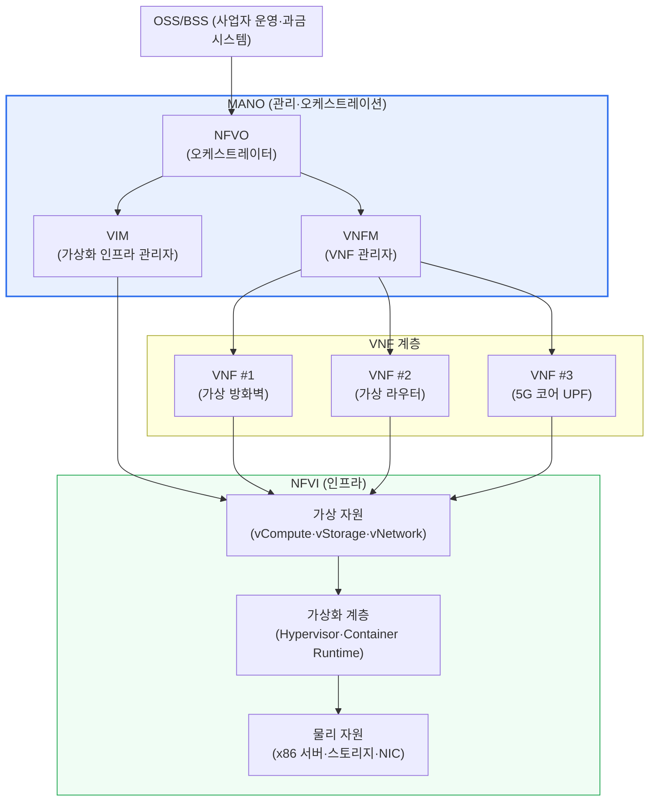
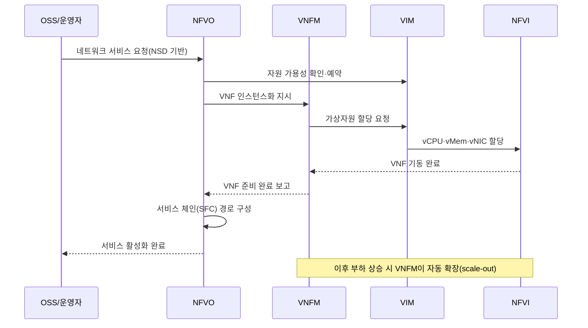

# 네트워크 기능 가상화(NFV, Network Functions Virtualization)

## 1. 개요

### 가. 정의
> **NFV(Network Functions Virtualization)** 는 방화벽·라우터·로드밸런서·DPI·EPC 등 그동안 **전용 하드웨어 장비(appliance)에 고정되어 있던 네트워크 기능**을, 범용 서버(x86) 위에서 동작하는 **소프트웨어(가상 네트워크 기능, VNF)** 로 분리·구현하여 필요에 따라 배치·확장·이동·삭제할 수 있게 하는 아키텍처 기술이다. 2012년 유럽전기통신표준협회(ETSI)의 NFV ISG(Industry Specification Group)가 통신사업자 주도로 표준화를 시작했다.

NFV의 핵심 발상은 '**네트워크 기능을 하드웨어에서 떼어내 소프트웨어로 만들자**'는 것이다. 이를 이해하려면 전통적 네트워크 장비의 구조적 한계를 먼저 짚어야 한다. 기존의 통신망은 특정 기능마다 벤더의 전용 ASIC·펌웨어에 최적화된 물리 장비(專用 하드웨어)를 두는 방식이었다. 방화벽은 방화벽 박스, 로드밸런서는 로드밸런서 박스, 세션관리(EPC)는 또 다른 박스를 사서 랙에 꽂고 케이블로 연결했다. 이 방식은 성능은 뛰어나지만, 새 서비스를 하나 올릴 때마다 장비를 구매·설치·배선·구성하는 데 수주~수개월이 걸리고, 특정 벤더에 종속되며(vendor lock-in), 용량을 초과하면 장비를 통째로 교체해야 하는 비탄력적 구조였다.

NFV는 이 구조를 근본적으로 바꾼다. 네트워크 기능을 '박스'가 아니라 범용 서버 위에서 도는 **VM 또는 컨테이너 형태의 소프트웨어(VNF)** 로 재정의함으로써, 서버 자원만 있으면 방화벽·라우터·5G 코어 기능을 **소프트웨어 설치처럼 몇 분 만에 배치**하고, 트래픽이 몰리면 인스턴스를 늘려(scale-out) 대응하며, 필요 없어지면 회수해 자원을 반납한다. 즉 NFV는 서버 가상화가 IT 인프라에 가져온 유연성을 네트워크 영역에 확장한 것으로, '네트워크의 클라우드화'라고 요약할 수 있다.

### 나. 등장 배경과 필요성
NFV가 통신사업자(Telco) 주도로 태동한 결정적 배경은 **트래픽 폭증과 수익성 악화의 괴리**다. 스마트폰·OTT·영상 트래픽이 매년 수십 % 증가하는데도 데이터 요금(ARPU)은 정체되면서, 사업자는 늘어나는 트래픽을 값비싼 전용 장비 증설로 감당하는 종래 방식으로는 수익을 낼 수 없게 되었다. 여기에 5G·IoT가 요구하는 **네트워크 슬라이싱**(하나의 물리망을 용도별 논리망으로 쪼개는 기술)과 초저지연 엣지 서비스는, 물리 장비를 일일이 두는 방식으로는 현실적으로 구현이 불가능했다. 사업자들은 IT업계가 이미 검증한 '범용 서버 + 가상화 + 자동화'를 네트워크에 도입하면 **CAPEX(자본지출)·OPEX(운영지출)를 동시에 절감**하고 신규 서비스 출시 시간(Time-to-Market)을 획기적으로 단축할 수 있다고 보았고, 이것이 2012년 세계 주요 통신사가 ETSI에 모여 NFV 백서를 발표한 직접적 동기가 되었다.

특히 NFV는 SDN과 함께 '차세대 네트워크의 양대 축'으로 거론된다. **SDN이 제어 평면과 데이터 평면을 분리해 네트워크를 '프로그래밍 가능'하게 만들었다면, NFV는 네트워크 기능을 하드웨어에서 분리해 '소프트웨어화'했다.** 둘은 독립적으로도 쓰이지만, SDN이 VNF 간 트래픽 경로를 유연하게 연결(Service Function Chaining)해 주고 NFV가 그 위에서 기능을 담당하는 식으로 상호보완할 때 시너지가 극대화된다.

## 2. NFV의 아키텍처(ETSI NFV MANO)

ETSI NFV는 전체 구조를 크게 **① VNF(가상 네트워크 기능), ② NFVI(NFV 인프라), ③ MANO(관리·오케스트레이션)** 의 세 영역으로 정의한다. 아래 그림은 이 세 영역과 주요 구성요소의 관계를 나타낸 전체 구조도다.

**VNF(Virtualized Network Function)** 는 종래 전용 장비가 수행하던 개별 네트워크 기능을 소프트웨어로 구현한 것이다. 가상 방화벽(vFW), 가상 라우터(vRouter), 가상 로드밸런서, 5G 코어의 UPF/AMF/SMF 등이 대표적이다. 하나의 논리적 서비스는 여러 VNF의 조합으로 구성될 수 있으며, 각 VNF는 다시 여러 VNFC(Component)로 나뉠 수 있다. VNF의 실체는 VM 이미지나 컨테이너 이미지이므로, 스냅샷·복제·마이그레이션 같은 가상화의 이점을 그대로 누린다. 예컨대 특정 지역에서 DDoS가 발생하면 가상 방화벽 인스턴스를 수 분 내에 여러 개 띄워(scale-out) 방어 용량을 늘리고, 공격이 잦아들면 회수하는 탄력적 대응이 가능하다.

대표적인 VNF의 유형을 정리하면 다음과 같으며, 이는 곧 종래 어떤 전용 장비가 소프트웨어로 대체되는지를 보여준다.

- **보안 계열** — 가상 방화벽(vFW), 가상 IPS/IDS, 가상 DPI(심층 패킷 검사), 가상 VPN 게이트웨이
- **네트워킹 계열** — 가상 라우터(vRouter), 가상 스위치, 가상 로드밸런서(vLB), 가상 NAT
- **이동통신 코어 계열** — 4G EPC(가상 S/P-GW, MME), 5G 코어(UPF·AMF·SMF·PCF 등)
- **가입자망·접속 계열** — vCPE(가상 고객댁내장비), vBNG, vRAN/O-RAN 기능

이처럼 하나의 물리 서버 풀 위에 성격이 전혀 다른 기능들을 동시에 올릴 수 있다는 점이 NFV의 자원 통합(consolidation) 효과이며, 서로 다른 VNF를 조합해 새로운 서비스를 신속히 설계할 수 있는 유연성의 원천이다.

**NFVI(NFV Infrastructure)** 는 VNF가 실제로 올라가는 토대로, 물리 자원(x86 서버·스토리지·네트워크 카드)과 이를 추상화하는 가상화 계층(하이퍼바이저 또는 컨테이너 런타임), 그리고 그 위에서 VNF에 제공되는 가상 자원(vCPU·vMemory·vStorage·vNetwork)으로 구성된다. NFVI의 성능은 곧 VNF의 성능을 좌우하므로, 소프트웨어 기반의 패킷 처리 병목을 극복하기 위한 가속 기술(DPDK, SR-IOV, SmartNIC 등)이 함께 적용되는 것이 일반적이다. 이 부분은 뒤의 심화 절에서 자세히 다룬다.

**MANO(Management and Orchestration)** 는 NFV의 두뇌로, VNF의 전체 수명주기와 인프라 자원을 관리·자동화한다. MANO는 다음 세 요소로 구성된다. **NFVO(NFV Orchestrator)** 는 최상위 지휘자로서 여러 VNF를 엮어 종단 간 네트워크 서비스를 구성(Service Chaining)하고, 전체 자원을 조율하며 서비스 수명주기를 관장한다. **VNFM(VNF Manager)** 은 개별 VNF의 인스턴스화·확장·치유·종료 등 수명주기를 담당하고, 상태를 모니터링해 오토스케일링·자동복구를 수행한다. **VIM(Virtualized Infrastructure Manager)** 은 NFVI의 물리·가상 자원을 실제로 할당·회수하는 관리자로, 대표적으로 OpenStack이나 쿠버네티스가 이 역할을 맡는다.

| 영역 | 구성요소 | 핵심 역할 | 대표 구현 |
|---|---|---|---|
| **VNF** | VNF / VNFC | 네트워크 기능의 소프트웨어 구현 | vFW, vRouter, 5G UPF |
| **NFVI** | 물리·가상 자원, 가상화 계층 | VNF 실행 토대 제공 | KVM, OpenStack, 컨테이너 |
| **MANO** | NFVO / VNFM / VIM | 수명주기·자원 관리·오케스트레이션 | OSM, ONAP, Tacker |

## 3. VNF 수명주기와 서비스 체이닝(SFC) 동작

NFV의 실질적 가치는 VNF를 **자동으로 배치하고, 트래픽 흐름에 맞춰 여러 VNF를 순서대로 엮는(서비스 체이닝)** 데서 나온다. 종래에는 트래픽이 방화벽 → IPS → 로드밸런서 순으로 흐르도록 물리적으로 케이블을 배선해야 했지만, NFV·SDN 환경에서는 소프트웨어 정책만으로 이 경로(Service Function Chain)를 즉시 정의·변경할 수 있다. 아래 시퀀스는 신규 네트워크 서비스가 요청되어 VNF들이 배치되고 서비스 체인이 구성되는 과정을 나타낸다.

**설계·온보딩 단계** 에서는 VNF 벤더가 제공하는 이미지와, 그 VNF를 어떻게 배치·구성할지를 기술한 **VNFD(VNF Descriptor)**, 여러 VNF로 이루어진 서비스 전체를 기술한 **NSD(Network Service Descriptor)** 를 카탈로그에 등록(온보딩)한다. 이 디스크립터는 필요 자원·확장 정책·연결 관계를 선언적으로 담고 있어, 이후 자동화의 기준이 된다.

**인스턴스화·운영 단계** 에서 운영자가 서비스를 요청하면, NFVO가 NSD를 해석해 필요한 VNF들을 VNFM·VIM을 통해 NFVI 위에 자동 배치하고, SDN 컨트롤러와 연동해 트래픽이 VNF들을 정해진 순서로 통과하도록 경로를 설정한다. 운영 중에는 VNFM이 각 VNF의 부하·상태를 모니터링하여, 임계치를 초과하면 인스턴스를 추가(auto-scaling)하고 장애가 감지되면 자동으로 재기동·대체(auto-healing)한다.

**종료·회수 단계** 에서는 서비스가 불필요해지면 VNF를 종료하고 점유 자원을 반납해 다른 서비스가 재사용할 수 있게 한다. 이처럼 배치–확장–치유–회수가 소프트웨어로 자동화되는 것이 NFV가 제공하는 탄력성의 본질이다.

여기서 주목할 점은 **NFV와 SDN이 서로 다른 문제를 풀되 한 흐름에서 맞물린다**는 것이다. NFV는 '어떤 기능(VNF)을 어디에 얼마나 띄울 것인가'를 담당하고, SDN은 '그 VNF들 사이로 트래픽을 어떤 경로로 흘릴 것인가'를 담당한다. 서비스 체이닝에서 NFVO가 방화벽·IPS·로드밸런서 VNF를 배치하면, SDN 컨트롤러가 각 스위치의 플로우 테이블을 갱신해 패킷이 그 순서대로 통과하도록 만든다. 따라서 실무 설계에서는 NFV의 오케스트레이션(MANO)과 SDN의 경로 제어를 하나의 폐루프(closed-loop) 자동화로 연동하는 것이 핵심 설계 포인트가 된다. 예컨대 특정 VNF 인스턴스가 auto-scaling으로 새로 뜨면, SDN이 즉시 신규 인스턴스로 트래픽을 분산·재배치해야 서비스 무중단이 유지된다.

## 4. 전통 전용장비 방식과 NFV 방식 비교

NFV의 의의는 단순한 '가상화'가 아니라, 네트워크 운영의 **경제성과 민첩성 자체를 바꾼다**는 데 있다. 아래 비교는 두 방식의 차이가 '왜' 생기는지에 초점을 둔다.

| 구분 | 전통 전용장비(Appliance) | NFV 방식 |
|---|---|---|
| 기능 구현 | 벤더 전용 HW+펌웨어 | 범용 서버 위 SW(VNF) |
| 도입 속도 | 수주~수개월(구매·배선) | 수분~수시간(SW 배치) |
| 확장성 | 장비 교체(scale-up) | 인스턴스 증설(scale-out) |
| 비용 구조 | 높은 CAPEX·고정비 | CAPEX↓, 자원 공유로 OPEX↓ |
| 벤더 종속 | 높음(lock-in) | 낮음(멀티벤더 VNF) |
| 성능 | 매우 높음(ASIC) | 상대적 낮음→가속기술로 보완 |

전용 장비가 빠른 이유는 패킷 처리를 전담하는 ASIC이 하드웨어 수준에서 동작하기 때문이고, NFV가 상대적으로 느린 이유는 범용 CPU가 소프트웨어로 패킷을 처리하며 커널·가상화 계층을 거치기 때문이다. 이 성능 격차가 NFV 도입의 최대 걸림돌이었고, 그래서 DPDK·SR-IOV 같은 가속 기술이 NFV의 성패를 가르는 핵심 요소가 되었다. 반대로 NFV가 압도적으로 앞서는 지점은 민첩성과 경제성이다. 예를 들어 한 통신사가 신규 기업고객에게 '가상 방화벽+가상 VPN' 결합 서비스를 제공한다고 할 때, 전용장비 방식이라면 장비 구매·설치에 수주가 걸리지만 NFV라면 카탈로그의 VNFD를 조합해 수 시간 내에 서비스를 개통하고 사용량 기반으로 과금할 수 있다.

**구체 사례**로, 국내외 통신사업자들은 5G 상용화 과정에서 **5G 코어망(5GC)을 클라우드 네이티브 NFV(CNF)로 구축**하는 추세다. 5G SA(Standalone) 코어의 UPF·AMF·SMF는 대부분 컨테이너 기반 VNF로 구현되며, 트래픽이 집중되는 지역에는 엣지(MEC)에 UPF를 분산 배치해 초저지연을 확보한다. AT&T가 자사 네트워크의 상당 부분을 화이트박스+가상화로 전환한 'Domain 2.0' 전략(2020년경까지 네트워크 기능 대부분의 소프트웨어화를 목표로 제시), 그리고 이를 위해 개발·기증한 오케스트레이션 플랫폼 **ONAP**은 NFV 상용화의 대표적 산업 사례로 꼽힌다.

성능 관점의 수치로도 그 효과를 가늠할 수 있다. 초기 커널 네트워크 스택 기반의 순수 소프트웨어 처리는 범용 서버에서 수 Gbps 수준에 그쳤으나, DPDK로 커널을 우회하면 동일 서버에서 수십 Gbps 급 처리량을 확보할 수 있어, 전용 장비를 상당 부분 대체할 수 있는 성능 수준에 도달한다. 또한 신규 서비스 개통이 '수주'에서 '수 시간'으로 단축되는 Time-to-Market 개선, 그리고 유휴 자원을 공유·재활용함으로써 얻는 인프라 이용률 향상은 사업자 관점에서 정량적 OPEX 절감으로 직결된다. 다만 이 효과는 앞서 강조한 가속 기술과 자동화가 충분히 성숙했을 때 비로소 실현된다는 점에서, NFV의 도입은 '장비를 소프트웨어로 바꾸는 것' 이상의 운영 역량 전환을 요구한다.

## 5. 심화 — 성능 병목 극복과 클라우드 네이티브 전환(CNF)

NFV 도입 초기 최대의 기술적 난제는 **소프트웨어 기반 패킷 처리의 성능 한계**였다. 범용 서버에서 패킷이 NIC → 커널 네트워크 스택 → 하이퍼바이저 → VNF로 이동하는 과정에는 인터럽트·컨텍스트 스위칭·메모리 복사가 다수 개입되어, ASIC 대비 처리량(throughput)과 지연(latency)에서 크게 불리했다. 이를 극복하기 위해 세 가지 가속 기술이 표준적으로 사용된다. **DPDK(Data Plane Development Kit)** 는 커널을 우회(kernel bypass)해 사용자 공간에서 폴링 방식으로 패킷을 직접 처리함으로써 인터럽트 오버헤드를 제거하고 처리량을 수 배로 끌어올린다. **SR-IOV(Single Root I/O Virtualization)** 는 물리 NIC을 여러 가상 기능(VF)으로 나눠 VNF가 하이퍼바이저를 거치지 않고 NIC에 직접 접근하게 하여 지연을 줄인다. **SmartNIC·DPU**는 패킷 처리·암호화 등을 전용 하드웨어로 오프로드해 CPU 부담을 덜어준다. 이들 기술 덕분에 NFV는 상용 통신망 수준의 성능을 확보할 수 있게 되었다.

최근의 결정적 흐름은 **VM 기반 NFV에서 컨테이너·쿠버네티스 기반의 클라우드 네이티브 NFV로의 전환**이다. 초기 VNF는 무겁고 부팅이 느린 VM으로 구현되었으나, 이를 경량 컨테이너로 재구현한 **CNF(Cloud-native Network Function)** 가 확산되면서 배포 속도·자원 효율·확장성이 한층 개선되었다. 이 과정에서 VIM 역할이 OpenStack에서 **쿠버네티스**로 옮겨가고 있으며, ETSI도 컨테이너 인프라 관리자(CISM) 개념을 도입해 표준을 현행화했다. CNF는 마이크로서비스·CI/CD·GitOps 같은 클라우드 네이티브 운영 방식을 네트워크에 접목시켜, 네트워크 기능도 애플리케이션처럼 지속적으로 배포·업데이트하는 시대를 열고 있다. 이는 통신망 운영이 IT DevOps 문화와 수렴하는 것을 의미하며, 사업자 조직·프로세스의 변화까지 요구한다.

또한 NFV는 **오픈 RAN(O-RAN)** 및 **엣지 컴퓨팅(MEC)** 과 결합하며 적용 범위를 넓히고 있다. 무선 기지국의 기능(vRAN/O-RAN)까지 소프트웨어로 가상화해 범용 서버에서 구동하려는 시도가 대표적이며, 이는 특정 장비 벤더 종속을 깨고 네트워크 전 계층을 소프트웨어로 재편하려는 큰 흐름의 일부다.

## 6. 고려사항 및 시사점

- **성능과 결정성(Determinism)의 확보** — NFV는 본질적으로 소프트웨어 처리이므로, 통신망이 요구하는 캐리어급 성능·지연 결정성을 보장하려면 DPDK·SR-IOV·CPU 피닝·NUMA 정렬·hugepage 등 인프라 최적화가 필수다. 도입 시 목표 SLA를 정의하고 PoC로 실측 검증하는 것이 트레이드오프(범용성 vs 성능) 관리의 출발점이다.

- **관리 복잡성과 자동화 성숙도** — 물리 장비가 사라진 대신 VNF·NFVI·MANO라는 다층 소프트웨어 스택이 새로 생겨, 장애 지점과 관리 포인트가 오히려 늘 수 있다. MANO(OSM·ONAP)와 관측성(Observability)·폐루프 자동화를 함께 도입해 '수동 운영을 자동화로 상쇄'하지 못하면 OPEX 절감 효과가 반감된다. 조직의 자동화 성숙도가 NFV 성공의 실질적 전제조건이다.

- **보안 경계의 재정의** — 기능이 소프트웨어화·공유 인프라화되면서 하이퍼바이저 취약점, VNF 간 횡적 이동(lateral movement), 멀티테넌시 격리 실패 같은 새로운 위협이 등장한다. 마이크로세그멘테이션, VNF 이미지 무결성 검증, 제로 트러스트·기밀 컴퓨팅 적용 등 소프트웨어 정의 환경에 맞는 보안 아키텍처를 병행 설계해야 한다.

- **SDN·5G·엣지와의 연계 전략** — NFV는 단독으로도 유효하지만, SDN의 동적 경로 제어, 5G 네트워크 슬라이싱, MEC의 분산 배치와 결합할 때 가치가 극대화된다. 따라서 NFV는 개별 기술 도입이 아니라 '소프트웨어 정의 인프라(SDI)'로의 전환이라는 큰 그림 속에서 로드맵을 수립해야 한다.

- **표준·오픈소스 생태계 활용과 벤더 종속 회피** — ETSI NFV 표준, OSM·ONAP·Tacker 등 오픈소스 MANO, 그리고 CNF·쿠버네티스 생태계를 적극 활용하되, 멀티벤더 VNF 상호운용성(온보딩·인증 절차)을 사전에 확보해 새로운 형태의 소프트웨어 벤더 종속에 빠지지 않도록 거버넌스를 갖춰야 한다.

- **점진적 전환과 하이브리드 운영** — 기존 전용 장비를 한 번에 걷어내기 어려운 통신망 특성상, 초기에는 물리 장비와 VNF가 공존하는 하이브리드 구간이 불가피하다. 트래픽 특성(초고속 백본 vs 유연성이 중요한 부가서비스)에 따라 가상화 대상을 선별하고, 리스크가 낮은 영역부터 단계적으로 전환하는 로드맵이 실패 확률을 낮춘다.

## 참고자료
- ETSI, "Network Functions Virtualisation (NFV); Architectural Framework" (ETSI GS NFV 002), https://www.etsi.org/technologies/nfv
- ETSI NFV, "NFV Management and Orchestration (MANO)" (ETSI GS NFV-MAN 001), https://www.etsi.org/committee/nfv
- Linux Foundation, "Open Source MANO (OSM)", https://osm.etsi.org/
- Linux Foundation, "ONAP (Open Network Automation Platform)", https://www.onap.org/

---
> **한 줄 요약**: NFV는 전용 하드웨어에 갇혀 있던 네트워크 기능을 범용 서버 위 소프트웨어(VNF)로 분리하고 ETSI MANO(NFVO·VNFM·VIM)로 수명주기를 자동화하여, CAPEX·OPEX 절감과 민첩한 서비스 제공을 실현하는 네트워크의 클라우드화 기술이며, SDN·5G·엣지와 결합해 클라우드 네이티브(CNF)로 진화하고 있다.
