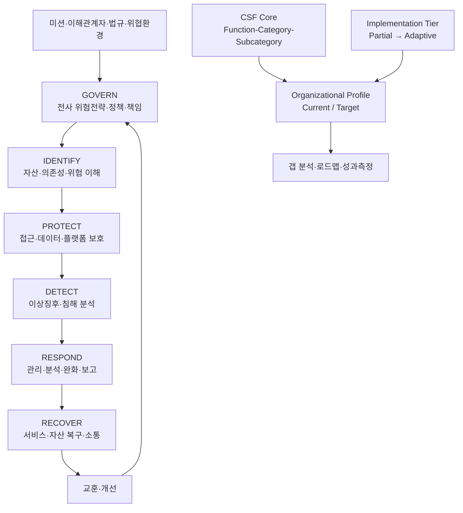
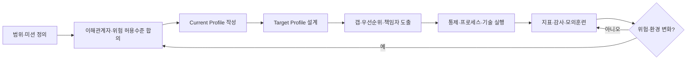

# NIST Cybersecurity Framework 2.0 기반 사이버보안 위험관리

## 1. 개요

> **정의**: NIST Cybersecurity Framework(CSF) 2.0은 조직이 사이버보안 위험을 이해하고 우선순위를 정하며 관리하기 위한 비처방적(outcome-based) 프레임워크이다.

NIST CSF는 특정 제품, 통제 목록, 인증제도라기보다 조직이 달성해야 할 사이버보안 결과(outcome)를 공통 언어로 정리하는 위험관리 체계다.
따라서 “방화벽을 설치했는가”와 같은 구현 수단을 직접 명령하지 않고, “중요 자산에 대한 접근이 관리되고 있는가”와 같은 결과를 제시한다.
조직은 자신의 규모, 산업, 규제, 위협 수준과 기술 환경에 맞추어 그 결과를 달성할 방법을 선택한다.

CSF 2.0은 2024년 2월 26일 NIST Cybersecurity White Paper 29로 발행되었다.
이 버전은 기존의 핵심 구조를 확장하면서 보안 운영자뿐 아니라 경영진, 이사회, 조달·법무·인사·감사 담당자도 사용할 수 있도록 범용성을 높였다.
특히 사이버보안을 IT 부서만의 기술 통제가 아니라 전사적 위험관리(ERM)의 일부로 다루고, GOVERN 기능을 최상위에 추가하였다.

CSF 2.0의 적용 대상은 대기업이나 중요 인프라 사업자에 한정되지 않는다.
소규모 조직, 공공기관, 제조 OT, IoT, 클라우드, 모바일, AI 시스템 등 ICT를 활용하는 모든 조직이 자신에게 필요한 결과를 선택할 수 있다.
이는 조직마다 자산과 위험 허용수준이 다르므로 단일한 통제 기준을 강제하면 형식적 준수만 남는다는 문제의식에 기반한다.

기술사 답안에서는 CSF를 “식별-보호-탐지-대응-복구”의 순환으로만 암기하면 부족하다.
CSF 2.0에서는 GOVERN이 나머지 다섯 기능의 우선순위와 위험 수용기준을 정하고, IDENTIFY가 현재 위험을 파악하며, PROTECT·DETECT·RESPOND·RECOVER가 예방부터 개선까지 연결한다는 구조를 설명해야 한다.
또한 Core, Organizational Profile, Implementation Tier의 관계와 실제 이행 절차를 함께 제시해야 프레임워크를 운영 모델로 해석할 수 있다.

### 1.1 등장 배경과 필요성

디지털 서비스가 업무 핵심이 되면서 사이버 사고의 영향은 정보 유출에 그치지 않고 생산중단, 안전사고, 계약위반, 평판 하락과 주주가치 훼손으로 확장되었다.
클라우드와 SaaS, 외주 개발, 오픈소스, API, 원격근무가 늘어남에 따라 조직의 경계는 네트워크 내부로 한정되지 않는다.
이런 환경에서 보안을 장비 목록이나 부서별 점검표로 관리하면 공급자와 서비스 연쇄관계, 업무 중요도, 복구 가능성을 함께 판단하기 어렵다.

CSF는 경영진이 이해할 수 있는 위험 언어와 실무자가 사용할 수 있는 보안 결과를 연결한다.
예를 들어 경영진은 “온라인 주문 서비스의 허용 중단시간은 30분”이라는 업무 목표를 제시하고, 보안·인프라 조직은 이를 바탕으로 인증 강화, 로그 수집, 침해 탐지, 격리와 복구 검증 결과를 설계할 수 있다.
이 연결이 있어야 투자비용을 기술 유행이 아니라 사업 영향과 잔여위험으로 설명할 수 있다.

### 1.2 핵심 특징

첫째, CSF는 결과 중심이다.
동일한 보안 결과를 달성하는 방법은 온프레미스 SIEM일 수도 있고 관리형 탐지·대응 서비스일 수도 있으므로, 조직의 조건에 맞는 기술 선택이 가능하다.

둘째, CSF는 위험 기반이다.
모든 자산을 같은 수준으로 보호하는 대신 미션, 이해관계자, 규제, 위협과 위험 허용수준을 고려하여 투자 순서를 정한다.

셋째, CSF는 생명주기형이다.
보호 통제만 강화하는 것이 아니라 탐지, 사고 대응, 서비스 복구와 사고 후 개선까지 포함하여 예방 실패를 전제로 회복탄력성을 관리한다.

넷째, CSF는 매핑 가능한 공통 언어다.
ISO/IEC 27001, NIST SP 800-53, CIS Controls, 산업별 규정 등과의 관계를 Informative References로 연결할 수 있지만, 그 매핑 자체가 CSF Core의 필수 통제나 인증을 의미하지는 않는다.

## 2. CSF 2.0의 전체 구조와 개념도

CSF 2.0은 CSF Core, Organizational Profiles, Implementation Tiers, 보조 자료로 구성된다.
Core는 “무엇을 달성할 것인가”를, Profile은 “우리 조직의 현재와 목표 상태는 무엇인가”를, Tier는 “위험관리 관행의 엄격성과 통합 수준은 어느 정도인가”를 표현한다.
이 세 요소를 분리하면 공통 기준과 조직별 실행계획을 혼동하지 않고 관리할 수 있다.

### 2.1 CSF Core

CSF Core는 Function, Category, Subcategory의 계층으로 사이버보안 결과를 분류한다.
Function은 가장 높은 수준의 관점이고, Category는 관련 결과의 묶음이며, Subcategory는 평가와 설계에서 사용할 수 있는 구체적인 결과 진술이다.
계층이 있다고 해서 실제 실행순서나 중요도 순서를 의미하는 것은 아니다.

Core의 결과는 체크리스트의 모든 항목을 빠짐없이 수행하라는 명령이 아니다.
조직은 사업 목적과 위험 프로파일에 따라 필요한 결과를 선택하고, 그 결과를 달성하는 활동과 책임자를 정의한다.
따라서 같은 Subcategory를 선택하더라도 은행은 거래 무결성과 규제 보고를, 제조사는 생산안전과 OT 가용성을 더 강하게 설계할 수 있다.

### 2.2 Organizational Profile

Organizational Profile은 특정 조직의 CSF Core 결과에 대한 현재(Current) 상태와 목표(Target) 상태를 기술한다.
Current Profile은 현재 달성 중인 결과와 달성 방법을 표현하고, Target Profile은 전략 변화, 신규 기술, 규제, 위협 인텔리전스까지 고려하여 원하는 상태를 표현한다.

Profile은 단순한 문서가 아니라 갭 분석의 기준선이다.
Current와 Target을 비교하면 미달 결과, 선행조건, 책임자, 투자비용과 목표일정을 도출할 수 있다.
예를 들어 Target이 “중요 API의 모든 인증 이벤트를 중앙 분석한다”라면, 현재의 로그 누락과 서비스별 포맷 차이를 갭으로 기록하고 수집·표준화·탐지 규칙의 로드맵으로 연결한다.

### 2.3 Implementation Tier

Implementation Tier는 조직의 사이버보안 위험관리 관행이 사업 필요와 얼마나 연결되어 있고 전사 위험관리와 얼마나 통합되어 있는지를 설명한다.
Tier는 보안 통제의 개수나 제품 가격을 평가하는 등급이 아니며, 조직의 운영 특성과 의사결정 방식을 표현하는 맥락 정보다.

| Tier | 명칭 | 핵심적인 운영 특성 |
|---|---|---|
| Tier 1 | Partial | 위험관리가 비공식적·임시적이며 조직 전체에 일관되지 않다. |
| Tier 2 | Risk Informed | 위험 정보를 활용하지만 전사 정책·프로세스 통합이 제한적이다. |
| Tier 3 | Repeatable | 정책과 절차가 공식화되고 반복 가능하며 조직 전반에서 운영된다. |
| Tier 4 | Adaptive | 변화하는 위협과 사업환경을 예측하고 지속적으로 개선한다. |

Tier 1 조직이 무조건 Tier 4를 목표로 해야 하는 것은 아니다.
소규모 조직이 핵심 자산에 대해 일관된 위험평가와 복구를 수행하는 Tier 2~3 수준을 확보하는 것이, 감당할 수 없는 고도화 목표를 세우고 운영을 중단하는 것보다 합리적일 수 있다.
반대로 금융거래 플랫폼처럼 장애·침해의 파급효과가 큰 조직은 탐지와 대응 데이터의 실시간성, 공급망 통합, 적응형 개선을 목표로 Tier 4 요소를 선택할 수 있다.

## 3. 여섯 가지 Function의 원리와 적용

### 3.1 GOVERN(GV): 거버넌스

GOVERN은 CSF 2.0에서 새롭게 전면에 배치된 기능으로, 조직의 사이버보안 위험관리 전략·기대수준·정책을 수립하고 전달하며 모니터링한다.
조직의 미션, 이해관계자, 법·규제·계약, 위험 선호도와 허용수준을 반영하여 나머지 다섯 기능의 우선순위를 정한다.

GOVERN의 핵심은 보안팀이 모든 위험을 독자적으로 결정하지 않도록 책임과 권한을 명확히 하는 것이다.
이사회나 경영진은 위험 수용 여부와 예산을 결정하고, CISO 또는 보안책임자는 정책과 프로그램을 운영하며, 시스템 소유자는 자산별 위험과 예외를 책임지는 식으로 역할을 나눈다.

공급망 위험도 GOVERN에서 다뤄야 한다.
외부 클라우드, SaaS, 개발업체, 오픈소스, AI 서비스가 핵심 기능을 수행한다면 공급자의 보안 요구사항, 사고 통지, 취약점 대응, 종료와 데이터 반환 조건을 조달·계약·운영에 포함해야 한다.
공급자 보안평가를 계약 체결 시 한 번만 하고 끝내면 서비스 변경과 인수합병, 하위 공급자 변화에 대응할 수 없으므로 주기적 모니터링이 필요하다.

### 3.2 IDENTIFY(ID): 자산과 위험 이해

IDENTIFY는 조직의 데이터, 하드웨어, 소프트웨어, 시스템, 시설, 서비스, 인력과 공급자를 파악하고 관련 사이버보안 위험을 이해하는 기능이다.
자산 식별은 단순한 CMDB 목록 작성이 아니라 자산이 제공하는 업무 서비스, 데이터 흐름, 의존성, 소유자, 노출면과 복구 우선순위를 연결하는 작업이어야 한다.

자산 목록에 없는 자산은 통제 대상에서 빠진다.
예를 들어 개발자가 개인 클라우드 저장소에 소스코드를 복사하거나 사업부가 승인 없이 SaaS를 구매하면 공식 자산대장과 실제 공격면 사이에 그림자 IT가 생긴다.
따라서 네트워크·클라우드·SaaS·코드 저장소·엔드포인트의 자동 발견 결과를 소유자 확인과 결합하고, 신규 자산과 폐기 자산의 상태변화를 추적해야 한다.

위험평가는 자산의 가치, 위협 가능성, 취약성, 노출과 영향의 조합으로 수행한다.
가령 고객 인증 API는 외부 노출과 개인정보 영향이 높으므로 일반 사내 위키보다 강한 인증, 로깅, 속도제한, 복구 테스트의 대상이 된다.
이때 점수만 산출하면 우선순위의 근거가 약해지므로 업무 중단시간, 영향받는 고객 수, 법적 의무와 공급자 의존성을 함께 서술한다.

### 3.3 PROTECT(PR): 보호조치

PROTECT는 식별된 위험을 줄이기 위한 보호조치를 사용하는 기능이다.
주요 범위에는 정체성 관리·인증·접근통제, 인식·훈련, 데이터 보안, 플랫폼 보안, 기술 인프라 회복탄력성이 포함된다.

접근통제는 계정을 만들고 권한을 부여하는 절차만을 의미하지 않는다.
사용자·서비스·장비의 정체성을 확인하고 최소권한을 적용하며, 특권권한을 별도로 승인·기록하고, 직무변경·퇴직·서비스 종료 시 권한을 회수해야 한다.
패스키나 피싱 저항형 MFA를 도입하더라도 계정 복구와 비상계정이 우회로가 되지 않도록 같은 수준의 통제를 설계해야 한다.

데이터 보호는 저장·전송 암호화, 키 관리, 백업, 보존·폐기, 무결성 검증과 접근기록을 함께 고려한다.
암호화만으로 데이터 유출 위험이 사라지는 것이 아니며, 애플리케이션 로그에 평문 개인정보가 남거나 백업 계정이 탈취되면 보호조치가 무력화된다.
분류등급과 데이터 흐름에 따라 마스킹, 토큰화, DLP, 보존기간과 파기증적을 조합하는 것이 바람직하다.

플랫폼 보안은 운영체제·컨테이너·미들웨어·클라우드 설정·소프트웨어 공급망의 안전한 구성과 변경관리다.
기준 이미지와 코드형 인프라를 사용하면 동일한 설정을 반복 적용할 수 있고, 정책 위반을 배포 전에 차단할 수 있다.
다만 자동화된 배포가 잘못된 정책을 대규모로 확산할 수 있으므로 승인, 검증, 단계적 배포와 롤백을 함께 마련해야 한다.

### 3.4 DETECT(DE): 탐지와 분석

DETECT는 공격과 침해의 가능성을 나타내는 이상징후, 침해지표와 불리한 이벤트를 적시에 발견하고 분석하는 기능이다.
탐지의 품질은 단순히 로그를 많이 모으는 데서 결정되지 않고, 중요한 자산에 필요한 텔레메트리와 탐지 가설을 정의하는 데서 결정된다.

예를 들어 관리자 계정의 평소와 다른 국가 로그인, 대량의 토큰 발급, 비정상적인 API 호출량, 백업 삭제와 암호화 작업의 연쇄는 랜섬웨어나 계정탈취의 탐지 가설이 될 수 있다.
이벤트에는 시간, 주체, 대상, 행위, 결과와 상관관계 키가 포함되어야 분석이 가능하며, 시계 동기화와 보존기간이 미흡하면 포렌식 가치가 떨어진다.

탐지는 오탐과 미탐의 균형 문제다.
모든 이벤트를 경보로 만들면 분석팀이 피로해져 중요한 신호를 놓칠 수 있으므로 자산 중요도, 공격 단계, 신뢰도와 잠재영향을 반영해 우선순위를 정한다.
경보의 정확도뿐 아니라 탐지 후 분석에 걸리는 시간과 실제 대응으로 연결되는 비율도 운영지표로 관리한다.

### 3.5 RESPOND(RS): 사고 대응

RESPOND는 침해사고가 탐지된 후 영향을 억제하고, 원인을 분석하며, 완화·보고·소통하는 기능이다.
사고 대응계획에는 선언 기준, 지휘체계, 증거보존, 격리 권한, 고객·규제기관·수사기관 통지와 복구 인계 조건을 포함한다.

초기에는 완전한 원인 규명보다 확산 방지가 중요할 수 있다.
예를 들어 계정탈취가 의심되면 토큰 폐기와 세션 종료를 먼저 수행하고, 악성 IP 차단과 서비스 격리를 시행한 뒤 포렌식 분석을 진행한다.
그러나 성급한 시스템 재설정이나 로그 삭제는 증거를 훼손할 수 있으므로 사전에 승인된 플레이북과 디지털 증거 절차가 필요하다.

사고 커뮤니케이션은 기술적 사실, 법적 의무, 고객 신뢰를 함께 고려한다.
확인되지 않은 원인을 단정하지 않되 현재 영향, 임시조치, 다음 업데이트 시점을 일관되게 전달해야 하며, 공급자 사고일 때도 계약상 통지와 공동 대응의 역할을 명확히 해야 한다.

### 3.6 RECOVER(RC): 복구와 개선

RECOVER는 사고로 영향을 받은 자산과 운영을 복원하고 정상 서비스로 돌아가는 기능이다.
복구는 백업 파일을 가지고 있는지보다 신뢰할 수 있는 상태로 정해진 시간 안에 서비스를 재개할 수 있는지가 핵심이다.

업무영향분석으로 서비스별 RTO와 RPO, 복구 우선순위와 의사결정권을 정의한다.
백업은 운영 계정과 분리하고 변경불가·오프라인 사본을 고려하며, 실제 복구 테스트를 통해 백업의 무결성, 애플리케이션 의존성, 키와 인증서의 가용성을 확인한다.
랜섬웨어 상황에서 감염된 백업을 복원하면 재감염되므로 복구 전 악성코드 검사와 깨끗한 기준선 검증이 필요하다.

복구가 완료되면 사건을 닫는 것이 아니라 교훈을 Current Profile과 Target Profile에 반영한다.
탐지 규칙의 누락, 공급자 연락처 오류, 권한 과다, 복구 절차의 병목을 개선 백로그로 등록하고, 다음 모의훈련이나 실제 변경에서 효과를 확인해야 지속적 개선이 된다.

## 4. 실행 절차와 운영 산출물

### 4.1 적용 로드맵

첫 단계는 범위를 정하는 것이다.
전사 전체를 한 번에 정하려 하지 말고, 고객 인증·결제·생산제어·핵심 데이터와 같이 미션 영향이 큰 서비스부터 경계를 설정한다.
범위에는 관련 클라우드 계정, 공급자, 사용자, 데이터 흐름과 상호의존 서비스를 포함한다.

둘째, GOVERN 관점에서 경영목표와 위험 허용수준을 확정한다.
“무조건 보안 강화”가 아니라 허용 가능한 서비스 중단시간, 개인정보 영향, 규제 위반 위험과 투자 제약을 합의해야 Target Profile의 우선순위가 현실화된다.

셋째, Current Profile을 작성한다.
자산대장, 취약점, IAM, 백업, 로그, 사고기록, 공급자 평가와 감사자료를 증거로 활용하고, 문서가 있다고 해서 결과가 달성된 것으로 간주하지 않는다.
운영 샘플, 설정 조회, 인터뷰, 모의훈련 결과로 실제 수행 여부를 확인한다.

넷째, Target Profile과 갭을 정의한다.
모든 결과를 동시에 달성하려 하지 말고 영향도·실현가능성·의존성·규제기한을 기준으로 우선순위를 정한다.
예를 들어 중요 서비스의 관리자 MFA와 불변 백업을 먼저 확보한 뒤 세부 탐지 자동화와 공급망 텔레메트리를 확장할 수 있다.

다섯째, 실행과 측정을 반복한다.
정책 개정, 설계 변경, 도구 도입, 교육, 모의훈련을 책임자와 기한이 있는 이행항목으로 쪼개고, 경영진에게 잔여위험과 추세를 보고한다.
새로운 서비스, 사고, 규제와 위협 변화가 생기면 Profile과 Tier 판단을 갱신한다.

### 4.2 주요 산출물

| 단계 | 대표 산출물 | 기술사 관점의 확인 질문 |
|---|---|---|
| 범위 설정 | 서비스 맵, 자산·데이터 흐름, 이해관계자 목록 | 무엇이 중단되면 미션이 실패하는가? |
| 거버넌스 | 위험선호도, 정책, RACI, 공급망 요구사항 | 누가 위험을 수용하고 누가 예산을 결정하는가? |
| 현황 진단 | Current Profile, 증거목록, 성숙도·갭 평가 | 문서가 아니라 실제 결과를 어떻게 증명하는가? |
| 목표 설계 | Target Profile, 우선순위, 로드맵 | 규제·위협·사업변화가 목표에 반영되었는가? |
| 실행 | 통제 구현, 플레이북, 교육·훈련 | 예방 실패 시 탐지·대응·복구가 이어지는가? |
| 개선 | 지표, 감사, 사고 교훈, 개선 백로그 | 측정 결과가 다음 투자와 설계에 반영되는가? |

## 5. 비교 및 연계

### 5.1 CSF 1.1과 CSF 2.0

CSF 2.0은 기존 다섯 기능의 단순한 명칭 변경이 아니라 적용 범위와 거버넌스 관점을 확장한 개정이다.
기존의 Identify-Protect-Detect-Respond-Recover 흐름은 유지되지만, GOVERN이 추가되어 전사 위험관리와 공급망·정책·책임을 명시적으로 조정한다.

CSF 2.0은 결과의 순서를 고정된 실행순서로 해석하지 않도록 주의한다.
현실의 조직은 사고 대응을 통해 식별정보를 갱신하고, 복구 교훈으로 거버넌스 정책을 바꾸며, 보호와 탐지를 동시에 개선한다.
따라서 시험 답안에서는 순환·동시·지속적 기능이라는 점을 강조하는 것이 적절하다.

| 구분 | CSF 1.1 | CSF 2.0 | 실무적 의미 |
|---|---|---|---|
| 중심 대상 | 중요 인프라 개선에 강한 초점 | 산업·정부·학계·비영리 등 범용 | 중소조직과 비IT 이해관계자까지 확장 |
| 최상위 기능 | Identify, Protect, Detect, Respond, Recover | Govern을 포함한 6개 Function | ERM·책임·정책을 보안 운영과 연결 |
| Profile | Current/Target 중심 | Organizational Profile로 확장 | 프로파일의 목적과 이해관계자 소통을 명확화 |
| 구현 맥락 | Implementation Tier 제공 | Tier의 위험관리 통합 관점 강화 | 기술 성숙도와 혼동하지 않음 |
| 보조 자료 | 매핑·사례 중심 | Quick-Start, Community Profile, Examples 등 | 사용자의 목표에 맞춘 적용 경로 제공 |

CSF 2.0으로 전환할 때 기존 자산과 통제를 폐기하고 새 체계를 처음부터 만들 필요는 없다.
현재의 CSF 1.1 프로파일과 통제 증거를 보존한 뒤 GOVERN 결과와 새 Category, 변경된 ID·PR·RS·RC 위치를 매핑하고, 조직의 위험관리 회의체에 연결하는 방식이 비용과 혼란을 줄인다.

### 5.2 CSF와 ISO/IEC 27001·NIST RMF

CSF와 ISO/IEC 27001은 모두 위험 기반 보안을 지원하지만 목적과 산출물이 다르다.
CSF는 결과를 공통 언어로 정리해 현재와 목표의 격차를 소통하기 쉽고, ISO/IEC 27001은 정보보안경영시스템(ISMS)의 수립·운영·개선과 인증이라는 관리체계 요구에 초점을 둔다.
그러므로 CSF로 위험 우선순위와 경영진 소통을 정하고 ISO/IEC 27001의 관리체계와 통제로 실행하는 상호보완이 가능하다.

NIST RMF는 시스템 수명주기에서 Categorize, Select, Implement, Assess, Authorize, Monitor를 수행하는 위험관리 프로세스다.
CSF가 “어떤 보안 결과를 달성할 것인가”를 상위에서 보여준다면 RMF는 시스템별 보안·프라이버시 요구사항을 선택하고 평가·승인·모니터링하는 절차를 더 구체화한다.
둘을 결합하면 전사 Target Profile에서 핵심 시스템의 보안 요구사항과 승인 증거로 내려가는 추적성이 좋아진다.

## 6. 사례: 클라우드 기반 결제 서비스의 CSF 적용

다음은 특정 기업을 지칭하지 않는 가상 사례다.
월간 거래가 많은 온라인 결제 서비스가 멀티클라우드와 외부 인증·메시징 공급자를 사용하고 있으며, 목표는 보안사고가 발생해도 결제 핵심 기능을 30분 안에 제한적으로 재개하는 것이다.

먼저 GOVERN에서 결제서비스 소유자, CISO, 법무, 클라우드 운영자, 공급자 담당자의 RACI를 정한다.
법적 신고와 고객 통지 조건, 위험 수용권자, 공급자 사고 통지시간과 긴급 격리 권한을 계약과 내부 정책에 반영한다.

IDENTIFY에서는 결제 API, 토큰화 저장소, 키 관리 서비스, 주문 DB, 관리자 콘솔과 외부 공급자 사이의 데이터 흐름을 그린다.
자산마다 소유자, 개인정보 포함 여부, 외부 노출, 최대 허용중단시간, 복구 의존성과 로그 위치를 표시한다.

PROTECT에서는 관리자와 서비스 계정에 피싱 저항형 MFA와 최소권한을 적용하고, 결제 데이터는 토큰화와 키 분리로 보호한다.
배포 파이프라인은 코드 리뷰, 이미지 서명, 취약점 검사와 승인된 아티팩트 정책을 거치며, 불변 백업과 별도 복구 계정을 운영한다.

DETECT에서는 관리자 로그인 이상, 대량 결제 실패, 비정상 토큰 발급, 백업 삭제와 권한 상승을 주요 탐지 가설로 만든다.
API 게이트웨이, 클라우드 감사로그, IAM, DB 감사로그를 공통 시간축과 거래 식별자로 연결하여 한 사용자의 행위를 추적한다.

RESPOND에서는 계정탈취와 결제 조작을 별도 시나리오로 구분한다.
계정탈취 의심 시 세션과 토큰을 폐기하고, 결제 조작 의심 시 고위험 거래를 일시 보류하며, 공급자와 법무·고객대응팀에 사전 정의된 메시지를 전달한다.

RECOVER에서는 깨끗한 이미지와 백업의 무결성을 확인한 후 읽기 전용 조회, 결제 승인, 정산 순서로 서비스를 부분 재개한다.
복구 테스트에서 키 접근이나 DNS 전환이 병목으로 드러나면 이를 개선 백로그로 등록하고 Target Profile을 갱신한다.

이 사례의 핵심은 도구를 많이 구매하는 것이 아니다.
업무 목표인 30분 복구와 거래 무결성을 CSF 결과, 책임, 기술통제, 훈련, 측정지표로 연결했다는 점이 중요하다.
시험에서는 각 Function별로 산출물과 통제 예시를 제시하고, 공급자·규제·복구까지 끊김 없이 연결하면 높은 완성도의 답안이 된다.

## 7. 심화: 클라우드·AI·공급망 환경에서의 확장

CSF 2.0은 IT에만 묶이지 않고 클라우드, OT, IoT, 모바일과 AI 시스템에도 적용되는 결과 구조를 제시한다.
AI 시스템은 모델 자체뿐 아니라 학습데이터, 프롬프트·검색소스, 모델 제공자, 추론 인프라, 출력 이용자와 평가 데이터의 생명주기를 자산과 의존성으로 식별해야 한다.

AI 공급자나 외부 모델을 사용하는 경우 GOVERN에서 사용 목적과 금지 용도, 데이터 반출, 책임분계와 변경 통지조건을 결정한다.
IDENTIFY에서는 모델·데이터·도구 호출·권한·출력의 흐름을 자산 맵으로 만들고, PROTECT에서는 비밀정보 입력 방지, 접근권한, 모델·패키지 출처 검증을 적용한다.
DETECT·RESPOND에서는 프롬프트 주입, 데이터 유출, 도구 오용, 모델 성능 저하를 탐지하고 차단·롤백·인간검토로 대응한다.

소프트웨어 공급망은 조직 경계 밖의 변경이 서비스 위험으로 이어지는 대표 영역이다.
소스 저장소, 빌드 러너, 패키지 레지스트리, 컨테이너 이미지, 배포환경의 신뢰관계를 식별하고, 빌드 출처(provenance), 서명, SBOM, 취약점 대응과 공급자 통지를 조합해야 한다.
단일 SBOM 제출만으로 공급망 안전이 보장되는 것은 아니며, 실제 빌드 산출물과 배포 산출물의 연결성과 검증 가능성이 중요하다.

CSF의 비처방성은 장점인 동시에 운영 난이도다.
조직이 결과 문장만 복사하면 실행 책임과 검증기준이 비어버리므로, 각 Subcategory에 담당자·증거·측정식·목표수준·예외승인·재검토 주기를 붙여 관리해야 한다.
예를 들어 “중요 자산의 취약점을 관리한다”를 주 단위 중요도 평가, 기한 내 조치율, 예외 만료율, 재발률로 구체화해야 한다.

## 8. 고려사항 및 시사점

### 8.1 기술사 관점의 적용 전략

1. **거버넌스와 기술을 분리하지 않는다.** GOVERN에서 결정한 위험선호도와 서비스 중요도가 IAM, 로깅, 백업과 같은 기술 우선순위로 내려가도록 추적성을 만든다.

2. **Profile을 살아 있는 기준선으로 운영한다.** Current와 Target을 문서 보관용으로 만들지 말고 자산 변화, 신규 클라우드, 사고, 감사결과와 연결하여 정기적으로 갱신한다.

3. **Tier를 성숙도 점수로 오해하지 않는다.** Tier 4가 항상 우수한 것이 아니라 사업 영향과 비용·인력·위험 허용수준에 맞는 운영 관행인지 판단해야 한다.

4. **예방 통제와 회복탄력성을 균형 있게 투자한다.** 공격을 100% 막는다는 가정 대신 고품질 탐지, 신속한 격리, 깨끗한 백업과 복구훈련으로 잔여위험을 낮춘다.

5. **공급망과 제3자 접근을 동일한 위험체계에 넣는다.** 계약평가, 기술검증, 지속 모니터링, 사고 통지와 종료 전략을 분리된 구매 체크리스트로 두지 않는다.

6. **성과지표는 활동량보다 위험감소를 측정한다.** 교육 횟수와 패치 건수만 보고하지 말고 중요자산 커버리지, 평균 탐지·대응시간, 복구 성공률, 반복사고율과 잔여위험을 함께 본다.

7. **증거 중심으로 감사 가능성을 확보한다.** 정책 문구, 설정 스냅샷, 접근 승인, 로그, 훈련 결과, 복구 리허설과 예외 승인에 식별자와 보존기간을 부여한다.

8. **산업·규제 프레임워크와 매핑하되 중복 통제를 줄인다.** CSF, ISO/IEC 27001, 개인정보보호 요구사항, 클라우드 기준을 통제 카탈로그로 통합하고 하나의 증거가 여러 요구사항을 충족하도록 설계한다.

### 8.2 한계와 보완

CSF는 조직이 해야 할 결과와 적용 방향을 보여주지만 구체 제품, 최소 보안수준, 모든 법적 의무를 대신 결정하지 않는다.
따라서 조직은 산업규제, 계약, 개인정보보호, 안전, 수출통제와 같은 별도의 의무를 식별하고 CSF 결과에 매핑해야 한다.

또한 Profile 작성은 이해관계자 합의가 필요한 사회적 과정이다.
경영진이 위험선호도를 정하지 않거나 자산 소유자가 불명확하면 기술팀이 임의의 점수를 매기게 되고, 갭 분석이 예산 경쟁으로 변질될 수 있다.
이 경우 중요한 서비스부터 작은 범위의 파일럿을 수행하여 실제 사고 시나리오와 비용을 근거로 합의를 확장하는 것이 현실적이다.

## 참고자료

- NIST, *The NIST Cybersecurity Framework (CSF) 2.0* (NIST CSWP 29, 2024-02-26): https://nvlpubs.nist.gov/nistpubs/CSWP/NIST.CSWP.29.pdf
- NIST, *Cybersecurity Framework 2.0*: https://www.nist.gov/cyberframework
- NIST, *Cybersecurity Framework Frequently Asked Questions*: https://www.nist.gov/cyberframework/faqs
- NIST, *CSF 2.0 Resource & Overview Guide* (SP 1299): https://nvlpubs.nist.gov/nistpubs/SpecialPublications/NIST.SP.1299.pdf

---

> **한 줄 요약**: NIST CSF 2.0은 GOVERN으로 전사 위험을 정렬하고 IDENTIFY→PROTECT→DETECT→RESPOND→RECOVER의 결과를 Profile·Tier·지표로 운영하여 사이버보안을 지속적으로 개선하는 공통 프레임워크다.
