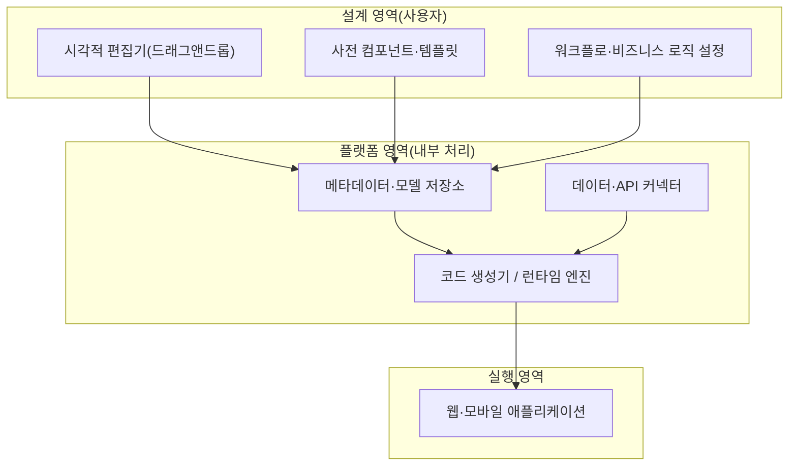

# 노코드(No-Code)

## 1. 개요

### 가. 정의
> **노코드(No-Code)** 는 프로그래밍 코드를 직접 작성하지 않고 **시각적 GUI(드래그앤드롭)와 사전 구성된 컴포넌트·템플릿** 만으로 애플리케이션을 개발하는 방식으로, 개발자가 아닌 현업 사용자(시민 개발자)도 소프트웨어를 만들 수 있게 하는 개발 패러다임이다.

노코드의 본질은 소프트웨어 개발의 **민주화(Democratization)** 다. 과거 앱 제작은 프로그래밍 언어와 실행 환경을 다룰 줄 아는 개발자만의 영역이었다. 노코드는 '코딩'이라는 진입 장벽을 '시각적 조작'으로 대체함으로써, 정작 업무를 가장 잘 아는 현업 담당자가 직접 필요한 도구를 만들 수 있게 한다. 이는 IT 부서에 개발 요청이 쌓여 몇 달을 기다려야 했던 병목을 해소하고, 비즈니스의 아이디어가 곧바로 실행으로 이어지는 속도를 만든다.

노코드가 성립하는 기술적 원리는 **추상화 계층의 상향 이동**이다. 어셈블리에서 고급 언어로, 다시 프레임워크로 추상화 수준이 올라온 흐름의 연장선에서, 노코드는 "코드"라는 표현 수단 자체를 시각적 메타모델로 한 단계 더 끌어올린 것이다. 사용자가 화면에서 폼과 버튼을 배치하고 규칙을 설정하면, 플랫폼 내부의 런타임·코드 생성기가 이를 실제 실행 가능한 애플리케이션(웹/모바일)으로 변환한다. 즉 코드가 사라진 것이 아니라 플랫폼 뒤로 감춰진 것이며, 이 점이 노코드의 장점(생산성)과 한계(플랫폼 종속·불투명성)를 동시에 규정한다. 예를 들어 마케팅 담당자가 개발자 도움 없이 캠페인 신청 폼과 승인 워크플로를 직접 만드는 식이다.

### 나. 등장 배경 및 필요성
노코드의 부상에는 뚜렷한 수급 불균형이 있다. 한편에서는 디지털 전환(DX) 수요가 폭증해 기업마다 필요한 내부 앱·자동화가 급증하는데, 다른 한편에서는 숙련 개발자 인력이 만성적으로 부족하다. 늘어나는 소프트웨어 수요를 소수의 개발자로 감당할 수 없게 되자, '코딩 없는 개발'로 개발 주체 자체를 현업으로 확장하려는 압력이 커졌다. 가트너 등은 앞으로 신규 애플리케이션 개발의 상당 부분이 로우코드·노코드 방식으로 이뤄질 것으로 전망해 왔는데, 구체 수치는 조사기관·시점마다 달라 일반화해 이해하는 편이 적절하다.

또한 클라우드(SaaS)의 보편화가 노코드를 뒷받침했다. 인프라·배포를 플랫폼이 대신 처리해 주므로, 사용자는 서버·배포 파이프라인을 몰라도 브라우저에서 만들고 곧바로 게시할 수 있다. 결국 노코드는 '개발자 부족'이라는 공급 제약과 '즉시성 요구'라는 수요 특성이 클라우드 위에서 만나 형성된 흐름이다.

## 2. 노코드 플랫폼의 아키텍처와 구성요소

노코드 플랫폼은 겉으로는 단순한 편집기지만, 내부적으로는 사용자의 시각적 조작을 실행 가능한 앱으로 변환하는 여러 계층으로 이뤄진다. 각 구성요소의 역할을 원리 중심으로 살펴보면 다음과 같다.

**시각적 편집기(Visual Editor)** 는 사용자가 화면 레이아웃을 드래그앤드롭으로 구성하는 진입점이다. 편집기는 사용자의 조작을 코드가 아니라 **메타데이터(선언적 모델)** 로 기록한다. "여기에 폼, 아래에 제출 버튼, 클릭 시 저장" 같은 의도가 내부적으로는 JSON/모델 형태로 저장되고, 이 선언적 표현이 노코드의 이식성과 자동화를 가능케 하는 근간이 된다. 편집기의 완성도가 곧 플랫폼의 표현력을 좌우한다.

**사전 컴포넌트·템플릿(Pre-built Components)** 은 버튼·폼·차트·테이블처럼 검증된 UI 부품과, 특정 업무(재고관리·설문·CRM)를 위한 완성형 템플릿의 묶음이다. 사용자는 밑바닥부터 만들지 않고 이 부품을 조립하므로 개발 속도가 빨라지지만, 반대로 제공된 부품의 범위를 벗어나는 요구는 구현이 어려워진다. 이 '조립식'이라는 특성이 노코드의 생산성과 유연성 한계를 동시에 만든다.

**워크플로·로직 엔진(Workflow Engine)** 은 조건 분기·자동화·승인 흐름 같은 비즈니스 로직을 시각적으로 정의하는 부분이다. "폼 제출 시 관리자에게 알림 → 승인되면 다음 단계" 같은 규칙을 규칙 기반(rule-based)으로 표현하며, 이것이 단순 화면 제작을 넘어 실제 업무 자동화를 가능케 한다. 복잡한 로직일수록 시각적 표현이 오히려 난해해지는 '역설'이 존재해, 이 지점에서 노코드의 적정 적용 범위가 갈린다.

**데이터·API 커넥터(Connectors)** 는 내장 데이터베이스와 외부 SaaS·API를 연결해 데이터를 읽고 쓰게 한다. 커넥터의 다양성이 플랫폼의 실용성을 결정하는데, 제공되지 않는 시스템과 연동하려면 결국 커스텀 코드가 필요해지는 경우가 많다. 마지막으로 **런타임·배포 엔진**이 메타데이터를 실제 실행 앱으로 변환·게시한다.

아래는 노코드로 하나의 업무 앱을 만드는 실제 진행 절차(프로세스 세부도)다. 요구 정의에서 게시·운영까지가 전통 개발보다 짧은 피드백 루프로 반복되는 것이 특징이다.

이 절차에서 주목할 점은 **현업이 요구 정의와 검증의 주체로 직접 참여** 한다는 것이다. 전통 개발은 현업이 요구를 문서로 전달하면 개발자가 해석·구현하고 다시 현업이 확인하는 과정에서 의미 손실과 대기가 발생한다. 노코드는 요구를 가진 사람이 곧 만드는 사람이 되므로 이 왕복 손실을 제거한다. 다만 이 구조는 뒤집어 보면, 소프트웨어 공학의 정식 검증(테스트·코드리뷰·보안점검) 절차가 생략되기 쉽다는 위험을 내포하므로, 뒤의 거버넌스 논의가 중요해진다.

## 3. 노코드와 로우코드 비교

노코드와 자주 함께 언급되는 로우코드(Low-Code)는 언뜻 비슷하지만 대상 사용자와 유연성에서 분명히 다르다. 노코드는 **완전히 코딩이 없어 비개발자(현업)를 겨냥** 하고 정형화된 범위 내에서 동작하는 반면, 로우코드는 **최소한의 코딩을 허용해 개발자·준개발자가 더 복잡하고 유연한 앱** 을 만들 수 있게 한다.

이 차이가 생기는 근본 이유는 '탈출구(escape hatch)의 유무'다. 로우코드는 시각적 개발을 기본으로 하되, 플랫폼이 커버하지 못하는 부분에서 코드를 직접 삽입할 여지를 남겨 둔다. 그 결과 로우코드는 기간계에 가까운 복잡한 요구까지 확장 가능하지만 개발 지식이 필요하다. 노코드는 이 탈출구를 닫아 단순성과 접근성을 극대화하는 대신, 표현 범위를 스스로 제한한다. 실무적 함의는 명확하다. 사용자의 IT 역량과 요구 복잡도에 따라 둘을 선택해야 하며, 실제 많은 상용 플랫폼은 두 성격을 스펙트럼으로 함께 제공한다.

| 구분 | 노코드(No-Code) | 로우코드(Low-Code) |
|---|---|---|
| **대상 사용자** | 비개발자(현업, 시민 개발자) | 개발자·준개발자(IT 부서) |
| **코딩** | 없음(완전 시각적) | 최소한의 코딩 병행(확장 가능) |
| **유연성** | 낮음(정형 범위 내) | 높음(커스터마이징·연동) |
| **적합 영역** | 단순 폼·업무 자동화·프로토타입 | 중간 복잡도 업무·기간계 보조 |
| **트레이드오프** | 접근성↑ / 표현력↓ | 표현력↑ / 학습곡선↑ |

## 4. 장단점 심층 분석과 적용 사례

노코드의 장점은 명확하다. 첫째 개발 속도가 빠르다. 아이디어에서 배포까지 수일 내로 단축되어, 특히 프로토타이핑·MVP 검증에 강력하다. 둘째 개발자 의존과 비용이 줄어 IT 백로그 병목이 완화된다. 셋째 현업이 직접 주도하므로 요구와 결과의 간극이 작아, "요구사항 전달 → 개발 → 재확인"의 반복 손실이 줄어든다.

그러나 한계도 구조적이다. 정형화된 틀 안에서만 동작하므로 복잡하거나 대규모·고성능이 필요한 시스템에는 부적합하고, 세밀한 커스터마이징이 어렵다. 또한 특정 플랫폼에 **종속(Vendor Lock-in)** 되어 이전이 힘들고 요금·정책 변화에 취약하다. 무엇보다 IT 부서의 통제 밖에서 앱이 늘어나는 **섀도IT(Shadow IT)** 와 그에 따른 데이터·보안·거버넌스 리스크가 커진다. 성능·확장성 측면에서도 플랫폼 추상화 계층의 오버헤드로 대량 트래픽 처리에 한계가 있을 수 있다.

**구체 사례를 들면**, ⑴ 스타트업이 코딩 없이 노코드 앱 빌더로 초기 서비스 프로토타입을 만들어 투자 유치·시장 검증에 활용하는 사례, ⑵ 대기업 현업 부서가 스프레드시트로 관리하던 재고·요청 처리를 노코드 워크플로 도구로 전환해 승인 리드타임을 크게 단축하는 사례, ⑶ 비영리·공공이 설문·신청 접수 폼을 즉시 제작해 캠페인에 대응하는 사례가 대표적이다. 공통점은 '정형화된 업무의 즉시 자동화'라는 노코드의 강점 영역에 해당한다는 것이다. 반대로 실시간 대량 거래를 처리하는 핵심 결제·기간계 시스템을 노코드로만 구축하려다 성능·유연성 한계에 부딪히는 것은 전형적인 오적용이다.

| 구분 | 내용 |
|---|---|
| **장점** | 빠른 개발·배포, 개발자 의존↓, 비용 절감, 현업 주도, 낮은 진입장벽 |
| **단점** | 복잡·대규모 부적합, 커스터마이징 한계, 벤더 종속, 섀도IT·보안·거버넌스 우려, 성능 한계 |

## 5. 심화 — 생성형 AI 결합과 시민 개발 거버넌스

노코드는 최근 **생성형 AI와 결합** 하며 한 단계 더 진화하고 있다. 기존 노코드가 "드래그앤드롭"이라면, AI 결합형은 자연어로 "이런 앱을 만들어줘"라고 하면 화면·데이터 모델·워크플로 초안을 자동 생성하는 방향으로 나아간다. 이는 개발의 민주화를 가속하는 동시에, 생성 결과의 정확성·보안을 사람이 검증해야 한다는 새로운 과제를 낳는다. AI가 만든 앱이 의도치 않은 데이터 접근이나 잘못된 로직을 포함할 수 있으므로, "생성은 쉬워졌지만 검증 책임은 남는다"는 점이 핵심이다.

또한 **시민 개발자(Citizen Developer)의 부상** 은 조직에 거버넌스 과제를 안긴다. 현업이 만드는 앱이 늘면 통제받지 않는 섀도IT와 데이터 유출·규정 위반 위험이 커진다. 따라서 성숙한 기업은 노코드를 금지하는 대신, IT가 승인된 플랫폼·커넥터·데이터 접근 범위를 정하고 그 울타리 안에서 현업이 자유롭게 만들도록 하는 **가드레일형 거버넌스**를 채택한다. 이는 통제와 자율의 균형을 잡는 실무적 해법으로, 노코드 확산기의 핵심 관리 이슈다.

## 6. 고려사항 및 시사점 (기술사 관점)

1. **적용 범위의 명확한 구분(적재적소 전략).** 노코드는 정형 업무 자동화·프로토타이핑·내부 도구에 효율적이지만, 고성능·고가용·복잡 로직이 필요한 핵심 기간계는 전통 개발 또는 로우코드와 병행하는 것이 안전하다. "무엇을 노코드로, 무엇을 코드로"의 포트폴리오 판단이 선행되어야 한다.

2. **섀도IT 통제와 IT 거버넌스 편입.** 현업 주도 개발이 늘수록 데이터·보안·규정 준수 리스크가 커지므로, 승인된 플랫폼·데이터 접근 정책·감사 체계를 갖춘 가드레일형 거버넌스로 자율과 통제를 동시에 확보해야 한다.

3. **벤더 종속(Lock-in)과 출구 전략(트레이드오프).** 특정 플랫폼 의존은 비용·정책 리스크로 이어지므로, 데이터 표준·내보내기(export) 가능성·마이그레이션 경로를 사전에 확인하고 종속을 감내할 수준을 판단해야 한다.

4. **성능·확장성·기술 부채 관점.** 성장으로 트래픽·복잡도가 커지면 노코드의 추상화 한계가 병목이 될 수 있으므로, 규모 확장 시 전통 개발로의 전환(재작성) 시나리오를 미리 설계해 두는 것이 바람직하다.

5. **인력·역량 전략(조직 관점).** 노코드는 개발자를 대체하기보다 개발자를 반복 업무에서 해방시켜 고부가 영역에 집중하게 하는 도구로 보는 것이 타당하다. 시민 개발자 교육과 IT의 조력자(enabler) 역할 재정의가 성공적 도입의 관건이다.

6. **품질·보안 검증 체계 보완.** 노코드는 정식 개발 생명주기의 테스트·코드리뷰·보안점검을 우회하기 쉬우므로, 승인 전 검토·권한 최소화·민감정보 처리 가이드 같은 최소한의 품질 게이트를 플랫폼 차원에서 강제해 '빠름'이 '허술함'이 되지 않도록 균형을 잡아야 한다.

## 참고자료
- Gartner, "Low-Code / No-Code" Glossary, https://www.gartner.com/en/information-technology/glossary/low-code-application-platform-lcap
- Microsoft Power Platform (노코드·로우코드 사례), https://www.microsoft.com/power-platform

---

> **한 줄 요약**: 노코드는 *코딩 없이 시각적 편집으로 앱을 개발* 해 현업 시민 개발자의 참여를 가능케 하는 개발 민주화 기술로, 빠른 개발·낮은 진입장벽의 장점과 유연성·성능·벤더 종속·거버넌스 한계를 함께 고려해 적용 범위를 구분하고 가드레일형 IT 거버넌스로 관리해야 한다.
