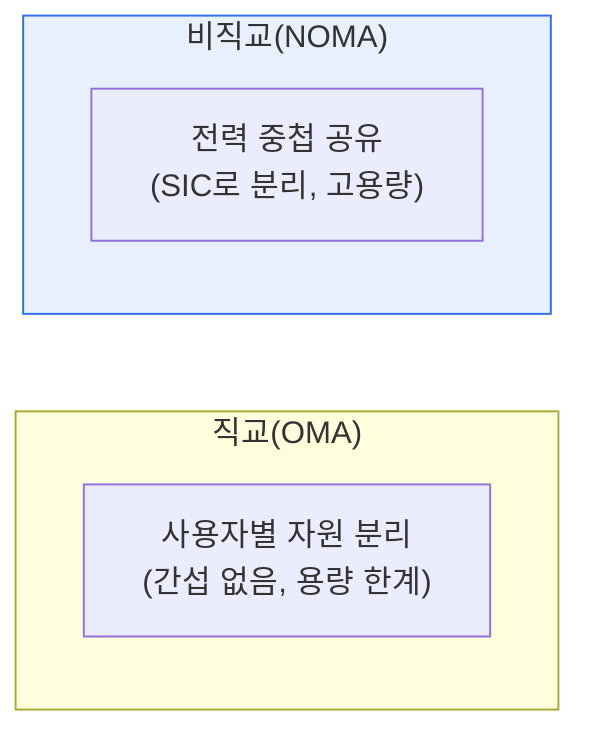

# 비직교 다중접속(NOMA, Non-Orthogonal Multiple Access)

## 1. 개요

### 가. 정의
> 여러 사용자에게 **동일한 시간·주파수 자원을 전력 차이(또는 코드)로 중첩해 할당**하는 다중접속 기술. 기존의 직교 방식(OMA)과 달리 자원을 나누지 않고 겹쳐 씀으로써 주파수 효율과 수용 용량을 크게 높인다.

NOMA를 이해하는 핵심은 '**자원을 나누지 않고 겹쳐 쓴다**'는 발상의 전환이다. 기존 직교 다중접속(OMA)은 사용자마다 시간·주파수·코드를 겹치지 않게(직교) 나눠 줘서 서로 간섭하지 않게 했다. 깔끔하지만, 자원이 물리적으로 한정되어 있어 수용할 수 있는 사용자 수에 한계가 있다. NOMA는 발상을 뒤집어, **같은 시간·주파수를 여러 사용자가 함께 쓰되 전력 세기를 다르게** 배정한다. 기지국에서 가까운(채널이 좋은) 사용자에겐 약한 전력을, 먼(채널이 나쁜) 사용자에겐 강한 전력을 준다. 수신단에서는 **연속 간섭 제거(SIC)** 기법으로 강한 신호부터 차례로 복원·제거해 자기 신호를 분리해낸다. 이렇게 하면 같은 자원으로 더 많은 사용자를 수용하고 주파수 효율을 높일 수 있어, 초연결이 요구되는 5G/6G의 핵심 후보 기술이 되었다.

### 나. 등장 배경
사물인터넷(IoT)·초연결로 접속 기기 수가 폭증하면서, 한정된 주파수로 더 많은 사용자를 수용해야 하는 요구가 커졌다. OMA의 용량 한계를 넘기 위해 NOMA가 부상했다.

## 2. OMA와 비교

| 구분 | OMA(직교) | NOMA(비직교) |
|---|---|---|
| **자원 할당** | 사용자별 분리(직교) | 동일 자원 중첩 공유 |
| **구분 방식** | 시간·주파수·코드 분리 | 전력 차이(또는 코드) |
| **수신 처리** | 단순 | 연속 간섭 제거(SIC) |
| **주파수 효율** | 상대적 낮음 | 높음 |
| **수용 용량** | 제한적 | 큼(초연결) |

## 3. 핵심 기술

| 기술 | 내용 |
|---|---|
| **전력 할당(Power-domain)** | 채널 상태에 따라 전력 세기 차등 배정 |
| **중첩 부호화(Superposition Coding)** | 여러 사용자 신호를 겹쳐 전송 |
| **연속 간섭 제거(SIC)** | 강한 신호부터 복원·제거해 자기 신호 분리 |

## 4. 고려사항 및 시사점

1. **SIC의 복잡도와 오류 전파**가 과제다. 수신단에서 신호를 차례로 제거하는 SIC는 연산이 복잡하고, 앞 신호 복원이 틀리면 오류가 뒤로 전파되므로 수신기 성능이 관건이다.
2. **초연결 시대의 핵심 후보**다. IoT·mMTC(대규모 기계형 통신)처럼 수많은 기기를 수용해야 하는 5G/6G 환경에서 주파수 효율과 용량을 높이는 유력 기술이다.
3. **다른 기술과의 결합**으로 진화한다. MIMO·빔포밍과 결합하고, 전력 영역 외에 코드 영역 NOMA 등으로 확장되며, 6G의 초광대역·초연결 요구에 대응한다.

---

> **한 줄 요약**: NOMA는 *동일 시간·주파수를 전력 차이로 중첩 공유* 하고 수신단에서 SIC로 분리하는 비직교 다중접속으로, OMA의 용량 한계를 넘어 주파수 효율과 수용 용량을 높여 5G/6G 초연결의 핵심 후보 기술이다.
