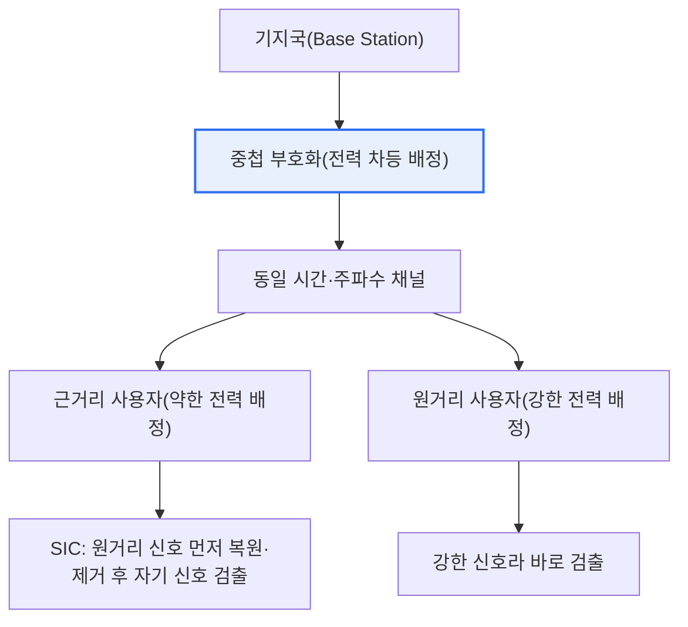
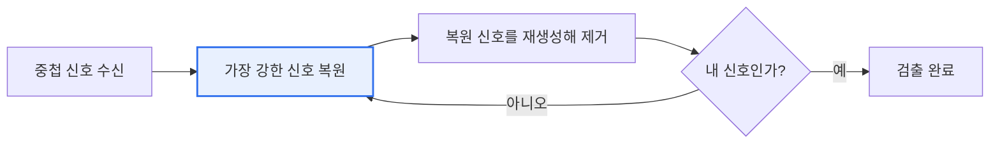

# 비직교 다중접속(NOMA, Non-Orthogonal Multiple Access)

## 1. 개요

### 가. 정의
> 여러 사용자에게 **동일한 시간·주파수 자원을 전력 차이(또는 코드)로 중첩해 할당**하고, 수신단에서 연속 간섭 제거(SIC)로 신호를 분리하는 다중접속 기술. 기존의 직교 방식(OMA)과 달리 자원을 나누지 않고 겹쳐 씀으로써 주파수 효율과 수용 용량을 크게 높인다.

NOMA를 이해하는 핵심은 '**자원을 나누지 않고 겹쳐 쓴다**'는 발상의 전환이다. 기존 직교 다중접속(OMA, Orthogonal Multiple Access)은 사용자마다 시간(TDMA)·주파수(FDMA)·코드(CDMA)·부반송파(OFDMA)를 겹치지 않게(직교하게) 나눠 주어 서로 간섭하지 않게 했다. 이 방식은 수신 처리가 단순하고 안정적이지만, 자원이 물리적으로 한정되어 있어 **직교 자원의 개수가 곧 수용 가능한 사용자 수의 상한**이 된다는 근본 한계를 갖는다.

NOMA는 이 전제를 뒤집는다. **같은 시간·주파수를 여러 사용자가 함께 쓰되, 전력 세기(Power Domain)를 다르게** 배정한다. 기지국은 채널이 좋은(가까운) 사용자에게는 약한 전력을, 채널이 나쁜(먼) 사용자에게는 강한 전력을 배정하여 여러 신호를 하나로 겹쳐(중첩 부호화, Superposition Coding) 전송한다. 수신단에서는 **연속 간섭 제거(SIC, Successive Interference Cancellation)** 기법으로 전력이 강한 신호부터 차례로 복원·제거해 자기 신호를 분리해낸다. 이렇게 하면 같은 자원으로 더 많은 사용자를 동시 수용하고 주파수 효율을 높일 수 있어, 초연결이 요구되는 5G/6G의 후보 기술로 꾸준히 연구되어 왔다.

### 나. 등장 배경 및 필요성
NOMA가 부상한 배경에는 '주파수는 유한한데 접속 수요는 폭증한다'는 구조적 모순이 있다. 사물인터넷(IoT)·초연결로 접속 기기 수가 급증하면서, 셀 하나가 수용해야 하는 단말 수가 사람 중심 통신 시대와 비교할 수 없이 커졌다. 특히 5G가 정의한 세 가지 사용 시나리오 중 **mMTC(대규모 기계형 통신)** 는 좁은 지역에 극단적으로 많은 저속 단말을 수용해야 하는데, 직교 자원을 하나씩 나눠 주는 OMA로는 이 밀도를 감당하기 어렵다.

또한 한정된 주파수 스펙트럼은 경매·할당 비용이 매우 높은 국가 자원이므로, **같은 대역폭에서 얼마나 많은 정보·사용자를 실어 나르는가(주파수 효율, spectral efficiency)** 가 이동통신 사업자의 핵심 경쟁력이 된다. NOMA는 자원을 겹쳐 쓰는 방식으로 이 효율의 이론적 상한을 끌어올릴 수 있어, OMA의 용량 한계를 넘기 위한 유력한 대안으로 연구되어 왔다.

## 2. 동작 원리 — 전력 중첩과 SIC

NOMA의 동작은 '송신단에서 겹치고, 수신단에서 벗겨낸다'는 두 축으로 이해할 수 있다. 아래 개념도는 다운링크(하향) NOMA의 전체 구조를 나타낸다.

```mermaid
flowchart TB
  BS["기지국(Base Station)"] --> SC["중첩 부호화(전력 차등 배정)"]
  SC --> CH["동일 시간·주파수 채널"]
  CH --> U1["근거리 사용자(약한 전력 배정)"]
  CH --> U2["원거리 사용자(강한 전력 배정)"]
  U1 --> SIC1["SIC: 원거리 신호 먼저 복원·제거 후 자기 신호 검출"]
  U2 --> DIRECT["강한 신호라 바로 검출"]
  style SC fill:#e8f0fe,stroke:#2f6fed,stroke-width:2px
```

기지국은 두 사용자의 신호를 **전력을 달리하여 하나로 합친 뒤** 같은 자원에 실어 보낸다. 여기서 중요한 원리는 '**채널이 나쁜 사용자에게 더 큰 전력을 준다**'는 점이다. 직관과 반대로 보이지만, 채널이 나쁜(먼) 사용자는 신호가 크게 감쇠하므로 애초에 강한 전력을 실어야 최소한의 수신 품질을 확보할 수 있고, 채널이 좋은(가까운) 사용자는 약한 전력으로도 충분하기 때문이다. 이 전력 배분의 비대칭성이 바로 SIC를 가능하게 하는 열쇠다.

**원거리 사용자(강한 전력)** 는 자기 신호가 전체 수신 전력의 대부분을 차지하므로, 근거리 사용자의 약한 신호를 잡음처럼 간주하고 곧바로 자기 신호를 검출한다. 반면 **근거리 사용자(약한 전력)** 는 먼저 전력이 강한 원거리 사용자의 신호를 복원한 뒤 그것을 수신 신호에서 빼내고(간섭 제거), 남은 신호에서 비로소 자기 신호를 검출한다. 이 '강한 것부터 차례로 벗겨내는' 과정이 SIC의 본질이며, 여러 사용자가 겹쳐 있어도 각자 신호를 분리해낼 수 있는 이유다.

이 과정을 프로세스 관점에서 보면 다음과 같은 순차 처리로 정리된다.

```mermaid
flowchart LR
  R["중첩 신호 수신"] --> D1["가장 강한 신호 복원"]
  D1 --> C1["복원 신호를 재생성해 제거"]
  C1 --> Q{"내 신호인가?"}
  Q -- "예" --> OUT["검출 완료"]
  Q -- "아니오" --> D1
  style D1 fill:#e8f0fe,stroke:#2f6fed,stroke-width:2px
```

이 순차 구조 때문에 NOMA의 성능은 **SIC의 정확도에 크게 의존**한다. 앞 단계에서 강한 신호를 정확히 복원·제거하지 못하면, 그 오차가 뒤 신호 검출로 그대로 전파(오류 전파, Error Propagation)되어 성능이 급격히 나빠진다. 따라서 실제 구현에서는 전력 배분 최적화, 사용자 페어링(어떤 사용자끼리 묶을지), 채널 추정 정확도가 설계의 핵심 변수가 된다.

**간단한 수치 예시**로 원리를 구체화해 보자. 기지국이 총 전력을 두 사용자에게 배분하되, 채널이 나쁜 원거리 사용자에게 80%, 채널이 좋은 근거리 사용자에게 20%를 준다고 하자(값은 설명을 위한 예시다). 원거리 사용자 입장에서는 자기 신호가 수신 전력의 대부분을 차지하고 근거리 사용자의 20% 신호는 상대적으로 약해 잡음처럼 처리해도 검출이 가능하다. 근거리 사용자는 채널이 좋아 신호 대 잡음비가 높으므로, 먼저 강한 80% 신호(원거리 사용자 것)를 여유 있게 복원·제거한 뒤 자기 몫인 20% 신호를 깨끗하게 검출한다. 이처럼 **전력비의 비대칭과 채널 이득의 비대칭이 맞물릴 때** 두 사용자가 같은 자원을 쓰고도 각자 신호를 회복할 수 있다는 것이 NOMA의 핵심 직관이다.

### 다. 하향링크와 상향링크의 차이
NOMA는 하향링크(Downlink, 기지국→단말)와 상향링크(Uplink, 단말→기지국)에서 동작 양상이 다르다. **하향링크**에서는 기지국이 모든 사용자의 신호를 알고 전력을 통제해 겹치므로, 중첩 부호화와 전력 배분을 기지국이 일괄 최적화할 수 있고 SIC는 각 단말이 수행한다. 반면 **상향링크**에서는 서로 다른 위치의 단말들이 독립적으로 송신해 신호가 자연스럽게 다른 전력으로 기지국에 도달하며, SIC는 기지국이 수행한다. 상향링크 NOMA는 스케줄링 요청 없이 즉시 전송하는 그랜트-프리(Grant-free) 방식과 결합하기 좋아, 접속 지연을 줄여야 하는 대규모 IoT 시나리오에서 특히 주목받는다. 다만 단말 간 전력 제어가 어렵고 충돌 가능성이 있어, 기지국의 신호 분리 능력이 하향링크보다 더 중요해진다.

## 3. 핵심 구성 기술

NOMA는 세 가지 요소 기술이 유기적으로 맞물려 동작한다. 각 기술은 단독으로 존재하는 것이 아니라 서로의 전제가 된다.

**전력 할당(Power-domain Multiplexing)** 은 NOMA의 출발점이다. 채널 상태 정보(CSI)를 바탕으로 사용자별 전력 세기를 차등 배정하는데, 이 배분이 곧 전체 셀의 공정성(Fairness)과 총 용량(Sum-rate) 사이의 균형을 결정한다. 전력 차이를 충분히 벌리지 못하면 SIC가 신호를 구분하지 못하고, 너무 벌리면 특정 사용자만 좋은 품질을 받는 불공정이 생긴다.

**중첩 부호화(Superposition Coding)** 는 여러 사용자의 신호를 전력을 달리해 하나로 합쳐 전송하는 송신단 기법이다. 정보이론적으로 방송 채널(Broadcast Channel)의 용량을 달성하는 기법으로 알려져 있으며, NOMA는 이 오래된 이론을 실제 다중접속에 적용한 것으로 볼 수 있다.

**연속 간섭 제거(SIC)** 는 수신단의 핵심 기법으로, 앞서 설명한 대로 강한 신호부터 복원·제거해 자기 신호를 분리한다. 수신기 복잡도의 대부분이 여기서 발생하므로, 단말의 연산 능력과 전력 소모가 제약되는 IoT 환경에서는 SIC 단수(동시에 겹칠 사용자 수)를 제한하는 실무적 타협이 필요하다. SIC의 처리 절차를 단계로 나누면 다음과 같다.

- **① 정렬**: 수신한 중첩 신호에서 전력이 강한 신호부터 처리 순서를 정한다(전력 크기 = 처리 우선순위).
- **② 복원**: 가장 강한 신호를 먼저 복조·복호(디코딩)해 데이터를 추정한다.
- **③ 재생성**: 추정한 데이터로 해당 신호를 다시 만들어(재변조) 원래 파형을 복원한다.
- **④ 제거**: 재생성한 신호를 수신 신호에서 빼내 간섭을 없앤다.
- **⑤ 반복·종료**: 남은 신호에 대해 ②~④를 반복하다가 자기 신호에 도달하면 검출을 끝낸다.

이 절차에서 ②의 복원이 틀리면 ③~④의 제거가 부정확해져 오류가 뒤로 전파되므로, 각 단계의 정확도가 사슬처럼 연결되어 있다는 점이 SIC 설계의 근본 어려움이다.

| 기술 | 위치 | 역할 | 핵심 과제 |
|---|---|---|---|
| **전력 할당** | 송신 | 채널 상태별 전력 차등 배정 | 총용량-공정성 균형 |
| **중첩 부호화** | 송신 | 여러 신호를 겹쳐 전송 | 방송채널 용량 달성 |
| **SIC** | 수신 | 강한 신호부터 제거·분리 | 복잡도·오류 전파 |

## 4. OMA와의 비교 — 차이가 생기는 이유

NOMA와 OMA의 차이는 단순한 '효율 대 단순함'이 아니라, **간섭을 다루는 철학의 차이**에서 비롯된다. OMA는 애초에 간섭이 생기지 않도록 자원을 직교 분리하는 '간섭 회피(interference avoidance)' 전략이고, NOMA는 간섭을 허용하되 수신단에서 능동적으로 제거하는 '간섭 관리(interference management)' 전략이다. 이 관점 차이가 이후 모든 특성 차이를 만들어낸다.

| 구분 | OMA(직교) | NOMA(비직교) |
|---|---|---|
| **자원 할당** | 사용자별 분리(직교) | 동일 자원 중첩 공유 |
| **간섭 처리** | 회피(직교로 원천 차단) | 관리(SIC로 제거) |
| **구분 방식** | 시간·주파수·코드 분리 | 전력 차이(또는 코드) |
| **수신 처리** | 단순(저복잡도) | 연속 간섭 제거(고복잡도) |
| **주파수 효율** | 상대적으로 낮음 | 높음 |
| **수용 용량** | 직교 자원 수로 제한 | 큼(초연결) |
| **지연·전력** | 낮음 | SIC로 증가 |

이 표에서 실무적으로 가장 중요한 함의는 **'공짜 점심은 없다'** 는 것이다. NOMA가 주파수 효율과 수용 용량을 높이는 대가로, 수신기 복잡도·연산 지연·전력 소모가 늘고 SIC 오류 위험이 생긴다. 따라서 NOMA는 모든 상황에서 우월한 것이 아니라, **채널 이득 차이가 큰 사용자들을 묶을 때** 이득이 극대화된다. 채널 상태가 비슷한 사용자끼리는 전력 차이를 벌리기 어려워 SIC가 잘 동작하지 않으므로, 이 경우 OMA가 오히려 유리할 수 있다.

**구체 사례**로, 셀 경계의 원거리 사용자와 기지국 인근의 근거리 사용자를 한 쌍으로 묶으면 채널 이득 차가 커서 NOMA의 이득이 크다. 반면 두 사용자가 모두 셀 중앙에 비슷한 거리로 있으면 전력 영역에서의 구분이 모호해진다. 이 때문에 실제 표준화 논의에서는 NOMA를 단독 방식이 아니라 OFDMA 위에 선택적으로 얹는 형태나, MIMO·빔포밍과 결합한 형태로 검토해 왔다.

## 5. 심화 — 표준화 동향과 진화 방향

NOMA는 오랫동안 유력한 후보 기술로 연구되었지만, **상용 이동통신 표준에 전면 채택되었다고 단정하기는 어렵다.** 3GPP는 5G NR 표준화 과정에서 여러 다중접속 후보를 검토했고 전력 영역 NOMA도 그중 하나였으나, 수신기 복잡도와 표준화 시점의 성숙도 등을 이유로 5G의 기본 다중접속으로 OFDMA 계열이 유지된 것으로 알려져 있다. 다만 방송·릴레이·특정 상향링크 시나리오 등에서 NOMA적 기법이 부분적으로 활용·연구되고 있으며, 세부 채택 범위는 릴리스와 시점에 따라 다르므로 일반화해 이해하는 것이 안전하다.

기술적 진화 방향은 크게 두 갈래다. 첫째, **코드 영역 NOMA(Code-domain)** 로의 확장이다. 전력 영역 대신 희소 부호(SCMA, Sparse Code Multiple Access)나 저밀도 확산 코드를 이용해 사용자를 구분하는 방식으로, SIC 복잡도를 완화하면서 대규모 접속을 노린다. 둘째, **MIMO·빔포밍과의 결합(MIMO-NOMA)** 이다. 공간 영역(안테나·빔)과 전력 영역을 함께 활용해, 빔으로 나눈 사용자 그룹 내부에서 다시 NOMA로 겹쳐 수용하는 계층적 구조다.

6G 관점에서 NOMA는 **초연결(수많은 IoT 단말)과 초저지연·고신뢰를 동시에 요구하는 환경**에서 다시 주목받고 있다. 특히 그랜트-프리(Grant-free) 상향 접속과 결합하면, 단말이 스케줄링 요청 절차 없이 즉시 전송하고 기지국이 겹친 신호를 분리하는 방식으로 접속 지연을 크게 줄일 수 있어 mMTC·URLLC 결합 시나리오의 후보로 논의된다. 다만 이 역시 연구·표준화 진행 중인 영역이므로 확정된 상용 기술로 단정하지 않는 것이 정확하다.

**응용이 검토되는 대표 영역**을 정리하면 이해가 구체화된다. 첫째, 위성·비지상 네트워크(NTN)다. 위성 셀은 커버리지가 넓어 사용자 간 채널 이득 차이가 자연히 크게 벌어지므로 NOMA의 전제(전력·채널의 비대칭)가 잘 성립해, 한정된 위성 자원으로 많은 단말을 수용하는 방안으로 연구된다. 둘째, 차량 통신(V2X)·밀리미터파 소형셀처럼 사용자 밀도와 채널 편차가 큰 환경이다. 셋째, 방송·멀티캐스트처럼 하나의 자원으로 여러 수신자에게 서로 다른 품질의 콘텐츠를 계층적으로 전송(계층 부호화)하는 경우다. 이 사례들의 공통점은 모두 '**채널 이득의 차이가 크거나 자원이 극도로 제한적**'이라는 것으로, NOMA가 언제 이득을 내는지를 역으로 보여준다.

## 6. 고려사항 및 시사점 (기술사 관점)

1. **SIC의 복잡도와 오류 전파가 최대 과제다.** 수신단에서 신호를 순차 제거하는 SIC는 연산량이 사용자 수에 따라 증가하고, 앞 신호 복원 오류가 뒤로 전파된다. 단말 전력·연산이 제약되는 IoT에서는 동시 다중화 사용자 수(SIC 단수)를 제한하거나, 복잡도가 낮은 코드 영역 기법과 절충하는 설계가 현실적이다.

2. **사용자 페어링과 전력 배분이 성능을 좌우한다.** 채널 이득 차이가 큰 사용자를 묶어야 이득이 크므로, 스케줄러가 어떤 사용자끼리 겹칠지(pairing)와 전력을 어떻게 나눌지(power allocation)를 실시간 최적화해야 한다. 이는 총용량 최대화와 사용자 간 공정성 사이의 트레이드오프를 푸는 문제로, NOMA 실무의 핵심 알고리즘 과제다.

3. **정확한 채널 추정과 CSI 피드백이 전제다.** 전력 배분과 SIC 모두 채널 상태 정보(CSI)에 의존하므로, 채널 추정 오차·피드백 지연이 크면 NOMA의 이점이 상쇄된다. 고속 이동 환경처럼 채널이 빠르게 변하는 상황에서는 이 전제가 약해져 OMA 대비 우위가 줄어들 수 있다.

4. **표준·상용화 성숙도를 냉정히 평가해야 한다.** NOMA는 이론적 이득이 분명하지만, 수신기 복잡도·구현 비용·기존 표준과의 정합 때문에 전면 상용화에는 신중한 판단이 필요하다. 기술사 관점에서는 '유망하나 상황 의존적'인 기술로 위치 짓고, mMTC·그랜트-프리 등 이득이 큰 특정 시나리오에 선택적으로 적용하는 전략을 제시하는 것이 타당하다.

5. **다른 기술과의 결합을 통한 진화가 현실적 경로다.** 단독 방식으로 OMA를 대체하기보다 MIMO·빔포밍·mmWave와 결합(MIMO-NOMA)하거나 코드 영역으로 확장(SCMA)하는 방향이 실질적이다. 6G의 초연결·초저지연 요구에 맞춰, NOMA는 다중접속 기법의 '단일 정답'이 아니라 상황별로 선택되는 도구 상자의 한 축으로 이해하는 것이 적절하다.

---

> **한 줄 요약**: NOMA는 *동일 시간·주파수를 전력 차이로 중첩 공유* 하고 수신단에서 SIC로 신호를 분리하는 비직교 다중접속으로, OMA의 용량 한계를 넘어 주파수 효율·수용 용량을 높이지만 SIC 복잡도·오류 전파·채널 추정 의존이라는 대가를 수반하며, 채널 이득 차가 큰 초연결(mMTC) 시나리오에서 MIMO·코드 영역과 결합해 진화하는 5G/6G 후보 기술이다.
