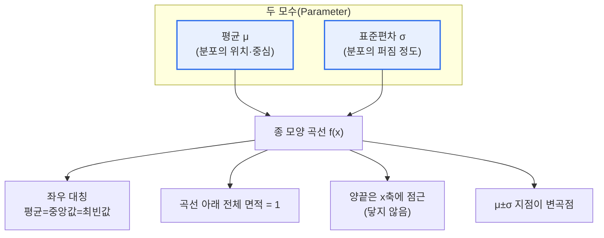
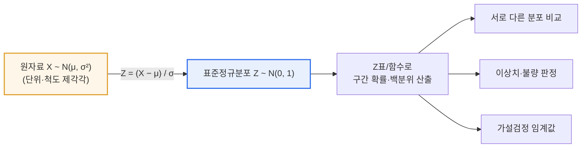

# 정규분포(Normal Distribution)의 특징

## 1. 개요

### 가. 정의
> **정규분포**는 평균(μ)을 중심으로 좌우 대칭인 **종(Bell) 모양의 연속확률분포**로, 자연·사회 현상에서 가장 널리 나타나며 통계적 추론(estimation·testing)의 수학적 기반이 되는 분포다. 확률밀도함수는 평균 μ와 분산 σ²(표준편차 σ) 두 모수만으로 완전히 결정되며, 기호로는 X ~ N(μ, σ²)로 표기한다.

정규분포가 통계학의 중심에 자리 잡은 근본 이유는 '**세상의 수많은 현상이 종 모양으로 분포하고, 그렇지 않은 모집단에서 뽑은 표본조차 그 평균은 정규분포로 수렴한다**'는 이중의 보편성에 있다. 사람의 키·몸무게, 반복 측정에서 생기는 오차, 제조 공정에서 나오는 부품의 치수처럼 여러 개의 작고 독립적인 요인이 더해져 만들어지는 값은 특정 요인이 지배하지 않는 한 자연스럽게 평균 주변으로 모이고 양극단이 드물어지는 종 모양을 띤다. 이는 우연이 아니라, 독립적인 확률변수의 합이 정규분포에 가까워진다는 수학적 성질의 발현이다.

더 결정적인 것은 **중심극한정리(Central Limit Theorem, CLT)**다. 모집단이 정규분포가 아니더라도, 그 모집단에서 크기 n의 표본을 반복해서 뽑아 계산한 표본평균 X̄의 분포는 n이 커질수록 정규분포 N(μ, σ²/n)에 가까워진다. 예를 들어 주사위 눈(1~6, 균등분포)을 30개씩 뽑아 평균을 내는 실험을 수천 번 반복하면, 개별 눈은 균등분포임에도 표본평균의 히스토그램은 3.5를 중심으로 하는 종 모양이 된다. 이 성질 덕분에 모집단 분포를 몰라도 '표본을 통해' 모수를 추정하고 가설을 검정할 수 있으며, 정규분포는 신뢰구간·가설검정·회귀분석·품질관리(6시그마) 등 추론통계 전반의 공통 언어가 된다.

마지막으로 **모수의 단순함**도 정규분포의 강력한 실무적 장점이다. 평균(위치)과 표준편차(퍼짐) 단 두 개의 값만 알면 분포 전체의 모양이 확정되고, 임의 구간의 확률을 계산할 수 있다. 이 경제성이 이론 전개와 현장 적용 모두를 쉽게 만든다.

### 나. 등장 배경과 필요성
정규분포는 18~19세기 천문 관측과 측지(測地) 과정에서 반복 측정할 때마다 값이 조금씩 달라지는 '**측정 오차**'를 수학적으로 설명하려는 노력에서 정립되었다. 드무아브르(de Moivre)가 이항분포의 근사로 종 모양 곡선을 처음 다루었고, 이후 **가우스(Gauss)**가 오차론에서 최소제곱법과 함께 이 분포를 체계화해 오늘날 '**가우스 분포(Gaussian distribution)**'라고도 불린다. 관측 오차가 특정 방향으로 치우치지 않고 평균 0을 중심으로 대칭적으로 흩어진다는 직관이 정규분포의 종 모양으로 이어졌다. 이렇게 오차 모델에서 출발한 분포가, 표본평균의 수렴이라는 CLT로 뒷받침되면서 자연·공학·사회과학·경영의 데이터를 다루는 표준 도구로 자리 잡았다.

## 2. 확률밀도함수와 기하학적 특징

정규분포의 모양과 성질을 좌우하는 것은 평균 μ와 표준편차 σ이다. 아래 그림은 두 모수가 곡선의 어떤 측면을 결정하는지, 그리고 그로부터 어떤 기하학적 성질이 파생되는지를 보여준다.

확률밀도함수는 f(x) = (1 / (σ√(2π))) · exp( −(x−μ)² / (2σ²) ) 이다. 수식이 복잡해 보이지만 구조는 단순하다. 지수 안의 −(x−μ)²/(2σ²) 항이 핵심으로, x가 평균 μ에서 멀어질수록 (x−μ)²이 커지고 음의 지수가 급격히 작아져 곡선이 빠르게 낮아진다. 앞의 1/(σ√(2π))는 전체 넓이를 1로 맞추는 정규화 상수다. 이 두 부분이 결합해 '평균 부근이 가장 높고 양끝으로 갈수록 대칭적으로 감소하는' 종 모양을 만든다.

**첫째, 좌우 대칭성과 대푯값의 일치**다. 곡선은 x=μ를 축으로 완벽히 대칭이므로 평균·중앙값·최빈값이 모두 μ에서 만난다. 이는 한쪽으로 치우친(왜도가 있는) 분포와 정규분포를 구분하는 핵심 신호다. 소득분포처럼 오른쪽 꼬리가 긴 데이터는 평균이 중앙값보다 크게 나타나므로, 세 대푯값이 벌어져 있으면 정규성을 의심해야 한다.

**둘째, 표준편차가 결정하는 퍼짐**이다. σ가 작으면 곡선은 평균 주변에 뾰족하게 솟고, σ가 크면 낮고 넓게 퍼진다. 평균이 같아도 σ가 다르면 전혀 다른 위험·품질 수준을 뜻한다. 예컨대 두 생산라인이 모두 평균 지름 10mm의 부품을 만들어도, σ가 0.05mm인 라인과 0.20mm인 라인은 불량률이 크게 달라진다. 정규분포에서 μ±σ 지점은 곡선의 오목·볼록이 바뀌는 **변곡점**이기도 해, σ는 통계적으로도 기하학적으로도 '퍼짐의 자연 단위'가 된다.

**셋째, 면적=확률과 점근성**이다. 곡선 아래 전체 넓이는 항상 1이고, 특정 구간 [a, b]의 넓이가 곧 그 구간에 값이 들어올 확률 P(a≤X≤b)이다. 또한 곡선은 양끝에서 x축에 한없이 가까워지되 결코 닿지 않는 점근선을 가진다. 이는 '아무리 극단적인 값도 확률이 0은 아니다'라는 의미로, 뒤에서 다룰 두꺼운 꼬리(fat-tail) 위험 논의의 출발점이 된다.

| 특징 | 내용 | 실무적 함의 |
|---|---|---|
| **좌우 대칭** | 평균 중심 대칭, 평균=중앙값=최빈값 | 세 대푯값이 벌어지면 정규성 의심 |
| **종 모양** | 평균 부근 밀집, 양끝으로 갈수록 감소 | 평균 근처 값이 가장 흔함 |
| **두 모수 결정** | μ(위치)·σ(퍼짐)로 분포 완전 결정 | 두 값만 알면 임의 구간 확률 계산 |
| **면적 = 1** | 곡선 아래 전체 넓이=1, 구간 넓이=확률 | 적분/표로 확률 산출 |
| **점근성** | 양끝이 x축에 닿지 않고 무한 접근 | 극단값도 확률 0은 아님 |
| **변곡점 μ±σ** | 오목·볼록 전환점이 표준편차 위치 | σ가 퍼짐의 자연 단위 |

## 3. 68-95-99.7 법칙과 표준정규분포(표준화)

### 가. 68-95-99.7 경험규칙
정규분포의 실용성을 가장 직관적으로 보여주는 것이 **68-95-99.7 법칙(경험규칙, empirical rule)**이다. 평균을 중심으로 ±1σ 안에 약 68.3%, ±2σ 안에 약 95.4%, ±3σ 안에 약 99.7%의 데이터가 들어간다. 이 비율은 평균·표준편차가 무엇이든 정규분포이기만 하면 항상 성립한다.

구체적으로, 평균 70점·표준편차 10점인 시험 성적이 정규분포를 따른다면 60~80점 구간에 전체 학생의 약 68%가 몰리고, 50~90점에 약 95%가, 40~100점에 약 99.7%가 들어간다. 100점 만점에서 90점을 넘는 학생은 상위 약 2.3%에 불과하다는 계산이 곧바로 나온다. 이 규칙 덕분에 "몇 σ를 벗어나면 이상치로 본다"는 관리 기준을 세울 수 있고, 이는 통계적 공정관리(SPC)의 관리한계선(±3σ)과 이상치 탐지의 근거가 된다.

### 나. 표준화(Z변환)와 표준정규분포
서로 다른 정규분포를 한 자로 비교하려면 **표준정규분포**(평균 0, 표준편차 1, Z ~ N(0,1))로 변환한다. 원자료 X를 Z = (X − μ) / σ 로 바꾸는 것을 **표준화(standardization)**라 하며, Z값은 '평균에서 표준편차 몇 개만큼 떨어져 있는가'를 뜻한다. 표준화하면 단위가 다른 값도 공통 척도로 비교할 수 있다. 예를 들어 국어 점수(평균 70, σ 10)에서 85점을 받은 학생의 Z는 +1.5, 수학 점수(평균 60, σ 20)에서 85점을 받은 학생의 Z는 +1.25이다. 원점수는 같은 85점이지만 표준화하면 국어에서의 성취가 상대적으로 더 우수함을 알 수 있다.

표준화의 진짜 힘은 확률 계산의 표준화다. 모든 정규분포는 Z로 바꾼 뒤 하나의 표준정규분포 표(또는 함수)만 있으면 임의 구간의 확률을 읽을 수 있다. 과거에는 Z표를 손으로 찾았지만, 오늘날에는 스프레드시트의 NORM.S.DIST, 파이썬의 scipy.stats.norm 같은 함수로 즉시 계산한다. 가설검정에서 유의수준 5%에 대응하는 임계값 ±1.96(양측), 1% 유의수준의 ±2.58도 모두 이 표준정규분포에서 나온 값이다.

| 구간 | 포함 비율 | 활용 예시 |
|---|---|---|
| **±1σ** | 약 68.3% | 일상적 변동 범위 |
| **±2σ (≈1.96σ)** | 약 95.4% (정확히 95%는 1.96σ) | 95% 신뢰구간·유의수준 5% |
| **±3σ** | 약 99.7% | SPC 관리한계·이상치 기준 |
| **±6σ** | 약 99.99966% | 6시그마 품질(100만 개당 3.4 결함) |

## 4. 유사·관련 분포와의 비교

정규분포를 정확히 쓰려면 언제 다른 분포로 갈아타야 하는지를 아는 것이 중요하다. 아래 비교는 단순한 나열이 아니라 '왜 그 분포가 필요해지는가'라는 맥락을 담는다.

t분포는 표본이 작고(대략 n<30) 모표준편차를 몰라 표본표준편차로 대체할 때 쓴다. 정규분포보다 꼬리가 두꺼운데, 이는 작은 표본에서 표준편차 추정의 불확실성이 크기 때문이다. 표본이 커지면 t분포는 정규분포에 수렴한다. 카이제곱분포·F분포는 분산의 검정이나 분산분석(ANOVA)에서 분산의 비를 다룰 때 등장한다. 이항분포는 성공/실패의 이산 사건을 다루지만, 시행 횟수가 크고 성공확률이 극단적이지 않으면 정규분포로 근사(정규근사)할 수 있어 CLT의 대표적 응용이 된다.

| 분포 | 언제 쓰나 | 정규분포와의 관계 |
|---|---|---|
| **표준정규(Z)** | 모분산을 알거나 대표본 | 정규분포를 평균 0·σ 1로 변환한 것 |
| **t분포** | 소표본·모분산 미지 | 꼬리가 두꺼움, n 커지면 정규로 수렴 |
| **카이제곱** | 분산 검정·적합도 검정 | 표준정규 제곱들의 합 |
| **이항분포** | 성공/실패 이산 사건 | n 크면 정규근사 가능(CLT) |

## 5. 심화 — 실무 적용 사례와 정규성의 한계

정규분포는 산업 현장에서 폭넓게 쓰인다. **품질경영의 6시그마**가 대표적이다. 6시그마는 공정 산포를 정규분포로 모델링하고, 규격한계(spec limit)가 평균에서 6σ 떨어지도록 산포를 줄여 불량을 극단적으로 낮추는 방법론이다. 실무에서는 공정 평균이 장기적으로 ±1.5σ 표류(shift)한다고 보정해, 6시그마 수준을 '100만 기회당 약 3.4개 결함(DPMO 3.4)'으로 정의한다. GE·모토로라가 1980~90년대에 이 방법으로 품질비용을 대폭 절감한 사례가 널리 알려져 있다.

**금융 리스크 관리**에서도 정규분포는 오래 표준으로 쓰였다. 수익률이 정규분포를 따른다고 가정하면 특정 신뢰수준에서의 최대 예상손실인 **VaR(Value at Risk)**를 표준편차와 Z값으로 간단히 계산할 수 있다. 예컨대 일간 수익률의 표준편차가 2%라면 95% VaR는 약 1.65×2% = 3.3% 수준으로 추정된다. 그러나 여기에는 중요한 한계가 있다. 실제 금융 수익률은 정규분포보다 꼬리가 훨씬 두껍고(leptokurtic) 극단 사건이 자주 발생한다. 2008년 글로벌 금융위기는 정규분포 가정 하에서는 '수만 년에 한 번' 나올 법한 폭락이 현실에서 반복적으로 일어남을 보여주었고, 이후 극단값이론(EVT)·t분포·역사적 시뮬레이션 등 두꺼운 꼬리를 반영하는 보완 기법이 강조되었다.

이 사례들이 주는 교훈은, 정규분포가 강력하되 만능이 아니라는 점이다. 데이터가 정규분포를 '따를 것'이라고 가정하기 전에, **정규성 검정과 시각적 진단**으로 확인하는 절차가 필요하다. 대표적으로 샤피로-윌크(Shapiro-Wilk) 검정, 콜모고로프-스미르노프(K-S) 검정 같은 정규성 검정과, 데이터의 분위수를 이론 분위수와 비교하는 **Q-Q plot**이 쓰인다. Q-Q plot에서 점들이 직선을 따르면 정규성에 부합하고, 양끝이 위로 휘면 두꺼운 꼬리, S자로 휘면 왜도를 시사한다. 정규성이 깨지면 로그·제곱근 변환(Box-Cox 포함)으로 정규에 가깝게 만들거나, 정규성을 요구하지 않는 비모수 기법(만-휘트니, 크루스칼-왈리스 등)으로 전환한다.

## 6. 고려사항 및 시사점 (기술사 관점)

1. **정규성 가정의 검증을 절차화하라.** t검정·회귀분석·ANOVA 등 널리 쓰는 모수적 기법 다수가 정규성을 전제한다. 따라서 데이터 분석 프로세스에 정규성 검정(Shapiro-Wilk)과 Q-Q plot을 표준 단계로 넣고, 위배 시 변환 또는 비모수 기법으로 분기하는 판단 기준을 사전에 마련해야 신뢰할 수 있는 결론이 나온다.

2. **중심극한정리를 근거로 하되 표본 크기를 확보하라.** 모집단이 정규가 아니어도 표본평균은 정규로 수렴하므로 대부분의 추론이 정규분포 위에서 가능하다. 다만 이는 '충분히 큰 표본'을 전제한다. 왜도가 심한 모집단일수록 더 큰 n이 필요하므로, 표본 설계 단계에서 필요한 표본 크기를 산정하고 소표본에서는 t분포 등 보정된 분포를 적용해야 한다.

3. **두꺼운 꼬리(fat-tail) 위험을 별도로 관리하라.** 금융·재난·보안 사고처럼 극단값의 충격이 큰 도메인에서는 정규분포가 꼬리 위험을 과소평가한다. VaR를 넘어 조건부VaR(Expected Shortfall), 극단값이론, 스트레스 테스트를 병행해 '드물지만 치명적인' 사건에 대비하는 것이 기술사 관점의 리스크 설계다.

4. **품질·운영 관리의 정량 기준으로 활용하라.** 68-95-99.7 법칙과 ±3σ 관리한계는 SPC·6시그마·SLA 이상치 탐지의 정량적 뼈대를 제공한다. 공정능력지수(Cp, Cpk)로 규격 대비 산포를 수치화하고, 관측치가 관리한계를 벗어나면 원인을 추적하는 체계를 갖추면 품질을 데이터 기반으로 지속 개선할 수 있다.

5. **머신러닝·이상탐지와의 연계를 고려하라.** 많은 알고리즘이 입력 특성의 정규성 또는 표준화(스케일링)를 가정하거나 그로부터 이득을 본다. Z-score 기반 표준화는 특성 간 스케일을 맞추는 표준 전처리이며, 정규분포 가정을 이용한 이상탐지(예: Gaussian anomaly detection)는 로그 분석·부정거래 탐지 등에 응용된다. 데이터 파이프라인 설계 시 분포 특성을 명시적으로 다루는 것이 성능과 해석 가능성을 함께 높인다.

## 참고자료
- NIST/SEMATECH e-Handbook of Statistical Methods, "Normal Distribution": https://www.itl.nist.gov/div898/handbook/eda/section3/eda3661.htm
- Wikipedia, "Normal distribution": https://en.wikipedia.org/wiki/Normal_distribution
- Wikipedia, "Central limit theorem": https://en.wikipedia.org/wiki/Central_limit_theorem
- Wikipedia, "68–95–99.7 rule": https://en.wikipedia.org/wiki/68%E2%80%9395%E2%80%9399.7_rule

---

> **한 줄 요약**: 정규분포는 *평균 중심 좌우 대칭의 종 모양 연속분포* 로 평균(μ)·표준편차(σ) 두 모수로 완전히 결정되며, 68-95-99.7 법칙과 표준화(Z)로 확률을 계산하고 중심극한정리를 통해 통계적 추론의 토대가 되지만, 두꺼운 꼬리 위험과 정규성 검증을 함께 다뤄야 한다.
