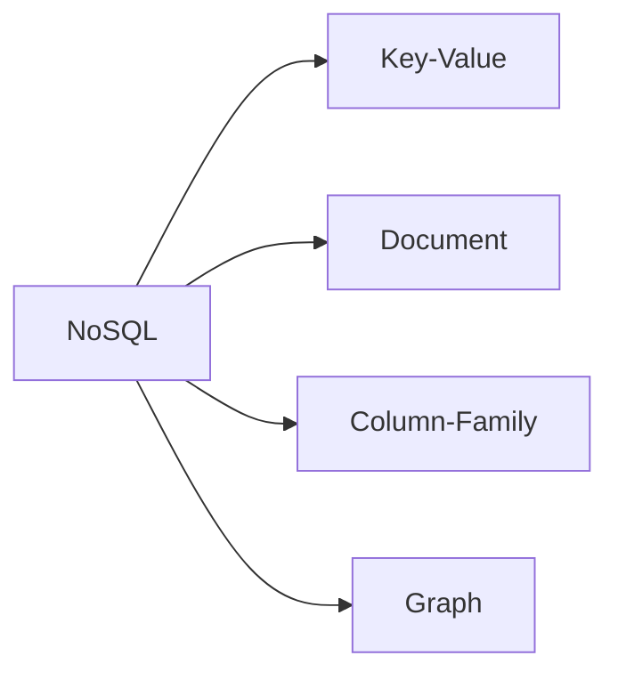

# NoSQL 유형과 데이터 모델링 절차

## 1. 개요

### 가. 정의
> 관계형 스키마·SQL·강한 정합성에서 벗어나 **대용량·비정형·분산·고확장성**에 최적화된 데이터 저장 기술(Not Only SQL).

### 나. 등장 배경
- 빅데이터·실시간 웹 서비스의 **수평 확장(Scale-out)** 요구
- 비정형·반정형 데이터 증가, 유연한 스키마 필요

### 다. 특징 (RDB와 비교)

| 구분 | RDBMS | NoSQL |
|---|---|---|
| 스키마 | 고정 | 유연(스키마리스) |
| 확장 | 수직(Scale-up) | 수평(Scale-out) |
| 정합성 | ACID(강한) | BASE(결과적 일관성) |
| 트랜잭션 | 강함 | 제한적 |

## 2. NoSQL 유형

| 유형 | 모델 | 예시 | 용도 |
|---|---|---|---|
| **Key-Value** | 키-값 쌍 | Redis, DynamoDB | 캐시·세션 |
| **Document** | JSON 문서 | MongoDB | 반정형 데이터 |
| **Column-Family** | 컬럼 지향 | Cassandra, HBase | 대용량 시계열 |
| **Graph** | 노드-간선 | Neo4j | 관계망·추천 |

## 3. CAP 이론
- 분산 시스템은 **일관성(C)·가용성(A)·분단내성(P)** 중 2가지만 보장
- NoSQL은 대체로 **AP**(가용성) 또는 **CP**(일관성) 선택

## 4. 데이터 모델링 절차

| 단계 | 내용 |
|---|---|
| **쿼리 우선(Query-First)** | 조회 패턴을 먼저 분석 (RDB와 반대) |
| **비정규화·임베딩** | Join 회피 위해 데이터 중복·문서 내장 |
| **키 설계** | 파티션·정렬 키로 분산·성능 최적화 |
| **검증·튜닝** | 접근 패턴별 성능·핫스팟 점검 |

## 5. 고려사항 및 시사점
- **정합성 vs 가용성** 트레이드오프(CAP) 명확히
- 접근 패턴 변경 시 재설계 부담 → 초기 쿼리 분석 중요
- 폴리글랏 퍼시스턴스(RDB+NoSQL 혼용)로 목적별 최적 저장소 선택

---

> **한 줄 요약**: NoSQL은 *비정형·대용량·분산에 최적화된 저장 기술* 로 Key-Value·Document·Column·Graph 유형이 있고, CAP 이론에 따라 정합성·가용성을 선택하며, 조회 패턴을 먼저 분석하는 쿼리 우선 비정규화 모델링을 따른다.
