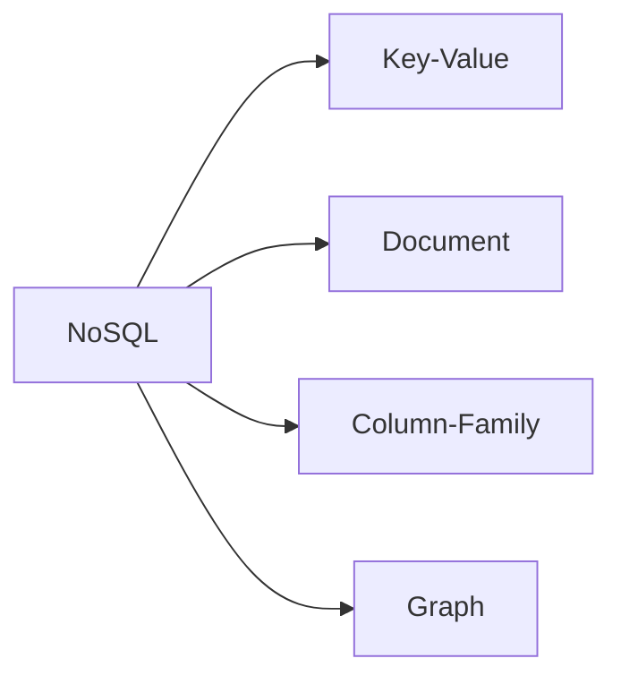

# NoSQL 유형과 데이터 모델링 절차

## 1. 개요

### 가. 정의
> 관계형 스키마·SQL·강한 정합성이라는 RDBMS의 전제에서 벗어나, **대용량·비정형·분산·고확장성** 요구에 최적화된 데이터 저장 기술군. 이름의 "Not Only SQL"이 말하듯 SQL을 배제한다기보다 **관계형만으로는 감당하기 어려운 영역을 보완**하는 대안이다.

### 나. 등장 배경 및 필요성
RDBMS는 정합성이 중요한 정형 데이터에 강력하지만, 성능을 높이려면 서버 사양을 키우는 **수직 확장(Scale-up)** 에 의존해 물리적·비용적 한계에 부딪힌다. 그런데 2000년대 이후 대규모 웹 서비스는 폭증하는 트래픽과 로그·JSON·소셜 관계 같은 비정형·반정형 데이터를 저렴한 서버 여러 대에 나눠 담는 **수평 확장(Scale-out)** 을 필요로 하게 되었다. 여기에 더해 서비스 초기부터 스키마를 확정하기 어렵고 요구가 수시로 바뀌는 환경에서는 컬럼 하나 추가에도 테이블 전체를 잠그는 고정 스키마가 걸림돌이 된다. NoSQL은 이런 **유연한 스키마, 수평 확장, 고가용성**을 우선 목표로 삼아 등장했다.

### 다. RDBMS와의 특징 비교
NoSQL이 이런 특성을 얻는 대신 포기하는 것은 무엇인지가 중요하다. 대표적으로 **강한 정합성(ACID) 대신 결과적 일관성(BASE)** 을 택한다. 분산된 여러 노드에 데이터를 복제·분산하면 모든 노드를 항상 동일 상태로 유지하기가 비싸지기 때문에, 일시적 불일치를 허용하되 결국 수렴하도록 완화한 것이다.

| 구분 | RDBMS | NoSQL |
|---|---|---|
| 스키마 | 고정(사전 정의) | 유연(스키마리스) |
| 확장 방식 | 수직(Scale-up) | 수평(Scale-out) |
| 정합성 모델 | ACID(강한 일관성) | BASE(결과적 일관성) |
| 트랜잭션 | 강함(다중 테이블) | 제한적 |
| 적합 데이터 | 정형·관계 중심 | 비정형·대용량·분산 |

## 2. NoSQL 유형

NoSQL은 데이터를 담는 모델에 따라 네 유형으로 나뉘며, 각각 잘 맞는 접근 패턴이 다르다.

**Key-Value**는 키로 값을 넣고 빼는 가장 단순한 형태다. 구조가 단순한 만큼 조회가 매우 빨라 캐시·세션 저장에 적합하다(Redis). **Document**는 값 자리에 JSON/BSON 같은 계층적 문서를 담아, 한 엔터티에 관련된 데이터를 통째로 저장·조회할 수 있어 반정형 데이터에 강하다(MongoDB). **Column-Family**는 행이 아니라 컬럼 단위로 저장해 특정 컬럼만 대량으로 읽는 분석·시계열 쓰기에 유리하다(Cassandra, HBase). **Graph**는 데이터를 노드와 간선(관계)으로 표현해, 여러 단계로 이어진 관계 탐색(친구의 친구, 추천)을 조인 없이 빠르게 수행한다(Neo4j).

| 유형 | 데이터 모델 | 대표 제품 | 주요 용도 |
|---|---|---|---|
| **Key-Value** | 키-값 쌍 | Redis, DynamoDB | 캐시·세션·설정 |
| **Document** | JSON/BSON 문서 | MongoDB | 반정형·카탈로그 |
| **Column-Family** | 컬럼 지향 | Cassandra, HBase | 대용량 시계열·로그 |
| **Graph** | 노드-간선 | Neo4j | 관계망·추천·부정탐지 |

## 3. CAP 이론과 정합성 선택

NoSQL 설계의 핵심 이론이 CAP이다. 분산 시스템은 **일관성(Consistency)·가용성(Availability)·분단내성(Partition tolerance)** 세 가지를 동시에 모두 만족할 수 없고, 네트워크 분단(P)이 현실에서 불가피한 이상 **분단이 발생한 순간 C와 A 중 하나를 포기**해야 한다는 것이다. 노드 간 통신이 끊겼을 때, 오래된 값이라도 응답을 주면(A 선택) 일관성이 깨지고, 최신 값을 보장하려 응답을 막으면(C 선택) 가용성이 떨어진다.

그래서 NoSQL 제품은 목적에 따라 성향이 갈린다. Cassandra·DynamoDB처럼 항상 응답을 우선하는 **AP형**은 SNS 피드처럼 잠깐의 불일치가 허용되는 서비스에, HBase·MongoDB(구성에 따라)처럼 정확성을 우선하는 **CP형**은 재고·잔액처럼 오답이 치명적인 영역에 쓰인다. 즉 CAP 선택은 기술 취향이 아니라 **비즈니스 요구가 결정하는 트레이드오프**다.

## 4. 데이터 모델링 절차

NoSQL 모델링의 가장 큰 특징은 방향이 RDB와 **정반대**라는 점이다. RDB는 데이터의 구조(엔터티·관계)를 먼저 정규화한 뒤 필요한 쿼리를 짜지만, NoSQL은 **어떻게 조회할 것인가(쿼리)를 먼저 정하고 그에 맞춰 데이터 구조를 만든다.**

| 단계 | 내용 | 원리 |
|---|---|---|
| **쿼리 우선(Query-First)** | 조회 패턴을 먼저 분석 | 조인이 약하므로 읽기 형태에 저장을 맞춤 |
| **비정규화·임베딩** | 데이터 중복·문서 내장 | 한 번 읽기로 완결시켜 조인 회피 |
| **키 설계** | 파티션 키·정렬 키 설계 | 데이터를 노드에 고르게 분산·정렬 |
| **검증·튜닝** | 접근 패턴별 성능·핫스팟 점검 | 특정 키 쏠림(Hotspot) 방지 |

예를 들어 전자상거래에서 "주문 화면에 회원명·상품명을 함께 보여준다"면, RDB처럼 회원·상품·주문 테이블을 조인하는 대신 주문 문서 안에 회원명·상품명을 **미리 복제해 임베딩**해 둔다. 조회 한 번으로 화면이 완성되어 빠르지만, 회원이 이름을 바꾸면 복제된 값을 모두 갱신해야 하는 부담이 생긴다. 이처럼 NoSQL 모델링은 **읽기 성능을 위해 쓰기 복잡성과 중복을 감수**하는 설계다. 파티션 키를 잘못 잡아 특정 노드에만 요청이 몰리면(핫스팟) 확장성이 무너지므로 키 설계가 성능의 관건이 된다.

## 5. 고려사항 및 시사점
- **정합성 vs 가용성의 명시적 선택**: CAP 트레이드오프를 서비스 특성에 맞게 의식적으로 결정해야 하며, 금융처럼 정확성이 필수인 영역은 무분별한 AP 채택을 피해야 한다.
- **재설계 부담**: 접근 패턴이 바뀌면 데이터 구조 자체를 다시 짜야 하므로, 초기 쿼리 분석의 정확성이 장기 운영비를 좌우한다.
- **폴리글랏 퍼시스턴스(Polyglot Persistence)**: 현실 시스템은 하나로 통일하기보다 정형 거래는 RDB, 세션은 Key-Value, 추천은 Graph처럼 **목적별로 최적 저장소를 혼용**하는 방향으로 가고 있으며, NewSQL은 NoSQL의 확장성과 RDB의 ACID를 함께 잡으려는 절충으로 진화하고 있다.

---

> **한 줄 요약**: NoSQL은 *대용량·비정형·분산에 최적화된 저장 기술군* 으로 Key-Value·Document·Column·Graph 유형이 있고, CAP 이론에 따라 정합성·가용성을 트레이드오프로 선택하며, 조회 패턴을 먼저 정의하고 비정규화·임베딩으로 조인을 회피하는 쿼리 우선 모델링을 따른다.
