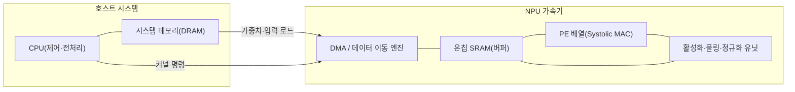
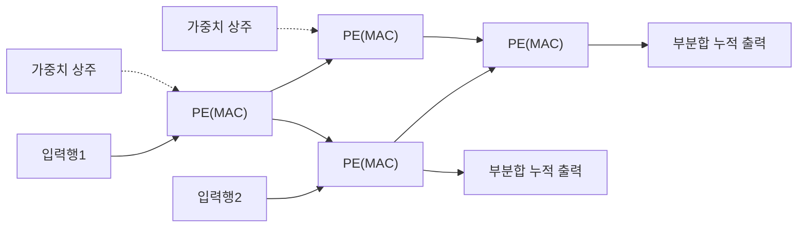
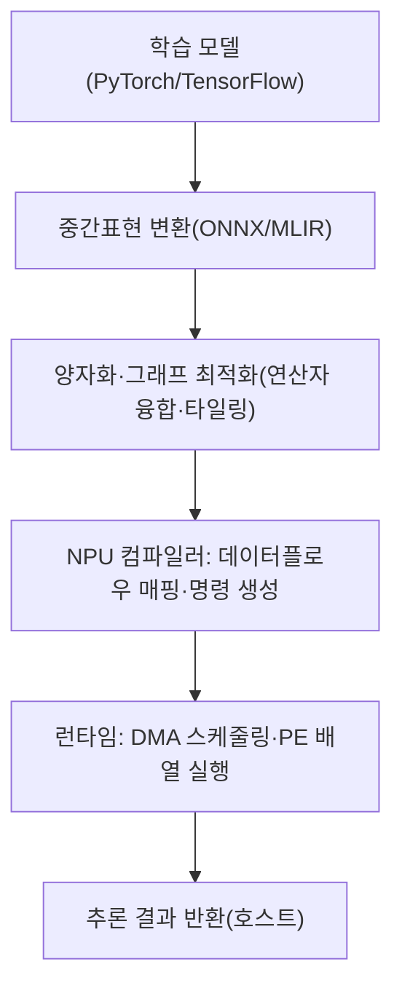

# NPU(Neural Processing Unit, 신경망 처리장치)

## 1. 개요

### 가. 정의
> **NPU(Neural Processing Unit)** 는 심층신경망의 핵심 연산인 **행렬·벡터 곱셈과 곱셈-누산(MAC, Multiply-Accumulate)** 을 대규모 병렬로 처리하도록 특화한 **AI 전용 가속기(Domain-Specific Accelerator)** 이다. 범용 연산을 목표로 한 CPU나 그래픽 연산에서 출발한 GPU와 달리, NPU는 "신경망 추론·학습이라는 특정 워크로드"만을 위해 데이터패스·메모리 계층·수치정밀도를 재설계한 **도메인 특화 아키텍처(DSA)** 의 대표 사례다.

전통적 CPU는 분기 예측·비순차 실행 등 제어 중심 최적화로 다양한 작업을 유연하게 처리하지만, 신경망처럼 동일한 곱셈-누산이 수억~수조 회 반복되는 규칙적 연산에는 비효율적이다. GPU는 수천 개의 코어로 이 병렬성을 상당히 흡수했으나, 원래 그래픽 파이프라인을 위한 범용성이 남아 있어 전력·면적 효율 측면에서는 여전히 개선 여지가 있다. NPU는 제어 로직을 최소화하고 **연산기(PE) 배열과 온칩 메모리**에 다이 면적을 집중함으로써, 같은 전력에서 훨씬 높은 연산 처리량(TOPS)과 전력효율(TOPS/W)을 달성한다. 구글 TPU, 애플 뉴럴엔진, 삼성·퀄컴 모바일 SoC의 NPU 블록이 대표적이다.

### 나. 등장 배경 및 필요성
NPU가 부상한 배경에는 세 가지 압력이 겹쳐 있다. 첫째는 **딥러닝 연산량의 폭발적 증가**다. 이미지 인식에서 시작해 트랜스포머 기반 대규모 언어모델(LLM)로 넘어오면서 모델 파라미터와 연산량이 기하급수적으로 늘었고, 범용 프로세서로는 합리적 시간·비용 안에 이를 감당하기 어려워졌다. 둘째는 **전력효율(Energy Efficiency)의 한계**다. 무어의 법칙 둔화와 데나드 스케일링 종료로 트랜지스터를 더 넣어도 전력밀도가 함께 오르는 상황에서, 성능을 끌어올리려면 범용성을 포기하고 특정 연산에 회로를 특화하는 **도메인 특화 가속**이 사실상 유일한 출구가 되었다. 셋째는 **추론의 편재화(Ubiquitous Inference)** 로, 스마트폰·자동차·IoT 단말처럼 배터리와 발열이 제약인 환경에서 AI를 상시 구동해야 하는 온디바이스 수요가 커지면서, 작은 전력으로 신경망을 돌리는 전용 하드웨어가 필수가 되었다. 이 세 압력이 맞물려 "신경망만 잘하는 칩"인 NPU가 CPU·GPU에 이어 컴퓨팅의 제3축으로 자리 잡았다.

역사적으로 보면, 초기에는 GPU가 딥러닝 붐을 견인했지만 학습·추론 규모가 커지면서 "범용 병렬"만으로는 비용·전력을 감당하기 어려운 임계점에 도달했고, 이때 특정 워크로드에 회로를 맞추는 전용 가속기가 필연적 해법으로 등장했다. 구글이 2015년경 자사 데이터센터 추론 부담을 낮추기 위해 TPU를 개발한 것이 상징적 전환점으로, 이후 클라우드·모바일·차량 전 영역에서 NPU 내재화가 표준이 되었다.

한 걸음 더 들어가면, NPU의 부상은 컴퓨팅 설계 철학의 전환을 반영한다. 반도체 성능 향상이 클럭·범용성 확대만으로는 한계에 부딪히자, 특정 응용의 연산 패턴에 회로를 맞추는 **도메인 특화 아키텍처(DSA)** 가 성능·전력의 새 돌파구로 부각되었고, 신경망은 그 첫 번째 대규모 성공 사례가 되었다. 즉 NPU는 단순한 신제품이 아니라 "폰노이만 범용성에서 응용 특화로"라는 시대적 흐름의 산물이며, 이 관점을 이해해야 이후의 구조적 선택들이 일관되게 읽힌다.

### 다. 특징
NPU의 성격은 **① 특정 연산 특화(MAC 중심), ② 대규모 데이터 병렬성 활용, ③ 저정밀 정수 연산 선호(INT8 등), ④ 데이터 재사용 극대화를 통한 전력효율 우선**으로 요약된다. 이는 "유연성"을 일부 희생하는 대신 "효율"을 얻는 설계 철학이며, 뒤에서 살펴볼 구조·정밀도·컴파일러 스택이 모두 이 원칙에서 파생된다.

네 가지 특징은 서로 맞물려 있다. MAC 중심의 특화(①)가 있기에 규칙적 배열로 병렬성(②)을 극대화할 수 있고, 그 규칙성 덕에 저정밀 정수 연산(③)을 촘촘히 집적하며, 데이터 재사용(④)으로 이동 에너지를 줄여 전력효율이 완성된다. 반대로 이 규칙성을 벗어나는 워크로드에서는 네 이점이 동시에 약해지는데, 이것이 NPU의 강점이자 한계를 동시에 규정한다. 따라서 NPU를 이해한다는 것은 이 네 축이 어떤 조건에서 성립하고 어떤 조건에서 무너지는지를 아는 것과 같다.

## 2. 아키텍처 구조와 동작 원리

NPU 성능의 핵심은 **연산기를 어떻게 배열해 데이터 이동을 줄이느냐**에 있다. 아래 구조도는 호스트(CPU)와 NPU가 협력하는 전형적 시스템 구성을 보여준다.

호스트 CPU는 모델 그래프를 분해해 연산을 NPU로 위임하고, 방대한 가중치·입력은 DMA가 **온칩 SRAM 버퍼**로 옮긴 뒤 **PE 배열**에서 행렬곱이 수행된다. 여기서 핵심은 **연산 대비 데이터 재사용을 극대화**하여 느리고 전력을 많이 먹는 외부 DRAM 접근을 최소화하는 것이다. 데이터 한 번 읽어 여러 번 재사용할수록(높은 Operational Intensity) NPU의 이점이 커진다.

이 구조가 전력효율로 이어지는 원리는 "값비싼 자원을 아끼고 값싼 자원을 활용한다"로 요약된다. 신경망 연산에서 진짜 비용이 큰 것은 곱셈 자체가 아니라 그 피연산자를 먼 메모리에서 실어 나르는 일이다. NPU는 바로 이 데이터 이동을 겨냥해, 제어 로직을 걷어내고 확보한 다이 면적을 연산기와 온칩 버퍼에 투자한다. 아래에서는 그 구체적 설계 요소들을 하나씩 살펴본다.

### 가. 시스톨릭 어레이와 곱셈-누산 병렬화
NPU의 심장은 **시스톨릭 어레이(Systolic Array)** 라 불리는 2차원 격자형 연산기 배열이다. 이는 다수의 처리요소(PE)가 격자로 연결되어, 데이터가 심장 박동처럼 한 클럭마다 인접 PE로 흘러가며 각 PE가 곱셈-누산을 수행하는 구조다. 행렬 A와 B의 곱을 계산할 때, 입력은 배열의 한 변으로 흘러들고 가중치는 각 PE에 상주하며, 부분합이 배열을 따라 누적되어 반대편으로 빠져나온다. 이 방식의 결정적 장점은 **한 번 읽은 데이터가 배열 내부를 통과하며 여러 PE에서 재사용**되어, 외부 메모리 접근 횟수를 획기적으로 줄인다는 데 있다. 구글 TPU가 256×256 규모의 대형 시스톨릭 어레이로 한 사이클에 수만 회의 MAC을 처리한 것이 대표적 사례로, 제어 오버헤드가 거의 없이 연산 밀도를 극한으로 끌어올린다.

아래 세부도는 2×2 축소 예시로, 입력이 왼쪽에서 흘러들고 가중치가 각 PE에 상주하며 부분합이 아래로 누적되는 시스톨릭 어레이의 데이터 흐름을 보여준다.

핵심은 한 번 주입된 입력·가중치가 배열을 통과하며 여러 PE에서 거듭 쓰인다는 점으로, 이 재사용이 외부 메모리 접근을 줄이는 원천이다. 시스톨릭 어레이가 효율적인 이유는 단순히 "코어가 많아서"가 아니라 **데이터 이동 패턴이 규칙적이고 국소적**이기 때문이다. GPU가 방대한 레지스터·캐시를 통해 유연하게 데이터를 공유한다면, 시스톨릭 어레이는 인접 PE 간 배선만으로 데이터를 전달해 배선 길이와 전력을 줄인다. 다만 이런 규칙성은 곱셈-누산이 조밀하게 채워질 때만 효과적이어서, 희소(Sparse)하거나 불규칙한 연산에서는 PE 활용률이 떨어질 수 있다는 한계도 함께 지닌다.

### 나. 데이터플로우(Dataflow)와 재사용 전략
NPU 설계에서 성능·전력을 좌우하는 또 하나의 축은 **어떤 데이터를 고정하고 무엇을 흐르게 할 것인가**를 정하는 데이터플로우다. 크게 세 가지가 있다. **가중치 고정(Weight Stationary)** 은 가중치를 PE에 상주시켜 재사용을 극대화하는 방식으로, 같은 가중치를 여러 입력에 반복 적용하는 합성곱·완전연결층에 유리하다. **출력 고정(Output Stationary)** 은 각 PE가 하나의 출력값 누산을 끝까지 책임져 부분합의 이동을 없애며, **행 고정(Row Stationary)** 은 입력·가중치·부분합의 재사용을 종합적으로 균형 맞추는 방식(예: MIT Eyeriss)이다. 어느 것이 최적인지는 계층의 형태(채널 수·커널 크기·배치 크기)에 따라 달라지므로, 실제 NPU는 여러 데이터플로우를 지원하거나 특정 워크로드에 맞춰 선택한다. 이처럼 "무엇을 재사용할지"의 설계가 곧 전력효율을 결정한다.

한편 데이터플로우 선택은 온칩 메모리 계층 설계와 맞물린다. NPU는 외부 DRAM, 큰 온칩 **글로벌 버퍼(Global Buffer, SRAM)**, 그리고 각 PE 내부의 작은 **레지스터 파일**로 이어지는 다단 메모리 계층을 두는데, 상위로 갈수록 접근 에너지가 급격히 낮아진다. 따라서 데이터를 가능한 한 PE 근처(레지스터·로컬 버퍼)에 오래 머무르게 해 재사용하는 것이 전력효율의 관건이며, 데이터플로우란 결국 "이 계층 어디에 무엇을 얼마나 붙잡아 둘 것인가"를 정하는 정책에 다름 아니다. 이 때문에 NPU 설계는 연산기 수를 늘리는 것만큼이나 버퍼 용량과 대역폭의 균형을 잡는 일이 중요하다.

### 다. 저정밀 연산과 양자화
NPU가 GPU 대비 압도적 전력효율을 내는 또 다른 비결은 **낮은 수치정밀도(Reduced Precision)** 다. 학습은 통상 FP32/FP16 같은 부동소수점을 쓰지만, 추론 단계에서는 32비트 부동소수점을 **8비트 정수(INT8)** 나 그 이하로 낮추는 **양자화(Quantization)** 를 적용해도 정확도 손실이 크지 않다는 점이 실증되었다. 정수 곱셈기는 부동소수점 대비 회로 면적·전력이 수 배 작으므로, 같은 다이에 더 많은 연산기를 넣고 더 낮은 전력으로 돌릴 수 있다. 예컨대 INT8 연산은 FP32 대비 대략 4분의 1 수준의 메모리와 훨씬 적은 에너지로 동일 연산을 수행한다. 최신 NPU는 여기서 더 나아가 INT4·FP8 등 초저정밀과, 레이어별로 정밀도를 달리하는 **혼합정밀도(Mixed Precision)**, 가중치가 0인 연결을 건너뛰는 **희소성(Sparsity) 가속**까지 지원해 효율을 끌어올린다. 다만 정밀도를 낮출수록 정확도 저하 위험이 커지므로, 양자화 인지 학습(QAT) 등으로 이를 보정하는 것이 실무적 관건이다.

### 라. 소프트웨어 스택과 컴파일러
NPU는 하드웨어만으로 동작하지 않으며, **모델을 하드웨어 명령으로 변환하는 컴파일러·런타임 스택**이 성능의 절반 이상을 좌우한다. 개발자가 파이토치·텐서플로로 작성한 모델은 ONNX 같은 중간표현으로 바뀐 뒤, NPU 전용 컴파일러(예: 벤더 SDK, Apache TVM, Google XLA)가 이를 받아 **연산자 융합(Operator Fusion), 타일링(Tiling), 메모리 할당, 데이터플로우 매핑**을 수행해 최적화된 실행 코드를 만든다. 이 과정에서 여러 연산을 하나로 합쳐 중간결과의 메모리 왕복을 없애고, 큰 행렬을 온칩 버퍼 크기에 맞게 잘라(타일링) 재사용을 극대화한다. 하드웨어가 아무리 뛰어나도 컴파일러가 연산을 잘 매핑하지 못하면 PE 활용률이 급락하므로, NPU 경쟁력은 **하드웨어-소프트웨어 공동 설계(HW-SW Co-design)** 에 크게 의존한다. 실제로 신생 NPU 스타트업들이 겪는 가장 큰 난관도 칩 자체보다 이 소프트웨어 생태계의 성숙도인 경우가 많다.

### 마. 성능지표와 루프라인(Roofline) 관점
NPU를 평가·비교할 때는 단일 수치가 아니라 여러 지표를 함께 봐야 한다. 가장 널리 쓰이는 것은 초당 연산 횟수인 **TOPS(Tera Operations Per Second)** 와, 이를 소비전력으로 나눈 **전력효율 TOPS/W** 다. 그러나 TOPS는 이론상 최대치(Peak)일 뿐이어서, 실제 워크로드에서 연산기가 얼마나 채워졌는지를 나타내는 **실효 활용률(Utilization)** 과 **모델 FLOP 활용률(MFU, Model FLOPs Utilization)** 을 함께 봐야 왜곡을 피할 수 있다. 예컨대 어떤 칩이 100 TOPS를 광고해도 실제 추론에서 활용률이 30%에 그친다면, 경쟁 칩의 60 TOPS·70% 활용이 더 빠를 수 있다. 이처럼 "카탈로그 스펙"과 "실측 성능"의 괴리를 읽어내는 것이 기술사 관점의 안목이다.

성능의 병목이 연산인지 메모리인지를 구조적으로 진단하는 도구가 **루프라인 모델(Roofline Model)** 이다. 가로축에 연산강도(Operational Intensity, 바이트당 연산 수), 세로축에 달성 성능을 놓으면, 성능은 메모리 대역폭이 그은 **사선 지붕**과 연산 성능이 그은 **수평 지붕** 중 낮은 쪽에 갇힌다. 연산강도가 낮은 LLM 가중치 읽기 같은 작업은 대역폭 지붕에 걸려(Memory-bound) 연산기를 아무리 늘려도 빨라지지 않으며, 반대로 조밀한 합성곱은 연산 지붕에 걸린다(Compute-bound). 따라서 NPU 설계·튜닝은 대상 워크로드가 루프라인의 어느 영역에 있는지를 먼저 파악하고, 그에 맞춰 연산기·대역폭·온칩 버퍼의 균형을 잡는 데서 출발한다.

### 바. 한계와 도전과제
NPU가 만능은 아니며, 특화의 대가로 몇 가지 구조적 한계를 안는다. 첫째는 **유연성 부족**이다. 하드웨어가 특정 연산자·데이터플로우에 최적화되어 있어, 어텐션의 변형이나 새로운 활성화 함수처럼 예상치 못한 연산 패턴이 등장하면 지원이 늦거나 CPU로 폴백(Fallback)해 성능이 급락한다. 딥러닝 모델 구조가 빠르게 바뀌는 현실에서, 칩 설계-검증-양산에 수년이 걸리는 하드웨어가 소프트웨어의 변화 속도를 따라가기 어렵다는 **속도 불일치**가 근본 딜레마다.

둘째는 **희소성·비정형 연산의 비효율**이다. 시스톨릭 어레이는 조밀한 행렬곱에 최적이지만, 가중치가 대부분 0인 희소 모델이나 그래프·추천 임베딩처럼 접근이 불규칙한 워크로드에서는 PE가 놀아 이론 성능을 못 낸다. 셋째는 **소프트웨어 성숙도와 벤더 종속**으로, 앞서 강조했듯 컴파일러·프레임워크 생태계가 약하면 좋은 칩도 제 성능을 못 내며, 특정 벤더 툴체인에 묶이는 Lock-in 위험이 크다. 이러한 한계들은 NPU를 CPU·GPU의 대체재가 아니라 **역할을 나눠 맡는 보완재**로 자리매김하게 하는 근거가 된다.

## 3. 유형 및 CPU·GPU와의 비교

NPU는 배치되는 위치와 목적에 따라 성격이 갈린다. 아래는 대표적 분류와 특성을 정리한 표다.

| 구분 | 배치·형태 | 목표 | 대표 사례 |
|------|-----------|------|-----------|
| 데이터센터 NPU | 서버 가속 카드·모듈 | 대규모 학습·추론 처리량 | 구글 TPU, 국내외 AI 반도체 |
| 모바일/엣지 NPU | SoC 내장 IP 블록 | 저전력 온디바이스 추론 | 애플 뉴럴엔진, 스마트폰 NPU |
| 자동차/임베디드 NPU | 차량용 SoC·전용칩 | 실시간·기능안전 추론 | ADAS·자율주행 SoC |

표는 분류를 보조할 뿐이며, 핵심은 **동일한 '신경망 특화'라는 철학이 전력 예산과 지연 요구에 따라 다르게 구현**된다는 점이다. 데이터센터 NPU는 수백 와트를 쓰며 처리량을 극대화하는 반면, 모바일 NPU는 수 와트 이하에서 상시 추론을 지속해야 하므로 정수 연산·클럭 게이팅 등 저전력 기법에 더 무게를 둔다.

아래 절차도는 학습된 모델이 NPU에서 실제로 실행되기까지 거치는 배포·실행 파이프라인을 나타낸다. 하드웨어 못지않게 이 소프트웨어 경로가 실효 성능을 좌우한다.

이 흐름에서 3~4단계(양자화·매핑)의 품질이 실효 활용률을 좌우한다. 같은 하드웨어라도 컴파일러가 연산을 잘게 나눠 온칩 버퍼에 맞추고 불필요한 메모리 왕복을 제거하면 성능이 배로 뛰는 반면, 매핑이 서툴면 값비싼 PE 배열이 놀게 된다. 이것이 NPU를 "하드웨어 단품"이 아니라 "하드웨어-소프트웨어 시스템"으로 봐야 하는 이유다.

CPU·GPU와의 비교는 항목 나열이 아니라 **왜 차이가 생기는지**로 이해해야 한다. CPU는 소수의 강력한 코어와 정교한 제어로 **분기·순차 로직**에 강하지만 대규모 병렬 곱셈에는 비효율적이다. GPU는 수천 코어의 SIMT 구조로 **범용 병렬 연산**에 탁월해 학습에 널리 쓰이나, 그래픽 태생의 범용성 탓에 추론 전용 대비 전력효율이 낮다. NPU는 제어·범용성을 덜어내고 **MAC 배열과 온칩 메모리에 자원을 집중**하므로, 특정 신경망 워크로드에서 GPU 대비 수 배의 TOPS/W를 낸다. 대신 지원 연산자가 제한적이고 새로운 모델 구조가 나오면 하드웨어·컴파일러가 이를 따라가야 한다는 유연성의 대가를 치른다. 요컨대 **CPU=유연성, GPU=범용 병렬, NPU=효율 특화**라는 상보적 역할 분담이며, 실제 시스템은 세 가지를 이기종(Heterogeneous)으로 결합해 사용한다.

### 구체 사례로 본 효율 차이
효율 차이를 수치 감각으로 이해하면 NPU의 존재 이유가 분명해진다. 첫째, **정밀도 절감 효과**다. FP32 곱셈기를 INT8로 낮추면 곱셈기 회로 면적·전력이 대략 한 자릿수 배 줄어, 같은 다이에 훨씬 많은 MAC을 집적하고 더 낮은 전력으로 구동할 수 있다. 가중치 저장 용량과 메모리 대역폭 소모도 4분의 1 수준으로 줄어, 메모리 병목이 큰 추론에서 이중의 이득을 준다. 둘째, **데이터 이동 에너지**다. 일반적으로 한 번의 곱셈-누산 자체보다 그 피연산자를 외부 DRAM에서 읽어오는 데 수십 배의 에너지가 든다고 알려져 있어, 시스톨릭 어레이·온칩 버퍼로 재사용을 늘려 외부 접근을 줄이는 것이 전력효율의 핵심임을 알 수 있다. 셋째, **활용률의 현실**이다. 구글 TPU 논문은 초기 데이터센터 추론에서 워크로드에 따라 연산기 활용률이 크게 요동쳤음을 보고했는데, 이는 "이론 TOPS가 높아도 실효 성능은 매핑·배치 크기에 좌우된다"는 앞선 지적을 실증한다. 이 세 사례는 NPU 도입 판단이 스펙 숫자가 아니라 **대상 워크로드에서의 실측**에 근거해야 함을 보여준다.

## 4. 심화: 최신 동향과 실무 적용

NPU 분야는 몇 가지 뚜렷한 흐름 속에 빠르게 진화하고 있다. 첫째, **생성형 AI·LLM 추론 특화**다. 트랜스포머의 어텐션 연산과 거대한 가중치를 효율적으로 처리하기 위해, 대역폭이 큰 HBM을 결합하고 KV 캐시 관리·플래시어텐션류 최적화를 하드웨어·컴파일러 차원에서 지원하는 방향으로 설계가 재편되고 있다. LLM 추론은 메모리 대역폭에 민감(Memory-bound)한 특성이 강해, 연산기뿐 아니라 메모리 서브시스템 설계가 성능을 좌우한다.

이 흐름에서 NPU 설계의 무게중심은 순수 연산 성능에서 **메모리 계층·인터커넥트**로 옮겨가고 있다. LLM 추론 시간의 상당 부분이 거대한 가중치와 KV 캐시를 읽는 데 소요되므로, HBM 대역폭 확대, 다수 칩을 잇는 고속 인터커넥트(칩 간 통신), 그리고 여러 NPU에 모델을 나눠 싣는 텐서·파이프라인 병렬화가 핵심 설계 변수가 되었다. 즉 "칩 하나의 TOPS"보다 "여러 칩을 묶은 시스템의 실효 대역폭과 확장성"이 경쟁력을 가른다.

둘째, **온디바이스 AI의 본격화**다. 스마트폰·PC(이른바 AI PC)에 강력한 NPU가 기본 탑재되면서, 클라우드에 보내지 않고 단말에서 직접 언어모델·이미지 생성을 구동하는 사례가 늘고 있다. 이는 **응답 지연 단축, 통신비 절감, 개인정보의 로컬 처리(프라이버시)** 라는 실질적 이점을 준다. 예컨대 통화 실시간 번역, 사진 보정, 문서 요약 같은 기능이 네트워크 없이 단말 NPU만으로 처리되는 방향으로 제품이 진화한다. 온디바이스 추론은 데이터가 단말을 떠나지 않으므로 개인정보보호법·데이터 주권 요구에도 부합해, 규제가 엄격한 의료·금융 영역에서 특히 주목받는다. 다만 단말의 제한된 전력·메모리에 맞추기 위해 경량화(양자화·증류·프루닝)와 소형 모델(sLM) 설계가 전제되어야 하며, 여기서 다시 NPU의 저정밀·희소 가속 기능이 빛을 발한다.

셋째, **차량·로봇 등 안전필수(Safety-critical) 영역으로의 확장**이다. 자율주행 ADAS는 카메라·라이다 입력을 실시간으로 추론해야 하므로, 결정론적 지연(Deterministic Latency)과 기능안전(ISO 26262) 준수를 만족하는 차량용 NPU가 요구된다. 이 영역에서는 최대 성능보다 **최악의 경우 지연(WCET) 보장과 오류 검출·복구**가 더 중요해, 데이터센터용과는 설계 우선순위가 달라진다. 한 프레임이라도 추론이 늦으면 안전에 직결되므로, 여기서는 처리량보다 예측가능성이 곧 품질이다.

넷째, **AI 반도체 생태계와 국가전략 경쟁**이다. 엔비디아 GPU 중심 구도에 맞서 구글·아마존·마이크로소프트 등 하이퍼스케일러가 자체 NPU(TPU, Trainium/Inferentia, Maia 등)를 설계해 비용·공급망을 내재화하고 있으며, 국내에서도 데이터센터용 AI 반도체 개발이 국가 차원의 과제로 추진되고 있다. 이는 NPU가 단순 부품을 넘어 **AI 주권·산업 경쟁력의 핵심 인프라**로 격상되었음을 보여준다. 다만 이 경쟁의 승부처는 칩 성능뿐 아니라, 앞서 언급한 컴파일러·프레임워크·개발자 생태계의 성숙에 있다는 점이 반복적으로 확인되고 있다. 실제로 후발 주자들이 하드웨어 스펙에서 앞서고도 시장에서 고전하는 주된 이유가 소프트웨어 생태계의 격차인 경우가 많아, "칩을 만드는 능력"과 "칩을 쓰게 만드는 능력"은 별개의 과제로 다뤄진다.

다섯째, **연산 패러다임의 융합**이다. NPU는 앞서 다룬 PIM(메모리 내 연산)·뉴로모픽·아날로그 인메모리 컴퓨팅 등과 배타적이지 않으며, 오히려 메모리 병목을 함께 공략하는 방향으로 수렴하고 있다. 예컨대 대역폭이 관건인 계층은 PIM/HBM으로, 조밀한 행렬곱은 시스톨릭 어레이로 나눠 처리하는 이종 결합이 연구되고 있어, 향후 NPU는 단일 아키텍처가 아니라 여러 연산 방식을 한 패키지에 담는 이기종 가속기의 중심축으로 진화할 가능성이 크다.

## 5. 고려사항 및 시사점

기술사 관점에서 NPU의 도입·설계·전략을 다음과 같이 정리할 수 있다.

- **워크로드 정합성 우선 선정**: NPU는 만능이 아니라 규칙적·조밀한 행렬연산에 특화된 가속기다. 도입 전 대상 워크로드가 실제로 메모리·연산 특성상 NPU 이점을 보는지(합성곱·트랜스포머 등) 벤치마크로 검증하고, 불규칙·제어 중심 로직은 CPU에 남기는 **이기종 분할**을 설계 원칙으로 삼아야 한다.

- **효율과 정확도의 트레이드오프 관리**: 양자화·희소화·저정밀은 전력효율을 크게 높이지만 모델 정확도 저하 위험을 수반한다. 양자화 인지 학습(QAT), 정밀도별 민감도 분석, 정확도-지연-전력의 3자 목표를 함께 관리하는 **정량적 수용기준(SLA)** 설정이 필요하다.

- **소프트웨어 생태계·이식성(Portability) 확보**: NPU 성능은 컴파일러·런타임에 크게 좌우되고, 벤더 종속(Lock-in) 위험이 크다. ONNX·MLIR 등 표준 중간표현과 개방형 컴파일러 스택을 활용해 이식성을 확보하고, 특정 벤더에 종속되지 않는 추상화 계층을 설계 단계에서 고려해야 한다.

- **총소유비용(TCO)과 전력·냉각 관점의 경제성**: 데이터센터 도입 시 칩 단가뿐 아니라 전력·냉각·랙 밀도·유휴율까지 포함한 TCO로 GPU 대비 경제성을 평가해야 한다. 전력효율(TOPS/W)이 곧 운영비와 탄소배출로 직결되므로, ESG·그린 IT 관점에서도 NPU의 효율 이점은 전략적 가치를 지닌다.

- **연계 기술과의 통합 로드맵**: NPU는 HBM·PIM 등 메모리 혁신, 칩렛(Chiplet)·CXL 등 이종집적·인터커넥트, MLOps·온디바이스 프레임워크와 결합할 때 효과가 극대화된다. 단품 도입이 아니라 메모리·패키징·소프트웨어를 아우르는 **시스템 수준 공동설계 로드맵** 관점에서 접근하는 것이 바람직하다.

- **거버넌스·라이프사이클 관리**: 하드웨어 특화가 심화될수록 모델-컴파일러-하드웨어 버전 간 정합성 관리가 중요해진다. 모델 갱신 시 재양자화·재컴파일 파이프라인을 MLOps에 통합하고, 하드웨어 세대 교체에 대비한 추상화·회귀 검증 체계를 갖춰야 장기 운영 리스크를 줄일 수 있다.

- **전망**: 무어의 법칙 둔화가 이어지는 한 도메인 특화 가속은 더욱 확산될 것이며, NPU는 CPU·GPU와 병존하는 상시 컴퓨팅 축으로 굳어질 전망이다. 향후 아날로그·인메모리 연산, 광연산 등과의 융합, 생성형 AI 추론 특화 심화가 주요 발전 방향이 될 것이다.

## 참고자료
- Google Cloud, "Introduction to Cloud TPU": https://cloud.google.com/tpu/docs/intro-to-tpu
- N. P. Jouppi et al., "In-Datacenter Performance Analysis of a Tensor Processing Unit" (ISCA 2017): https://arxiv.org/abs/1704.04760
- Y. Chen et al., "Eyeriss: An Energy-Efficient Reconfigurable Accelerator for Deep Convolutional Neural Networks": https://ieeexplore.ieee.org/document/7738524

---
> **한 줄 요약**: NPU는 신경망의 곱셈-누산 연산을 시스톨릭 어레이·저정밀 연산·데이터 재사용으로 특화 가속하는 AI 전용 가속기로, CPU·GPU와 상보적으로 결합해 온디바이스부터 데이터센터까지 AI 시대의 전력효율을 책임지는 컴퓨팅의 제3축이다.
