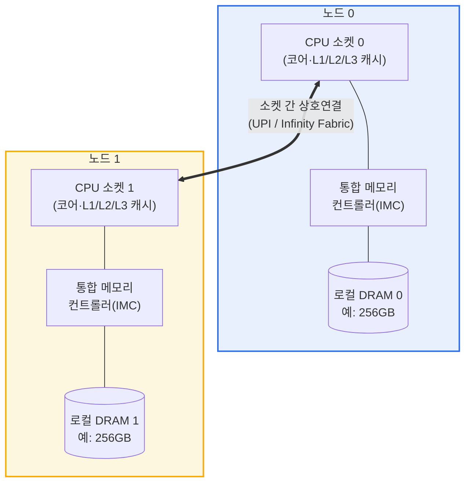

# 불균일 메모리 접근(NUMA, Non-Uniform Memory Access)

## 1. 개요

### 가. 정의

> **NUMA(Non-Uniform Memory Access, 불균일 메모리 접근)** 는 다수의 프로세서(소켓)와 메모리를 여러 개의 **노드(node)** 로 묶고, 각 프로세서가 자신과 물리적으로 가까운 **로컬 메모리(local memory)** 는 빠르게, 다른 노드에 속한 **원격 메모리(remote memory)** 는 상호연결망(interconnect)을 거쳐 상대적으로 느리게 접근하도록 구성한 공유 메모리 다중처리 구조이다.

NUMA의 핵심 발상은 '모든 CPU가 모든 메모리에 똑같은 시간에 접근한다'는 이상을 포기하는 대신, 시스템 확장성(scalability)을 얻는 데 있다. 전통적인 **UMA(Uniform Memory Access)** 또는 대칭형 다중처리(SMP)에서는 모든 프로세서가 하나의 공통 버스와 단일 메모리 풀을 공유하므로, 어느 CPU가 어느 주소를 읽든 접근 지연이 동일하다. 이는 프로그래밍 모델을 단순하게 만들지만, 프로세서 수가 늘어날수록 공유 버스가 병목이 되어 4~8소켓을 넘어서면 확장 효율이 급격히 떨어진다.

NUMA는 이 병목을 '메모리를 CPU 곁으로 분산 배치'하여 해결한다. 각 소켓에 자신만의 메모리 컨트롤러와 로컬 DRAM을 붙여 두면, 대부분의 접근이 로컬에서 처리되어 공유 버스 경합이 사라진다. 다만 그 대가로 다른 노드의 메모리를 읽을 때는 소켓 간 링크(예: Intel UPI, AMD Infinity Fabric)를 한두 홉 건너야 하므로 지연이 커지고 대역폭이 낮아진다. 즉 '메모리 접근 시간이 데이터의 물리적 위치에 따라 달라진다'는 것이 이름 그대로의 본질이며, 소프트웨어가 이 비대칭을 인지하고 데이터·스레드 배치를 최적화해야 성능을 온전히 끌어낼 수 있다.

한 가지 유의할 점은 오늘날 상용 서버의 NUMA는 대부분 **캐시 일관성(cache coherence)을 하드웨어가 보장하는 ccNUMA(cache-coherent NUMA)** 라는 사실이다. 프로그래머는 여전히 단일한 전역 주소 공간을 보며, 원격 메모리도 포인터 하나로 투명하게 접근한다. NUMA는 정확성의 문제가 아니라 **성능의 문제**이며, 잘못 배치하면 느려질 뿐 틀리지는 않는다는 점이 분산 메모리(MPI 등)와 결정적으로 다르다.

### 나. 등장 배경과 필요성

멀티코어·멀티소켓 시대가 열리면서 프로세서의 연산 능력은 코어 수에 비례해 증가했지만, 메모리 서브시스템은 그 속도를 따라가지 못했다. 단일 버스 SMP는 모든 코어가 하나의 메모리 채널을 두고 다투기 때문에, 코어가 16개, 32개로 늘면 메모리 대역폭이 곧바로 상한선이 되어 이른바 **메모리 벽(Memory Wall)** 과 버스 경합이 심화되었다. 데이터센터가 요구하는 대규모 인메모리 데이터베이스, 가상화 집적, HPC 시뮬레이션은 수백 GB~수 TB의 메모리와 수십 개의 코어를 한 노드에 담아야 했고, 단일 버스 구조로는 이를 감당할 수 없었다.

NUMA는 이런 필요에서 자연스럽게 등장했다. 메모리 컨트롤러를 CPU 다이 안으로 통합(IMC, Integrated Memory Controller)하고 소켓마다 독립적인 메모리 채널을 부여함으로써, 시스템 전체 메모리 대역폭이 소켓 수에 비례해 **선형적으로 확장**되도록 만든 것이다. 예를 들어 2소켓 서버는 각 소켓이 8채널 DDR5를 갖추어 노드당 300GB/s 이상, 합산하면 600GB/s를 넘는 대역폭을 제공할 수 있는데, 이는 단일 버스로는 불가능한 수치다. 오늘날 x86 서버(Intel Xeon, AMD EPYC)와 대형 ARM 서버는 사실상 모두 NUMA이며, 클라우드 대형 인스턴스, 관계형·인메모리 DBMS, 가상화 호스트에서 NUMA 인지 튜닝은 성능 엔지니어링의 기본기가 되었다.

## 2. 전체 구조와 구성요소

NUMA 시스템의 전체 구조는 '노드 = 프로세서 + 로컬 메모리 + 메모리 컨트롤러'를 기본 단위로 하고, 이 노드들을 고속 상호연결망으로 묶은 형태로 이해할 수 있다. 아래 구조도는 2개 노드로 구성된 전형적인 ccNUMA 서버의 하드웨어 배치를 보여준다.



**노드(node)** 는 NUMA에서 지역성(locality)을 판단하는 기본 경계다. 하나의 노드는 대개 하나의 CPU 소켓과 그 소켓에 직결된 메모리 채널·DRAM으로 구성되며, 운영체제는 이 노드 단위로 CPU와 메모리 자원을 관리한다. 노드 0의 코어가 노드 0의 DRAM을 읽으면 로컬 접근이고, 노드 1의 DRAM을 읽으면 원격 접근이다. 최근의 대형 프로세서는 한 소켓 안에서도 다이(die)나 메모리 컨트롤러 그룹을 다시 여러 서브노드로 노출하는 **SNC(Sub-NUMA Clustering)** 나 칩렛 기반 구성을 쓰기도 하여, 물리 소켓 수보다 많은 NUMA 노드가 보이는 경우도 흔하다.

**상호연결망(interconnect)** 은 노드 간 원격 접근과 캐시 일관성 트래픽이 흐르는 통로다. Intel은 과거 QPI에서 UPI(Ultra Path Interconnect)로, AMD는 Infinity Fabric으로 소켓을 연결한다. 이 링크의 대역폭과 홉(hop) 수가 원격 접근 성능을 좌우하며, 4소켓·8소켓처럼 노드가 많아지면 노드 간 거리(어떤 노드는 직접 연결, 어떤 노드는 중간 노드를 경유)가 균일하지 않아 **NUMA 거리(NUMA distance)** 라는 개념이 필요해진다. 리눅스는 `numactl --hardware`로 노드 간 상대 거리 행렬(예: 로컬 10, 원격 21)을 제공한다.

**메모리 컨트롤러(IMC)** 는 각 노드의 지역성을 물리적으로 성립시키는 핵심이다. 메모리 컨트롤러가 CPU 다이 안에 통합되면서, 자기 노드의 DRAM은 짧은 배선으로 직접 접근하고 다른 노드의 DRAM은 상호연결을 거치는 비대칭이 만들어진다. **캐시 일관성 프로토콜**(MESI/MESIF/MOESI 계열)은 여러 노드의 캐시에 흩어진 동일 데이터의 복사본이 서로 모순되지 않도록 보장하여, 프로그래머에게 단일 공유 메모리라는 착시를 유지시켜 준다.

아래 시퀀스 다이어그램은 한 코어가 특정 가상주소를 접근할 때, 그 데이터가 로컬 노드에 있는지 원격 노드에 있는지에 따라 경로와 지연이 어떻게 갈리는지를 보여준다. 이 '로컬이면 빠른 직행, 원격이면 상호연결 우회'라는 분기가 NUMA 성능의 모든 것을 압축한다.

```mermaid
sequenceDiagram
  participant Core as "노드0 코어"
  participant L3 as "L3 캐시(노드0)"
  participant MC0 as "IMC(노드0)"
  participant Link as "상호연결(UPI/IF)"
  participant MC1 as "IMC(노드1)"
  Core->>L3: 주소 조회(캐시 히트?)
  alt 캐시 히트
    L3-->>Core: 데이터 즉시 반환(수 ns)
  else 캐시 미스 - 로컬 메모리
    L3->>MC0: 로컬 DRAM 요청
    MC0-->>Core: 데이터 반환(약 90ns, 로컬)
  else 캐시 미스 - 원격 메모리
    L3->>Link: 원격 노드로 요청 전달
    Link->>MC1: 노드1 DRAM 요청
    MC1-->>Link: 데이터 전달
    Link-->>Core: 데이터 반환(약 150ns, 원격)
  end
```

### 가. 로컬 접근과 원격 접근의 성능 비대칭

NUMA를 이해하는 가장 실질적인 관점은 로컬과 원격의 정량적 차이다. 로컬 접근은 메모리 컨트롤러를 통해 곧바로 DRAM에 도달하지만, 원격 접근은 '요청 → 소켓 간 링크 → 상대 노드 메모리 컨트롤러 → DRAM → 다시 링크 → 원 노드'의 경로를 거치므로 지연이 더해진다. 실측 기준으로 원격 지연은 로컬 대비 대략 **1.5~2.2배**, 원격 대역폭은 로컬의 **50~70% 수준**으로 낮아지는 것이 일반적이다. 예컨대 로컬 접근이 90ns라면 원격은 130~180ns가 될 수 있다.

이 차이가 실제 응용에 미치는 영향은 결코 작지 않다. 대규모 인메모리 DB에서 스레드가 자신의 노드가 아닌 원격 노드의 버퍼 풀을 반복 접근하면, 접근 하나하나의 지연 증가가 누적되어 처리량이 20~40%까지 하락하는 사례가 보고된다. 반대로 데이터와 이를 처리하는 스레드를 같은 노드에 배치하면 원격 트래픽이 사라져 상호연결 대역폭 경합도 함께 줄어드는 이중 효과가 있다.

주의할 점은 원격 접근이 '느린 것'이지 '틀린 것'은 아니라는 사실이다. ccNUMA에서는 원격 데이터도 정확히 읽히며, 성능 저하만 발생한다. 따라서 NUMA 최적화는 정확성 검증이 아니라 프로파일링을 통한 지역성 개선의 문제로 접근해야 한다.

### 나. 운영체제의 NUMA 인지 정책(스케줄링·메모리 배치)

NUMA의 성능은 절반 이상이 운영체제와 런타임의 배치 정책에 달려 있다. 리눅스 커널은 물리 메모리를 노드별 존(zone)으로 관리하고, 프로세스가 메모리를 요청하면 기본적으로 **first-touch 정책**을 적용한다. 이는 페이지를 '할당을 요청한 시점'이 아니라 '그 페이지에 처음 실제로 쓰기(touch)를 수행한 스레드가 속한 노드'에 배치하는 정책으로, 초기화 루프를 실제 계산을 수행할 스레드가 병렬로 돌게 하면 데이터가 자연스럽게 각 스레드의 로컬 노드에 흩어진다.

스케줄러 역시 NUMA를 인지한다. CPU 스케줄러는 스레드를 가능한 한 자신의 메모리가 있는 노드의 코어에서 실행하려 하고(**CPU affinity·NUMA balancing**), 리눅스의 **AutoNUMA**는 실행 중 페이지 접근 통계를 수집해 자주 원격 접근되는 페이지를 접근 스레드 노드로 마이그레이션하거나 스레드를 데이터 쪽으로 이주시켜 지역성을 사후 교정한다. 다만 이런 자동 균형화는 페이지 이동 비용을 수반하므로, 지연에 민감한 워크로드에서는 오히려 `numactl --cpunodebind --membind`로 명시적으로 고정하는 편이 안정적이다.

메모리 배치 전략에는 몇 가지 선택지가 있다. 특정 노드에 몰아넣는 **bind**, 여러 노드에 라운드로빈으로 분산하는 **interleave**, 우선 로컬을 쓰되 부족하면 원격으로 넘기는 **preferred** 정책이 대표적이다. 예컨대 대역폭이 관건인 HPC 스트리밍 커널은 interleave로 모든 노드의 메모리 대역폭을 합산해 쓰는 편이 유리하고, 지연이 관건인 OLTP는 bind로 지역성을 극대화하는 편이 유리하다. 이처럼 워크로드 특성에 따라 정반대의 정책이 최적이 된다는 점이 NUMA 튜닝의 묘미이자 어려움이다.

### 다. 애플리케이션·가상화 계층의 NUMA 정합

하드웨어와 OS가 준비되어도 애플리케이션이 노드 경계를 무시하면 효과가 사라진다. 그래서 DBMS·JVM·가상화 하이퍼바이저는 자체적으로 NUMA를 인지하도록 설계된다. SQL Server는 **soft-NUMA**로 스케줄러 그룹을 노드에 정렬하고, Oracle·PostgreSQL은 대형 버퍼 캐시를 노드에 인터리브하거나 특정 노드에 고정하는 옵션을 제공한다. JVM은 `-XX:+UseNUMA` 플래그로 힙의 젊은 세대(young gen)를 노드별로 분할해 각 GC 스레드가 로컬 영역만 다루게 함으로써 원격 접근을 줄인다.

가상화·컨테이너 환경에서는 **vNUMA(virtual NUMA)** 정합이 중요하다. 물리 호스트의 NUMA 토폴로지를 게스트 VM에 그대로 노출하면, 게스트 OS가 자신의 관점에서 다시 NUMA 최적화를 수행해 이중으로 지역성을 확보할 수 있다. 반대로 VM의 가상 CPU와 메모리가 여러 물리 노드에 걸쳐 배치되면(NUMA 스팬), 게스트 내부의 어떤 최적화도 물리 원격 접근을 피하지 못한다. VMware·KVM은 VM의 vCPU와 메모리를 가능한 한 하나의 물리 노드 안에 묶어 배치하는 스케줄링을 수행하며, 쿠버네티스도 **Topology Manager**로 CPU·메모리·장치(NIC·GPU)를 동일 노드에 정렬해 지연에 민감한 파드의 성능을 보장한다.

### 라. 캐시 일관성 트래픽과 거짓 공유(false sharing)

NUMA에서 종종 간과되지만 성능을 크게 좌우하는 것이 캐시 일관성 유지에 드는 비용이다. ccNUMA는 여러 노드의 캐시에 같은 데이터의 복사본이 존재할 수 있으므로, 어느 노드가 그 데이터를 수정하면 다른 노드의 복사본을 무효화(invalidate)하거나 최신본을 넘겨주는 코히어런시 트래픽이 상호연결을 타고 흐른다. 이 트래픽은 원격 데이터 접근과 무관하게, 심지어 로컬 데이터만 다루는 것처럼 보이는 코드에서도 발생할 수 있다.

대표적 함정이 **거짓 공유(false sharing)** 다. 서로 다른 노드의 스레드가 논리적으로는 별개의 변수를 다루지만, 그 변수들이 우연히 같은 캐시 라인(보통 64바이트) 안에 놓여 있으면, 한 스레드의 쓰기가 다른 노드가 캐싱한 라인 전체를 무효화시켜 불필요한 코히어런시 왕복이 폭증한다. 예를 들어 스레드별 카운터 배열을 인접하게 배치하면, 각 스레드가 자기 카운터만 증가시키는데도 노드 간 캐시 라인 핑퐁으로 성능이 수 배 저하될 수 있다. 해법은 각 카운터를 캐시 라인 크기로 패딩(cache line padding)하여 서로 다른 라인에 놓는 것으로, 이는 NUMA·멀티코어 성능 튜닝의 고전적 기법이다.

따라서 NUMA 최적화는 '데이터를 로컬에 두는 것'만이 아니라 '노드 간에 공유·경합하는 쓰기를 최소화하는 것'까지 포함한다. `perf c2c`(cache-to-cache) 같은 도구로 어떤 캐시 라인이 노드를 넘나들며 경합하는지 식별하고, 자료구조를 노드별로 샤딩하거나 패딩해 코히어런시 트래픽을 줄이는 것이 실무의 핵심 과제다.

## 3. UMA·NUMA·분산 메모리 비교

세 구조의 차이는 단순한 우열이 아니라 '프로그래밍 편의성'과 '확장성'을 어떻게 맞바꾸는가의 문제다. UMA(SMP)는 모든 접근 지연이 동일해 프로그래밍이 가장 단순하지만 확장성이 낮고, 분산 메모리(예: MPI 클러스터)는 무한에 가깝게 확장되지만 노드 간에 명시적 메시지 전달이 필요해 개발 부담이 크다. NUMA는 그 사이에서 '단일 주소 공간의 편의성'과 '소켓 단위 확장성'을 절충한 지점에 위치한다.

| 구분 | UMA(SMP) | NUMA(ccNUMA) | 분산 메모리(MPP) |
|------|----------|--------------|------------------|
| 메모리 모델 | 단일 공유 풀 | 단일 주소공간, 물리 분산 | 노드별 독립 메모리 |
| 접근 지연 | 균일 | 로컬≠원격(비대칭) | 원격은 명시적 통신 |
| 캐시 일관성 | HW 보장 | HW 보장(ccNUMA) | 없음(SW가 관리) |
| 확장성 | 낮음(~8소켓) | 중간(수십 소켓) | 매우 높음(수천 노드) |
| 프로그래밍 난이도 | 낮음 | 중간(배치 튜닝) | 높음(MPI 등) |
| 대표 사례 | 소형 다중코어 | Xeon/EPYC 서버 | HPC 슈퍼컴퓨터 |

표에서 드러나듯 NUMA가 UMA와 결정적으로 다른 지점은 '접근 지연의 비대칭'이며, 분산 메모리와 다른 지점은 '캐시 일관성과 단일 주소공간의 유지'다. 이 두 경계 덕분에 NUMA는 기존 SMP용으로 작성된 소프트웨어를 수정 없이도 돌릴 수 있으면서(정확성 보존), 성능 튜닝을 얹으면 대형 시스템으로 확장되는 실용적 절충안이 된다. 실무에서 "코드는 그대로 돌지만 느리다"는 증상이 나타난다면 그 상당수가 UMA 가정으로 짜인 코드가 NUMA 하드웨어에서 원격 접근을 남발하는 경우다.

구체적 사례로, 한 인메모리 캐시 서버를 2소켓·40코어 장비에서 아무 튜닝 없이 구동했을 때 40개 스레드가 노드 경계를 넘나들며 힙을 공유해 처리량이 목표의 60%대에 머물렀으나, 스레드를 노드별로 20개씩 나누어 로컬 힙만 쓰도록 샤딩하고 `numactl`로 고정하자 처리량이 약 1.5배 향상된 사례가 있다. 이는 코드 로직을 한 줄도 바꾸지 않고 배치만 바꾼 결과라는 점에서 NUMA 최적화의 성격을 잘 보여준다.

## 4. 심화: CXL과 메모리 계층 확장, 그리고 최신 동향

NUMA 개념은 최근 **CXL(Compute Express Link)** 의 부상으로 새로운 국면을 맞고 있다. CXL은 PCIe 물리 계층 위에서 캐시 일관성을 유지한 채 메모리를 확장·공유·풀링하는 개방형 상호연결 표준으로, CXL로 붙인 외장 메모리는 CPU에서 볼 때 '코어가 없는 또 하나의 NUMA 노드(memory-only node, CPU-less node)'로 나타난다. 즉 원격 접근보다도 한 단계 더 먼 계층이 생기는 셈이며, 운영체제는 이를 기존 NUMA 프레임워크로 관리한다. 리눅스가 도입한 **계층형 메모리(tiered memory)** 와 페이지 승격·강등(promotion/demotion) 메커니즘은, 뜨거운 데이터는 빠른 로컬 DRAM에, 차가운 데이터는 느린 CXL 메모리에 두는 자동 배치를 NUMA 노드 간 페이지 마이그레이션으로 구현한다.

이 흐름은 NUMA를 '소켓 간 비대칭'에서 '메모리 계층 전반의 비대칭'으로 확장한다. 과거에는 로컬 대 원격의 2단계였다면, 이제는 로컬 DRAM(약 90ns) → 원격 DRAM(약 150ns) → CXL 메모리(약 250~400ns)로 이어지는 다단계 지연 계층을 소프트웨어가 인지·활용해야 한다. 또한 여러 서버가 CXL 스위치를 통해 하나의 메모리 풀을 공유하는 **메모리 풀링(memory pooling)** 은 데이터센터의 메모리 스트랜딩(할당은 되었지만 쓰이지 않는 메모리) 문제를 완화하는 수단으로 주목받고 있어, NUMA 최적화 기법의 가치는 오히려 커지고 있다.

AI·데이터센터 관점에서도 NUMA는 여전히 결정적이다. GPU를 여러 장 꽂은 학습 서버에서 각 GPU는 특정 NUMA 노드의 PCIe·메모리에 붙어 있으므로, 데이터 로더 스레드와 고정 메모리(pinned memory) 버퍼를 해당 GPU와 같은 노드에 배치해야 PCIe·NVLink 전송 지연과 원격 DRAM 접근을 함께 줄일 수 있다. 쿠버네티스 Topology Manager, NVIDIA의 GPU 토폴로지 인지 배치가 모두 이 원리를 자동화한 것이다. 다만 CXL·tiered memory의 세부 성능 수치와 표준 세부 사항은 세대·구현별 편차가 크므로, 실제 설계 시에는 벤더 문서와 실측으로 확인하는 것이 바람직하다.

## 5. 고려사항 및 시사점

기술사 관점에서 NUMA는 단순한 하드웨어 세부가 아니라 '지역성을 시스템 전 계층에서 정합시키는 설계 원리'로 이해해야 하며, 다음과 같은 전략적 시사점을 갖는다.

- **적용 전략 — 워크로드 특성에 따른 정책 이원화**: 지연 민감형(OLTP, 인메모리 캐시)은 bind·affinity로 지역성을 극대화하고, 대역폭 집약형(HPC 스트리밍, 대규모 분석)은 interleave로 전체 노드 대역폭을 합산해 활용해야 한다. 하나의 정답이 없으므로, 도입 전 반드시 프로파일링(`numastat`, `perf c2c`, LIKWID 등)으로 원격 접근 비율과 병목 유형을 먼저 진단해야 한다.

- **트레이드오프 — 자동 균형화 대 명시적 고정**: AutoNUMA·NUMA balancing은 개발 부담 없이 지역성을 개선하지만 페이지 마이그레이션과 통계 수집 오버헤드를 유발한다. 지연 지터(jitter)에 민감한 실시간·금융 시스템에서는 자동화를 끄고 수동 고정을 택하는 편이 예측 가능성을 높인다. 편의성과 결정성 사이의 균형을 워크로드별로 판단해야 한다.

- **가상화·클라우드 정합의 중요성**: 물리 NUMA가 아무리 잘 튜닝돼도 vNUMA·컨테이너 토폴로지가 물리 경계와 어긋나면 효과가 상쇄된다. VM 크기를 물리 노드에 맞추고(NUMA 스팬 회피), 쿠버네티스 Topology Manager로 CPU·메모리·NIC·GPU를 동일 노드에 정렬하는 것이 대형 인스턴스 성능 보장의 전제 조건이다. 클라우드 대형 인스턴스 선정 시 vCPU·메모리 비율이 노드 경계와 정합하는지 검토해야 한다.

- **전망과 연계 기술 — CXL·계층형 메모리로의 확장**: CXL 메모리 확장·풀링이 보편화되면 NUMA는 소켓 간 비대칭을 넘어 DRAM–CXL을 아우르는 다단계 메모리 계층 관리로 진화한다. 계층형 메모리의 핫/콜드 페이지 자동 배치, 메모리 풀링을 통한 자원 스트랜딩 완화는 데이터센터 TCO 절감의 핵심 수단이 될 것이므로, NUMA 인지 설계 역량은 앞으로도 성능·비용 최적화의 기반 기술로 유지될 전망이다.

- **거버넌스·운영 관점**: NUMA 최적화는 일회성 튜닝이 아니라 배포 파이프라인에 내재화해야 지속된다. 성능 회귀를 조기에 잡기 위해 원격 접근 비율을 관측 지표(observability)로 상시 모니터링하고, 하드웨어 세대 교체 시 토폴로지 변화(SNC, 칩렛, 노드 수 증가)를 배치 정책에 반영하는 운영 프로세스가 필요하다.

## 참고자료

- Linux Kernel Documentation, "What is NUMA?" — https://www.kernel.org/doc/html/latest/mm/numa.html
- Linux `numactl`/`numastat` man pages — https://man7.org/linux/man-pages/man8/numactl.8.html
- Christoph Lameter, "NUMA (Non-Uniform Memory Access): An Overview", ACM Queue — https://queue.acm.org/detail.cfm?id=2513149
- Compute Express Link (CXL) Specification — https://computeexpresslink.org/
- Kubernetes Topology Manager — https://kubernetes.io/docs/tasks/administer-cluster/topology-manager/

---

> **한 줄 요약**: NUMA는 프로세서마다 로컬 메모리를 붙여 확장성을 얻는 대신 로컬·원격 접근 지연이 달라지는 ccNUMA 구조로, first-touch·affinity·interleave 등 OS·애플리케이션·가상화 전 계층의 지역성 정합이 성능을 좌우하며 CXL·계층형 메모리로 그 개념이 확장되고 있다.
