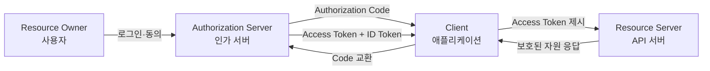
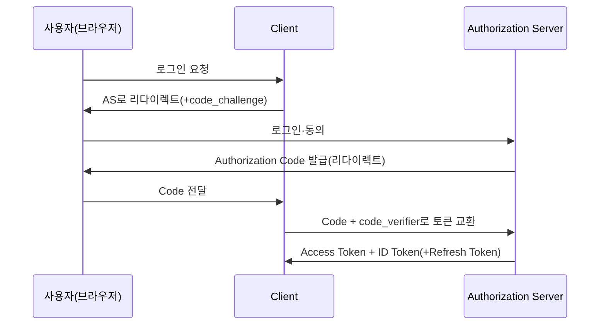

# OAuth 2.0과 OpenID Connect(OIDC)

## 1. 개요

### 가. 정의
> **OAuth 2.0**은 자원 소유자(사용자)의 비밀번호를 제3자 애플리케이션에 노출하지 않고, **제한된 범위(scope)의 접근 권한을 위임**하기 위한 인가(Authorization) 프레임워크(RFC 6749)이다. **OpenID Connect(OIDC)**는 이 OAuth 2.0 위에 **ID 토큰**이라는 표준화된 신원 증명 계층을 얹어 "이 사용자가 누구인가"를 확인하는 **인증(Authentication) 프로토콜**이다.

두 표준은 흔히 하나로 묶여 불리지만 해결하는 문제가 다르다. OAuth 2.0은 "이 애플리케이션이 사용자를 대신해 무엇을 할 수 있는가"라는 **권한(authorization)** 질문에 답하도록 설계되었고, 원래 사용자 신원을 증명하는 용도가 아니었다. 실제로 초창기 웹 서비스들이 OAuth의 액세스 토큰 발급 성공 여부만으로 로그인 성공을 판단하는 편법(pseudo-authentication)을 쓰다가 토큰 재사용·오디언스 혼동(audience confusion) 취약점을 겪었다. 이런 문제를 근본적으로 해결하기 위해 OpenID Foundation이 2014년 OIDC를 표준화하면서, **누가 로그인했는가(authentication)**와 **무엇에 접근할 수 있는가(authorization)**를 명확히 분리하고, 전자를 위·변조가 검증 가능한 JWT 형식의 ID 토큰으로 표준화했다 ([Duende Software](https://duendesoftware.com/learn/the-differences-between-oauth-2-0-and-openid-connect-and-why-they-matter)).

### 나. 등장 배경 및 필요성
과거 웹 서비스 간 연동은 사용자가 자신의 아이디·비밀번호를 상대 서비스에 직접 입력하는 방식(비밀번호 공유, password anti-pattern)이 일반적이었다. 이 방식은 비밀번호가 여러 서비스에 흩어져 저장되어 유출 위험이 커지고, 사용자가 특정 권한만 위임하거나 나중에 회수하는 것이 불가능했다. OAuth는 사용자가 신뢰하는 인가 서버(예: 구글, 카카오)에서 로그인한 뒤, 클라이언트 앱에는 **범위가 제한되고 회수 가능한 토큰**만 발급함으로써 이 문제를 해결한다. 여기에 OIDC가 더해지면서 하나의 계정으로 여러 서비스에 로그인하는 **SSO(Single Sign-On)**와 마이크로서비스·모바일 앱·SPA(Single Page Application) 환경에서의 표준화된 신원 연동이 가능해졌다. 현재 대부분의 소셜 로그인("구글로 로그인", "카카오로 로그인")과 기업용 SSO(Okta, Azure AD, Keycloak 등)가 이 두 표준의 조합으로 구현된다.

## 2. 전체 구조와 참여 주체

OAuth/OIDC 생태계는 크게 네 주체로 구성되며, 각 주체의 역할과 신뢰 경계를 정확히 이해해야 인가 흐름을 설계·감사할 수 있다.

- **자원 소유자(Resource Owner)**: 보호된 자원(사진, 프로필, 이메일 등)의 실제 소유자인 사용자다. 인가 서버 화면에서 로그인하고 "이 앱이 내 이메일에 접근하는 것을 허용할지" 동의(consent)하는 주체이며, 이 동의 UI의 명확성이 전체 신뢰 모델의 실질적 방어선이 된다.
- **클라이언트(Client)**: 자원에 접근하려는 애플리케이션이다. 클라이언트 비밀키를 안전하게 보관할 수 있는지에 따라 **기밀 클라이언트(confidential, 서버사이드 앱)**와 **공개 클라이언트(public, 모바일·SPA)**로 나뉘며, 이 구분이 뒤에서 다룰 그랜트 타입 선택의 핵심 기준이 된다.
- **인가 서버(Authorization Server)**: 사용자를 인증하고 동의를 받아 토큰을 발급하는 신뢰의 중심점이다. OIDC를 지원하면 이를 **OpenID Provider(OP)**라고도 부르며, `/.well-known/openid-configuration` 경로로 자신의 엔드포인트·지원 알고리즘을 표준화된 방식으로 공개하는 **디스커버리(Discovery)** 기능을 제공한다.
- **자원 서버(Resource Server)**: 실제 보호된 API·데이터를 보유한 서버로, 클라이언트가 제시한 액세스 토큰의 유효성과 스코프를 검증한 뒤에만 응답한다.

### 토큰 종류와 수명 설계 (참고)

OAuth/OIDC 생태계에서 다루는 토큰은 성격이 서로 다르며, 이를 혼동하면 보안 설계 전체가 흔들린다. **액세스 토큰(Access Token)**은 자원 서버에 제시하는 "입장권"으로, 형식이 표준화되어 있지 않아 불투명한 임의 문자열(opaque token)일 수도 있고 JWT일 수도 있다. **ID 토큰**은 반드시 JWT여야 하며 클라이언트가 직접 해석·검증하도록 설계된 신원 증명서다. **리프레시 토큰**은 자원 서버에는 절대 제시되지 않고, 오직 인가 서버에 새 액세스 토큰을 요청할 때만 쓰이는 재발급용 토큰이다.

| 토큰 | 제시 대상 | 형식 | 일반적 수명 |
|---|---|---|---|
| Access Token | 자원 서버(API) | 불투명 문자열 또는 JWT | 5분~1시간 |
| ID Token | 클라이언트(앱 자신) | JWT(필수) | 1회성 검증(재사용 안 함) |
| Refresh Token | 인가 서버 | 불투명 문자열 권장 | 수일~수개월(회전 적용) |

예를 들어 한 커머스 플랫폼이 액세스 토큰 수명을 30분, 리프레시 토큰 수명을 14일로 설정했다면, 사용자는 2주에 한 번만 재로그인하면 되지만 액세스 토큰이 탈취되더라도 공격자의 악용 가능 시간은 최대 30분으로 제한된다. 이처럼 두 토큰의 수명을 분리 설계하는 것 자체가 "사용성과 보안의 균형"을 다루는 기술사 답안의 핵심 논점이 된다.

## 3. OAuth 2.0 인가 그랜트(Grant) 유형

인가 그랜트는 "클라이언트가 어떤 방식으로 토큰을 발급받는가"에 대한 시나리오별 규격이며, 클라이언트의 신뢰 수준과 사용자 개입 여부에 따라 선택이 갈린다.

### 가. Authorization Code Grant (+ PKCE)
가장 안전하고 표준적인 흐름으로, 웹 서버 애플리케이션은 물론 PKCE(Proof Key for Code Exchange, RFC 7636)를 더한 모바일·SPA에서도 사용된다.

이 흐름의 핵심은 **인가 코드(authorization code)가 브라우저를 통해 노출되더라도, 실제 토큰 교환은 클라이언트와 인가 서버 간의 백채널(back-channel) 통신으로 이뤄진다**는 점이다. 코드 자체는 단명(수십 초~수 분)하고 1회성이므로 탈취되어도 악용 가치가 낮다. 다만 공개 클라이언트는 클라이언트 비밀키를 안전하게 보관할 수 없으므로, 코드 탈취(authorization code interception) 공격을 막기 위해 **PKCE**를 덧붙인다. PKCE는 클라이언트가 무작위 `code_verifier`를 생성하고 그 해시값인 `code_challenge`를 인가 요청에 포함시켜, 실제 토큰 교환 시점에 원본 `code_verifier`를 함께 제시해야만 토큰이 발급되게 만든다. 이렇게 하면 공격자가 리다이렉트 URI를 가로채 코드를 훔쳐도 해당 검증자를 모르므로 토큰으로 교환할 수 없다.

### 나. Client Credentials Grant
사용자 개입이 없는 **서버-대-서버(machine-to-machine)** 통신에 쓰인다. 클라이언트가 자신의 클라이언트 ID·시크릿만으로 직접 인가 서버에 토큰을 요청하며, 사용자 위임이 아니라 애플리케이션 자체의 신원으로 접근 권한을 얻는다. 배치 작업, 백엔드 마이크로서비스 간 API 호출, 관리용 스크립트 등에서 흔히 쓰이며, 반드시 기밀 클라이언트(비밀키를 안전히 보관 가능한 서버)에서만 사용해야 한다.

### 다. Refresh Token Grant
액세스 토큰은 탈취 피해를 줄이기 위해 짧은 만료 시간(수 분~수십 분)을 갖는다. 매번 사용자에게 재로그인을 요구하면 사용성이 크게 떨어지므로, 최초 인가 시 함께 발급되는 **리프레시 토큰**으로 사용자 개입 없이 새 액세스 토큰을 재발급받는다. 리프레시 토큰은 액세스 토큰보다 수명이 길고(수일~수개월) 탈취 시 피해가 크므로, 서버 측 안전한 저장소에만 두고 **1회 사용 후 새 리프레시 토큰으로 교체(rotation)**하는 것이 최신 보안 관행이다.

### 라. (사용 지양) Implicit Grant와 Resource Owner Password Credentials
초기 OAuth 2.0에는 SPA를 위해 토큰을 URL 프래그먼트로 즉시 반환하는 **암묵적 그랜트(Implicit Grant)**와, 사용자 아이디·비밀번호를 클라이언트가 직접 받아 인가 서버에 전달하는 **ROPC(Resource Owner Password Credentials)**가 정의되어 있었다. 그러나 암묵적 그랜트는 토큰이 브라우저 히스토리·리퍼러에 노출되고 백채널 검증이 없어 탈취에 취약했고, ROPC는 클라이언트가 사용자 비밀번호를 직접 다루므로 OAuth가 원래 없애고자 했던 "비밀번호 공유" 문제를 재현했다. 이런 이유로 두 방식 모두 최신 표준에서 사실상 폐기되었으며, 뒤에서 다룰 **OAuth 2.1**은 이 둘을 명세에서 완전히 제거했다.

### 마. 그랜트 유형 비교 요약

앞서 다룬 네 가지(및 폐기 대상 두 가지) 그랜트는 "누가 개입하는가"와 "클라이언트가 비밀을 안전히 보관할 수 있는가"라는 두 축으로 정리하면 선택 기준이 명확해진다.

| 그랜트 | 사용자 개입 | 적합한 클라이언트 | 현재 권장 여부 |
|---|---|---|---|
| Authorization Code(+PKCE) | 필요 | 공개·기밀 클라이언트 모두 | 권장(기본) |
| Client Credentials | 불필요 | 기밀 클라이언트(M2M) | 권장 |
| Refresh Token | 불필요(최초 1회만 필요) | 공개·기밀 클라이언트 모두 | 권장(회전 필수) |
| Implicit | 필요 | 공개 클라이언트 | 폐기(OAuth 2.1에서 제거) |
| ROPC | 필요(비밀번호 직접 입력) | 레거시 마이그레이션용 | 폐기 권고 |

## 4. OpenID Connect: OAuth 위의 인증 계층

OIDC는 OAuth 2.0의 인가 코드 흐름을 그대로 재사용하면서, 요청 시 `scope=openid`를 포함시키고 응답에 **ID 토큰**을 추가하는 방식으로 동작한다. 즉 별도의 새 프로토콜이 아니라 OAuth 2.0의 **표준 확장(profile)**이다.

### 가. ID 토큰의 구조
ID 토큰은 서명된 **JWT(JSON Web Token)**로, `iss`(발급자), `sub`(사용자 고유 식별자), `aud`(토큰의 수신 대상 클라이언트), `exp`(만료 시각), `iat`(발급 시각), `nonce`(재생 공격 방지용 난수) 등의 표준 클레임과 `name`·`email` 같은 사용자 속성 클레임을 담는다. 클라이언트는 이 토큰의 서명을 인가 서버의 공개키로 검증함으로써, 토큰이 위조되지 않았고 자신을 대상(`aud`)으로 발급되었음을 암호학적으로 확인할 수 있다. 이 서명 검증 가능성이 "ID 토큰으로 로그인 여부를 판단해도 안전한" 근본 이유이며, 단순 액세스 토큰(불투명한 문자열이거나 자원 서버만 해석 가능)으로는 이런 안전한 판단이 불가능하다.

### 나. UserInfo 엔드포인트와 디스커버리
ID 토큰에 담긴 정보가 최소한일 때, 클라이언트는 액세스 토큰을 들고 표준화된 `/userinfo` 엔드포인트에 추가 사용자 속성을 조회할 수 있다. 또한 OIDC 지원 서버는 `/.well-known/openid-configuration` 문서를 통해 인가·토큰·UserInfo 엔드포인트 주소, 지원 서명 알고리즘, 지원 스코프 목록을 표준 JSON으로 공개하므로, 클라이언트 라이브러리가 서버별 설정 없이도 자동으로 연동 정보를 획득할 수 있다.

| 항목 | OAuth 2.0 | OpenID Connect |
|---|---|---|
| 목적 | 인가(리소스 접근 위임) | 인증(신원 확인) + 인가 |
| 핵심 토큰 | Access Token, Refresh Token | ID Token(JWT) + OAuth 토큰 |
| 사용자 정보 | 표준 미정의 | ID 토큰 클레임 + `/userinfo` |
| 스코프 | 서비스별 자유 정의(`read`, `write`) | 표준 스코프(`openid`,`profile`,`email`) |
| 디스커버리 | 미정의 | `/.well-known/openid-configuration` |
| 단독 사용 | 가능(M2M API 접근) | 불가(OAuth 2.0 기반 필수) |

([Duende Software](https://duendesoftware.com/learn/the-differences-between-oauth-2-0-and-openid-connect-and-why-they-matter); [SuperTokens](https://supertokens.com/blog/openid-connect-vs-oauth2))

### 다. OIDC의 세 가지 흐름(Flow)

OIDC는 OAuth의 그랜트를 그대로 계승하면서 세 가지 흐름으로 세분화된다. **Authorization Code Flow**는 서버 사이드 앱에 적합하며 ID 토큰과 액세스 토큰을 모두 백채널로 안전하게 받는다. **Implicit Flow**는 과거 SPA를 위해 프런트채널로 토큰을 즉시 반환했으나 앞서 설명한 보안 약점 때문에 폐기 대상이다. **Hybrid Flow**는 인가 응답 단계에서 ID 토큰을 프런트채널로 먼저 받아 화면에 사용자 이름을 즉시 표시하면서도, 액세스 토큰은 이후 백채널 교환으로 안전하게 받는 절충안으로, 리다이렉트 후 화면 전환 지연을 줄여야 하는 엔터프라이즈 SSO 시나리오에서 종종 쓰인다.

## 5. 비교·적용 사례

가장 익숙한 사례는 소셜 로그인이다. 예를 들어 어느 커머스 앱이 "구글로 로그인" 버튼을 제공한다면, 사용자가 구글 인가 서버에서 인증·동의한 뒤 앱은 구글로부터 ID 토큰(사용자가 누구인지)과, 필요하다면 액세스 토큰(구글 캘린더·드라이브 등 부가 API 접근 권한)을 함께 받는다. 이때 앱은 구글 비밀번호를 절대 보지 못하며, 사용자는 구글 계정 설정에서 언제든 해당 앱의 접근 권한만 개별적으로 회수할 수 있다. 기업 환경에서는 Okta·Azure AD·Keycloak 같은 **IdP(Identity Provider)**를 OIDC로 연동해 사내 수십 개 시스템에 하나의 계정으로 SSO 로그인을 구현하는 것이 표준적 패턴이며, 인사 시스템 퇴사 처리 한 번으로 모든 연동 시스템의 접근을 동시에 차단할 수 있다는 점이 개별 시스템별 계정 관리 대비 뚜렷한 실무적 이점이다. 반대로 서버 간 배치 연동(예: 내부 결제 서비스가 정산 서비스 API를 매시간 호출)에는 사용자 개입이 없으므로 OIDC가 아니라 순수 OAuth의 Client Credentials Grant가 적합하며, 여기에 사용자 신원 개념을 억지로 끌어들이면 오히려 설계가 복잡해진다.

## 6. 관련 기출·유사 주제 연계

이 주제는 정보관리기술사 시험에서 단독 문제로도, 다른 주제의 하위 논점으로도 자주 등장한다. "식별과 인증", "JWT", "접근제어(Access Control)", "제로 트러스트 보안 모델" 주제와는 인증·인가의 구체적 구현 표준이라는 관계로 연결되며, "마이데이터 전송 보안"·"금융 클라우드 SLA" 주제에서는 FAPI가 실제 규제 요구사항의 기술적 근거로 인용된다. 답안을 구성할 때는 "OAuth/OIDC 개념 → 그랜트 선택 기준 → 최신 보안 강화(OAuth 2.1·FAPI) → 제로 트러스트·마이크로서비스 아키텍처 적용"의 흐름으로 전개하면, 단순 프로토콜 설명을 넘어 기술사 답안이 요구하는 아키텍처·거버넌스 관점까지 자연스럽게 포함시킬 수 있다.

## 7. 심화 — 최신 동향과 보안 강화 표준

OAuth 생태계는 2020년대 들어 "기본값 자체를 더 안전하게" 만드는 방향으로 빠르게 진화하고 있다.

- **OAuth 2.1**: RFC 6749 이후 흩어져 있던 여러 보안 권고 사항(RFC들)을 하나의 명세로 통합하는 작업으로, **PKCE를 모든 클라이언트(공개+기밀 클라이언트 모두)에 필수화**하고, 취약점이 반복 지적된 **Implicit Grant와 ROPC를 명세에서 완전히 제거**했다. 또한 리다이렉트 URI를 문자열 그대로 정확히 일치(exact match)시키도록 강제하고, 리프레시 토큰 회전(rotation)을 요구한다 ([OAuth.net](https://oauth.net/2.1/); [WorkOS](https://workos.com/blog/oauth-2-1-vs-oauth-2-0)).
- **FAPI(Financial-grade API)**: OpenID Foundation이 금융권처럼 위험도가 높은 API를 위해 OAuth/OIDC 위에 추가 제약을 씌운 프로파일이다. 클라이언트 인증에 비밀키 대신 **mTLS 또는 서명된 JWT(private_key_jwt)**를 요구하고, 액세스 토큰을 클라이언트 인증서에 바인딩(sender-constrained token)해 토큰 탈취 시에도 재사용을 막는다 ([OpenID Foundation FAPI](https://openid.net/specs/openid-financial-api-part-2-1_0.html)). 국내 오픈뱅킹·마이데이터 API 보안 요구사항도 이와 유사한 철학(강한 클라이언트 인증, 토큰 바인딩)을 취한다.
- **DPoP(Demonstrating Proof of Possession)**: 액세스 토큰이 탈취되어도 공격자가 그대로 재사용하지 못하게, 클라이언트가 매 요청마다 자신만 아는 개인키로 서명한 증명 값을 함께 제시하도록 하는 확장으로, mTLS를 쓰기 어려운 환경(SPA, 모바일)에서 토큰 바인딩을 구현하는 대안으로 주목받고 있다.

## 8. 고려사항 및 시사점 (기술사 관점)

- **아키텍처 설계 원칙**: 마이크로서비스·API 게이트웨이 환경에서는 인증(신원 확인)은 OIDC로 중앙화하고, 개별 서비스 간 인가는 스코프·클레임 기반의 세분화된 정책으로 분리하는 것이 유지보수성과 보안을 동시에 확보하는 설계다. 인증 로직을 서비스마다 구현하면 구현 편차로 인한 취약점이 필연적으로 발생한다.
- **트레이드오프**: PKCE·mTLS·토큰 바인딩 같은 강화 조치는 보안을 높이지만 클라이언트 구현 복잡도와 인프라(인증서 관리 등) 부담을 늘린다. 내부망 M2M 통신처럼 위협 모델이 상대적으로 낮은 영역까지 금융권 수준(FAPI)의 통제를 일괄 적용하면 과잉 설계가 되므로, 자원의 민감도에 따라 통제 수준을 계층화해야 한다.
- **제로 트러스트와의 연계**: OAuth/OIDC의 "매 요청마다 유효한 토큰과 스코프를 검증한다"는 원칙은 제로 트러스트 보안 모델의 핵심 전제(암묵적 신뢰 제거, 지속적 검증)와 정확히 맞물린다. 특히 짧은 액세스 토큰 수명과 세분화된 스코프는 사고 발생 시 피해 범위를 최소화하는 최소 권한(least privilege) 원칙의 실질적 구현체다.
- **전망 — AI 에이전트 시대의 인가**: 최근 LLM 에이전트가 사용자를 대신해 여러 API를 자율적으로 호출하는 사례가 늘면서, "에이전트가 어떤 범위까지, 얼마나 오래 대리 행동할 수 있는가"를 표현하는 위임 인가 모델(예: 동적 클라이언트 등록, 세분화된 Rich Authorization Requests, 에이전트별 짧은 수명 토큰)이 OAuth 생태계의 새로운 확장 지점으로 떠오르고 있다. 정보관리기술사 수험 관점에서는 기존 3자 위임(사용자-클라이언트-서버) 모델이 "사람이 아닌 에이전트"라는 네 번째 행위자를 어떻게 안전하게 수용할지가 향후 출제·실무 모두에서 중요해질 영역이다.
- **감사·로그 관점**: 인가 서버의 토큰 발급·갱신·폐기 이력, 동의 화면 노출 여부, 스코프 변경 내역은 개인정보 처리방침 준수와 사고 대응(포렌식) 모두에 필수적인 증적이다. 정보시스템 감리·ISMS-P 심사에서도 "누가 언제 어떤 범위로 위임했는지 추적 가능한가"를 인증·인가 체계의 핵심 점검항목으로 다루므로, 설계 초기에 토큰 이벤트 로깅 체계를 함께 마련해야 한다.
- **가용성·장애 격리**: 인가 서버는 사실상 전사 시스템의 단일 신뢰 지점(SPOF에 가까운 구조)이 되므로, 인가 서버 장애가 곧 전체 로그인 불가로 이어진다. 다중 리전 구성, 캐시된 공개키로 오프라인 토큰 검증을 유지하는 방식 등 가용성 설계를 별도로 고려해야 한다.

## 참고자료
- [OAuth 2.1 — oauth.net](https://oauth.net/2.1/)
- [OAuth 2.0 vs OAuth 2.1: What changed, why it matters — WorkOS](https://workos.com/blog/oauth-2-1-vs-oauth-2-0)
- [The differences between OAuth 2.0 and OpenID Connect — Duende Software](https://duendesoftware.com/learn/the-differences-between-oauth-2-0-and-openid-connect-and-why-they-matter)
- [OpenID Connect vs OAuth2 — SuperTokens](https://supertokens.com/blog/openid-connect-vs-oauth2)
- [Financial-grade API Security Profile 1.0 - Part 2: Advanced — OpenID Foundation](https://openid.net/specs/openid-financial-api-part-2-1_0.html)
- [OAuth 2.1: Key Updates and Differences from OAuth 2.0 — FusionAuth](https://fusionauth.io/articles/oauth/differences-between-oauth-2-oauth-2-1)
- [OAuth vs OpenID Connect — GeeksforGeeks](https://www.geeksforgeeks.org/websites-apps/oauth-vs-openid-connect/)

이러한 다각적 근거가 있는 만큼, 실제 기술사 답안을 쓸 때는 "OAuth와 OIDC는 다르다"는 단순 문장에 머무르지 않고, 앞에서 서술한 구조·보안 강화 동향을 함께 제시해야 실무·심사 관점을 제대로 보여줄 수 있다.

---

> **한 줄 요약**: OAuth 2.0은 사용자 비밀번호 노출 없이 범위가 제한된 접근 권한을 위임하는 인가 프레임워크이고, OpenID Connect는 그 위에 서명된 ID 토큰으로 "누가 로그인했는가"를 증명하는 인증 계층이며, PKCE·FAPI·OAuth 2.1 같은 최신 강화 표준이 토큰 탈취·재사용 위협에 대응해 계속 진화하고 있다.
