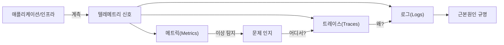
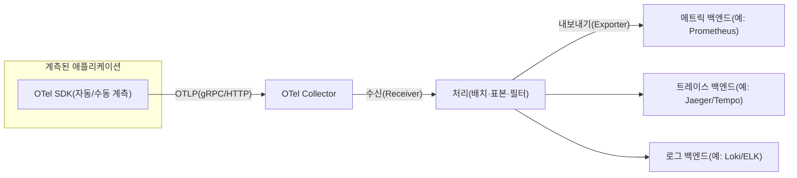

# 옵저버빌리티(Observability)와 OpenTelemetry

## 1. 개요

> **정의**: 옵저버빌리티(관측성)는 시스템 외부로 방출되는 텔레메트리(메트릭·로그·트레이스)만으로 시스템 내부 상태를 추론하고, 사전에 정의하지 않은 질문에 대해서도 원인을 규명할 수 있는 능력이다.

전통적인 모니터링은 "장애가 났는가"를 미리 정한 임계치와 대시보드로 확인하는 데 초점을 두었다.
그러나 마이크로서비스·컨테이너·서버리스가 확산되면서 하나의 사용자 요청이 수십 개 서비스를 거치고, 인스턴스는 수 분 단위로 생성·소멸한다.
이런 환경에서는 "무엇이 고장 날지"를 사전에 모두 예측해 지표를 심어 두는 것이 불가능하며, 장애의 양상도 "완전 정지"보다 "특정 사용자·특정 경로에서만 느려지는" 형태로 나타난다.
옵저버빌리티는 이처럼 **알지 못했던 미지의 문제(unknown-unknowns)**를 사후에 탐색적으로 파고들 수 있게 하는 것을 목표로 한다는 점에서 기존 모니터링과 구분된다.

모니터링과 옵저버빌리티는 대립 개념이 아니라 포함 관계에 가깝다.
모니터링은 알려진 실패 모드에 대한 지표를 수집·경보하는 활동이고, 옵저버빌리티는 그 지표를 포함해 시스템이 충분히 풍부한 텔레메트리를 방출하도록 설계하는 **속성(property)**이다.
즉 "모니터링을 한다"는 행위이고 "관측 가능하다"는 시스템이 갖춰야 할 성질이다.
따라서 옵저버빌리티는 운영 도구를 하나 더 도입하는 문제가 아니라, 코드가 의미 있는 신호를 남기도록 설계 단계에서 확보해야 하는 품질 특성이다.

시험 답안에서는 옵저버빌리티를 "3대 요소(메트릭·로그·트레이스)"의 나열로 끝내지 말고, 세 신호가 **왜 상호 보완적이며 어떻게 연결(correlation)될 때 가치가 생기는지**, 그리고 이를 벤더 종속 없이 표준화하는 OpenTelemetry의 역할까지 연결해야 설계 관점의 답안이 된다.

### 1.1 등장 배경과 필요성

첫째, 분산 시스템의 복잡도 때문이다.
모놀리식에서는 하나의 프로세스 로그만 보면 되었지만, 100개 서비스로 분해되면 요청 하나의 지연이 어느 구간에서 발생했는지 단일 로그로는 알 수 없다.
서비스 간 인과관계를 추적하려면 요청을 종단 간(end-to-end)으로 이어 볼 수 있는 분산 트레이싱이 필수가 된다.

둘째, 인프라의 휘발성(ephemerality) 때문이다.
쿠버네티스 파드나 서버리스 함수는 문제가 발생한 뒤 접속해 조사하려 하면 이미 사라지고 없다.
따라서 사후 접속 디버깅 대신, 실행 중 충분한 신호를 밖으로 내보내 두는 방식으로 전환해야 한다.

셋째, 비용과 사용자 경험 관점이다.
장애의 평균 복구 시간(MTTR)은 대부분 "원인 규명(탐지 후 진단)"에 소요되며, 관측성이 낮으면 이 구간이 길어져 매출·신뢰 손실이 커진다.
관측성은 곧 MTTR 단축과 직결되므로 SRE 신뢰성 관리의 전제 조건이 된다.

### 1.2 핵심 목표와 비목표

핵심 목표는 미지 문제의 탐색적 진단, 신호 간 상관관계 확보, 벤더 중립적 계측 표준화, 그리고 진단 시간의 단축이다.
반대로 모든 데이터를 무제한 수집·영구 보관하는 것은 목표가 아니다.
텔레메트리는 그 자체가 저장·전송·질의 비용을 유발하므로, 카디널리티와 표본추출(sampling)을 설계해 신호 대 잡음비를 관리하는 것이 오히려 핵심 역량이다.

## 2. 옵저버빌리티 3대 신호(Three Pillars)

옵저버빌리티는 흔히 메트릭·로그·트레이스의 세 신호로 설명된다.
다만 세 신호를 각각 다른 도구로 따로 보면 "사일로"가 되어 값이 반감된다.
진정한 관측성은 하나의 문제 상황에서 지표(무엇이·얼마나) → 트레이스(어디서) → 로그(왜)로 **끊김 없이 오갈 수 있을 때** 달성된다.

### 2.1 메트릭(Metrics)

메트릭은 시간에 따라 집계된 수치(요청량, 오류율, 지연, 자원 사용률 등)이다.
개별 이벤트를 버리고 통계로 압축하기 때문에 저장 비용이 낮고 장기 추세·경보에 적합하다.
예컨대 "5분간 5xx 오류율 > 1%"는 메트릭으로 감시하기 좋은 형태이며, RED(Rate·Errors·Duration)나 USE(Utilization·Saturation·Errors) 같은 방법론으로 어떤 지표를 볼지 체계화한다.
다만 메트릭은 집계 과정에서 개별 요청의 맥락을 잃으므로 "무엇이 잘못됐다"는 알려 주지만 "왜"는 답하지 못한다.
특히 라벨(label) 조합이 많아지면 카디널리티가 폭증해 저장·질의 비용이 급증하므로, 사용자 ID처럼 값이 무한한 차원을 메트릭 라벨로 쓰지 않도록 주의해야 한다.

### 2.2 로그(Logs)

로그는 특정 시점에 발생한 개별 이벤트의 기록이다.
가장 풍부한 맥락을 담을 수 있어 근본원인 분석의 최종 단서가 되지만, 양이 많아 저장·검색 비용이 크다.
비정형 텍스트 로그보다 **구조화 로그(JSON 등)**를 쓰면 필드 기준 검색·집계가 가능해 관측성이 크게 향상된다.
핵심은 로그에 트레이스 ID를 함께 기록해 트레이스·로그를 상호 연결하는 것이며, 이것이 없으면 로그는 다시 사일로가 된다.

### 2.3 트레이스(Traces)

트레이스는 하나의 요청이 여러 서비스를 거치며 만든 작업 단위(스팬, Span)들의 인과·시간 관계를 이은 것이다.
각 스팬은 서비스명·시작/종료 시각·상태·부모 스팬을 갖고, 이들이 트리를 이뤄 요청의 전체 여정을 보여 준다.
분산 트레이싱은 W3C Trace Context 표준의 `traceparent` 헤더로 서비스 경계를 넘어 컨텍스트를 전파(context propagation)한다.
덕분에 "결제 API의 p99 지연 증가가 사실은 하위 쿠폰 서비스의 DB 락 때문"과 같은 **구간별 병목**을 정확히 짚을 수 있다.

| 신호 | 질문 | 강점 | 약점 | 비용 |
|------|------|------|------|------|
| 메트릭 | 무엇이, 얼마나 | 저비용·장기추세·경보 | 개별 맥락 소실 | 낮음 |
| 로그 | 왜(상세 맥락) | 최고 상세도 | 대용량·잡음 | 높음 |
| 트레이스 | 어디서(구간) | 종단 간 인과관계 | 계측·전파 필요 | 중간 |

## 3. OpenTelemetry(OTel) 표준과 파이프라인

과거에는 신호마다·벤더마다 계측 라이브러리가 달라, 관측 도구를 바꾸면 애플리케이션 코드를 다시 계측해야 하는 벤더 종속이 컸다.
**OpenTelemetry(OTel)**는 CNCF 산하 프로젝트로, 메트릭·로그·트레이스를 아우르는 **단일 계측 API/SDK와 전송 규격(OTLP)**을 표준화해 이 문제를 해결한다.
개발자는 OTel API로 한 번만 계측하고, 데이터를 어디로 보낼지는 설정(Exporter)으로 바꾼다.
즉 "계측(코드)"과 "백엔드(도구)"를 분리해 벤더 중립성을 확보한다.

**OTel Collector**는 이 구조의 중심 부품으로, 여러 소스에서 텔레메트리를 받아(Receiver) 배치·표본추출·민감정보 마스킹·재라벨링 등으로 가공(Processor)한 뒤 여러 백엔드로 내보낸다(Exporter).
애플리케이션은 Collector 한 곳에만 보내면 되므로, 백엔드 교체나 다중 전송이 코드 변경 없이 가능하다.
또한 표본추출을 Collector에서 중앙 집중 처리하면 전체 트레이스를 보고 판단하는 **꼬리 기반 표본추출(tail-based sampling)**로 "오류가 난 요청은 반드시 보관"하는 정책을 구현할 수 있다.
계측은 자동 계측(에이전트가 HTTP·DB 호출을 자동 포착)과 수동 계측(업무 의미가 담긴 커스텀 스팬·속성 추가)을 병행하며, 후자가 답안 품질을 좌우한다.

## 4. 도입 시 비교와 사례 — 왜 이렇게 설계하는가

관측성 설계의 핵심 갈등은 **완전성과 비용**의 트레이드오프다.
모든 요청의 트레이스를 100% 보관하면 이상적이지만, 대규모 트래픽에서는 저장·전송 비용이 감당되지 않는다.
그래서 표본추출 전략을 고른다.
머리 기반(head-based)은 요청 시작 시점에 확률로 채택 여부를 정해 오버헤드가 낮지만, "드물게 발생한 오류 요청"을 놓칠 수 있다.
꼬리 기반(tail-based)은 요청 완료 후 결과(오류·고지연)를 보고 채택하므로 진단 가치가 높은 트레이스를 선별 보관하지만, 완료 전까지 버퍼링이 필요해 Collector 자원을 더 쓴다.
따라서 "정상 트래픽은 1% 표본, 오류·느린 요청은 100% 보관"처럼 두 방식을 조합하는 것이 실무의 정석이다.

구체적 효과의 예로, 어느 서비스에서 사용자 결제 지연 민원이 산발적으로 발생했다고 하자.
메트릭 대시보드에서는 전체 p50 지연이 정상이라 원인이 보이지 않지만, 오류·고지연 요청만 100% 보관한 트레이스를 열면 특정 결제 수단 경로의 하위 스팬에서 외부 PG사 응답이 3초 이상 걸린 사실이 드러난다.
그 스팬에 연결된 구조화 로그의 트레이스 ID로 넘어가면 특정 카드사 타임아웃 재시도가 원인임을 확인할 수 있다.
이처럼 세 신호를 트레이스 ID로 이어 붙이는 상관관계가 있어야 "평균은 정상인데 일부만 느린" 문제를 진단할 수 있고, 이것이 관측성이 단순 모니터링과 갈라지는 지점이다.

## 5. 고려사항 및 시사점(기술사 관점)

첫째, **관측성은 설계 품질이지 사후 도구 도입이 아니다.**
코드가 의미 있는 스팬·속성·구조화 로그를 남기도록 개발 표준(로깅 규약, 트레이스 전파, 상관 ID)을 아키텍처 단계에서 정해야 하며, 운영팀에 관측성 확보를 떠넘기면 실패한다.

둘째, **비용·카디널리티 거버넌스가 성패를 가른다.**
무분별한 라벨·전량 보관은 관측 플랫폼 비용을 서비스 인프라보다 크게 만들 수 있다.
신호별 보존 기간 차등(메트릭 장기, 로그·트레이스 단기), 표본추출, 카디널리티 상한을 정책으로 관리해야 한다.

셋째, **표준 채택으로 벤더 종속을 완화한다.**
OpenTelemetry·OTLP·W3C Trace Context 같은 개방 표준으로 계측하면 백엔드(오픈소스/상용/클라우드)를 코드 변경 없이 교체·병행할 수 있어 장기 협상력과 이식성을 확보한다.

넷째, **보안·개인정보와 상충을 관리한다.**
텔레메트리에는 사용자 식별자·토큰 등 민감정보가 섞이기 쉬우므로, Collector 단계의 마스킹·필터링과 접근통제를 두어 관측 데이터가 새로운 유출 경로가 되지 않게 해야 한다.

다섯째, **SRE·AIOps로의 연계 전망이다.**
관측 데이터는 SLI/SLO·오류 예산 산정의 입력이 되고, 나아가 이상 탐지·근본원인 추론을 자동화하는 AIOps의 학습 데이터가 된다.
따라서 관측성은 단기적으로 장애 대응, 장기적으로 자율 운영(self-healing)의 기반 인프라로 자리매김한다.

## 참고자료
- OpenTelemetry 공식 문서: https://opentelemetry.io/docs/
- W3C Trace Context 표준: https://www.w3.org/TR/trace-context/
- CNCF OpenTelemetry 프로젝트: https://www.cncf.io/projects/opentelemetry/

---
> **한 줄 요약**: 옵저버빌리티는 메트릭·로그·트레이스를 트레이스 ID로 상호 연결해 미지의 장애까지 사후 탐색으로 규명하는 시스템 속성이며, OpenTelemetry 표준 계측과 표본추출·카디널리티 거버넌스로 벤더 종속 없이 비용 효율적으로 확보한다.
