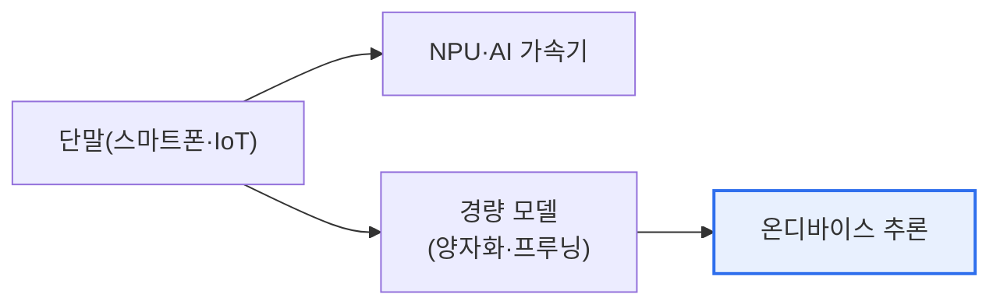

# 온디바이스 AI(On-Device AI)

## 1. 개요

### 가. 정의
> **온디바이스 AI**는 클라우드 서버가 아니라 **스마트폰·IoT 기기 등 단말 자체에서 직접 AI 추론을 수행**하는 기술. 데이터를 외부로 보내지 않고 기기 안에서 처리한다.

온디바이스 AI의 핵심 발상은 '**AI를 데이터가 있는 곳으로 가져가는 것**'이다. 지금까지 AI 서비스는 대개 단말이 데이터를 클라우드로 보내면, 서버의 강력한 AI가 처리해 결과를 돌려주는 방식이었다. 그러나 이 방식은 네트워크가 필요하고, 지연이 생기며, 사진·음성 같은 개인 데이터가 외부로 나가 프라이버시 우려가 있다. 온디바이스 AI는 AI 모델을 단말에 직접 넣어 이 문제를 해결한다. 데이터가 기기를 떠나지 않으니 프라이버시가 보호되고(로컬 처리), 네트워크 없이도 즉시 반응하며(저지연·오프라인), 서버 비용도 줄어든다. 스마트폰의 얼굴 인식 잠금 해제, 실시간 번역, 카메라 장면 인식이 대표적이다. 다만 단말은 클라우드보다 연산·전력·메모리가 제한되므로, AI 모델을 작고 효율적으로 만드는 **경량화** 기술이 핵심 과제가 된다.

### 나. 등장 배경
프라이버시 규제 강화, 실시간 반응 요구, 클라우드 비용·네트워크 의존 문제, 그리고 모바일 AI 반도체(NPU)의 발전이 온디바이스 AI를 가능하게 했다.

## 2. 하드웨어 및 소프트웨어 기술

| 구분 | 기술 |
|---|---|
| **하드웨어** | NPU(신경망처리장치)·AI 가속기, 저전력 칩 |
| **모델 경량화** | 양자화(정밀도↓), 프루닝(가지치기), 지식 증류 |
| **소프트웨어 프레임워크** | TensorFlow Lite, Core ML, ONNX Runtime |
| **최적화** | 하드웨어 맞춤 컴파일, 엣지 런타임 |

핵심은 제한된 단말 자원에서 AI를 돌리기 위한 **모델 경량화**(양자화·프루닝·증류)와 이를 가속하는 **NPU** 다.

## 3. 클라우드 AI와 비교

| 구분 | 클라우드 AI | 온디바이스 AI |
|---|---|---|
| **처리 위치** | 서버 | 단말 |
| **프라이버시** | 데이터 외부 전송 | 로컬 처리(보호) |
| **지연** | 네트워크 지연 | 저지연·오프라인 |
| **연산 능력** | 강력(대형 모델) | 제한(경량 모델) |
| **비용** | 서버 비용 | 단말 자원 |

## 4. 고려사항 및 시사점

1. **경량화와 정확도의 균형**이 관건이다. 모델을 작게 만들수록 단말에서 돌리기 쉽지만 정확도가 떨어질 수 있으므로, 양자화·프루닝·증류로 성능 손실을 최소화하며 경량화해야 한다.
2. **프라이버시·실시간성의 강점**이 명확하다. 개인 데이터가 기기를 떠나지 않아 규제(개인정보) 대응에 유리하고, 오프라인·저지연으로 자율주행·의료 같은 실시간 응용에 적합하다.
3. **하이브리드·온디바이스 생성형 AI로 확장**된다. 간단한 처리는 온디바이스, 복잡한 처리는 클라우드로 나누는 하이브리드가 확산되고, sLLM 등 경량 생성형 AI를 단말에서 구동하는 방향으로 발전하고 있다.

---

> **한 줄 요약**: 온디바이스 AI는 *단말 자체에서 AI 추론을 수행* 해 프라이버시(로컬 처리)·저지연·오프라인의 강점을 제공하며, NPU와 모델 경량화(양자화·프루닝·증류)가 핵심이고 클라우드와의 하이브리드·온디바이스 생성형 AI로 진화한다.
