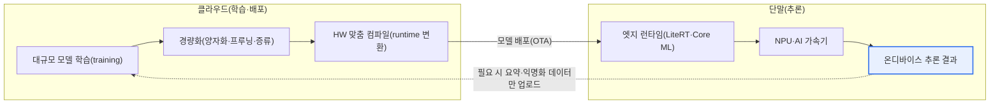
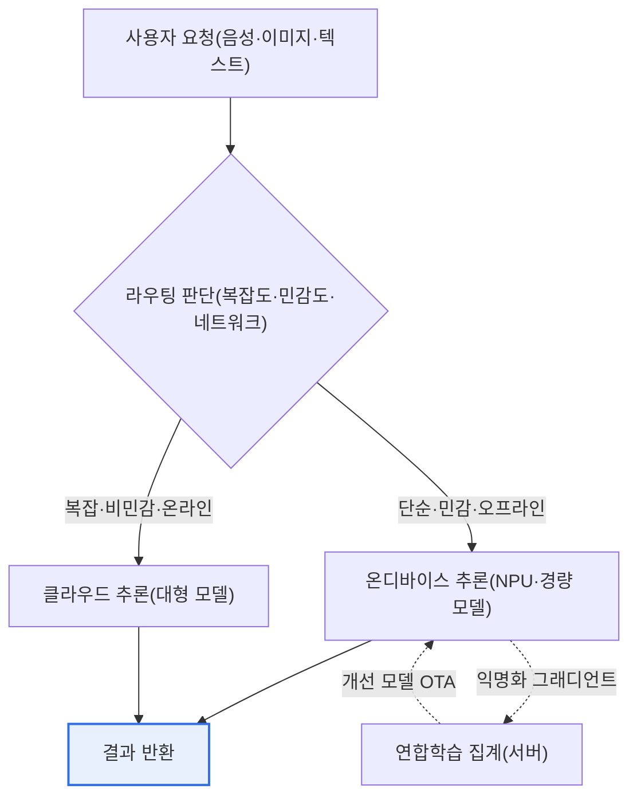

# 온디바이스 AI(On-Device AI)

## 1. 개요

### 가. 정의
> **온디바이스 AI**는 클라우드 서버가 아니라 **스마트폰·IoT 기기 등 단말(edge device) 자체에서 직접 AI 추론(inference)을 수행**하는 기술이다. 데이터를 외부로 전송하지 않고 기기 안에서 모델을 실행해 결과를 만들어 낸다.

온디바이스 AI의 핵심 발상은 '**AI를 데이터가 있는 곳으로 가져가는 것**'이다. 지금까지 대부분의 AI 서비스는 단말이 데이터를 클라우드로 보내면 서버의 강력한 대형 모델이 처리해 결과를 돌려주는 **중앙집중형(cloud-centric)** 구조였다. 이 구조는 데이터센터의 GPU 자원을 마음껏 활용할 수 있다는 장점이 있으나, 반드시 네트워크가 있어야 하고, 왕복 지연(round-trip latency)이 발생하며, 사진·음성·위치 같은 민감한 개인 데이터가 외부로 나가야 한다는 근본적 한계를 안고 있다. 온디바이스 AI는 AI 모델 자체를 단말에 내장(embedding)함으로써 이 한계를 정면으로 해소한다.

그 결과 세 가지 구조적 이점이 생긴다. 첫째, 데이터가 기기를 떠나지 않으므로 **프라이버시가 원천적으로 보호**된다. 둘째, 서버 왕복이 없으므로 **네트워크 없이도 즉시 반응(저지연·오프라인)** 한다. 셋째, 추론이 단말에서 일어나므로 **서버 인프라 비용과 대역폭 비용이 절감**된다. 스마트폰의 얼굴 인식 잠금 해제, 실시간 통화 번역, 카메라의 장면·피사체 인식, 음성 비서의 웨이크워드 감지가 대표적 사례다. 다만 단말은 데이터센터에 비해 연산 능력·전력·메모리가 극도로 제한되므로, 무거운 대형 모델을 그대로 올릴 수 없다. 따라서 모델을 작고 효율적으로 압축하는 **경량화(model compression)** 와 이를 저전력으로 가속하는 **전용 반도체(NPU)** 가 온디바이스 AI 성패를 가르는 핵심 과제가 된다.

### 나. 주요 특징
온디바이스 AI는 로컬 처리(데이터 비전송), 저지연·오프라인 동작, 개인화(단말에 축적된 개인 맥락 활용), 그리고 자원 제약 하의 효율 극대화라는 특징을 갖는다. 이 특징들은 서로 맞물려 있어, 예컨대 로컬 처리라는 특성이 프라이버시와 오프라인 동작을 동시에 가능케 하는 식이다.

### 다. 등장 배경 및 필요성
온디바이스 AI가 최근 급부상한 데에는 서로 맞물린 네 가지 동인이 있다. 먼저 **프라이버시 규제 강화**다. EU GDPR, 국내 개인정보보호법이 개인 데이터의 국외·외부 이전을 엄격히 규율하면서, 데이터를 아예 단말 밖으로 내보내지 않는 로컬 처리 방식이 규제 준수 관점에서 매력적인 대안이 되었다. 둘째, **실시간 반응 요구**다. 자율주행·산업 안전·AR/VR처럼 수십 ms의 지연도 치명적인 응용에서는 클라우드 왕복 지연을 감내할 수 없으므로 단말 처리가 사실상 필수다.

셋째, **클라우드 비용과 네트워크 의존 문제**다. 생성형 AI 확산으로 추론 요청량이 폭증하면서 GPU 서버 운영비가 기하급수적으로 늘었고, 단순·반복 추론을 단말로 분산(offloading)하려는 경제적 유인이 커졌다. 넷째, 무엇보다 **모바일 AI 반도체(NPU)의 성능 향상**이다. 애플 Neural Engine, 퀄컴 Hexagon, 삼성 엑시노스 NPU 등이 세대를 거듭하며 수십 TOPS(초당 조 단위 연산) 규모의 저전력 추론을 가능케 했고, 이것이 온디바이스 AI를 '실험'에서 '상용'으로 끌어올린 결정적 계기가 되었다. 이 네 동인은 독립적이 아니라 상호 강화 관계에 있어, 규제·응용·경제·하드웨어가 동시에 온디바이스 방향을 가리키고 있다는 점이 이 기술의 지속 가능성을 뒷받침한다.

## 2. 전체 구조 및 동작 원리

온디바이스 AI 시스템은 크게 **클라우드에서의 학습(training)** 과 **단말에서의 추론(inference)** 으로 이원화된다. 무거운 학습은 여전히 데이터센터에서 대규모 데이터로 수행하되, 그 결과물인 모델을 경량화·컴파일해 단말에 배포하고, 실제 추론만 단말에서 처리하는 것이 일반적 아키텍처다. 아래 구조도는 학습–경량화–배포–추론으로 이어지는 전체 흐름을 보여 준다.

```mermaid
flowchart LR
  subgraph Cloud["클라우드(학습·배포)"]
    T["대규모 모델 학습(training)"] --> Z["경량화(양자화·프루닝·증류)"]
    Z --> CP["HW 맞춤 컴파일(runtime 변환)"]
  end
  subgraph Device["단말(추론)"]
    RT["엣지 런타임(LiteRT·Core ML)"] --> N["NPU·AI 가속기"]
    N --> R["온디바이스 추론 결과"]
  end
  CP -->|"모델 배포(OTA)"| RT
  R -.->|"필요 시 요약·익명화 데이터만 업로드"| T
  style R fill:#e8f0fe,stroke:#2f6fed,stroke-width:2px
```

이 구조에서 눈여겨볼 점은 **데이터의 흐름이 최소화**된다는 것이다. 원본 데이터는 단말에 머물고, 클라우드로는 모델(내려받기)과 익명화된 요약 통계(선택적 업로드)만 오간다. 특히 여러 단말이 원본 데이터를 공유하지 않은 채 로컬에서 학습한 결과(그래디언트)만 서버에서 합치는 **연합학습(Federated Learning)** 기법과 결합하면, 프라이버시를 지키면서도 모델을 지속 개선할 수 있다. 즉 온디바이스 AI는 단순히 '추론을 단말로 옮기는 것'을 넘어, 학습·배포·재학습 전 주기에서 데이터를 국지화하는 아키텍처 철학으로 이해해야 한다.

## 3. 하드웨어 및 소프트웨어 핵심 기술

### 가. 하드웨어 — NPU와 이기종 컴퓨팅
온디바이스 AI의 물리적 토대는 **NPU(Neural Processing Unit, 신경망처리장치)** 다. CPU는 범용 순차 처리에, GPU는 대규모 병렬 부동소수점 연산에 강하지만, 둘 다 전력 대비 효율(성능/W) 측면에서 모바일 상시 추론에는 부담이 크다. NPU는 신경망의 핵심 연산인 행렬 곱셈·누산(MAC)을 저정밀·저전력으로 대량 수행하도록 특화된 가속기로, 같은 추론을 GPU 대비 수 배 낮은 전력으로 처리한다. 애플의 Neural Engine, 퀄컴 스냅드래곤의 Hexagon NPU, 삼성 엑시노스 NPU가 대표적이며, 최신 플래그십 AP는 수십 TOPS급 성능을 제공한다.

실제 단말에서는 하나의 프로세서만 쓰지 않고 CPU·GPU·NPU를 작업 특성에 따라 나눠 쓰는 **이기종 컴퓨팅(heterogeneous computing)** 이 일반적이다. 예컨대 전처리는 CPU, 이미지 필터는 GPU, 신경망 추론은 NPU가 맡는 식이다. 런타임은 모델의 각 연산(operator)을 어느 하드웨어에 배치할지 결정하는 **하드웨어 위임(delegation)** 을 수행하며, 이 배치 최적화가 실제 체감 성능과 배터리 소모를 크게 좌우한다.

### 나. 모델 경량화 — 양자화·프루닝·지식 증류
제한된 단말 자원에서 AI를 돌리기 위한 가장 중요한 소프트웨어 기술이 **모델 경량화**다. 대표 기법은 세 가지다. 첫째, **양자화(Quantization)** 는 가중치·활성값의 표현 정밀도를 낮추는 기법이다. 예를 들어 32비트 부동소수점(FP32)을 8비트 정수(INT8)로 바꾸면 모델 크기가 약 4분의 1로 줄고, 정수 연산에 최적화된 NPU에서 훨씬 빠르게 돈다. 다만 정밀도가 낮아진 만큼 정확도 손실이 생길 수 있어, 학습 과정에 양자화를 반영하는 QAT(Quantization-Aware Training)로 손실을 최소화한다.

둘째, **프루닝(Pruning, 가지치기)** 은 기여도가 낮은 가중치·뉴런·채널을 제거해 모델을 희소(sparse)하게 만드는 기법이다. 사람 뇌가 잘 쓰지 않는 시냅스를 정리하듯, 중요도가 낮은 연결을 잘라 연산량과 메모리를 줄인다. 셋째, **지식 증류(Knowledge Distillation)** 는 크고 정확한 교사 모델(teacher)의 출력 분포를 작은 학생 모델(student)이 모방하도록 학습시켜, 작은 모델이 큰 모델에 근접한 성능을 내게 하는 기법이다. 실무에서는 이 세 기법을 단독으로 쓰기보다 **증류로 구조를 줄이고, 프루닝으로 희소화하고, 양자화로 정밀도를 낮추는 식으로 조합**해 목표 정확도를 지키면서 크기·지연·전력을 함께 최적화한다.

### 다. 소프트웨어 프레임워크와 런타임
경량화된 모델을 실제 단말에서 실행하려면 단말 OS·칩셋에 맞는 **엣지 런타임**이 필요하다. 구글은 오랫동안 **TensorFlow Lite(TFLite)** 를 제공해 왔는데, 2024년 9월 이를 **LiteRT**로 개명했다. 개명의 배경은 이 런타임이 이제 TensorFlow뿐 아니라 PyTorch·JAX·Keras로 만든 모델까지 포괄하는 범용 온디바이스 런타임으로 성장했기 때문이며, 이후 GPU·NPU 가속과 LLM·확산모델 지원을 강화하는 방향으로 발전하고 있다. 애플 진영에는 **Core ML**, 상호운용 표준으로는 **ONNX Runtime**, 퀄컴의 QNN 등 칩셋 벤더별 SDK가 있다. 이들 프레임워크는 학습된 모델을 단말 전용 포맷으로 변환하고, 위임(delegate)을 통해 NPU·GPU로 연산을 내려보내는 역할을 한다.

| 구분 | 대표 기술 | 역할·요점 |
|---|---|---|
| **하드웨어** | NPU(Neural Engine·Hexagon·엑시노스 NPU), AI 가속기 | 저전력·고효율 신경망 추론, 이기종 컴퓨팅 |
| **모델 경량화** | 양자화(FP32→INT8), 프루닝, 지식 증류 | 크기·지연·전력 감소, 정확도 손실 최소화 |
| **런타임/프레임워크** | LiteRT(구 TFLite), Core ML, ONNX Runtime, QNN | 모델 변환·HW 위임·추론 실행 |
| **학습 연계** | 연합학습(Federated Learning) | 원본 비공유 상태로 협업 학습 |

## 4. 클라우드 AI와의 비교 — 차이의 이유와 함의

온디바이스 AI와 클라우드 AI는 우열의 문제가 아니라 **자원 위치의 차이에서 파생되는 트레이드오프**로 이해해야 한다. 처리 위치가 서버냐 단말이냐가 나머지 모든 특성을 결정한다. 클라우드는 사실상 무제한에 가까운 GPU 자원을 쓸 수 있어 초거대 모델을 돌릴 수 있지만, 데이터가 외부로 나가고 네트워크 지연·비용이 붙는다. 반대로 단말은 자원이 제한돼 경량 모델만 가능하지만, 데이터가 나가지 않아 프라이버시·지연·오프라인 측면에서 압도적으로 유리하다.

| 구분 | 클라우드 AI | 온디바이스 AI |
|---|---|---|
| **처리 위치** | 데이터센터 서버 | 단말(edge) |
| **프라이버시** | 데이터 외부 전송 → 유출·규제 위험 | 로컬 처리 → 원천 보호 |
| **지연/연결성** | 네트워크 왕복 지연, 연결 필수 | 저지연, 오프라인 동작 |
| **연산 능력** | 강력(초거대·대형 모델) | 제한(경량·소형 모델) |
| **비용 구조** | 서버·대역폭 운영비(가변비) | 단말 자원 소모(고정비) |
| **모델 갱신** | 서버 즉시 반영 | OTA 배포 필요, 갱신 지연 |

이 차이의 실무적 함의는 명확하다. **정확도가 최우선이고 데이터 민감도가 낮은 대화형 생성 작업**은 클라우드가, **프라이버시·실시간성이 최우선인 상시 감지·개인화 작업**은 온디바이스가 유리하다. 그래서 현실의 상용 서비스는 양자택일이 아니라 **하이브리드(hybrid)** 로 수렴한다. 예컨대 스마트폰 음성 비서는 웨이크워드 감지·간단한 명령은 온디바이스로 즉시 처리하고, 복잡한 질의응답은 클라우드로 넘기는 식으로 역할을 분담한다. 이때 '어떤 작업을 어디서 처리할지' 결정하는 **오케스트레이션(라우팅) 정책**이 서비스 품질과 비용을 좌우하는 핵심 설계 변수가 된다.

아래 프로세스 세부도는 하이브리드 환경에서 하나의 요청이 어떤 경로로 처리되는지를 보여 준다. 라우팅 판단은 대개 요청의 **복잡도·데이터 민감도·네트워크 상태**를 종합해 이뤄지며, 민감 데이터나 오프라인 상황일수록 온디바이스 경로가 선택된다.

```mermaid
flowchart TB
  IN["사용자 요청(음성·이미지·텍스트)"] --> J{"라우팅 판단(복잡도·민감도·네트워크)"}
  J -->|"단순·민감·오프라인"| ON["온디바이스 추론(NPU·경량 모델)"]
  J -->|"복잡·비민감·온라인"| CL["클라우드 추론(대형 모델)"]
  ON --> OUT["결과 반환"]
  CL --> OUT
  ON -.->|"익명화 그래디언트"| FL["연합학습 집계(서버)"]
  FL -.->|"개선 모델 OTA"| ON
  style OUT fill:#e8f0fe,stroke:#2f6fed,stroke-width:2px
```

이 흐름에서 핵심은 단말이 단순히 '결과 소비자'가 아니라, 익명화된 학습 신호를 되돌려 모델을 함께 개선하는 **능동적 참여자**가 된다는 점이다. 즉 온디바이스 추론과 연합학습·OTA 갱신이 하나의 순환 고리를 이루며, 이 고리가 잘 설계될수록 프라이버시를 지키면서도 모델이 지속적으로 정교해진다.

## 5. 심화 — 온디바이스 생성형 AI(sLLM)와 최신 동향

최근 온디바이스 AI의 최대 화두는 **생성형 AI의 단말 내재화**다. 수십억~수백억 파라미터의 대형 언어모델(LLM)은 단말에 그대로 올릴 수 없으므로, 파라미터를 대폭 줄이고 경량화한 **sLLM(small LLM)** 을 단말에서 구동하려는 시도가 본격화됐다. 구글은 안드로이드에 내장되는 **Gemini Nano**로 문자 요약·스마트 답장 등을 오프라인 처리하는 방향을 제시했고, 애플은 **Apple Intelligence**로 단말 처리와 프라이빗 클라우드를 결합하는 하이브리드 전략을, 삼성은 **Galaxy AI**로 온디바이스 통역·요약을 상용화했다. 이러한 흐름은 개인화·프라이버시·오프라인이라는 온디바이스의 강점과 생성형 AI의 폭발적 수요가 만나는 접점이다.

기술 측면에서는 세 가지 진전이 두드러진다. 첫째, **저비트 양자화의 고도화**로 4비트(INT4) 이하로도 실용 정확도를 유지하는 기법이 확산되고 있다. 둘째, 런타임 차원에서 **여러 칩셋의 NPU를 일관된 API로 다루는 통합 가속(unified NPU acceleration)** 이 도입되어, 개발자가 벤더별 파편화 없이 NPU를 활용할 수 있게 되었다. 셋째, **하이브리드 오케스트레이션의 정교화**로, 질의의 복잡도·민감도·네트워크 상태를 실시간 판단해 단말과 클라우드로 동적 분배하는 방식이 발전하고 있다. 다만 sLLM은 대형 모델 대비 환각(hallucination)·정확도 한계가 뚜렷하므로, 어떤 작업까지 단말에 맡길지에 대한 신중한 경계 설정이 여전히 과제로 남아 있다.

구체적 응용 사례로 **실시간 통역·자막**을 들 수 있다. 클라우드 왕복 방식은 통신 지연에 서버 처리 시간이 더해져 대화의 자연스러운 흐름을 끊기 쉽지만, 온디바이스 음성인식·번역 모델은 네트워크 왕복을 제거해 체감 지연을 크게 줄이고 기내·해외 로밍 같은 오프라인 환경에서도 동작한다는 이점이 있다. 또 다른 사례는 **스마트폰 카메라의 실시간 장면 분석**으로, 촬영 순간 피사체·조명을 인식해 화질을 보정하는 처리는 셔터 지연을 없애기 위해 반드시 단말에서 이뤄져야 한다. 이처럼 '지연이 곧 사용성'인 응용일수록 온디바이스의 가치는 정확도 손실을 상쇄하고도 남는다.

## 6. 고려사항 및 시사점

1. **경량화와 정확도의 균형(trade-off) 관리가 관건이다.** 모델을 작게 만들수록 단말 구동은 쉬워지지만 정확도가 하락한다. 양자화·프루닝·증류를 조합하되, 목표 정확도·지연·전력을 정량 지표(KPI)로 설정하고 QAT 등으로 손실을 최소화하는 체계적 최적화가 필요하다. '작게'가 목적이 아니라 '충분히 정확하면서 충분히 작게'가 목적임을 잊지 말아야 한다.

2. **프라이버시·규제 대응의 전략적 자산으로 활용해야 한다.** 데이터가 단말을 떠나지 않는 특성은 GDPR·개인정보보호법 대응에서 강력한 무기다. 연합학습·차등 프라이버시(differential privacy)와 결합하면 '데이터를 모으지 않고도 모델을 개선'하는 프라이버시 보존형 AI를 구현할 수 있어, 규제 리스크를 설계 단계에서 원천 차단하는 privacy-by-design 관점으로 접근해야 한다.

3. **하이브리드 아키텍처와 오케스트레이션 설계가 성패를 좌우한다.** 순수 온디바이스보다 단말–클라우드 협업이 현실적 해법이므로, 작업의 민감도·복잡도·지연 요구에 따라 처리 위치를 동적으로 라우팅하는 정책과, 모델을 안전하게 갱신하는 OTA 배포·버전 관리 체계를 함께 설계해야 한다.

4. **하드웨어 파편화와 배포·운영 부담을 고려해야 한다.** 단말마다 NPU 성능·런타임 지원이 제각각이어서, 하나의 모델을 다양한 기기에서 일관되게 동작시키려면 상당한 검증·최적화 비용이 든다. 통합 가속 API·표준 포맷(ONNX) 채택, 기기 등급별 모델 분기 전략으로 이 파편화 비용을 관리하고, 배포 후에도 성능·전력·정확도를 지속 모니터링하는 MLOps 체계(엣지 MLOps)를 갖춰야 한다.

5. **에너지 효율과 발열·배터리 제약을 설계 제약으로 다뤄야 한다.** 단말은 배터리와 방열 능력이 제한되므로, 상시 추론이 배터리 소모·발열로 이어지면 사용성이 급격히 나빠진다. 추론 빈도·모델 크기·NPU 활용을 전력 예산(power budget) 안에서 설계하고, 필요할 때만 추론을 트리거하는 방식으로 전력을 관리해야 한다. 성능만이 아니라 성능/와트가 온디바이스 설계의 1차 지표임을 인식해야 한다.

6. **전망 — 엣지·클라우드 연속체(continuum)로의 진화.** 온디바이스 AI는 독립 기술이 아니라 단말·엣지 서버·클라우드가 하나의 연속된 컴퓨팅 자원으로 통합되는 흐름의 일부다. 향후 sLLM 성능 향상과 NPU 발전에 따라 단말이 담당하는 지능의 비중은 계속 커질 것이며, 이는 개인화·프라이버시·에너지 효율을 동시에 달성하는 지속가능한 AI(sustainable AI) 관점에서도 중요한 방향이다.

## 참고자료
- Google Developers Blog, "TensorFlow Lite is now LiteRT" — https://developers.googleblog.com/tensorflow-lite-is-now-litert/
- Google Developers Blog, "LiteRT: The Universal Framework for On-Device AI" — https://developers.googleblog.com/litert-the-universal-framework-for-on-device-ai/
- 9to5Google, "Google renames TensorFlow Lite to LiteRT" — https://9to5google.com/2024/09/04/tensorflow-lite-litert/

---

> **한 줄 요약**: 온디바이스 AI는 *단말 자체에서 AI 추론을 수행* 해 프라이버시(로컬 처리)·저지연·오프라인의 강점을 제공하며, NPU 기반 이기종 컴퓨팅과 모델 경량화(양자화·프루닝·증류)가 핵심이고, 연합학습·sLLM(Gemini Nano·Apple Intelligence·Galaxy AI)과 하이브리드 오케스트레이션을 통해 엣지–클라우드 연속체로 진화한다.
