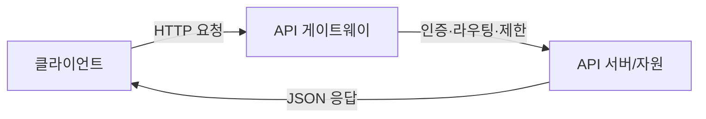

# 개방형 API(Open API)

## 1. 개요

### 가. 정의
> 외부 개발자·서비스가 접근·이용할 수 있도록 **공개된 표준 인터페이스**. 데이터·기능을 개방하여 서비스 연계·확장·생태계를 촉진한다.

### 나. 특징

| 특징 | 내용 |
|---|---|
| **개방성** | 인증된 외부 주체에 기능·데이터 공개 |
| **표준성** | HTTP·REST·OpenAPI(Swagger) 등 표준 준수 |
| **재사용성** | 매시업·플랫폼 생태계 확장 |
| **관리 필요** | 인증·과금·버전·트래픽 통제(API 게이트웨이) |

## 2. SOAP와 REST 구성요소 비교

| 구분 | SOAP | REST |
|---|---|---|
| **개념** | XML 기반 프로토콜 | HTTP 기반 아키텍처 스타일 |
| **구성요소** | Envelope·Header·Body, WSDL, UDDI | 자원(URI)·HTTP 메서드·표현(JSON)·무상태 |
| **메시지** | XML | JSON(주로) |
| **특징** | 강한 표준·트랜잭션·보안(WS-Security) | 경량·확장성·캐싱·Stateless |
| **적합** | 엔터프라이즈·높은 신뢰성 | 웹·모바일·공개 API |

## 3. 취약점 및 대응 방안 (OWASP API Top 10)

| 취약점 | 대응 |
|---|---|
| **인증·인가 미흡(BOLA)** | OAuth 2.0·JWT, 객체 수준 권한 검증 |
| **과도한 데이터 노출** | 응답 필드 최소화, 스키마 검증 |
| **자원 고갈(DoS)** | Rate Limiting·쿼터, 페이지네이션 |
| **인젝션** | 입력 검증, 파라미터 바인딩 |
| **부적절한 자산관리** | API 인벤토리·버전 관리, 폐기 API 차단 |

## 4. API 관리(수명주기)

| 단계 | 활동 |
|---|---|
| **설계** | OpenAPI 명세(계약 우선), 표준화 |
| **게시** | API 게이트웨이·포털 등록 |
| **운영** | 인증·과금·모니터링·트래픽 제어 |
| **폐기** | 버전 폐기·마이그레이션 |

## 5. 고려사항 및 시사점
- **API 게이트웨이 중심** 통합 보안·트래픽·버전 관리
- OpenAPI 명세 기반 설계·문서화·자동화(계약 우선)
- 제로트러스트·mTLS로 API 보안 강화, 오픈뱅킹·마이데이터의 기반

---

> **한 줄 요약**: 개방형 API는 표준(REST/SOAP) 기반 공개 인터페이스로 생태계를 확장하며, OAuth 인증·게이트웨이·Rate Limiting 등으로 OWASP API 취약점에 대응하고 수명주기 관리로 운영한다.
