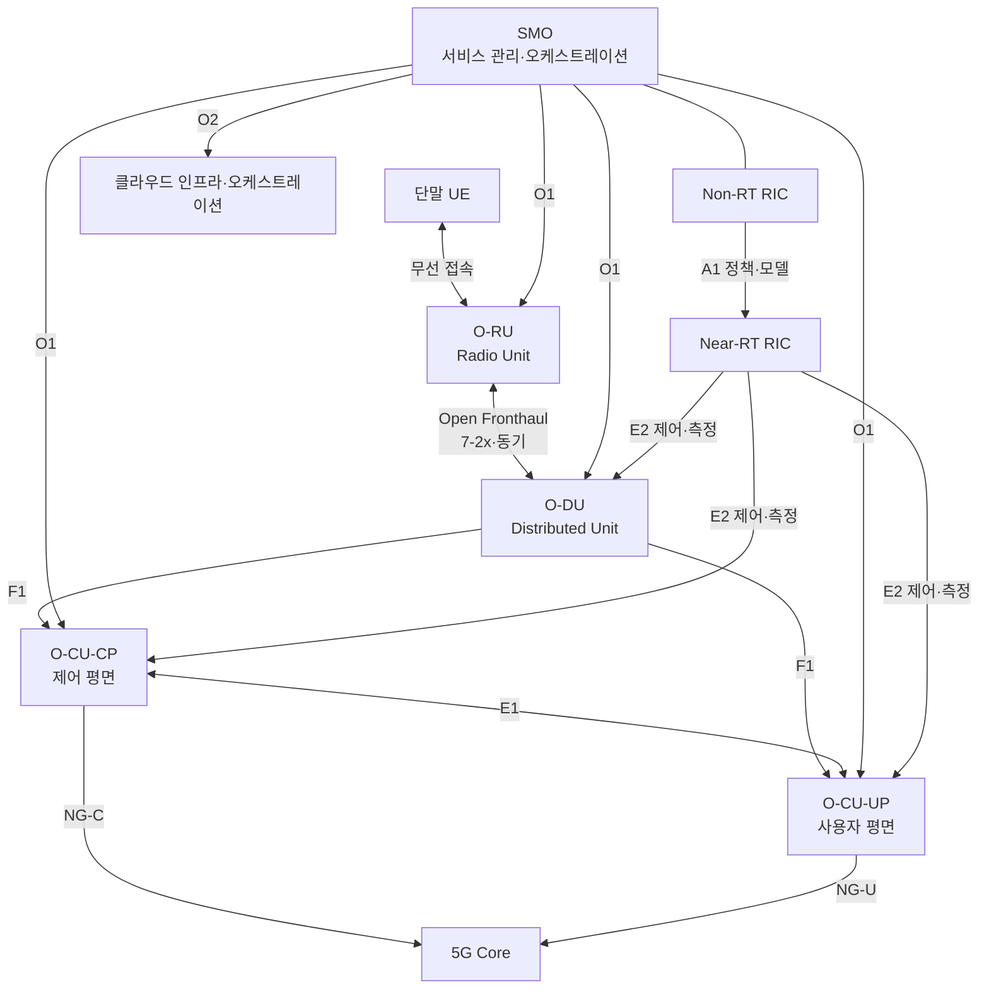
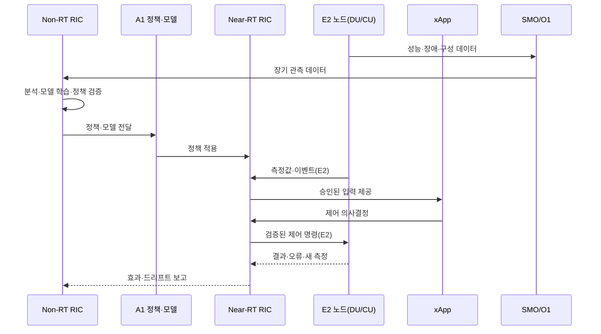

# Open RAN(개방형 무선접속망) 아키텍처와 RIC 기반 지능화

## 1. 개요

> **정의**: Open RAN(Open Radio Access Network)은 무선접속망의 기능을 RU·DU·CU 등으로 분리하고, 개방형 표준 인터페이스·가상화·지능형 제어를 적용하여 다중 공급자 상호운용성과 자동화를 지향하는 RAN 아키텍처이다.

이동통신의 무선접속망(RAN)은 단말과 코어망 사이에서 무선 신호를 처리하고, 셀 자원·이동성·품질을 제어하는 핵심 영역이다. 기존 기지국은 무선장치, 기저대역 처리, 제어 소프트웨어가 특정 공급자의 장비와 인터페이스에 강하게 결합되는 경우가 많았다. 한 공급자의 장비를 장기간 사용하면 통합과 운영은 단순할 수 있지만, 장비 교체와 기능 혁신의 선택 폭이 줄고 공급자 종속과 비용 구조의 불투명성이 커질 수 있다.

Open RAN은 이 문제를 단순히 “기지국을 오픈소스로 만든다”는 방식으로 해결하지 않는다. RAN 기능의 분리 지점과 인터페이스를 표준화하고, 하드웨어와 소프트웨어의 조합 가능성을 높이며, 중앙·분산 제어를 소프트웨어로 자동화하는 산업 아키텍처의 변화다. 따라서 인터페이스가 공개되어도 적합성 시험, 성능 최적화, 운영 책임과 보안이 확보되지 않으면 실제 개방성은 제한된다.

핵심 구성은 O-RAN의 개방형 프런트홀을 통해 연결되는 O-RU와 O-DU, O-CU, 그리고 이를 관리·오케스트레이션하는 SMO(Service Management and Orchestration)이다. O-CU는 다시 제어 평면을 담당하는 O-CU-CP와 사용자 평면을 담당하는 O-CU-UP으로 나누어 설명할 수 있다. 지능화는 Non-RT RIC과 Near-RT RIC이 정책과 실시간 제어를 나누어 수행하는 방식으로 구현된다.

Open RAN을 설계할 때는 네 가지 목표를 함께 보아야 한다. 첫째, 공급자 간 상호운용성이다. 둘째, 범용 서버와 클라우드 기술을 활용하는 유연성이다. 셋째, RIC와 애플리케이션을 통한 자동화·최적화다. 넷째, 개방된 접점과 다중 공급자 구성을 전제로 한 보안·성능·운영성이다. 어느 하나만 달성하고 나머지를 희생하면 상용망에서 지속 가능한 구조가 되기 어렵다.

본 답안은 Open RAN의 등장 배경, 기능 분해와 인터페이스, RIC 지능화, 구축 절차, 기존 RAN·vRAN과의 비교, 보안과 성능 고려사항 및 기술사 관점의 적용 전략을 논술형으로 정리한다.

## 2. 등장 배경과 기본 원리

### 가. 전통적 RAN의 구조적 한계

전통적인 RAN은 무선처리 장치와 기저대역 장치, 제어 소프트웨어가 하나의 제품군으로 공급되는 구조가 일반적이었다. 이 구조는 한 공급자가 하드웨어·소프트웨어·시험·장애 책임을 통합한다는 장점이 있다. 반면 다른 공급자의 장비를 동일한 무선망에 혼합하려면 독자 인터페이스와 상호운용 조건을 별도로 맞추어야 하므로 교체 비용과 검증 부담이 커진다.

또한 트래픽과 서비스 요구가 시간·지역별로 달라져도 전용 장비의 용량을 유연하게 재배치하기 어렵다. 도심의 특정 시간대에는 용량이 부족하지만 다른 지역에서는 유휴 자원이 남을 수 있다. 소프트웨어 기반 기능과 가상화 자원을 활용하면 자원 배치와 기능 업데이트를 유연하게 만들 수 있으나, 무선 물리계층의 지연·동기·처리량 제약을 함께 만족해야 한다.

5G 이후에는 단순한 음성·데이터 연결을 넘어 네트워크 슬라이싱, 초저지연 서비스, 산업용 사설망, 대규모 IoT와 같은 다양한 요구가 생겼다. RAN은 정적인 기지국 설정을 넘어 정책과 관측 데이터를 기반으로 자원을 조정해야 한다. 이 변화가 개방형 인터페이스, 클라우드 네이티브 운영, AI/ML 기반 최적화와 결합하면서 Open RAN의 필요성이 커졌다.

### 나. Open RAN의 핵심 원리

첫째는 **기능 분리(disaggregation)**다. 무선 신호를 송수신하는 RU, 분산된 기저대역 처리 기능을 수행하는 DU, 상위 계층 처리와 코어망 연계를 수행하는 CU를 논리·물리적으로 나누면 배치 위치와 공급자 구성을 선택할 수 있다. 다만 분리 지점마다 데이터량, 지연, 동기, 전송망 요구가 달라지므로 기능을 나누는 것 자체가 항상 비용 절감을 의미하지는 않는다.

둘째는 **개방형 인터페이스(open interface)**다. 개방형 인터페이스는 기능 간 상호작용의 메시지, 절차, 성능·보안 요구를 명확히 하여 서로 다른 구현이 연결될 수 있게 한다. 인터페이스 문서가 공개되어도 구현체의 옵션, 프로파일, 시험 방법이 다르면 통합 문제가 남기 때문에 적합성·상호운용성 시험과 운영 가시성이 함께 필요하다.

셋째는 **가상화와 클라우드화**다. DU·CU 기능을 범용 서버, 가속기, 컨테이너 또는 가상머신 기반으로 실행하면 하드웨어 조달과 기능 배포의 선택 폭이 넓어진다. 그러나 일반 IT 워크로드와 달리 무선 처리는 엄격한 타이밍과 처리량을 요구하므로 CPU 핀닝, NUMA 배치, 가속기, 실시간 커널, 고정밀 동기 설계를 고려해야 한다.

넷째는 **지능형 제어(intelligence)**다. RAN에서 수집한 성능·장애·부하 데이터를 활용해 정책을 수립하고, 애플리케이션이 셀 선택·부하분산·에너지 절감 같은 제어를 보조한다. AI가 제어 루프 안에 들어갈수록 데이터 품질, 모델 검증, 정책 충돌, 실패 시 안전한 기본값과 롤백이 중요해진다.

## 3. Open RAN 기능 구조와 인터페이스

### 가. 전체 구성

O-RU는 무선 주파수와 안테나에 가까운 위치에서 디지털 무선 신호를 처리한다. 안테나 부근에 배치하면 프런트홀 전송 거리를 줄일 수 있지만 현장 장비의 전력·온도·유지보수 조건이 중요해진다. O-RU의 기능과 성능은 DU와의 개방형 프런트홀 조건에 맞아야 하며, 상호운용 시험에서 지연과 동기 편차를 함께 검증해야 한다.

O-DU는 RAN 프로토콜 스택 중 시간 제약이 큰 하위 계층 기능을 분산 위치에서 처리한다. O-DU는 셀 부하와 무선 자원에 가까우므로 지연에 민감하며, 범용 서버로 구현할 때에도 실시간 처리와 가속을 보장해야 한다. 중앙 클라우드에 무조건 통합하기보다 전송망 지연과 장애 영향 범위를 기준으로 배치 위치를 결정한다.

O-CU는 상위 계층 기능을 중앙 또는 지역 클라우드에 배치할 수 있게 한다. 제어 평면은 연결·이동성 제어를, 사용자 평면은 사용자 데이터 전달을 담당하도록 분리할 수 있다. 이 분리는 트래픽 경로 최적화와 자원 확장에 도움을 주지만, CU 내부 및 CU-DU 사이의 상태 일관성과 장애 전환을 운영 설계에 포함해야 한다.

SMO는 RAN 자원과 클라우드 자원의 배포·구성·모니터링·수명주기를 조정하는 관리 계층이다. 네트워크 기능을 배치하는 것뿐 아니라 인벤토리, 장애, 성능, 소프트웨어 버전, 정책과 인증서를 일관되게 관리해야 한다. SMO가 공급자별 도구의 집합에 머물면 개방형 구조의 운영 복잡성이 오히려 커질 수 있다.

### 나. 주요 인터페이스의 역할

Open Fronthaul은 O-RU와 O-DU 사이의 무선 데이터·제어·동기 전송을 담당한다. 분리된 장치 사이의 데이터량이 크고 타이밍 제약이 강하기 때문에 이 인터페이스는 전송망의 대역폭, 지연, 지터와 정확한 시간 동기를 요구한다. 현장에서는 장비 호환 여부뿐 아니라 피크 트래픽과 장애 시 보호 절체를 시험해야 한다.

F1 인터페이스는 DU와 CU 사이의 연결을 제공하여 분산·중앙 기능 분리를 가능하게 한다. E1은 CU-CP와 CU-UP 사이의 제어 관계를 지원한다. 이처럼 계층을 나누면 기능 확장과 배치 최적화가 쉬워지지만, 인터페이스가 늘어나면서 장애 원인 분석과 버전 호환성 관리의 중요성이 커진다.

O1은 관리·운영·유지보수 정보를 교환하는 인터페이스로, 구성·성능·장애·소프트웨어 관리에 활용된다. O2는 SMO와 클라우드 인프라·오케스트레이션 계층의 연계를 위한 접점이다. O1/O2의 자동화 수준이 낮으면 사업자는 여러 공급자의 장비마다 별도 운영 화면과 절차를 유지해야 한다.

A1은 Non-RT RIC과 Near-RT RIC 사이에서 정책, 지능화 지원 정보와 모델 관련 정보를 전달한다. E2는 Near-RT RIC과 E2 노드인 CU·DU 사이에서 측정과 제어를 연결한다. O-RAN Alliance는 이러한 기능·인터페이스를 기술 문서로 정의하고 있으며, 실제 구축에서는 해당 문서의 버전과 지원 프로파일을 명시해야 한다.

| 구분 | 연결 대상 | 주된 목적 | 설계 시 핵심 |
|---|---|---|---|
| Open Fronthaul | O-RU–O-DU | 무선 데이터·제어·동기 | 대역폭·지연·지터·시간 동기 |
| F1 | O-DU–O-CU | 분산/중앙 기능 연결 | 상태 관리·버전 호환·절체 |
| E1 | O-CU-CP–O-CU-UP | CU 제어·사용자 평면 연계 | 세션 상태·장애 전환 |
| O1 | SMO–RAN 노드 | 구성·장애·성능·소프트웨어 관리 | 표준 모델·자동화·증적 |
| O2 | SMO–클라우드 인프라 | 가상 자원 오케스트레이션 | 자원·배치·수명주기 |
| A1 | Non-RT RIC–Near-RT RIC | 정책·모델·의도 전달 | 정책 충돌·권한·검증 |
| E2 | Near-RT RIC–E2 노드 | 측정·제어·최적화 | 지연·안전성·애플리케이션 격리 |

표의 인터페이스는 서로 대체 관계가 아니라 서로 다른 추상화와 시간 범위를 담당한다. 예를 들어 O1의 구성 변경은 관리 수명주기에서 처리되지만, E2의 제어는 셀 부하와 무선 자원 같은 운영 상태를 짧은 주기로 반영한다. 같은 파라미터를 여러 접점에서 바꿀 수 있다면 권한의 우선순위와 충돌 해결 규칙을 정해야 한다.

## 4. RIC 기반 지능화와 운영 절차

### 가. Non-RT RIC과 Near-RT RIC

Non-RT RIC은 SMO 안에서 정책·분석·모델 학습과 같은 비교적 긴 주기의 제어를 수행한다. 장기 성능 추세, 에너지 사용량, 가입자 이동 패턴, 장애 이력을 분석하여 정책이나 모델을 만들 수 있다. 여기서 만들어진 정책은 현장 제어의 목표와 제약을 표현해야 하며, 단순히 “최대화”라는 목적만 주어서는 안 된다.

Near-RT RIC은 E2 노드의 측정 정보를 받아 비교적 짧은 주기의 제어를 수행한다. 부하분산, 이중 연결 최적화, 이동성 보조, 간섭 완화처럼 실시간성이 필요한 기능을 xApp 형태의 애플리케이션으로 구현할 수 있다. 여러 xApp이 같은 자원을 제어하면 목표가 충돌할 수 있으므로 실행 우선순위, 정책 범위와 승인된 제어변수를 관리해야 한다.

이 구조에서 AI 모델은 네트워크를 직접 통제하는 만능 모듈이 아니다. 모델 입력의 지연·누락·편향을 감시하고, 출력이 허용 범위인지 정책 엔진이 검사한 후에만 제어 명령으로 변환해야 한다. 모델이 불확실하거나 데이터 분포가 바뀌면 규칙 기반의 안전한 기본 정책으로 전환하고, 영향이 큰 명령은 사람 승인을 요구하는 방식이 바람직하다.

### 나. 지능형 제어의 단계별 절차

첫 단계는 목적과 제약을 정의하는 것이다. “에너지 사용량을 최소화”라는 목표만 두면 서비스 품질이나 긴급 통신의 우선순위가 훼손될 수 있다. 따라서 커버리지, 처리량, 지연, 슬라이스별 SLA, 긴급 서비스, 전력과 같은 목적·제약을 함께 수치화한다.

둘째는 데이터 수집과 품질 검증이다. 셀·장비·가입자 그룹별 측정값의 시간 정렬, 결측, 이상치, 라벨의 일관성을 확인한다. 측정 데이터의 출처와 보존 기간, 개인정보 포함 여부를 관리하지 않으면 지능화가 보안·개인정보 위험을 키울 수 있다.

셋째는 오프라인 평가와 제한적 온라인 검증이다. 과거 데이터를 이용한 재현성 평가와 시뮬레이션을 수행한 뒤, 일부 셀·시간대에만 정책을 적용하여 대조군과 비교한다. 효과가 평균적으로 좋아 보여도 특정 지역·단말·서비스군에 불리할 수 있으므로 세그먼트별 안전성과 공정성을 확인한다.

넷째는 배포·모니터링·철회다. 모델과 정책의 버전을 레지스트리에 등록하고, 승인자·훈련 데이터·평가 결과·적용 범위를 기록한다. 운영 중에는 목표 지표뿐 아니라 제어 명령 실패율, 롤백 횟수, 예외 발생, 데이터 드리프트를 모니터링하고 기준을 넘으면 자동으로 이전 버전이나 기본 정책으로 되돌린다.

| 단계 | 주요 활동 | 통제 산출물 |
|---|---|---|
| 목적 정의 | 목표·제약·영향 범위 설정 | 의도 명세, KPI/SLO, 위험 허용도 |
| 데이터 준비 | 수집·정합성·비식별·품질 점검 | 데이터 계보, 품질 리포트 |
| 평가 | 시뮬레이션·대조군·예외 시험 | 평가 결과, 승인 기록 |
| 제한 배포 | 카나리 셀·점진적 확대 | 배포 계획, 롤백 조건 |
| 운영 | 효과·드리프트·장애 관찰 | 대시보드, 감사 로그 |
| 개선·철회 | 재학습·정책 조정·비상 전환 | 변경 기록, 사후 검토 |

### 다. SMO와 자동화된 수명주기 관리

SMO의 자동화는 장비를 빠르게 배포하는 데서 끝나지 않고, 의도·구성·관측·변경·폐기의 전 생애주기를 연결해야 한다. 예를 들어 새 DU 소프트웨어를 배포할 때 호환되는 RU·가속기·커널 버전을 검증하고, 프런트홀 동기 상태와 성능 기준을 통과한 뒤에만 트래픽을 유입한다.

구성 관리는 원하는 상태(desired state)와 실제 상태(actual state)의 차이를 보여주어야 한다. 실제 상태가 선언과 다르면 자동 보정할 수 있지만, 무조건 덮어쓰면 현장 장애나 긴급 조치를 되돌릴 위험이 있다. 변경의 원인과 승인, 적용 범위, 롤백 방법을 기록하고, 긴급 변경은 사후 검토로 통제한다.

운영자는 서비스 카탈로그에서 셀·RU·DU·CU·RIC 애플리케이션·클라우드 자원의 의존성을 확인할 수 있어야 한다. 장애가 발생하면 특정 공급자의 장비 문제인지, 프런트홀 전송망인지, 시간 동기인지, RIC 정책인지 빠르게 분리해야 한다. 이 관측성은 다중 공급자 환경에서 SLA 책임을 판단하는 근거가 된다.

## 5. 구축 전략과 성능 설계

### 가. 단계적 구축

첫 단계에서는 사업 목표와 서비스 범위를 정한다. 전국망 전체를 한 번에 개방하기보다 신규 사설망, 특정 도시, 기업 전용망, 실험 셀과 같이 영향 범위가 제한된 영역을 선택하여 상호운용성과 운영 절차를 검증한다. 기존망과의 연동점, 장애 시 복귀 경로, 주파수·규제 조건을 초기 설계에 포함한다.

둘째는 다중 공급자 시험이다. RU·DU·CU·SMO·RIC의 조합을 기능 시험, 성능 시험, 장애 시험, 보안 시험으로 나누어 검증한다. 장비가 연결되는지 확인하는 데 그치지 않고 셀 경계 이동, 피크 부하, 패킷 손실, 시간 동기 이탈, 소프트웨어 업그레이드와 공급자 교체를 시험해야 한다.

셋째는 제한된 상용 파일럿이다. 24시간 평균 성능만 보지 말고 출퇴근 피크, 행사 트래픽, 우천·고온 등 환경 조건, 특정 단말군과 서비스별 품질을 관측한다. 파일럿의 성공 기준은 단순한 throughput 증가가 아니라 장애 복구 시간, 운영자의 처리 시간, 자동화 실패율과 총비용을 포함해야 한다.

넷째는 확대와 표준화다. 검증된 참조 구성과 공급자 적격 기준, 버전 호환표, 운영 런북, 보안 기준을 표준화한다. 지역·서비스를 확대할 때 새로운 조합을 매번 임시로 통합하지 않도록 자동 적합성 시험과 배포 파이프라인을 구축한다.

### 나. 성능·동기·가속기 고려

Open RAN의 성능은 인터페이스가 개방되었다는 사실만으로 보장되지 않는다. 프런트홀의 대역폭과 지연, DU의 처리량, 사용자 수, 안테나 수, 스케줄러 구현, 암호화 오버헤드와 가속기 사용이 함께 결과를 만든다. 동일한 장비라도 프로파일과 트래픽 패턴에 따라 CPU 사용률과 지연 분포가 달라지므로 평균값과 꼬리 지연을 모두 본다.

무선 기능 분리에는 시간 동기가 필수다. 주파수 동기와 위상·시간 동기를 구분하고, GNSS·PTP·SyncE 같은 공급원과 장애 시 holdover 동작을 설계한다. 동기 품질이 저하되었을 때 무조건 서비스를 중단할지, 성능을 낮추어 유지할지의 정책도 사전에 정해야 한다.

범용 서버의 활용은 자원 효율을 높일 수 있지만, CPU와 메모리의 경쟁으로 무선 처리의 지연이 흔들릴 수 있다. CPU 코어 격리, NUMA 인지 배치, DPDK 계열 패킷 처리, FPGA·GPU·전용 가속기, 실시간 스케줄링의 조합을 워크로드별로 평가한다. 특정 가속기에 종속되면 개방성의 이점과 비용 구조를 다시 점검해야 한다.

## 6. 기존 RAN·vRAN·Open RAN 비교

전통적 RAN은 통합 제품으로서 시험과 책임 경계가 비교적 단순한 반면, 공급자 선택과 기능 교체의 유연성이 낮을 수 있다. vRAN은 RAN 기능을 가상화·소프트웨어화하여 범용 컴퓨팅 기반으로 실행하려는 접근이며, Open RAN은 여기에 기능 분리, 개방형 인터페이스, 다중 공급자 상호운용과 RIC 지능화의 관점을 더한 것으로 이해할 수 있다. 실제 제품과 사업 모델에서는 세 용어의 범위가 겹칠 수 있으므로 용어보다 적용한 인터페이스와 운영 범위를 확인해야 한다.

| 구분 | 전통적 통합 RAN | vRAN | Open RAN |
|---|---|---|---|
| 기능 결합 | 공급자 장비에 강하게 결합 | 소프트웨어화 중심 | 기능 분리·개방 인터페이스 |
| 하드웨어 | 전용 장비 비중 높음 | 범용 서버 활용 | 범용·가속기·전용의 조합 |
| 공급자 구성 | 단일 공급자 중심 | 구현에 따라 다름 | 다중 공급자 상호운용 지향 |
| 지능화 | 장비별 관리·최적화 | 중앙 관리 가능 | RIC·앱·정책 기반 자동화 |
| 장점 | 통합 책임·검증 단순성 | 자원 유연성·소프트웨어 배포 | 선택권·혁신·자동화 |
| 주요 위험 | 종속·교체 비용 | 성능·가상화 오버헤드 | 통합·운영·보안 복잡성 |

차이를 단순히 개방성의 많고 적음으로 평가하면 안 된다. 단일 공급자 구조는 장애 원인과 책임의 경계가 분명할 수 있고, Open RAN은 공급자 선택권이 늘어나는 대신 한 장애가 여러 계층·공급자에 걸쳐 발생한다. 따라서 도입 의사결정은 장비 가격만이 아니라 통합 시험, 운영 인력, 관측 플랫폼, 부품·소프트웨어 수명주기와 전환 비용을 포함한 TCO로 비교해야 한다.

또한 Open RAN이 모든 지역과 서비스에 동일하게 적합한 것도 아니다. 트래픽 변동이 크고 자동화·공급자 선택의 가치가 높은 영역에서는 효과가 클 수 있지만, 전송망이 제한되거나 실시간 성능 여유가 작은 환경에서는 분리 지점과 배치 위치를 신중히 선택해야 한다. 기존 RAN과 단계적으로 연동하는 하이브리드 전략도 합리적인 대안이다.

## 7. 사례: 제조기업 사설 5G망의 Open RAN 적용

한 제조기업이 공장 내 AGV, 영상검사, 작업자 단말을 위한 사설 5G망을 구축한다고 가정한다. AGV는 이동성과 지연에 민감하고, 영상검사는 높은 uplink 처리량을 요구하며, 작업자 단말은 커버리지와 인증 편의가 중요하다. 한 가지 KPI로 세 서비스를 평가하면 특정 서비스의 개선이 다른 서비스의 품질을 훼손할 수 있다.

먼저 서비스별 SLA와 우선순위를 정의한다. AGV에는 지연 상한·절체시간·가용성을, 영상검사에는 uplink 처리량·패킷 손실·저장 연계를, 작업자 단말에는 인증 성공률·커버리지·복구시간을 부여한다. 이 정책은 RIC 애플리케이션과 SMO의 구성 템플릿에 반영하되, 안전 관련 제어는 AI의 자율 결정만으로 변경하지 않도록 한다.

RU는 생산라인 인근에 배치하고 DU는 공장 엣지에 두어 프런트홀과 무선 제어 지연을 줄인다. CU와 SMO는 공장 내 엣지 클러스터와 중앙 운영센터의 역할을 나누어 배치한다. 공장 네트워크가 단절되어도 안전 운전과 최소 통신이 유지되도록 로컬 제어와 중앙 관리의 의존성을 분리한다.

Near-RT RIC은 셀 부하와 AGV 이동 경로를 바탕으로 핸드오버 보조 정책을 적용하고, Non-RT RIC은 시간대별 생산계획·장애 이력·전력 데이터를 분석하여 장기적인 자원 정책을 만든다. 정책 적용 전에는 특정 생산라인에서 카나리 시험을 실시하고, AGV 정지·패킷 손실·핸드오버 실패가 임계값을 넘으면 이전 정책으로 자동 복귀한다.

운영 성과는 throughput만으로 판단하지 않는다. 서비스별 99퍼센타일 지연, 핸드오버 실패율, 장애 탐지·복구 시간, 에너지 사용량, 변경 실패율, 다중 공급자 통합 작업시간, 보안 패치 준수율을 함께 측정한다. 이렇게 해야 Open RAN 도입이 실제 생산성과 회복탄력성을 높였는지 확인할 수 있다.

## 8. 보안·신뢰성·운영 고려사항

Open RAN은 인터페이스와 소프트웨어 구성요소가 늘어 공격면도 넓어질 수 있다. O-RU·O-DU·O-CU·SMO·RIC·xApp과 클라우드 인프라, 공급자의 개발·배포 환경을 자산 목록과 위협 모델에 포함한다. 특히 관리 인터페이스와 RIC 제어 경로가 침해되면 단순 정보 유출을 넘어 무선 자원과 서비스 품질이 조작될 수 있다.

첫째, 상호 인증과 통신 보호를 적용한다. 장비·플랫폼·애플리케이션별 신원을 발급하고, 인증서 수명주기와 폐기·교체 절차를 자동화한다. 평면적인 네트워크 신뢰를 전제로 하지 말고 인터페이스·명령·데이터의 최소 권한을 적용한다.

둘째, xApp과 rApp의 공급망을 통제한다. 코드 서명, SBOM, 취약점 검사, 이미지 출처, 실행 권한, API 접근 범위, 업데이트 검증을 배포 게이트에 포함한다. 애플리케이션이 읽을 수 있는 측정 데이터와 실행할 수 있는 제어 명령을 분리하고, 위험한 명령은 정책 엔진과 승인 절차를 통과하게 한다.

셋째, 소프트웨어와 구성의 무결성을 확인한다. 부트 체인, 이미지 서명, 런타임 무결성, 변경 이력, 취약점 패치와 롤백을 관리한다. 다중 공급자 환경에서는 각 공급자의 보안 공지가 서로 다른 형식과 시점으로 오므로 공통 심각도·조치기한·검증 기준을 계약에 명시한다.

넷째, 장애 격리와 복구를 설계한다. RIC이 중단되어도 기본 RAN 기능이 안전하게 동작하고, SMO가 unavailable이어도 이미 승인된 구성이 유지되어야 한다. 단일 클러스터·단일 시간원·단일 관리망에 의존하지 않으며, 제어 루프별 타임아웃과 기본 동작을 정의한다.

| 영역 | 대표 위험 | 대응 방향 |
|---|---|---|
| 인터페이스 | 위·변조, 재전송, 서비스 거부 | 상호 인증·암호화·재전송 방지·속도 제한 |
| RIC/xApp | 악성 정책·권한 과다·모델 오류 | 최소 권한·정책 검증·샌드박스·롤백 |
| 클라우드 | 가상자원 탈취·격리 실패 | 워크로드 격리·이미지 검증·런타임 관측 |
| 공급망 | 취약 구성요소·업데이트 위조 | SBOM·서명·취약점 SLA·출처 검증 |
| 운영 | 다중 공급자 책임 공백 | 공동 런북·증적·SLA·에스컬레이션 |
| 가용성 | 동기·전송망·SMO 장애 | 로컬 자율성·이중화·holdover·복구훈련 |

보안 통제는 별도 심사 문서로만 남겨서는 안 된다. 정상 배포, 정책 승인, 장애 대응, 공급자 변경과 같은 운영 흐름에 통제를 내장하고, 로그를 상관분석하여 실제 제어 명령과 결과를 추적해야 한다. 기술사는 보안성·성능·가용성 사이의 트레이드오프와 잔여 위험을 경영진이 이해할 수 있는 지표로 설명해야 한다.

## 9. 심화: Open RAN 표준화와 산업 적용의 쟁점

O-RAN Alliance는 개방적이고 지능적이며 가상화되고 상호운용 가능한 RAN을 목표로 기술 문서를 개발하고, 기능·인터페이스·프로세스를 여러 작업그룹에서 다룬다. 표준 문서가 계속 갱신되므로 특정 버전의 기능 지원 여부와 상호운용 시험 범위를 제안서와 계약서에 명시해야 한다. “O-RAN 준수”라는 표현만으로 모든 인터페이스와 프로파일의 호환을 보장한다고 해석해서는 안 된다.

산업 적용의 핵심 쟁점은 성능과 통합 비용이다. 전용 장비가 제공하던 최적화가 범용 서버와 다중 공급자 조합에서 동일하게 나오는지, 장애를 어느 공급자가 분석하고 해결하는지, 소프트웨어 업그레이드의 호환성을 누가 보증하는지를 검증해야 한다. 개방성의 기대 편익을 정량화하려면 공급자 교체 기간, 기능 출시 주기, 운영 자동화율, 장애 평균 복구시간 같은 지표를 기준선과 비교한다.

또 하나의 쟁점은 지능형 제어의 책임이다. AI 기반 정책이 성능을 개선하더라도 모델이 왜 특정 셀을 조정했는지 설명하기 어렵거나, 드문 상황에서 위험한 명령을 낼 수 있다. 따라서 모델 카드와 변경 이력, 시뮬레이션·카나리 시험, 승인·철회 조건, 사람의 개입 경로를 운영 거버넌스에 포함한다.

향후에는 Open RAN이 사설 5G, 엣지 컴퓨팅, 네트워크 API, 에너지 최적화, 비지상망과 결합될 가능성이 있다. 그러나 기능의 결합이 많아질수록 데이터·정책·신뢰경계의 복잡성도 증가한다. 기술사는 기술 유행을 따라가는 대신 사업 목적, 서비스 품질, 공급망과 규제, 안전한 실패모드를 기준으로 적용 범위를 정해야 한다.

## 10. 고려사항 및 시사점

### 가. 개방성과 통합 책임을 함께 설계한다

인터페이스를 열면 공급자 선택권은 늘지만 통합 책임이 사라지는 것은 아니다. RAN 시스템 통합자, 장비 공급자, 클라우드 사업자, 전송망 운영자의 책임과 공동 시험 범위를 계약·RACI·SLA에 명시한다. 장애 발생 시 첫 통보자와 최종 해결 책임자가 다르지 않도록 에스컬레이션을 연습한다.

### 나. 성능을 평균이 아닌 최악 조건까지 검증한다

평균 throughput이나 평균 지연만으로는 무선망의 품질을 설명할 수 없다. 피크 부하, 99퍼센타일 지연, 동기 이탈, 패킷 손실, 이동성, 장애 절체와 소프트웨어 업그레이드 조건을 포함해 성능 예산을 세운다. 기능 분리로 얻는 유연성이 프런트홀 증설비와 처리 오버헤드보다 큰지 TCO로 평가한다.

### 다. RIC의 자동화에 안전한 기본값을 둔다

AI·정책 기반 자동화는 운영자의 반복 작업을 줄이지만 잘못된 제어를 빠르게 확산할 수 있다. 제어 범위, 변경률, 적용 셀 수, 서비스별 영향 한도를 제한하고, 데이터 드리프트·효과 저하·이상 명령이 감지되면 자동 철회한다. 자동화율 자체가 성과가 아니라 안전하게 자동화된 업무의 비율이 성과가 되어야 한다.

### 라. 다중 공급자 보안과 공급망을 전 생애주기로 관리한다

Open RAN의 구성요소는 하드웨어·소프트웨어·클라우드·앱·오픈소스·운영도구로 넓어진다. SBOM, 서명, 취약점 공개, 패치·지원 종료, 재위탁, 데이터 접근, 긴급 업데이트를 조달 조건과 운영 기준에 포함한다. 공급자 교체가 가능하려면 데이터·구성·로그를 표준 형식으로 반환받는 이관 조항도 필요하다.

### 마. 기존망과의 공존·철회 경로를 보장한다

상용망 전체를 한 번에 전환하지 말고 신규 영역과 제한된 셀에서 단계적으로 검증한다. Open RAN 장애 시 기존망이나 로컬 기본 기능으로 복귀할 수 있는 경로, 설정 백업, 주파수·인증 연속성, 운영자 훈련을 준비한다. 전환 가능성이 설계에 없으면 개방형 구조도 새로운 종속으로 바뀔 수 있다.

### 바. 사업 가치와 규제·안전 목표를 함께 측정한다

공급자 수나 오픈 인터페이스의 개수는 최종 성과가 아니다. 서비스별 품질, 커버리지, 비용, 에너지, 자동화, 복구성, 보안 사고와 규제 준수, 공급자 교체 시간의 변화를 기준선과 비교한다. 제조·의료·교통처럼 안전 영향이 있는 환경에서는 성능 개선보다 안전한 실패와 검증 가능한 책임이 우선될 수 있다.

## 참고자료

- O-RAN Alliance, “O-RAN Specifications” — https://www.o-ran.org/specifications
- O-RAN Alliance, “60 New or Updated O-RAN Technical Documents Released since March 2025” — https://www.o-ran.org/blog/60-new-or-updated-o-ran-technical-documents-released-since-march-2025
- NTT DOCOMO, “Initiatives toward Intelligent RAN” — https://ssw.web.docomo.ne.jp/orex/en/technical/vol30_1_005en/
- O-RAN Alliance, “O-RAN Software Community” — https://www.o-ran.org/o-ran-software-community
- 3GPP, “3GPP Specifications” — https://www.3gpp.org/dynareport/SpecList.htm

---

> **한 줄 요약**: Open RAN은 RU·DU·CU 분리와 개방형 인터페이스, 가상화, RIC 지능화를 결합해 RAN의 공급자 선택권과 자동화를 높이는 아키텍처이며, 실제 성공을 위해서는 상호운용 시험·시간 동기·성능·보안·다중 공급자 운영책임을 함께 설계해야 한다.
