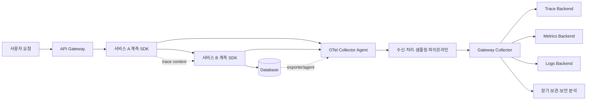
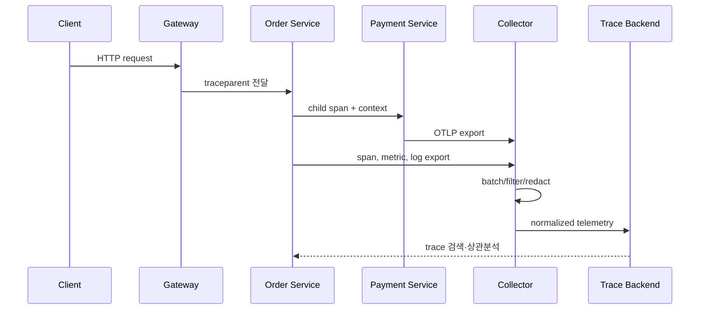

# OpenTelemetry 기반 분산 추적과 통합 관측성

## 1. 개요

> **정의**: OpenTelemetry(OTel)는 애플리케이션과 인프라에서 traces, metrics, logs 같은 텔레메트리를 계측·생성·수집·변환·전송하기 위한 벤더 중립 오픈 소스 관측성 프레임워크이다.

마이크로서비스와 클라우드 네이티브 시스템에서는 한 사용자 요청이 API 게이트웨이, 여러 서비스, 메시지 브로커, 캐시, 데이터베이스를 순차 또는 병렬로 통과한다.
한 서비스의 로그만 보는 전통적 방식으로는 전체 요청이 어디에서 지연되었는지, 어느 호출이 실패를 유발했는지, 동일한 장애가 어떤 고객과 리전에 영향을 주었는지 빠르게 설명하기 어렵다.
특히 서비스가 컨테이너와 자동 확장 그룹 사이에서 이동하면 호스트 이름과 프로세스 ID만으로 요청의 전체 경로를 재구성하기도 어렵다.

관측성은 단순히 모니터링 도구를 설치하는 작업이 아니다.
외부에서 관찰한 출력과 내부 신호를 바탕으로 시스템의 상태와 원인을 추론할 수 있게 만드는 설계 역량이다.
OpenTelemetry는 계측 코드와 특정 백엔드의 결합을 줄이고, 여러 언어와 런타임에서 공통 데이터 모델·API·전송 방식을 사용하게 한다.
따라서 운영 조직은 계측을 다시 작성하지 않고도 저장·검색·시각화 백엔드를 바꾸거나 여러 백엔드로 데이터를 분기할 수 있다.

OpenTelemetry의 핵심은 신호를 따로 수집하는 데 그치지 않고 공통 컨텍스트로 연결하는 데 있다.
트레이스는 한 요청의 인과 경로를 보여주고, 메트릭은 서비스 수준의 추세와 임계값을 보여주며, 로그는 개별 사건의 세부 사실을 남긴다.
세 신호를 trace ID, span ID, resource, 시맨틱 속성으로 연결하면 “오류율이 상승했다”에서 “특정 API의 특정 데이터베이스 호출에서 지연이 발생했고 해당 span의 로그에 타임아웃 원인이 기록됐다”로 분석을 좁힐 수 있다.

이 글은 OpenTelemetry의 구성요소, 신호 모델, 컨텍스트 전파, Collector 파이프라인, 설계·운영 고려사항을 기술사 논술형 관점에서 정리한다.
목표는 제품별 사용법을 암기하는 것이 아니라, 관측성 요구사항을 신호·수집 경로·저장 정책·보안 통제로 변환하는 사고 절차를 제시하는 것이다.

## 2. 도입 배경과 설계 목표

### 2.1 기존 모니터링의 한계

호스트 중심 모니터링은 CPU, 메모리, 디스크, 네트워크와 같은 인프라 상태를 잘 보여준다.
그러나 인프라 자원이 정상이어도 특정 테넌트의 요청만 실패하거나, 데이터베이스 쿼리 하나가 p99 지연을 만들 수 있다.
애플리케이션 로그를 별도 저장하면 사건의 시간·호스트·요청 ID를 사람이 맞춰야 하므로 분석 시간이 길어진다.

분산 추적은 요청을 하나의 trace로 묶고 각 처리 단계를 span으로 표현한다.
각 span에는 시작·종료 시각, 작업 이름, 부모 관계, 속성, 이벤트, 상태가 포함될 수 있다.
이 구조를 이용하면 서비스 간 호출의 병목, 병렬 실행의 대기, 재시도와 외부 의존성 지연을 호출 그래프에서 확인할 수 있다.
다만 모든 요청을 완전하게 추적하면 저장량과 처리 비용이 커지므로 샘플링 정책이 반드시 동반되어야 한다.

### 2.2 OpenTelemetry가 해결하는 문제

첫째, 계측 API와 수집·전송 경로를 표준화한다.
애플리케이션은 공통 API와 SDK를 통해 텔레메트리를 만들고, Collector가 수신·처리·내보내기를 담당하게 할 수 있다.
백엔드가 바뀌어도 애플리케이션 코드에 특정 벤더의 저장 API가 깊게 들어가지 않아 교체 비용과 종속 위험을 줄인다.

둘째, 신호 간 상관분석을 가능하게 한다.
trace ID와 span ID가 로그에 포함되면 로그 검색에서 관련 트레이스로 이동할 수 있다.
메트릭의 예외 지점에 trace를 연결하는 exemplar, resource 속성, 공통 시맨틱 규칙을 사용하면 서비스·배포·리전 단위의 원인 탐색을 일관되게 수행할 수 있다.

셋째, 수집 지점을 중앙화해 운영 정책을 적용한다.
Collector는 배치, 재시도, 메모리 제한, 필터링, 속성 변환, 샘플링, 여러 대상 내보내기를 수행할 수 있다.
민감한 속성의 삭제와 데이터 보존 기간에 맞춘 라우팅을 중앙 정책으로 관리하면 각 서비스가 제각각 처리하는 위험을 낮출 수 있다.

### 2.3 목표와 비목표

OpenTelemetry의 목표는 모든 장애를 자동으로 진단하는 것이 아니다.
일관된 신호를 충분한 맥락과 함께 확보하여 운영자가 가설을 세우고 검증하는 시간을 줄이는 것이 핵심이다.
따라서 계측의 성공 기준은 대시보드 개수보다 탐지 시간, 원인 분석 시간, 복구 시간, 데이터 품질과 비용의 균형으로 정의해야 한다.

반대로 OpenTelemetry는 로그 저장소, 시계열 데이터베이스, 트레이스 UI 그 자체가 아니다.
Collector와 SDK는 데이터를 만들고 전달하는 역할을 담당하며, 실제 저장·검색·시각화와 장기 보존은 선택한 백엔드와 운영 정책의 책임이다.
이 구분을 이해하지 못하면 “표준을 도입했으니 관측성이 완성됐다”는 잘못된 결론에 이른다.

## 3. 전체 아키텍처와 핵심 구성요소



애플리케이션 계층에는 API, SDK, 자동 계측 라이브러리, 수동 계측 코드가 있다.
자동 계측은 HTTP 서버, 클라이언트, 데이터베이스, 메시지 라이브러리와 같은 공통 경로의 span을 빠르게 생성한다.
수동 계측은 업무 규칙, 결제 승인, 재고 예약, 모델 추론처럼 자동 계측만으로 의미를 알 수 없는 지점을 표현한다.
두 방식을 섞을 때는 중복 span, 이름 불일치, 민감정보 기록을 검토해야 한다.

OpenTelemetry API는 계측 코드가 사용하는 추상 인터페이스다.
API만 의존하는 라이브러리는 SDK가 없을 때도 애플리케이션 기능을 수행할 수 있고, 실행 환경이 SDK를 연결하면 실제 수집을 활성화할 수 있다.
SDK는 샘플러, 프로세서, exporter, resource 감지와 같은 실행 정책을 제공한다.
이 분리는 라이브러리 작성자와 애플리케이션 운영자의 책임을 나누는 중요한 설계 원칙이다.

Collector는 수신기(receiver), 처리기(processor), 내보내기(exporter), 파이프라인(pipeline)으로 구성된다.
수신기는 OTLP, Prometheus, Jaeger 등 입력 형식을 받고, 처리기는 배치·필터·속성 변환·메모리 보호 등을 수행한다.
내보내기는 OTLP 또는 특정 백엔드 형식으로 데이터를 전달한다.
단일 Collector가 모든 책임을 갖기보다 에이전트와 게이트웨이를 분리하여 장애 도메인과 확장 단위를 설계할 수 있다.

| 구성요소 | 주요 책임 | 설계 시 확인할 질문 |
|---|---|---|
| API | 계측 호출의 표준 인터페이스 | 라이브러리가 벤더 SDK에 직접 결합되지 않았는가? |
| SDK | 샘플링·처리·내보내기 실행 | 메모리와 CPU 예산, 종료 시 flush가 보장되는가? |
| 자동 계측 | 공통 프레임워크의 빠른 계측 | 중복 span과 버전 호환성을 관리하는가? |
| 수동 계측 | 업무 의미와 핵심 이벤트 표현 | 어떤 업무 속성이 저카디널리티로 정의되는가? |
| Collector | 수집·변환·라우팅·보호 | 수집 경로 장애 시 백프레셔와 재시도가 동작하는가? |
| 백엔드 | 저장·검색·시각화·알림 | 보존·조회 성능·비용·접근권한은 적절한가? |

표의 구성요소는 독립된 제품 목록이 아니라 하나의 데이터 흐름을 이룬다.
예를 들어 SDK에서 생성한 span을 Collector가 받더라도 resource 속성이 누락되면 어느 서비스의 데이터인지 알기 어렵다.
반대로 데이터가 풍부해도 샘플링과 보존 정책이 없으면 저장 비용과 검색 지연이 증가한다.
기술사는 각 구성요소를 선택하는 이유와 실패 시 대체 경로까지 답안에 연결해야 한다.

## 4. 신호 모델과 컨텍스트 전파

### 4.1 Traces와 spans

Trace는 하나의 논리적 요청 또는 업무 흐름을 구성하는 span의 집합이다.
Span은 서비스 내부의 작업이나 외부 호출을 나타내며, 부모 span과의 관계로 호출 트리를 만든다.
분산 환경에서는 단순한 트리뿐 아니라 비동기 메시지, 배치, fan-in·fan-out을 표현하는 link가 필요할 수 있다.

span 이름은 검색과 집계의 기준이므로 URL 전체나 사용자 입력처럼 값이 계속 바뀌는 문자열을 그대로 넣지 않는다.
`GET /orders/{orderId}`처럼 템플릿화된 이름을 사용하고, 실제 식별자는 제한된 속성 또는 로그의 마스킹된 필드로 관리한다.
오류 span에는 상태, 예외 이벤트, 오류 유형, 외부 의존성 정보를 남기되 카드번호와 토큰 같은 비밀값은 기록하지 않는다.

### 4.2 Metrics와 logs

메트릭은 시간에 따른 수치의 집계다.
요청 수, 오류 수, 지연 히스토그램, 활성 연결 수, 큐 길이와 같은 메트릭은 SLI와 알림의 기반이 된다.
카운터·게이지·히스토그램·요약 등 계측 유형을 업무 의미에 맞게 선택하고, 같은 의미의 메트릭 이름과 단위를 조직 표준으로 정한다.

로그는 특정 시점의 사건을 기록한다.
구조화된 로그는 JSON이나 공통 필드로 기록하여 파싱·검색을 쉽게 하고, trace ID와 span ID를 넣어 관련 span을 찾을 수 있게 한다.
로그에 모든 요청 본문을 넣는 방식은 관측성처럼 보이지만 개인정보와 비용의 위험을 키우므로, 사건의 원인 분석에 필요한 최소 필드만 남겨야 한다.

### 4.3 Resource와 시맨틱 규칙

Resource는 텔레메트리를 생성한 서비스·호스트·컨테이너·클라우드 리소스의 정체성을 표현한다.
`service.name`, 배포 환경, 버전, 리전, 클러스터 같은 속성이 일관되게 채워져야 서로 다른 인스턴스의 데이터를 같은 서비스로 집계할 수 있다.
서비스 이름이 배포마다 바뀌면 동일 서비스의 오류율 추세가 단절되고, 반대로 너무 많은 식별자를 서비스 이름에 넣으면 집계가 파편화된다.

시맨틱 규칙은 HTTP, 데이터베이스, 메시징 같은 공통 작업의 속성 이름과 의미를 통일한다.
팀마다 `url`, `request_url`, `httpUrl`을 제각각 쓰면 여러 서비스의 데이터를 결합하기 어렵다.
표준 규칙을 따르되 기존 로그와의 호환성, 속성의 안정성, 개인정보 최소화 여부를 함께 검토해야 한다.

### 4.4 컨텍스트 전파

분산 추적에서 서비스 A가 서비스 B로 trace context를 전달해야 하나의 trace가 이어진다.
HTTP 요청의 헤더, 메시지의 메타데이터, 비동기 작업의 전달 객체가 전파 매체가 된다.
전파가 끊기면 각 서비스의 span은 생성되더라도 별도 trace로 보이므로, 프레임워크·프록시·메시지 브로커 경계마다 테스트해야 한다.

W3C Trace Context 계열 헤더를 사용할 때는 외부 입력을 신뢰해 권한 결정을 내리지 않는다.
trace ID는 상관관계용 식별자이며 인증·인가 토큰이 아니고, baggage에 넣은 값은 다운스트림으로 전파될 수 있으므로 비밀정보를 담지 않는다.
신뢰 경계 밖에서 들어온 baggage와 trace 정보는 허용 목록·크기 제한·삭제 정책으로 보호한다.



위 시퀀스에서 업무 요청의 context 전파와 텔레메트리 전송은 별개의 흐름이다.
요청 처리 중에 생성된 span은 SDK의 processor와 exporter를 거쳐 Collector로 전송되고, Collector는 데이터를 배치로 묶어 백엔드에 보낸다.
따라서 업무 요청이 성공했다고 해서 텔레메트리 전송도 성공한다고 단정할 수 없다.
종료 시 flush, 전송 실패 시 재시도, Collector 장애 시 버퍼와 드롭 정책을 운영 요구사항으로 정의해야 한다.

## 5. OTLP와 Collector 파이프라인 설계

OTLP는 OpenTelemetry 텔레메트리를 중간 노드와 백엔드 사이에 전달하는 프로토콜이다.
gRPC와 HTTP 전송을 지원하며, trace·metric·log의 payload와 요청·응답 방식을 규정한다.
조직은 프로토콜 선택보다 네트워크 경로, 인증, TLS, 최대 메시지 크기, 재시도, 압축, 장애 시 데이터 손실 허용량을 먼저 정해야 한다.

에이전트형 Collector는 애플리케이션이나 노드 가까이에 배치되어 짧은 경로와 로컬 버퍼를 제공한다.
게이트웨이형 Collector는 여러 에이전트의 데이터를 중앙에서 샘플링·정제·라우팅하고, 백엔드 자격증명과 외부 연결을 집중 관리한다.
두 계층을 사용할 때는 에이전트가 무한히 재시도하여 애플리케이션 자원을 압박하지 않도록 큐와 메모리 한도를 둔다.

파이프라인은 신호별로 분리할 수 있다.
트레이스는 tail sampling과 오류 우선 보존이 중요하고, 메트릭은 시계열 집계와 카디널리티 관리가 중요하며, 로그는 개인정보 마스킹과 보존 기간이 중요하다.
모든 신호에 동일한 프로세서를 적용하면 로그에 필요한 마스킹이 메트릭에는 부적절하거나, 트레이스의 샘플링이 감사 로그를 누락시킬 수 있다.

```yaml
receivers:
  otlp:
    protocols:
      grpc: {}
      http: {}
processors:
  memory_limiter:
    limit_mib: 512
  batch:
    timeout: 5s
  attributes/redact:
    actions:
      - key: user.email
        action: delete
exporters:
  otlp/backend:
    endpoint: telemetry-backend.example.internal:4317
service:
  pipelines:
    traces:
      receivers: [otlp]
      processors: [memory_limiter, attributes/redact, batch]
      exporters: [otlp/backend]
```

위 예시는 개념을 보여주는 최소 구성이지 운영 환경에 그대로 복사할 설정은 아니다.
실제 환경에서는 TLS 인증서와 자격증명, exporter 큐, 재시도 간격, health check, self-metrics, 네트워크 정책을 추가해야 한다.
또한 속성 삭제 프로세서만으로 민감정보가 모두 제거된다고 가정하지 말고, 애플리케이션 계측 단계와 백엔드 접근권한에서도 방어해야 한다.

Collector 자체도 관측 대상이다.
수신 성공·실패, 처리량, 큐 길이, 메모리 사용량, exporter 재시도, 드롭된 데이터, 처리 지연을 메트릭으로 모니터링한다.
Collector가 포화되었는데 애플리케이션만 보고 있으면 계측 데이터가 사라진 사실을 장애 원인으로 오인하거나 감지하지 못한다.
데이터 유실이 허용되지 않는 감사·보안 이벤트는 별도 전송 경로와 영속 큐를 검토한다.

## 6. 샘플링·카디널리티·비용 통제

모든 trace를 저장하는 것은 분석 편의성이 높지만 트래픽이 큰 서비스에서는 저장·전송 비용이 급격히 증가한다.
head sampling은 요청 초기에 보존 여부를 결정하여 비용을 빨리 줄이지만, 뒤에서 오류가 발생할 것을 미리 알기 어렵다.
tail sampling은 trace가 일정 부분 모인 뒤 오류, 지연, 특정 정책을 보고 결정하므로 중요한 trace를 보존하기 좋지만 Collector 메모리와 대기 시간이 필요하다.

실무에서는 정상 요청을 낮은 비율로 샘플링하고 오류·고지연·신규 버전의 trace를 우선 보존하는 혼합 정책을 사용한다.
샘플링 결정이 서비스마다 다르면 같은 trace의 일부 span만 남아 호출 경로가 끊길 수 있으므로, 분산 전파와 샘플링 플래그의 의미를 확인한다.
규제·감사 대상 거래는 일반 관측성 샘플링과 별도로 원본 이벤트를 보존한다.

카디널리티는 속성 값의 종류가 얼마나 많은지를 뜻한다.
`service.name`, `http.method`, `region`은 비교적 낮은 카디널리티지만, 무제한 사용자 ID·주문 ID·URL 쿼리 문자열은 매우 높다.
고카디널리티 속성을 메트릭 label에 넣으면 시계열 수와 메모리가 폭증하고, 검색 비용이 커질 수 있다.
업무 분석에 필요한 식별자는 로그나 trace span의 제한된 속성으로 보내고, 메트릭은 집계 가능한 차원으로 설계한다.

간단한 비용 추정은 초당 이벤트 수, 이벤트당 평균 바이트, 샘플링률, 복제 수, 보존 기간으로 시작한다.
예를 들어 초당 2,000개의 span을 평균 2KB로 전송하면 원시 전송량은 초당 약 4MB이며, 압축·배치·속성 증가·복제·인덱스 비용을 더 고려해야 한다.
평균값만으로 용량을 정하지 말고 배포 직후, 장애 폭증, 트래픽 피크, 재시도 폭증의 최악 조건을 별도로 산정한다.

## 7. 다른 관측성 접근과 비교

기존 도구를 모두 폐기하고 OpenTelemetry로 교체하는 것이 항상 최선은 아니다.
이미 운영 중인 Prometheus, 로그 수집기, APM을 유지하면서 OpenTelemetry Collector를 브리지로 사용하고, 서비스별로 단계적으로 계측을 확장할 수 있다.
중요한 것은 제품 이름이 아니라 데이터 모델과 운영 책임이 일관되는지다.

| 비교 대상 | 강점 | 한계 | OpenTelemetry와의 관계 |
|---|---|---|---|
| 호스트 모니터링 | 인프라 자원과 노드 상태에 강함 | 업무 흐름과 호출 원인 파악이 약함 | resource 메트릭과 결합 |
| 전통적 로그 수집 | 사건 세부와 감사 기록에 강함 | 호출 관계와 표준 필드가 불균일할 수 있음 | 로그 API·브리지·상관 ID로 연결 |
| 단일 벤더 APM | 빠른 초기 화면과 통합 기능 | 비용·포맷·에이전트 종속 가능성 | OTel exporter 또는 병행 수집 |
| Prometheus 중심 메트릭 | 강한 시계열 집계와 생태계 | trace·log의 인과 관계가 별도임 | OTLP·exemplar로 연결 |
| 수동 로그 상관분석 | 특정 시스템에 즉시 적용 가능 | 사람 의존과 누락, 운영 부하 | 자동·표준 계측으로 보완 |

OpenTelemetry는 단일 백엔드의 기능을 모두 대체하는 만능 도구가 아니다.
특정 APM의 프로파일링이나 세션 분석이 필요하면 해당 기능을 병행할 수 있고, 기존 메트릭 규칙이 안정적이면 변경의 위험을 계산해야 한다.
다만 표준 API와 OTLP를 경계로 두면 계측과 저장·시각화를 분리할 수 있어 장기적인 선택권이 커진다.

## 8. 설계 절차와 품질 검증

첫째, 장애 대응 질문을 정의한다.
“사용자 결제가 왜 느린가”, “어느 리전에서 오류가 증가했는가”, “배포 이후 어떤 의존성이 실패했는가”처럼 실제 질문을 정하고, 답에 필요한 신호와 속성을 역으로 설계한다.
도구를 먼저 설치하면 사용하지 않는 데이터만 쌓이기 쉽다.

둘째, 서비스 맵과 신뢰 경계를 그린다.
동기 호출, 메시지, 배치, 외부 SaaS, 데이터베이스, 사용자·관리자 경계를 표시하고, context가 어디서 생성·전파·삭제되는지 결정한다.
외부 경계를 통과하는 baggage, 헤더, 로그 속성은 허용 목록과 크기 제한을 둔다.

셋째, 계측 표준을 만든다.
서비스 이름 규칙, span 이름 템플릿, 오류 분류, resource 속성, 로그 필드, 메트릭 단위, 개인정보 금지 목록을 문서화한다.
표준은 중앙팀이 일방적으로 정하는 규칙이 아니라 개발·운영·보안·개인정보 담당자가 함께 검토할 계약이어야 한다.

넷째, Collector와 백엔드의 용량을 시험한다.
정상 부하뿐 아니라 트래픽 급증, 백엔드 중단, 네트워크 지연, exporter 재시도, Collector 재시작을 주입한다.
장애 중에도 핵심 업무를 방해하지 않고, 허용한 데이터 손실률과 복구 후 재전송 시간이 기준을 만족하는지 확인한다.

다섯째, 관측성 자체의 SLO를 정한다.
예를 들어 99%의 핵심 요청이 trace ID를 생성하고, 95%의 Collector export가 정해진 시간 안에 완료되며, 보안 이벤트가 별도 보존 경로에 남는다는 식으로 측정한다.
계측 데이터가 없는 서비스는 정상으로 보일 수 있으므로, 데이터 공백과 계측 실패를 알림 조건으로 포함한다.

## 9. 사례: 주문 플랫폼의 결제 지연 분석

한 주문 플랫폼에서 결제 성공률은 정상인데 고객의 주문 완료 시간이 증가했다고 가정한다.
인프라 CPU는 50% 이하이고 애플리케이션 오류 로그도 많지 않아 호스트 대시보드만으로는 원인을 찾기 어렵다.

OpenTelemetry trace를 조회하면 API Gateway span은 정상이나 주문 서비스의 재고 확인 span이 p95 800ms로 늘었고, 일부 trace에서 데이터베이스 lock 대기가 나타난다.
동일 trace의 구조화 로그에는 특정 인덱스 변경 배포 이후 쿼리 계획이 달라졌다는 이벤트가 있고, 메트릭에는 재고 DB 연결 대기 시간이 상승해 있다.
세 신호가 같은 resource와 trace context로 연결되어 있어 문제를 “결제 서비스가 느리다”가 아니라 “재고 DB의 특정 경로가 주문 전체의 선행 단계를 지연시킨다”로 좁힐 수 있다.

운영팀은 해당 배포를 롤백하고, 오류 trace와 고지연 trace를 우선 보존하는 샘플링 정책으로 재현 여부를 확인한다.
동시에 재고 조회와 결제 호출의 span을 분리하여 어느 단계가 사용자 타임아웃을 차지하는지 검증한다.
사후에는 쿼리 계획 검증을 배포 파이프라인에 넣고, 서비스·버전·리전별 지연 메트릭과 trace exemplar를 대시보드에 추가한다.

이 사례에서 중요한 것은 특정 도구 화면이 아니라 상관관계의 품질이다.
trace ID만 있고 서비스 버전이나 데이터베이스 시스템 속성이 없으면 원인 후보를 좁히기 어렵다.
속성이 너무 많거나 사용자 입력을 그대로 포함하면 비용·보안 문제가 생긴다.
따라서 관측성 설계는 “많이 기록하기”가 아니라 분석 질문에 필요한 최소 맥락을 안정적으로 기록하는 일이다.

## 10. 심화: 클라우드 네이티브와 생성형 AI 관측성

클라우드 환경에서는 서비스 인스턴스가 빈번히 생성·삭제되므로 resource 속성의 수명과 서비스 버전을 정확히 기록해야 한다.
배포 시스템, 오케스트레이터, 클라우드 리소스 감지기가 제공하는 속성을 조합하되, 동일한 의미의 필드가 충돌하면 우선순위를 정한다.
멀티리전 환경은 리전 간 전파 지연과 데이터 주권을 고려하여 Collector와 백엔드의 위치를 설계한다.

서비스 메시가 이미 통신 메트릭과 trace를 생성하더라도 애플리케이션 업무 span이 자동으로 생기는 것은 아니다.
프록시 계측은 네트워크 경로와 응답 코드에 강하지만, “재고 예약”과 “쿠폰 검증” 같은 업무 의미를 알지 못한다.
프록시·SDK·수동 계측의 중복을 줄이고 각 층의 책임을 문서화해야 한다.

생성형 AI 애플리케이션에서는 모델 호출, 검색·증강 단계, 도구 호출, 토큰 사용량, 안전성 필터 결과가 하나의 요청 흐름에 포함될 수 있다.
이 정보를 trace span의 이벤트와 제한된 속성으로 표현하면 지연과 실패를 단계별로 비교할 수 있다.
그러나 사용자 프롬프트, 모델 응답, 문서 내용에는 개인정보·기밀·저작권 정보가 들어갈 수 있으므로 원문을 무조건 텔레메트리에 남기지 않는다.
토큰 수와 모델 이름처럼 운영에 필요한 집계 정보와 원문 저장 정책을 분리하고, 접근권한과 보존 기간을 다르게 설정한다.

현재 OpenTelemetry 공식 사양은 traces, metrics, logs, context, resource, semantic conventions, OTLP를 함께 다루는 방향으로 발전하고 있다.
이러한 표준의 존재가 모든 언어 SDK의 기능 성숙도가 같다는 뜻은 아니므로, 도입 시 언어별 API·SDK·자동 계측 상태와 운영에 필요한 기능을 확인해야 한다.
표준 버전과 구현 버전을 구성 관리하고, 실험적 기능을 핵심 감사·결제 경로에 바로 의존하지 않는 것이 안전하다.

## 11. 고려사항 및 시사점

### 11.1 정확성과 비용의 균형

관측성 데이터는 많을수록 좋은 것이 아니라 질문에 답할 수 있을 만큼 정확해야 한다.
샘플링률, 속성 수, 로그 본문, 보존 기간을 비용 모델과 함께 결정하고, 장애·배포·감사 데이터의 우선순위를 다르게 둔다.
비용 절감 때문에 오류 trace를 버리거나, 반대로 모든 정상 요청을 무기한 보존하는 극단을 피한다.

### 11.2 데이터 품질과 계측 거버넌스

서비스 이름과 속성 규칙이 깨지면 대시보드와 알림의 신뢰성이 떨어진다.
스키마 변경을 코드 리뷰와 버전 관리에 포함하고, 표준 위반·누락·고카디널리티를 자동 점검한다.
새 서비스의 운영 인수 조건에 최소 trace·metric·log 품질을 넣어 계측을 사후 작업으로 남기지 않는다.

### 11.3 개인정보와 보안

trace, log, baggage는 요청 경로를 따라 여러 시스템으로 전파될 수 있으므로 일반 로그보다 넓은 영향 범위를 가진다.
수집 전 마스킹, 허용 목록, 암호화 전송, 백엔드 접근권한, 보존·삭제 정책을 설계하고 비밀값을 테스트 데이터로도 넣지 않는다.
관측성 시스템 자체가 민감한 운영·고객 정보를 모으므로 관리자 계정의 다중 인증과 감사 로그도 필요하다.

### 11.4 장애 격리와 백프레셔

Collector 또는 백엔드 장애가 업무 요청의 스레드와 메모리를 고갈시키지 않도록 비동기 전송, bounded queue, memory limiter, timeout, 재시도 상한을 둔다.
텔레메트리 드롭은 숨겨서는 안 되며, 어떤 신호와 비율이 손실되었는지 self-metrics와 알림으로 보여줘야 한다.
감사·보안 이벤트는 일반 디버그 로그와 동일한 손실 정책을 적용하지 않는다.

### 11.5 조직 운영과 비용 책임

관측성은 플랫폼팀만의 인프라가 아니라 각 서비스 팀이 품질을 책임지는 운영 계약이다.
플랫폼팀은 SDK·Collector·표준 대시보드를 제공하고, 서비스팀은 업무 span·오류 분류·민감정보 검토·SLO를 책임지는 구조가 효과적이다.
백엔드 비용을 서비스·환경·신호별로 배분하면 불필요한 고카디널리티와 과도한 보존을 개선하기 쉽다.

### 11.6 기술사 관점의 적용 전략

기술사는 OpenTelemetry 도입을 제품 교체 프로젝트가 아니라 관측성 아키텍처 표준화와 운영 역량 개선 과제로 제시해야 한다.
현황 진단, 목표 신호 모델, context 전파 경계, Collector 토폴로지, 보안 통제, 비용 산정, 단계별 전환, 성공 지표를 설계 산출물로 연결한다.
기존 도구와의 공존·마이그레이션 전략을 포함하고, 벤더 중립성이 실제 선택권으로 이어지는지 백엔드 교체 시험으로 검증한다.
결국 좋은 관측성은 장애를 예언하는 마법이 아니라, 시스템의 상태를 신뢰할 수 있는 증거로 설명하고 빠른 의사결정을 가능하게 하는 공학적 기반이다.

## 참고자료

- OpenTelemetry Documentation, “Documentation”: https://opentelemetry.io/docs/
- OpenTelemetry Specification, “OpenTelemetry Specification”: https://opentelemetry.io/docs/specs/otel/
- OpenTelemetry Specification, “Overview”: https://opentelemetry.io/docs/specs/otel/overview/
- OpenTelemetry Specification, “OTLP Specification”: https://opentelemetry.io/docs/specs/otlp/
- OpenTelemetry Specification, “General semantic conventions”: https://opentelemetry.io/docs/specs/semconv/general/
- OpenTelemetry Documentation, “OpenTelemetry Logs”: https://opentelemetry.io/docs/concepts/signals/logs/
- W3C, “Trace Context”: https://www.w3.org/TR/trace-context/

---

> **한 줄 요약**: OpenTelemetry는 표준 API·SDK·Collector·OTLP와 공통 컨텍스트로 traces·metrics·logs를 연결하여 분산 시스템의 원인 분석을 빠르게 하되, 샘플링·보안·비용·운영 거버넌스를 함께 설계해야 완성되는 관측성 기반이다.
