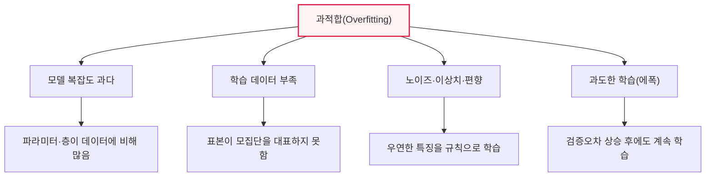
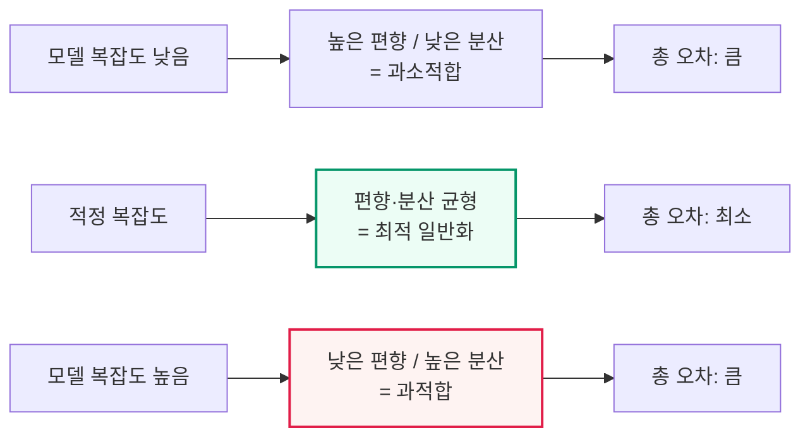

# 과적합(Overfitting)의 발생 이유와 해결 방안

## 1. 개요

### 가. 정의
> **과적합(Overfitting)** 은 머신러닝 모델이 **학습 데이터에 지나치게 맞춰져, 새로운 데이터(테스트·실제 운영 데이터)에 대한 예측 성능이 떨어지는** 현상이다. 모델이 데이터에 담긴 일반적 규칙(signal)이 아니라 특정 표본에만 존재하는 노이즈(noise)·특수성까지 함께 학습해 버린 상태를 말한다.

과적합의 본질은 '**외우기와 이해하기의 차이**'다. 학습(training)의 진짜 목표는 데이터에 담긴 일반적 규칙을 배워 처음 보는 데이터도 잘 예측하는 것, 즉 **일반화(generalization)** 다. 그런데 모델이 너무 복잡하거나 학습이 과하면, 규칙을 이해하는 대신 학습 데이터를 통째로 암기해 버린다. 시험 문제의 원리를 이해한 학생과 답만 외운 학생의 차이와 같다. 답만 외운 학생은 본 문제(학습 데이터)는 완벽히 풀지만 숫자만 바뀐 문제(새 데이터)에는 무너진다. 과적합된 모델도 학습 데이터에서는 정확도가 매우 높지만 실제 데이터에서는 성능이 급락한다.

반대편에는 **과소적합(Underfitting)** 이 있다. 모델이 너무 단순하거나 학습이 부족해 데이터의 패턴조차 제대로 배우지 못한 상태다. 과소적합 모델은 학습 데이터에서도, 새 데이터에서도 모두 성능이 낮다. 결국 머신러닝 모델링은 과소적합과 과적합 사이의 **적정 복잡도(sweet spot)** 를 찾아가는 과정이며, 좋은 모델은 학습 성능과 검증 성능이 모두 높고 그 격차가 작은 지점에 존재한다. 이 '균형점'을 정량적으로 설명하는 이론이 뒤에서 다룰 **편향-분산 트레이드오프**다.

### 나. 왜 중요한가 — 실무적 필요성
과적합이 중요한 이유는, 학습 단계의 높은 정확도가 실제 서비스 성능을 전혀 보장하지 못하기 때문이다. 예컨대 학습 데이터에서 정확도 99%를 기록한 이미지 분류 모델이 실제 운영 환경에서는 70%대로 떨어지는 일이 흔하다. 이는 모델이 학습 표본의 조명·배경 같은 우연한 특징까지 '규칙'으로 오인한 결과다. 특히 파라미터 수가 수백만~수십억에 이르는 딥러닝·거대언어모델(LLM)은 학습 데이터를 사실상 암기할 수 있는 표현력을 지니므로, 과적합 제어가 모델 품질의 성패를 가른다.

또한 과적합은 **데이터 유출(data leakage)** 이나 **평가 방법의 오류**와 결합될 때 더 위험하다. 검증·테스트 데이터가 학습에 새어 들어가면 과적합을 탐지하지 못한 채 '허위의 높은 성능'을 신뢰하게 되고, 이는 운영 배포 후 대규모 장애로 이어진다. 따라서 과적합은 단순한 알고리즘 이슈가 아니라 데이터 분할·평가 설계·MLOps 전 과정에 걸친 관리 대상이다.

### 다. 과적합과 과소적합의 증상 대비
두 현상을 실무에서 빠르게 구분하려면 학습·검증 성능의 조합을 보면 된다. 과소적합은 학습·검증 성능이 모두 낮은 반면, 과적합은 학습 성능만 높고 검증 성능이 낮다. 이 단순한 표지가 진단의 출발점이며, 처방의 방향(복잡도를 높일지 낮출지)을 정반대로 이끈다는 점에서 정확한 판별이 중요하다.

| 구분 | 과소적합(Underfitting) | 과적합(Overfitting) |
|---|---|---|
| **학습 성능** | 낮음 | 높음 |
| **검증 성능** | 낮음 | 낮음 |
| **편향/분산** | 편향 큼 | 분산 큼 |
| **원인** | 모델 단순·학습 부족 | 모델 복잡·데이터 부족·과학습 |
| **처방 방향** | 복잡도↑·학습↑·특징 추가 | 복잡도↓·데이터↑·정규화 |

## 2. 과적합의 발생 이유

과적합은 하나의 원인이 아니라 '모델 복잡도'와 '데이터 품질·양'의 불균형에서 비롯된다. 아래 구조도는 네 가지 주요 원인이 어떻게 과적합으로 수렴하는지를 보여준다.

**첫째, 모델 복잡도 과다**가 가장 근본적 원인이다. 모델의 파라미터 수나 층(layer)이 데이터가 담은 정보량에 비해 지나치게 많으면, 남는 표현력이 노이즈를 학습하는 데 쓰인다. 다항 회귀에서 차수를 무한정 높이면 모든 학습 점을 지나는 구불구불한 곡선이 만들어지지만, 그 곡선은 새 점에 대해 형편없는 예측을 한다. 딥러닝처럼 표현력이 큰 모델일수록 이 위험이 커진다.

**둘째, 학습 데이터의 부족과 비대표성**이다. 데이터가 적으면 모델이 배울 수 있는 '일반 규칙'의 근거가 빈약해, 우연히 관측된 패턴을 규칙으로 오인하기 쉽다. 표본이 모집단을 대표하지 못하는 편향(sampling bias)이 있으면, 모델은 편향된 세계관을 그대로 학습해 실제 데이터에서 무너진다. 예컨대 특정 병원 데이터로만 학습한 진단 모델은 다른 병원의 장비·환자군에서 성능이 급락한다.

**셋째, 노이즈·이상치·레이블 오류**다. 학습 데이터에 측정 오차·이상치·잘못된 레이블이 섞여 있으면, 표현력이 큰 모델은 이 오류까지 충실히 학습한다. 노이즈는 본질적으로 재현 불가능한 무작위 성분이므로, 이를 학습할수록 새 데이터 성능은 떨어진다. **넷째, 과도한 학습(에폭 과다)** 이다. 학습을 반복할수록 학습오차는 계속 줄지만, 어느 시점부터 검증오차는 오히려 증가하기 시작한다. 이 전환점을 지나서도 학습을 계속하면 모델이 학습 데이터에 특화되어 과적합된다.

## 3. 과적합의 해결 방안

### 가. 데이터 관점의 대응
가장 근본적이고 효과적인 해법은 '**더 많고 다양한 데이터를 확보하는 것**'이다. 데이터가 충분하면 모델이 노이즈를 규칙으로 오인할 여지가 줄고, 진짜 일반 규칙을 학습할 근거가 강해진다. 다만 실무에서 데이터 확보는 비용·시간·규제(개인정보) 제약을 받으므로, **데이터 증강(Data Augmentation)** 이 현실적 대안이 된다. 이미지에서는 회전·반전·크롭·색상 변형으로, 텍스트에서는 동의어 치환·역번역으로, 음성에서는 잡음 추가·속도 변형으로 학습 표본의 다양성을 인위적으로 늘린다.

데이터 품질 관리도 중요하다. 이상치·레이블 오류를 정제(cleansing)하고, 클래스 불균형을 보정(오버·언더 샘플링, SMOTE)하며, 표본이 모집단을 고르게 대표하도록 수집 설계를 개선한다. 최근에는 **합성 데이터(synthetic data)** 나 생성모델 기반 증강도 활용되지만, 원본 분포를 왜곡하면 오히려 성능을 해칠 수 있어 주의가 필요하다.

### 나. 모델·학습 관점의 대응
모델 쪽에서는 복잡도를 억제하는 **정규화(Regularization)** 가 핵심이다. **L2 정규화(가중치 감쇠, weight decay)** 는 가중치 제곱합에 페널티를 부과해 가중치를 전반적으로 작게 유지함으로써 모델을 매끄럽게 만들고, **L1 정규화(Lasso)** 는 가중치 절댓값에 페널티를 부과해 불필요한 특징의 가중치를 0으로 만들어 자동 특징 선택 효과를 낸다. 페널티 강도(λ)가 너무 크면 과소적합, 너무 작으면 과적합이 되므로 λ 자체가 튜닝 대상이다.

딥러닝에서는 **드롭아웃(Dropout)** 이 널리 쓰인다. 학습 시 각 층의 뉴런 일부를 확률적으로(예: 0.5) 무작위 비활성화해, 특정 뉴런 조합에 대한 과도한 의존을 막고 여러 부분 네트워크의 앙상블 효과를 낸다. **조기 종료(Early Stopping)** 는 검증오차가 더 이상 개선되지 않고 상승하기 시작하는 시점에서 학습을 멈추는 기법으로, 과도한 학습으로 인한 과적합을 직접 차단한다. 이 밖에 배치 정규화(Batch Normalization), 층·파라미터를 줄이는 **모델 단순화**, 사전학습 모델을 활용하는 **전이학습(Transfer Learning)** 도 데이터가 적을 때 과적합을 크게 줄인다.

### 다. 검증·평가 관점의 대응
과적합은 '진단'이 되어야 대응할 수 있으므로, 신뢰할 수 있는 검증 체계가 필수다. **교차검증(Cross-Validation)**, 특히 k-겹 교차검증은 데이터를 k개로 나눠 번갈아 검증에 사용함으로써, 특정 분할에 우연히 잘 맞는 것이 아닌 '일반화된 성능'을 추정한다. **앙상블(Ensemble)** 기법 중 배깅(Bagging)·랜덤 포레스트는 여러 모델의 예측을 평균 내 분산을 줄여 과적합을 완화한다. 데이터 분할 시 학습·검증·테스트를 엄격히 분리하고, 하이퍼파라미터 튜닝은 검증셋으로만 수행해 테스트셋 오염을 막는 것도 과적합을 정직하게 평가하기 위한 원칙이다.

| 방안 | 계열 | 핵심 원리 |
|---|---|---|
| **데이터 증강·확보** | 데이터 | 표본 다양성↑ → 노이즈 학습 억제 |
| **정규화(L1·L2)** | 모델 | 가중치 페널티로 복잡도 억제 |
| **드롭아웃** | 모델(딥러닝) | 뉴런 무작위 제거, 앙상블 효과 |
| **조기 종료** | 학습 | 검증오차 상승 시점에 학습 중단 |
| **교차검증** | 평가 | 일반화 성능을 신뢰성 있게 추정 |
| **모델 단순화** | 모델 | 파라미터·층·특징 축소 |
| **앙상블(배깅)** | 모델 | 여러 모델 평균으로 분산 감소 |
| **전이학습** | 모델 | 사전학습 지식으로 소량 데이터 보완 |

## 4. 편향-분산 트레이드오프 (원리 심화)

과적합과 과소적합을 하나의 이론으로 관통하는 것이 **편향-분산 트레이드오프(Bias-Variance Trade-off)** 다. 모델의 기대 예측오차는 크게 **편향(Bias)²+분산(Variance)+환원불가오차(irreducible error)** 로 분해된다. 편향은 모델의 단순화 가정 때문에 진짜 관계를 놓쳐 생기는 체계적 오차이고, 분산은 학습 데이터가 조금만 바뀌어도 모델이 크게 흔들리는 민감성이다.

위 다이어그램이 보여주듯, 모델 복잡도를 높이면 편향은 줄지만 분산은 커진다. **과적합은 분산이 큰 상태**(학습 데이터 변화에 과민)이고, **과소적합은 편향이 큰 상태**(패턴을 못 배움)다. 총 오차는 두 성분의 합이므로, 편향이 줄어드는 이득과 분산이 커지는 손실이 균형을 이루는 지점에서 최소가 된다. 앞서 본 해결책들을 이 관점에서 재해석하면 명확해진다. 정규화·드롭아웃·조기종료·앙상블은 모두 '분산을 줄이는' 처방이고, 데이터 증강은 분산을 줄이면서 편향을 덜 희생시키는 방법이다.

다만 이 전통적 트레이드오프가 항상 성립하는 것은 아니라는 최신 관찰도 있다. 매우 큰 딥러닝 모델에서는 파라미터 수가 데이터 수를 넘어선 뒤에도 검증오차가 다시 감소하는 **이중 하강(Double Descent)** 현상이 보고되었다. 이는 과적합을 '복잡도만의 함수'로 단정하기 어렵게 만들며, 대규모 모델 시대에 과적합 이해가 여전히 진화 중임을 시사한다. 실무에서는 단정보다 검증셋 성능을 근거로 판단하는 것이 안전하다.

## 5. 심화: 실무 사례와 진단·대응 전략

실제 프로젝트에서 과적합은 **학습곡선(learning curve)** 으로 진단하는 것이 정석이다. 에폭에 따른 학습오차와 검증오차를 함께 그렸을 때, 학습오차는 계속 낮아지는데 검증오차가 어느 시점부터 상승하며 둘 사이 격차(generalization gap)가 벌어지면 과적합의 명확한 신호다. 예컨대 학습 정확도 98%·검증 정확도 75%라면 23%p의 격차 자체가 과적합의 증거이며, 이때 조기 종료 시점을 그 전환점으로 잡거나 정규화를 강화한다.

대표적 실무 사례로 **의료 영상 진단 모델**을 들 수 있다. 특정 병원의 소수 데이터로만 학습한 폐렴 판별 모델이, 실제로는 폐 병변이 아니라 그 병원 X선 장비의 워터마크·촬영 각도 같은 부수 특징을 학습해 다른 병원에서 성능이 급락한 사례가 여러 연구에서 보고되었다. 이는 '데이터의 대표성 부족+노이즈 학습'이 결합된 전형적 과적합으로, 다기관 데이터 확보와 도메인 일반화 기법으로 대응한다. 또 다른 사례로 **금융 신용평가·주가예측 모델**은 과거 특정 기간의 시장 패턴에 과적합되면 시장 국면이 바뀔 때 예측이 무너지므로, 시계열 특성을 고려한 워크포워드(walk-forward) 검증과 정규화가 필수다.

**거대언어모델·추천시스템**에서도 과적합 관리는 핵심이다. LLM은 학습 데이터를 부분적으로 암기(memorization)해 학습 코퍼스 내용을 그대로 출력하는 문제가 알려져 있는데, 이는 프라이버시·저작권 위험으로도 이어진다. 이에 데이터 중복 제거(deduplication), 드롭아웃·가중치 감쇠, 조기 종료, 그리고 방대한 데이터로 표현력 대비 데이터량을 확보하는 방식으로 대응한다. 추천시스템에서는 소수 인기 항목에 과적합되어 다양성이 사라지는 문제를 정규화·앙상블로 완화한다.

## 6. 고려사항 및 시사점 (기술사 관점)

1. **과적합 대응은 단일 기법이 아니라 조합 전략으로 접근해야 한다.** 데이터 확보(근본), 정규화·드롭아웃(모델), 조기종료(학습), 교차검증(평가)을 상황에 맞게 결합하는 것이 정석이다. 데이터가 적으면 전이학습·증강을, 딥러닝이면 드롭아웃·배치정규화를, 실무 배포 전에는 교차검증으로 일반화를 검증하는 식의 계층적 처방이 필요하다.

2. **데이터 확보와 품질이 근본 해법이며, 알고리즘 처방은 보조수단이다.** 대표성 있는 데이터를 충분히 확보하는 것이 과적합을 막는 가장 확실한 방법이므로, 데이터 수집·정제·레이블링 파이프라인에 대한 투자가 우선되어야 한다. 정규화 강도만 높이면 과소적합이라는 반대 함정에 빠질 수 있어, 트레이드오프를 정량적으로 관리해야 한다.

3. **평가 설계와 데이터 유출 방지가 진단의 전제다.** 학습·검증·테스트를 엄격히 분리하고 하이퍼파라미터 튜닝을 검증셋으로만 수행하지 않으면, 과적합을 탐지하지 못한 채 허위 성능을 신뢰하게 된다. MLOps 관점에서 데이터 분할·리키지 점검·검증 자동화를 파이프라인에 내재화해야 한다.

4. **운영 단계의 데이터 드리프트까지 고려한 지속 관리가 필요하다.** 배포 시점에 일반화가 잘 되었더라도, 시간이 지나 입력 분포가 바뀌면(concept/data drift) 실질적 과적합 상태가 된다. 따라서 운영 중 성능 모니터링·주기적 재학습·A/B 테스트를 통해 일반화 성능을 지속 관리하는 것이 기술사 관점의 완성된 대응이다.

5. **대규모 모델 시대에는 과적합에 대한 이해도 재검토가 필요하다.** 이중 하강 등 최신 관찰은 '복잡도=과적합'이라는 단순 도식이 항상 옳지 않음을 보여준다. 특정 이론에 단정하기보다, 검증셋 성능과 학습곡선이라는 실증적 근거에 기반해 규제 강도·모델 규모·데이터량을 조율하는 실용적 판단이 요구된다.

## 참고자료
- Google Developers, "Machine Learning Crash Course — Overfitting": https://developers.google.com/machine-learning/crash-course/overfitting/overfitting
- scikit-learn, "Underfitting vs. Overfitting": https://scikit-learn.org/stable/auto_examples/model_selection/plot_underfitting_overfitting.html
- Belkin et al., "Reconciling modern machine-learning practice and the bias-variance trade-off (Double Descent)": https://www.pnas.org/doi/10.1073/pnas.1903070116

---

> **한 줄 요약**: 과적합은 *모델이 학습 데이터의 노이즈·특수성까지 외워 새 데이터에서 성능이 급락하는(분산이 큰)* 현상으로, 모델 복잡도 과다·데이터 부족·노이즈·과도한 학습이 원인이며, 데이터 증강·정규화(L1/L2)·드롭아웃·조기종료·교차검증·앙상블을 조합하고 편향-분산 균형점을 찾아 일반화 성능을 확보한다.
