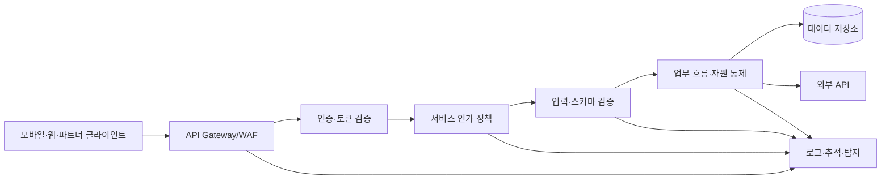
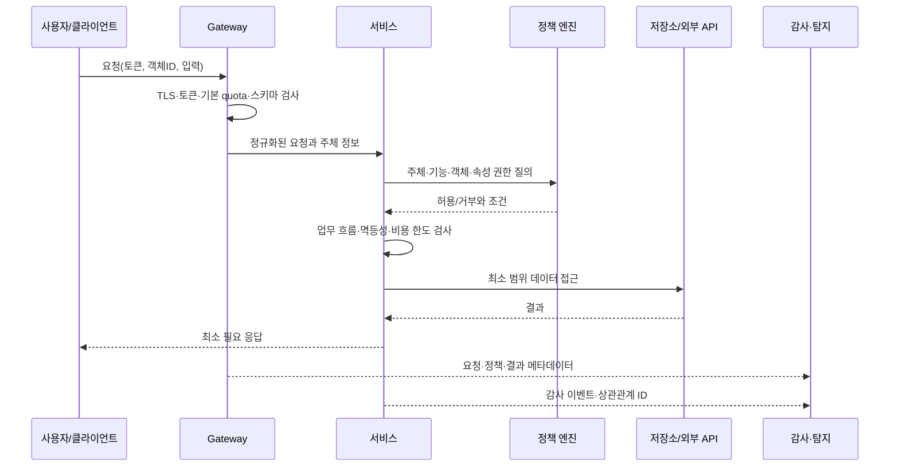

# OWASP API Security Top 10(2023) 기반 API 보안 설계와 운영

## 1. 개요

> **정의**: API 보안은 애플리케이션 사이의 호출 경계에서 인증·인가·입력 검증·자원 통제·기록·공급자 신뢰를 일관되게 적용하여, 데이터와 업무 기능의 기밀성·무결성·가용성을 보호하는 활동이다.

API는 웹 화면보다 더 많은 기능과 데이터를 직접 노출한다. 모바일 앱, 파트너 포털, 사내 마이크로서비스, 배치 작업이 같은 API를 호출하므로 하나의 엔드포인트가 여러 채널의 공통 공격면이 된다. 화면에서 버튼을 숨기는 것만으로는 API 호출을 막을 수 없으며, 매 요청의 서버 측에서 주체와 대상 객체, 실행 기능, 데이터 속성을 다시 판정해야 한다.

OWASP API Security Top 10은 API 특유의 실패 양상을 정리한 위험 인식 기준이다. 이 노트는 [OWASP API Security Top 10 2023 공식 목록](https://owasp.org/API-Security/editions/2023/en/0x11-t10/)을 중심으로 설명한다. 2023판은 2019년 초판에 이은 두 번째 판이며, 단순한 인증 취약점뿐 아니라 업무 흐름 악용과 제3자 API 신뢰 문제까지 다룬다.

API 위험의 핵심은 네 가지 경계가 동시에 무너지는 데 있다. 첫째는 호출자를 확인하는 인증 경계이고, 둘째는 호출자가 무엇을 할 수 있는지 결정하는 인가 경계다. 셋째는 얼마나 많은 비용과 자원을 소비할 수 있는지 정하는 자원 경계이며, 넷째는 어떤 버전·호스트·외부 공급자와 연결되어 있는지 관리하는 운영 경계다.

따라서 API 보안은 API 게이트웨이 하나를 설치하는 프로젝트가 아니다. 설계 단계의 위협 모델, 서비스 코드의 정책 집행, CI/CD의 계약 검사, 런타임의 탐지와 대응, 폐기 단계의 자산 정리를 연결하는 수명주기 관리 문제다.

기술사 답안에서는 위험 목록을 나열하는 것보다 ‘객체·속성·기능’ 수준의 인가를 분리하고, 정상 호출과 자동화된 업무 악용을 구별하며, 인증·인가·제한·관찰성을 하나의 통제 체계로 묶어 설명하는 것이 중요하다.

## 2. API 보안 위협 모델과 전체 구조

API 요청은 일반적으로 클라이언트, API 게이트웨이, 서비스, 데이터 저장소, 외부 API를 순서대로 통과한다. 각 계층은 서로 다른 보안 책임을 가진다. 게이트웨이는 공통 정책의 일관성을 높이지만, 객체별 권한이나 업무 규칙을 모두 알 수 없으므로 서비스 내부 검증을 대체할 수 없다.

인증은 ‘누구인가’를 확인하지만, 인가는 ‘이 주체가 이 객체의 이 속성에 대해 이 기능을 수행할 수 있는가’를 판단한다. 두 질문을 토큰의 존재 여부 하나로 합치면 수평적 권한 상승과 수직적 권한 상승을 놓치기 쉽다.

입력 검증은 악성 문자열을 걸러내는 작업에 한정되지 않는다. 페이지 크기, 정렬 필드, 필터 깊이, 업로드 크기, URL 목적지, 열거형 값, 숫자 범위를 검증해야 한다. 검증 규칙이 OpenAPI 계약과 서비스 구현에 서로 다르면 공격자는 더 느슨한 경로를 찾는다.

자원 통제는 네트워크 요청 수만 세는 방식으로 충분하지 않다. 한 번의 호출이 데이터베이스 조인, 대용량 파일 변환, SMS 발송, 결제 승인, 외부 AI 호출을 유발한다면 비용 단위별 제한이 필요하다. API 보안은 보안팀의 전유물이 아니라 서비스 소유자와 플랫폼팀의 공동 책임이다.

다음 표는 계층별 책임을 요약한 것이다. 표의 항목은 통제의 위치를 보여 주며, 실제 이유와 예외 처리는 각 서비스의 산문 설계로 남겨야 한다.

| 계층 | 주요 책임 | 대표 실패 |
|---|---|---|
| 자산·계약 | 호스트, 버전, 엔드포인트, 스키마 식별 | 잊힌 디버그 API와 구버전 노출 |
| 인증 | 토큰·세션·키의 발급, 검증, 폐기 | 위조·재사용·만료 미흡 |
| 인가 | 객체·속성·기능·업무 규칙 판정 | 다른 사용자 객체 조회·관리 API 호출 |
| 입력·출력 | 스키마, 타입, 범위, 민감 필드 통제 | 과도한 응답·대량 할당 |
| 자원·업무 | 속도, 동시성, 비용, 민감 흐름 통제 | DoS·재고 선점·쿠폰 남용 |
| 연계·운영 | 외부 API 검증, 설정, 로깅, 대응 | SSRF·제3자 데이터 신뢰·추적 불가 |

## 3. OWASP API Security Top 10 위험별 해설

### 3.1 API1:2023 Broken Object Level Authorization

객체 수준 인가(BOLA)는 요청의 경로 또는 본문에 포함된 객체 식별자를 바꾸어 다른 사용자의 리소스를 읽거나 수정하는 문제다. `/users/100/orders/9`의 `9`가 현재 사용자의 주문인지 확인하지 않고 조회하면 로그인과 인증은 정상이어도 기밀성이 무너진다.

취약점의 원인은 식별자를 신뢰하는 데이터 접근 코드다. 개발자는 URL에 숫자 ID가 있다는 사실을 ‘이미 권한을 확인한 상태’로 오해하기 쉽다. 그러나 식별자는 라우팅 정보일 뿐 권한 증명이 아니다. 모든 객체 조회·수정·삭제 경로에서 주체, 테넌트, 객체 소유권과 공유 상태를 함께 검사해야 한다.

실무에서는 전역 ID를 UUID로 바꾸는 것만으로 해결되지 않는다. UUID는 추측을 어렵게 만들 뿐이며, 유출되거나 응답에서 관찰되면 같은 문제가 남는다. 서비스 계층에서 `authorize(subject, action, resource)`를 호출하고, 데이터베이스 쿼리에도 테넌트 조건을 함께 넣어 방어 심층성을 구성해야 한다.

예를 들어 교육 플랫폼의 수강생 A가 자신의 성적 API를 호출할 때 `studentId=B`로 변경해도 결과가 나오지 않아야 한다. 가장 안전한 형태는 요청의 studentId를 권한 판단의 기준으로 삼지 않고, 인증 주체에서 얻은 사용자와 테넌트 범위로 조회하는 것이다.

### 3.2 API2:2023 Broken Authentication

인증 취약점은 토큰 탈취뿐 아니라 토큰의 발급·수명·회전·폐기 정책이 허술한 상태를 포괄한다. 비밀번호 재설정 토큰이 오래 살아 있거나, refresh token이 기기와 세션에 묶이지 않거나, 인증 실패에 제한이 없으면 공격자는 정상 API를 통해 계정을 장악할 수 있다.

액세스 토큰은 짧은 수명으로 운영하고, refresh token은 재사용 탐지와 회전 정책을 적용한다. 서명 알고리즘을 허용 목록으로 고정하고, issuer·audience·nonce·발급 시각과 만료 시각을 검증한다. 단순히 JWT의 서명이 맞는지만 확인하는 구현은 다른 서비스에서 발급된 토큰을 받아들이는 혼동을 만들 수 있다.

API 키는 사용자 인증과 애플리케이션 식별을 동일하게 보장하지 않는다. 파트너 키를 가진 사람이 어떤 최종 사용자인지 추적해야 하는 서비스라면 별도의 사용자 인증과 행위자 귀속이 필요하다. 키는 소스 코드와 URL에 남기지 말고 보관소에서 주입하며, 노출 시 즉시 폐기할 수 있어야 한다.

로그인, 비밀번호 변경, 결제 승인처럼 위험이 큰 작업은 재인증이나 단계별 인증을 요구한다. 인증 성공률과 실패율, 지역·기기 변화, refresh token 재사용을 함께 관찰해야 하며, 무조건적인 IP 차단은 모바일 사용자와 NAT 환경의 오탐을 키울 수 있다.

### 3.3 API3:2023 Broken Object Property Level Authorization

속성 수준 인가는 객체 자체의 접근 권한이 있어도 객체 내부의 각 필드에 대한 읽기·쓰기 권한이 다를 수 있다는 관점이다. 2023판은 과거의 과도한 데이터 노출과 대량 할당 문제를 공통 원인인 속성 권한 결함으로 묶는다.

응답 객체를 데이터베이스 모델 그대로 직렬화하면 내부 메모, 비용, 인증 정보, 관리자 플래그가 함께 노출될 수 있다. 반대로 클라이언트가 보낸 JSON을 객체에 그대로 병합하면 `role`, `approved`, `price` 같은 보호 필드를 수정할 수 있다. 입력 DTO와 출력 DTO를 분리하고 필드별 허용 목록을 명시해야 한다.

예를 들어 일반 판매자는 상품의 `name`과 `description`은 수정할 수 있지만 `sellerId`, `settlementRate`, `approved`는 수정할 수 없어야 한다. 화면에서 해당 입력 상자를 숨기는 것과 서버에서 속성 권한을 검증하는 것은 전혀 다른 통제다.

마스킹은 표시 제어이고 인가는 접근 결정이다. 주민등록번호 뒷자리를 마스킹해서 반환하는 것보다, 업무상 필요하지 않은 주체에게는 애초에 해당 필드를 조회하지 않는 편이 로그·캐시·분석 파이프라인으로의 확산을 줄인다.

### 3.4 API4:2023 Unrestricted Resource Consumption

무제한 자원 소비는 요청 빈도만이 아니라 요청 한 건이 유발하는 모든 유한 자원의 고갈을 의미한다. CPU와 메모리뿐 아니라 데이터베이스 연결, 저장 공간, 이메일·문자 발송량, 결제 수수료, 외부 AI 호출 비용도 자원으로 보아야 한다.

고정된 초당 요청 수만 적용하면 값싼 조회와 비싼 보고서 생성 API를 동일하게 취급하게 된다. 엔드포인트별 가중치, 사용자·테넌트별 예산, 동시 실행 수, 요청 본문의 크기와 처리 시간 제한을 설계해야 한다. 제한 초과 시 429와 재시도 안내를 일관되게 제공하되, 무한 재시도를 유발하는 응답은 피한다.

페이지 크기와 정렬·필터 조건의 상한을 서버에서 강제한다. 대용량 내보내기는 동기 API로 처리하지 않고 작업 큐에 등록한 뒤 진행률과 다운로드 만료 시간을 제공하면 요청 스레드와 웹 타임아웃의 연쇄 고장을 줄일 수 있다.

실제 사례로 이미지 변환 API가 무제한 원본 크기를 허용하면 공격자는 정상 인증으로 대형 파일을 반복 제출하여 CPU와 저장소를 동시에 소모할 수 있다. 파일 크기·픽셀 수·압축 해제 후 크기·사용자별 일일 한도를 함께 관리해야 한다.

### 3.5 API5:2023 Broken Function Level Authorization

기능 수준 인가(BFLA)는 일반 사용자용 기능과 관리자용 기능의 경계가 무너지는 문제다. `/admin/export`, `/users/{id}/suspend`와 같이 URL에 관리자라는 단어가 들어 있어도 서버가 역할과 정책을 검사하지 않으면 숨겨진 메뉴가 공격 표면이 된다.

역할 기반 접근제어(RBAC)는 빠르게 시작하기 좋지만 역할 수가 늘면 예외가 폭발한다. 속성 기반 접근제어(ABAC)나 정책 기반 접근제어(PBAC)를 도입하여 주체의 역할, 조직, 리소스 상태, 요청 맥락을 함께 판단할 수 있다. 중요한 점은 모델 이름보다 모든 민감 기능에 정책 검사가 실제로 연결되는지다.

HTTP 메서드만으로 권한을 추정해서는 안 된다. `GET`도 개인정보 대량 추출 기능일 수 있고, `POST`도 단순 검색일 수 있다. API 명세의 operationId와 실제 정책 ID를 매핑하여 기능 단위의 권한 테스트를 자동화하는 것이 바람직하다.

마이크로서비스 환경에서는 게이트웨이의 역할 검사와 서비스 내부의 업무 권한 검사가 서로 달라질 수 있다. 게이트웨이는 공통 인증과 거친 정책을 담당하고, 최종 서비스는 리소스와 업무 상태를 아는 주체로서 세밀한 결정을 내려야 한다.

### 3.6 API6:2023 Unrestricted Access to Sensitive Business Flows

민감한 업무 흐름의 무제한 접근은 전통적인 코딩 오류가 없어도 발생한다. 사용자가 상품 구매, 좌석 예약, 댓글 등록, 쿠폰 발급과 같은 정상 기능을 자동화해 사업 결과를 왜곡하면 API는 기술적으로 정상 동작하지만 비즈니스 보안은 실패한다.

이 위험은 ‘요청 횟수’보다 ‘업무 의미’를 모델링해야 한다는 점에서 API4와 다르다. 동일 계정이 짧은 시간에 여러 IP에서 신규 계정을 만들고 쿠폰을 소진하거나, 재고 확보와 결제 취소를 반복한다면 업무 규칙과 위험 신호를 함께 평가해야 한다.

대응책은 CAPTCHA 하나로 끝나지 않는다. 사용자·기기·결제수단·주소·재고·시간 창을 연결한 속도 제한, 중복 요청 방지, 예약 만료, 단계별 검증, 이상 탐지, 수동 심사를 조합한다. 자동화가 합법적인 파트너에게는 별도 quota와 계약 기반 허용량을 부여한다.

예를 들어 공연 티켓 API는 로그인과 권한이 정상이어도 한 계정이 짧은 시간에 좌석을 반복 점유하고 취소하면 다른 고객의 기회를 침해한다. 좌석 잠금의 시간 제한, 동일 결제수단의 동시 예약 상한, 멱등 키, 봇 위험 점수를 함께 적용해야 한다.

### 3.7 API7:2023 Server Side Request Forgery

SSRF는 서버가 사용자 제공 URL을 가져오는 기능을 악용하여 내부망, 메타데이터 서비스, 관리용 포트로 요청을 보내게 하는 공격이다. URL 형식이 올바르다는 것과 목적지가 안전하다는 것은 다르다.

허용 목록 기반의 외부 도메인 정책을 우선하며, DNS 재결합과 리다이렉트로 검사를 우회하지 못하게 한다. 사설 IP, 루프백, 링크 로컬 주소, 예약된 주소 대역을 해석 결과와 연결 단계에서 모두 차단하고, HTTP 클라이언트의 리다이렉트와 프로토콜을 제한한다.

네트워크 분할은 애플리케이션 검증의 대체재가 아니다. 애플리케이션이 내부 자격 증명 서비스에 접근할 수 있는 구조라면 SSRF 한 번으로 피해가 확장될 수 있으므로, 메타데이터 엔드포인트를 별도 정책으로 보호하고 최소 권한 네트워크를 구성해야 한다.

이미지 미리보기나 웹훅 검증 기능은 대표적인 사례다. 요청 URL을 저장만 하는지 실제로 서버가 가져오는지, 리다이렉션을 따라가는지, 응답 본문을 외부 사용자에게 돌려주는지를 데이터 흐름으로 분석해야 한다.

### 3.8 API8:2023 Security Misconfiguration

보안 설정 오류는 기본 계정, 과도한 CORS, 디버그 응답, 상세 스택 트레이스, 운영 환경의 테스트 엔드포인트, 검증되지 않은 HTTP 메서드 등 여러 형태로 나타난다. API와 API를 둘러싼 프록시·컨테이너·클라우드 설정을 함께 점검해야 한다.

환경별 설정을 코드와 분리하되, 분리 자체가 통제의 부재를 뜻해서는 안 된다. 안전한 기본값, 필수 환경 변수 검증, 설정 스키마, 변경 승인, 비밀 값 탐지, 배포 전 정책 테스트를 구성한다. 운영에서 개발용 문서와 샘플 계정이 살아 있지 않은지 정기적으로 확인한다.

CORS는 브라우저의 교차 출처 접근 통제이지 API 자체의 인증·인가가 아니다. 허용 출처를 별표로 열고 자격 증명을 허용하는 구성은 의도하지 않은 브라우저 호출을 만들 수 있다. 비브라우저 클라이언트까지 보호하려면 토큰과 서버 측 권한 검사가 반드시 필요하다.

오류 응답은 디버깅에 필요한 정보를 개발자에게 제공하지만, 운영 응답에 내부 호스트명·SQL·토큰·스택을 포함하면 공격자의 정찰 자료가 된다. 외부에는 상관관계 ID와 일반화한 오류를 반환하고, 상세 내용은 접근이 통제된 로그에 남긴다.

### 3.9 API9:2023 Improper Inventory Management

부적절한 자산 관리는 API가 어디에 있고 어떤 버전으로 배포되었는지 모르는 상태다. 운영 호스트뿐 아니라 테스트·스테이징·파트너 전용 호스트, GraphQL 스키마, 비동기 콜백, 서버리스 함수도 목록에 포함해야 한다.

API 인벤토리는 문서 파일만으로 유지되지 않는다. 게이트웨이 로그, DNS와 인증서, 서비스 레지스트리, OpenAPI 저장소, 코드 라우트, 클라우드 배포 목록을 상호 대조하여 실제 노출 면을 발견한다. 각 자산에 소유자, 데이터 등급, 버전, 인증 방식, 폐기 예정일을 부여한다.

구버전 API를 즉시 제거하기 어려운 경우 종료 일정을 공개하고, 신규 사용자 차단·기능 축소·응답 헤더의 폐기 안내·호출량 모니터링을 단계적으로 적용한다. 단순히 `/v1`을 `/v2`로 바꾸는 것은 구버전의 취약한 정책이 남아 있으면 위험을 이전하는 데 불과하다.

예를 들어 개발용 `api-dev.example`에 운영 데이터베이스가 연결된 상태라면 공식 문서에 없다는 사실은 보호가 아니다. 외부 공격면 검증과 내부 자산 대조를 정기적으로 수행하고, 발견된 미등록 API를 소유 팀의 수명주기에 편입해야 한다.

### 3.10 API10:2023 Unsafe Consumption of APIs

안전하지 않은 API 소비는 내부 개발자가 제3자 API의 응답을 사용자 입력보다 신뢰하는 데서 시작한다. 외부 응답이 악성 값, 과대 크기, 잘못된 타입, 지연 또는 오류를 포함할 수 있는데도 그대로 저장·렌더링·명령 생성에 사용하면 공급망 공격면이 된다.

외부 API는 별도의 신뢰 경계로 모델링한다. TLS와 인증서 검증, 시간 초과, 재시도 상한, 회로 차단, 응답 스키마 검증, 크기 제한, 허용 콘텐츠 타입, 출력 인코딩을 적용한다. 제3자 값으로 SQL·HTML·셸 명령·프롬프트를 조합할 때는 내부 입력과 동일한 검증 규칙을 적용해야 한다.

계약 테스트와 공급자 변경 감시를 운영한다. 응답 필드가 추가되거나 의미가 바뀌어도 소비자가 안전하게 실패하도록 알 수 없는 필드를 무시하고, 필수 필드 누락은 보수적으로 처리한다. 공급자별 자격 증명을 분리하고, 한 공급자의 장애가 전체 서비스 장애로 확산되지 않게 격리한다.

날씨·주소·결제·AI API를 조합하는 서비스가 있다고 하자. 주소 API의 응답을 검증 없이 HTML에 삽입하면 저장형 XSS가 될 수 있고, AI API의 결과를 업무 명령으로 바로 실행하면 간접 프롬프트 인젝션의 경로가 된다. ‘제3자 응답도 비신뢰 입력’이라는 원칙이 핵심이다.

## 4. 위험 간 비교와 통합 통제

API1과 API5는 모두 권한 결함이지만 판단 대상이 다르다. API1은 특정 객체의 소유·테넌트 범위를 놓치는 문제이고, API5는 특정 기능 자체를 실행할 권한을 놓치는 문제다. 한 사용자가 다른 사용자의 주문을 읽는 것은 API1의 전형이고, 일반 사용자가 관리자 일괄 삭제 기능을 호출하는 것은 API5의 전형이다.

API3는 객체는 허용했지만 필드 수준의 노출·수정을 통제하지 못하는 경우다. 따라서 객체, 기능, 속성이라는 세 축을 테스트 케이스에 분리해야 한다. “로그인된 사용자라서 접근 가능”이라는 단일 조건으로 세 축을 표현하면 결함 위치를 찾기 어렵다.

API4와 API6도 구분해야 한다. API4의 중심은 자원과 비용의 고갈이고 API6의 중심은 정상 기능이 사업 결과를 왜곡하는 것이다. 문자 발송 API의 무제한 호출은 API4이며, 한 사람이 이벤트 좌석을 반복 선점하는 것은 API6이다. 두 위험은 함께 발생할 수 있으므로 기술적 quota와 업무 정책을 연결한다.

API9와 API8은 운영 통제의 관점이 다르다. API9는 존재하는 자산을 모르는 문제이고 API8은 알고 있는 자산의 설정이 안전하지 않은 문제다. 인벤토리가 없으면 설정 점검 대상도 정의되지 않으므로 자산 발견을 먼저 수행하고, 이후 표준 설정과 예외 승인을 관리한다.

| 비교축 | 객체 인가 | 기능 인가 | 자원 통제 | 업무 흐름 통제 |
|---|---|---|---|---|
| 질문 | 이 객체를 볼 수 있는가? | 이 기능을 실행할 수 있는가? | 얼마나 소비할 수 있는가? | 이 행동이 사업을 왜곡하는가? |
| 주요 주체 | 사용자·테넌트·소유자 | 역할·정책·관리자 | 사용자·키·IP·테넌트 | 계정·기기·결제수단·행동 이력 |
| 실패 결과 | 정보 노출·변조 | 권한 상승·관리 기능 악용 | DoS·비용 폭증 | 재고·쿠폰·평판 훼손 |
| 핵심 검증 | 객체 조회 시 소유권 | operation별 정책 | 가중 quota·동시성 | 속도·중복·위험 기반 정책 |

통합 설계에서는 다음의 방어 심층 흐름을 사용한다.

다이어그램처럼 게이트웨이 검사는 빠른 공통 차단을 담당하고, 서비스는 업무 맥락을 사용한다. 정책 엔진을 중앙화하더라도 정책 입력을 잘못 구성하면 중앙에서 잘못된 결정을 반복하므로, 서비스별 정책 테스트와 승인 절차가 필요하다.

## 5. 구현·검증·운영 절차

첫 단계는 자산과 데이터 흐름을 식별하는 것이다. API 목록에 호스트·버전·인증 방식·민감 데이터·소유자·외부 의존성을 기록하고, 각 엔드포인트의 행위자와 객체를 정의한다. 문서와 실제 트래픽의 차이는 별도 위험으로 등록한다.

두 번째 단계는 위협 모델을 작성하는 것이다. 객체 ID 변조, 역할 변경, 대량 페이지 요청, URL 리다이렉트, 구버전 호출, 제3자 응답 오염을 남용 시나리오로 만든다. 개인정보·결제·관리 기능은 피해 규모와 탐지 가능성을 함께 평가한다.

세 번째 단계는 계약과 정책을 코드화하는 것이다. OpenAPI 스키마, JSON Schema, 정책 파일, 민감 필드 분류, quota 정의를 버전 관리한다. 리뷰어가 문서만 보고도 허용 주체와 거부 조건을 이해할 수 있어야 하며, 미정의 기본값은 거부 방향으로 둔다.

네 번째 단계는 자동 검증이다. 인증 토큰의 만료·issuer·audience, 객체 ID 교차 접근, 역할별 기능 호출, 속성 대량 할당, 제한 초과, SSRF 주소 차단, 구버전 노출을 CI에서 검사한다. 테스트는 401·403을 구분하여 인증 실패와 인가 실패를 혼동하지 않게 한다.

다섯 번째 단계는 운영 관찰성이다. 요청 ID, 주체·테넌트·API 버전·operationId·정책 결정·응답 코드·지연·자원 비용을 구조화해 기록하되, 토큰과 민감 본문은 마스킹한다. 비정상적인 객체 ID 패턴, 403 급증, 구버전 호출, quota 초과, 외부 API 스키마 변화에 경보를 둔다.

여섯 번째 단계는 사고 대응과 폐기다. 토큰·키를 회전하고, 공격 계정·기기·네트워크를 단계적으로 제한하며, 영향받은 객체와 테넌트를 산출한다. API 버전 폐기 시 고객 공지, 호출자 전환, 차단 시점, 감사 로그 보존, 롤백 계획을 운영 런북으로 관리한다.

## 6. 사례: 멀티테넌트 커머스 API

커머스 시스템은 상품 조회, 장바구니, 주문, 쿠폰, 결제, 배송조회 API를 제공한다고 가정한다. 주문 조회에서 `orderId`만 검증하면 API1이 발생하고, `isAdmin` 속성을 입력 JSON에서 받아들이면 API3가 발생한다. 일반 사용자가 `/admin/refund`를 호출할 수 있으면 API5가 된다.

쿠폰 발급은 API6의 대표 흐름이다. 한 사용자가 정상적으로 발급 권한을 갖고 있어도 계정·기기·결제수단별 발급 횟수, 캠페인 재고, 시간 창을 함께 판정해야 한다. 요청을 재전송해도 한 번만 처리하도록 멱등 키와 서버 측 상태 전이를 사용한다.

상품 이미지 URL을 서버가 가져오는 미리보기 기능은 API7을 유발할 수 있다. 허용된 이미지 도메인만 조회하고, 내부 주소와 리다이렉션을 차단하며, 별도 네트워크 샌드박스에서 처리한다. 이미지 응답의 크기와 형식도 검증하여 자원 고갈을 막는다.

배송사 API의 응답을 그대로 화면에 삽입하면 API10 문제가 된다. 배송사 응답을 내부 DTO로 변환하고 허용 필드만 저장하며, 장애·지연·스키마 변경을 격리한다. 결제·배송·쿠폰 공급자의 키와 quota를 분리하여 한 업체의 사고가 전체 계정으로 확대되지 않게 한다.

사례에서 보듯 위험은 서로 독립된 체크리스트가 아니다. 주문 조회의 인가, 쿠폰의 업무 규칙, 이미지의 URL 검증, 배송사의 응답 검증이 하나의 거래 흐름에 결합되어 있으므로 API별 담당자를 넘어 도메인 소유자가 종단 간 통제를 책임져야 한다.

## 7. 심화: API 보안 프로그램과 출제 연계

OWASP 목록은 취약점 진단 결과를 보여 주는 분류표이면서 설계 리뷰의 질문 목록으로 사용할 수 있다. 그러나 Top 10을 준수했다는 문구만으로 안전을 보증할 수는 없다. 공식 목록은 위험 인식 기준이고, 조직은 자산·위협·규제·비즈니스 영향에 맞춘 통제 수준을 추가해야 한다.

최신 API 환경에서는 REST 엔드포인트뿐 아니라 GraphQL, gRPC, 이벤트 콜백, 웹훅, AI 모델 호출도 같은 원리로 해석한다. GraphQL은 필드 선택과 질의 깊이 제한이 필요하고, gRPC는 서비스·메서드·메시지 필드 권한을 점검해야 한다. 웹훅은 발신자 인증, 재전송 방지, 서명 검증, 순서와 멱등성을 관리한다.

API 보안 성숙도는 발견, 예방, 탐지, 대응, 학습의 순환으로 평가할 수 있다. 발견 단계의 인벤토리가 부실하면 예방 정책의 적용 범위를 알 수 없고, 탐지 로그가 없으면 권한 우회가 사고 후에도 재현되지 않는다. 사고에서 얻은 테스트 케이스를 계약·회귀 테스트에 편입해야 프로그램이 개선된다.

기술사 답안의 출제 연계 관점에서는 제로 트러스트, 마이크로서비스, DevSecOps, 개인정보 보호, 클라우드 네이티브 보안과 연결할 수 있다. API를 서비스 간 신뢰의 경계로 보고, “항상 검증”, 최소 권한, 정책 자동화, 관찰성, 공급망 위험을 함께 제시하면 단일 취약점 설명보다 설계 관점이 분명해진다.

예상 답안은 ① API 확산과 위협 배경, ② 객체·기능·속성 인가 구분, ③ Top 10 핵심 위험과 대응, ④ 게이트웨이-서비스-데이터 계층 구조, ⑤ 커머스나 금융 사례, ⑥ 운영 지표와 고려사항 순서로 구성하면 논리적인 흐름을 만들 수 있다. 단순히 10개 항목을 한 줄씩 쓰지 말고 위험이 생기는 이유와 통제의 한계를 설명해야 한다.

## 8. 고려사항 및 시사점

### 8.1 보안성과 사용자 경험의 균형

모든 요청에 강한 재인증과 CAPTCHA를 적용하면 보안은 높아져도 정상 사용성이 떨어진다. 위험 기반 인증으로 저위험 흐름은 매끄럽게 처리하고, 결제·권한 변경·대량 다운로드처럼 피해가 큰 흐름에 추가 검증을 배치한다. 차단 기준은 고정값보다 실제 오탐률과 피해 비용을 함께 평가해야 한다.

### 8.2 중앙 통제와 서비스 자율성

API 게이트웨이에 모든 정책을 몰아넣으면 일관성은 좋아지지만 객체 소유권과 업무 상태를 모르는 정책이 된다. 공통 인증·전송·기본 quota는 플랫폼이 제공하고, 객체·필드·업무 규칙은 서비스가 소유하는 분산 책임 모델이 현실적이다. 정책 형식과 감사 이벤트는 표준화하여 자율성이 통제의 단절로 이어지지 않게 한다.

### 8.3 개인정보 최소화와 감사 가능성

탐지에 필요한 로그를 많이 남길수록 개인정보와 비밀이 확산될 수 있다. 원문 본문 대신 해시·식별자·분류 결과를 기록하고, 로그 접근과 보존 기간을 목적에 맞게 제한한다. 반대로 너무 많이 마스킹하여 주체·객체·정책 결정을 연결할 수 없으면 사고 범위 산출이 불가능하므로 복구 가능한 상관관계 설계가 필요하다.

### 8.4 성능과 보안 통제의 트레이드오프

인가 정책 질의와 외부 위험 분석을 동기 호출로 추가하면 지연과 장애 지점이 늘어난다. 짧은 TTL의 정책 캐시, 로컬 검증, 비동기 탐지, 회로 차단을 조합하되 권한 폐기와 데이터 민감도에 맞는 캐시 무효화 전략을 둔다. 보안 통제가 우회 가능한 최적화가 되지 않도록 실패 시 기본 거부 원칙을 정한다.

### 8.5 멀티테넌시와 데이터 경계

테넌트 ID를 클라이언트 입력만으로 받으면 객체 인가가 반복적으로 깨질 수 있다. 토큰의 테넌트 범위, 조직 간 공유 계약, 데이터베이스의 행 수준 조건, 캐시 키를 함께 설계한다. 운영자는 테넌트 간 교차 조회를 탐지하는 카나리 테스트를 정기적으로 수행해야 한다.

### 8.6 공급망과 외부 API 의존성

외부 API의 정상 응답도 신뢰할 수 없는 입력으로 취급하고, 계약·보안 점검·장애 격리·키 회전·종료 계획을 갖춘다. 외부 서비스에 의존하는 기능은 대체 경로와 수동 처리 절차를 준비해야 가용성 저하가 보안 우회로 바뀌지 않는다.

### 8.7 성과 측정과 지속 개선

API 보안의 성과는 취약점 개수만으로 평가하지 않는다. 미등록 API 발견 시간, 구버전 폐기율, 객체 인가 테스트 통과율, 정책 결정 로그 누락률, 키 회전 시간, 403 이상 패턴 탐지 시간, 사고 복구 시간을 지표로 관리한다. 지표가 개발팀의 속도를 처벌하는 장치가 되지 않도록 위험 감소와 학습을 함께 측정한다.

## 참고자료

- OWASP, “OWASP Top 10 API Security Risks – 2023”: https://owasp.org/API-Security/editions/2023/en/0x11-t10/
- OWASP, “Introduction - OWASP API Security Top 10”: https://owasp.org/API-Security/editions/2023/en/0x03-introduction/
- OWASP API Security Project: https://owasp.org/www-project-api-security/

---

> **한 줄 요약**: API 보안은 인증만 강화하는 일이 아니라 객체·속성·기능 인가, 자원·업무 흐름 통제, 자산 인벤토리와 외부 API 검증을 수명주기 전체에 연결하는 방어 심층 설계다.
