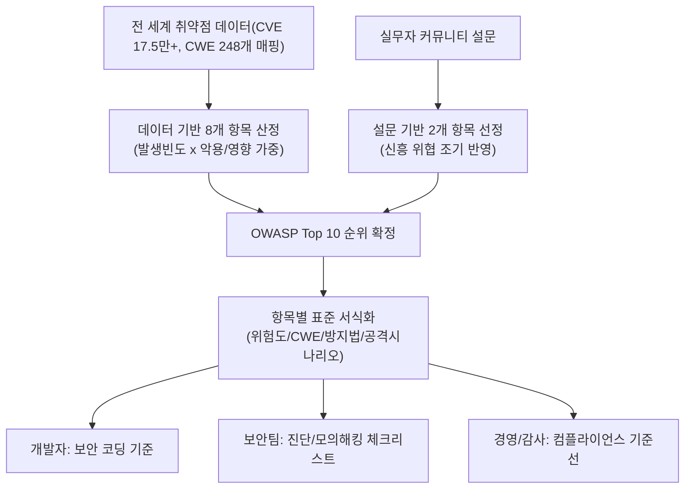
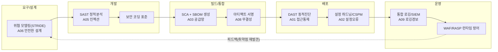

# OWASP Top 10 (웹 애플리케이션 보안 위험)

## 1. 개요

> **OWASP Top 10**은 비영리 오픈 커뮤니티 OWASP(Open Worldwide Application Security Project)가 전 세계 애플리케이션의 실제 취약점 데이터와 전문가 설문을 근거로 선정·발표하는, 웹 애플리케이션에서 가장 빈번하고 위험한 상위 10대 보안 위험(Risk) 목록이자 사실상의 산업 표준(de facto standard) 인식 자료이다.

웹 애플리케이션은 인터넷에 상시 노출된 최전선 공격 표면(attack surface)이다. 방화벽 뒤에 숨길 수 있는 내부 시스템과 달리, 웹은 HTTP(S)라는 개방된 프로토콜로 불특정 다수에게 서비스를 제공해야 하므로 인증·인가·입력검증 중 어느 한 곳만 무너져도 데이터 유출·권한 탈취·서비스 마비로 직결된다. 문제는 이러한 결함의 대부분이 신기술의 부재가 아니라 **이미 잘 알려진 기본 통제의 반복적 누락**에서 비롯된다는 점이다. OWASP Top 10은 바로 이 "가장 흔하게 되풀이되는 실패"를 데이터로 추려 개발자·보안담당자·경영진이 우선순위를 두어야 할 지점을 제시한다.

등장 배경에는 세 가지 필요성이 있다. 첫째, **공통 언어(common vocabulary)의 필요성**이다. 개발자와 보안팀, 감사자, 발주기관이 서로 다른 용어로 취약점을 논하면 커뮤니케이션 비용이 폭증한다. Top 10은 "A01 접근통제 취약점"처럼 표준 분류를 제공해 이해관계자 간 소통을 일원화한다. 둘째, **우선순위화(prioritization)의 필요성**이다. 보안 예산과 인력은 유한하므로, 발생 빈도·악용 가능성·영향도가 높은 위험부터 방어해야 투자 대비 효과가 크다. 셋째, **컴플라이언스 연계**이다. PCI-DSS, 전자금융감독규정, 정보보호 관리체계(ISMS-P) 등 다수 규제·인증이 OWASP Top 10 대응을 사실상 요구하거나 참조하므로, 이는 단순 기술 가이드를 넘어 규제 대응의 기준선이 되었다.

OWASP Top 10은 약 4년 주기(2013→2017→2021→2025)로 개정되며, 최신판인 **2025 개정판은 2025년 11월 Global AppSec 컨퍼런스에서 공개되어 2026년 1월 최종 확정**되었다. 2025판은 17.5만 건 이상의 CVE와 248개 CWE(Common Weakness Enumeration) 매핑, 그리고 실무자 설문을 결합해 선정되었다는 점에서 데이터 기반성이 한층 강화되었다.

OWASP Top 10의 핵심 특징을 정리하면 다음과 같다.

- **위험(Risk) 중심 분류**: 개별 취약점이 아니라 다수 CWE를 묶은 상위 위험 범주를 다뤄, 방어 우선순위 수립에 적합하다.
- **데이터+설문의 이원 선정**: 실측 취약점 통계(후행성)와 전문가 설문(선행성)을 결합해 과거 데이터와 신흥 위협을 함께 반영한다.
- **개발자 지향의 실용성**: 항목마다 방지 방법과 공격 시나리오를 표준 서식으로 제공해 즉시 대응에 활용된다.
- **사실상 표준·컴플라이언스 기준선**: PCI-DSS, 금융 감독규정, ISMS-P 등 다수 규제·인증이 참조하는 준거로 자리 잡았다.
- **주기적 진화**: 약 4년 주기로 개정되어 위협 환경 변화를 지속 추적한다.

## 2. 선정 방법론과 문서 구조

OWASP Top 10은 감(感)이 아니라 방법론에 근거한다. 항목 순위는 크게 두 축으로 결정된다. **8개 항목은 실측 데이터(CVE/CWE 통계)로 산정**되고, **2개 항목은 커뮤니티 설문(Community Survey)으로 선정**된다. 데이터 기반 항목은 "발생 빈도(Incidence Rate)"와 "악용·영향(Exploitability·Impact)"을 가중 계산하며, 설문 기반 항목은 아직 CVE로는 충분히 잡히지 않지만 실무자들이 위험성을 체감하는 최신 위협을 조기 반영하기 위한 장치다. 이 이원적 구조 덕분에 Top 10은 과거 데이터의 후행성과 미래 위협의 선행성을 동시에 담을 수 있다.

각 위험 항목은 위험도(요인·영향), 대표 CWE, 설명, 방지 방법(How to Prevent), 공격 시나리오 예시(Example Attack Scenarios), 참고자료의 일관된 서식으로 기술된다. 이 표준 서식은 개발자가 "무엇이 문제이고, 왜 위험하며, 어떻게 막는가"를 즉시 파악하도록 돕는다. 아래 다이어그램은 선정 파이프라인과 산출물의 전체 구조를 보여준다.

여기서 반드시 구분할 점은, Top 10이 나열하는 것은 개별 "취약점(Vulnerability)"이 아니라 다수 CWE를 묶은 상위 "위험 범주(Risk Category)"라는 사실이다. 예컨대 A01 접근통제 취약점 하나에도 수십 개의 세부 CWE가 매핑된다. 따라서 Top 10은 완전한 체크리스트가 아니라 **인식 제고(awareness) 문서**이며, 실제 검증에는 후술할 OWASP ASVS 같은 상세 표준을 병행해야 한다는 점을 기술사 관점에서 유념해야 한다.

## 3. OWASP Top 10:2025 항목별 상세

2025 개정판의 10대 위험은 아래와 같으며, 각 항목의 원리와 대응 방향을 순서대로 설명한다.

| 순위 | 위험 범주 | 핵심 원인 | 대표 방어 |
|------|-----------|-----------|-----------|
| A01 | Broken Access Control (접근통제 취약점, SSRF 흡수) | 인가 검사 누락·우회 | 서버측 인가 강제, Deny by default |
| A02 | Security Misconfiguration (보안 설정 오류) | 기본값·불필요 기능·오류노출 | 하드닝, 최소기능 |
| A03 | Software Supply Chain Failures (SW 공급망 실패, 신규) | 취약·변조된 의존성 | SBOM, SCA, 서명검증 |
| A04 | Cryptographic Failures (암호 실패) | 평문·약한 알고리즘 | 강암호·전송/저장 암호화 |
| A05 | Injection (인젝션) | 신뢰없는 입력의 명령 결합 | 파라미터 바인딩·검증 |
| A06 | Insecure Design (안전하지 않은 설계) | 설계단계 위협모델링 부재 | Threat Modeling, PbD |
| A07 | Authentication Failures (인증 실패) | 취약 인증·세션 관리 | MFA, 세션 보호 |
| A08 | Software or Data Integrity Failures (무결성 실패) | 미검증 업데이트·역직렬화 | 서명·무결성 검증 |
| A09 | Logging & Alerting Failures (로깅·경보 실패) | 탐지·대응 지연 | 통합로깅, 실시간 경보 |
| A10 | Mishandling of Exceptional Conditions (예외 상황 오처리, 신규) | 예외/오류 로직 결함 | 안전한 실패(fail-safe) |

**A01 접근통제 취약점(Broken Access Control)** 은 2021판에 이어 2025판에서도 부동의 1위다. 인증(Authentication)은 통과했으나 인가(Authorization)가 허술해, 일반 사용자가 URL·식별자(ID)만 바꿔 타인의 데이터나 관리자 기능에 접근하는 결함이 대표적이다. 예를 들어 `/account?id=1001`을 `id=1002`로 바꾸면 남의 계좌가 조회되는 IDOR(Insecure Direct Object Reference)가 전형이다. 2025판에서는 과거 별도 항목이던 SSRF(Server-Side Request Forgery)가 이 범주로 통합되었는데, 이는 서버가 검증 없이 사용자 지정 URL로 내부 자원에 접근하는 것 역시 본질적으로 "권한 경계를 넘는 접근"이라는 판단이다. 방어의 핵심은 클라이언트 통제를 신뢰하지 않고 **모든 요청을 서버 측에서 세션·역할 기반으로 인가하며, 기본은 거부(deny by default)** 로 두는 것이다.

**A02 보안 설정 오류(Security Misconfiguration)** 는 2021판 5위에서 2위로 크게 상승했다. 클라우드·컨테이너·IaC 확산으로 설정 요소가 폭증하면서, 디폴트 계정 방치, 불필요한 포트·서비스 개방, 상세 오류 메시지 노출, 클라우드 스토리지 버킷 공개 설정 같은 실수가 급증한 결과다. 실제로 대형 클라우드 데이터 유출 사고의 상당수가 취약점이 아니라 "잘못 열어둔 S3 버킷" 같은 설정 오류에서 비롯된다. 대응은 안전한 기준(하드닝 베이스라인)을 표준화하고, IaC 스캐닝·CSPM(Cloud Security Posture Management)으로 지속 점검하는 것이다.

**A03 소프트웨어 공급망 실패(Software Supply Chain Failures)** 는 2025판의 신규 최상위 항목으로, 2021판의 "취약하고 오래된 구성요소"를 공급망 전반으로 확장한 것이다. 오늘날 애플리케이션 코드의 70~90%가 오픈소스·서드파티 의존성이며, 하나의 인기 라이브러리가 오염되면 그것을 쓰는 수만 개 시스템이 동시에 감염된다. SolarWinds 사건, npm·PyPI의 악성 패키지 주입, Log4Shell(Log4j) 같은 사례가 공급망 위협의 파급력을 실증했다. 대응은 SBOM(Software Bill of Materials) 작성, SCA(Software Composition Analysis)로 알려진 취약점(CVE) 매핑, 서명·해시 기반 아티팩트 무결성 검증, SLSA 같은 공급망 무결성 프레임워크 적용이다.

**A04 암호 실패(Cryptographic Failures)** 는 민감정보를 평문으로 저장·전송하거나, 취약 알고리즘(MD5, SHA-1, DES)·짧은 키·하드코딩된 키를 쓰는 결함이다. 방어는 전송구간 TLS 1.2/1.3, 저장 데이터 AES-256, 비밀번호는 bcrypt·Argon2 같은 적응형 해시, 키는 KMS/HSM으로 분리 관리하는 것이다. **A05 인젝션(Injection)** 은 SQL·OS 명령·LDAP·XSS를 포괄하며, 신뢰할 수 없는 입력이 인터프리터의 명령·질의에 그대로 결합될 때 발생한다. 파라미터 바인딩(Prepared Statement), ORM, 입력 화이트리스트 검증, 출력 인코딩이 정석 대응이다.

**A06 안전하지 않은 설계(Insecure Design)** 는 구현 버그가 아니라 설계 자체의 결함으로, "코드는 정확히 설계대로 동작하지만 그 설계가 위험한" 경우다. 예컨대 비밀번호 재설정 로직에 계정 열거(enumeration)를 허용하는 흐름을 넣었다면 코딩을 아무리 완벽히 해도 위험은 남는다. 이는 **위협 모델링(Threat Modeling)과 Privacy/Security by Design을 설계 단계부터 적용**해야만 근본적으로 제거된다. **A07 인증 실패(Authentication Failures)** 는 취약한 비밀번호 정책, 크리덴셜 스터핑 방치, 세션 토큰 관리 부실을 포함하며, MFA·계정 잠금·안전한 세션 만료로 대응한다.

**A08 무결성 실패(Software or Data Integrity Failures)** 는 서명·검증 없이 업데이트·플러그인을 신뢰하거나, 안전하지 않은 역직렬화(deserialization)로 임의 객체가 실행되는 문제다. **A09 로깅·경보 실패(Logging & Alerting Failures)** 는 공격 자체가 아니라 "탐지·대응의 부재"로, 침해가 발생해도 로그가 없거나 경보가 울리지 않아 평균 탐지 시간(MTTD)이 수개월로 늘어나는 원인이 된다. 2025판은 명칭을 "경보(Alerting)"까지 포함하도록 바꿔 실시간 대응의 중요성을 강조했다. 마지막으로 신규 항목인 **A10 예외 상황 오처리(Mishandling of Exceptional Conditions)** 는 오류·예외 상황의 로직이 잘못 설계되어 발생하는 위험으로, 예외 발생 시 인가 검사를 건너뛰거나(fail-open), 민감정보를 오류 메시지로 노출하거나, 상태 불일치로 이어지는 경우를 포괄한다. 이는 견고한 오류 처리와 **안전한 실패(fail-safe/fail-closed) 원칙**으로 방어한다.

## 4. 2021 → 2025 변화 비교와 그 함의

2021판과 2025판을 비교하면 웹 보안의 무게중심 이동이 뚜렷하게 읽힌다. 단순히 순위가 바뀐 것이 아니라, "무엇이 위험한가"에 대한 산업의 인식이 애플리케이션 코드 내부에서 **공급망·설정·운영 전반으로 확장**되었음을 보여준다.

| 구분 | 2021판 | 2025판 | 변화의 의미 |
|------|--------|--------|-------------|
| 1위 | A01 접근통제 | A01 접근통제 | 여전히 최대 위협, SSRF 흡수로 범위 확대 |
| 신규/상승 | A05 보안설정오류 | A02로 상승 | 클라우드·IaC 확산의 설정 리스크 반영 |
| 신규 | (없음) | A03 공급망 실패 | 오픈소스 의존·공급망 공격 급증 |
| 신규 | (없음) | A10 예외상황 오처리 | 운영 중 실제 관측된 신흥 공격 반영 |
| 통합 | A10 SSRF (독립) | A01로 통합 | 권한 경계 위반의 본질 재분류 |
| 명칭변경 | A09 로깅·모니터링 실패 | A09 로깅·경보 실패 | 실시간 탐지·대응 강조 |

이 변화가 주는 실무적 함의는 분명하다. 첫째, **보안의 책임 경계가 개발자만의 것이 아니게 되었다.** 공급망(A03)과 설정(A02)이 상위로 오면서, 코드 리뷰만이 아니라 CI/CD 파이프라인, 인프라 구성, 의존성 관리까지 통합적으로 방어해야 한다. 이는 DevSecOps로의 전환을 가속하는 근거가 된다. 둘째, **설계·운영 단계의 결함이 부각되었다.** A06 안전하지 않은 설계와 A10 예외 오처리는 모두 "구현 이전"과 "구현 이후"의 문제로, 취약점 스캐너로는 잡기 어렵고 위협 모델링·아키텍처 리뷰·견고성 설계로만 예방된다. 셋째, SSRF의 통합 사례처럼 **위험의 재분류가 방어 전략을 단순화**한다 — SSRF를 별도로 다루기보다 "권한 경계 통제"라는 하나의 원칙으로 묶어 대응하면 커버리지가 넓어진다.

구체적 사례로, 2021년 Log4Shell(Log4j, CVE-2021-44228) 취약점은 단 하나의 로깅 라이브러리 결함이 전 세계 수억 대 시스템을 원격코드실행(RCE) 위험에 빠뜨린 대표적 공급망 사고로, A03이 신규 상위 항목이 된 직접적 배경이 되었다. 또한 다수의 클라우드 유출 사고가 코드 취약점이 아닌 공개 설정된 스토리지 버킷(A02)에서 비롯되었다는 통계는 설정 오류의 상승을 뒷받침한다.

한편 순위 산정이 "발생 빈도"와 "영향도"의 가중이라는 점도 해석에 유의해야 한다. 어떤 위험은 발생 빈도는 낮지만 한 번 터지면 치명적이고(예: 무결성 실패로 인한 공급망 오염), 어떤 위험은 빈도는 높지만 개별 영향은 제한적일 수 있다. 따라서 순위가 낮다고 해서 방어 우선순위가 반드시 낮은 것은 아니며, 조직의 업(業) 특성·데이터 민감도·규제 환경에 맞춰 Top 10을 재가중(re-weighting)하는 것이 실무적으로 타당하다. 예컨대 금융·의료처럼 데이터 민감도가 높은 도메인에서는 A04 암호 실패와 A01 접근통제의 상대적 비중을 더 크게 두는 식이다.

## 5. 실무 대응 절차 — SSDLC/DevSecOps 통합

OWASP Top 10은 사후 점검 체크리스트로 쓰면 효과가 반감된다. 진정한 가치는 **소프트웨어 개발 생애주기(SDLC) 전 단계에 보안을 내재화(Shift-Left)** 하는 기준선으로 활용할 때 발휘된다. 즉 요구·설계 단계에서 위협 모델링으로 A06을, 개발 단계에서 보안 코딩과 SAST로 A05를, 빌드 단계에서 SCA/SBOM으로 A03을, 배포·운영 단계에서 DAST·설정 점검·통합 로깅으로 A02·A09를 각각 방어하는 식으로 항목을 파이프라인 각 지점에 매핑한다. 아래는 이 통합을 아키텍처 관점에서 나타낸 것이다.

이 파이프라인의 핵심은 **각 단계의 게이트(Gate)에서 자동화된 보안 검증을 통과해야만 다음 단계로 진행**하도록 강제하는 것이다. 예컨대 SCA 스캔에서 심각도 High 이상의 알려진 취약점(CVE)이 발견되면 빌드를 실패시켜 취약한 의존성이 프로덕션에 도달하는 것을 원천 차단한다. 운영 단계의 WAF·RASP는 미처 제거하지 못한 잔여 위험에 대한 보상 통제(compensating control)로 기능하며, 여기서 탐지된 새로운 공격 패턴은 다시 위협 모델링으로 환류(feedback)되어 방어를 지속 개선한다. 실제 금융권 사례에서는 이러한 게이트 자동화 도입 후 배포 전 취약점 검출률이 크게 향상되고, 운영 단계에서 발견되던 결함이 개발 초기로 앞당겨져 수정 비용이 대폭 절감되는 효과가 보고된다.

여기서 WAF(Web Application Firewall)와 RASP(Runtime Application Self-Protection)의 역할 구분을 짚어둘 필요가 있다. WAF는 애플리케이션 앞단(네트워크 경계)에서 알려진 공격 패턴(시그니처)을 차단하는 외부 방어선으로, 배포 없이 신속히 규칙을 적용해 신규 취약점에 대한 가상 패치(virtual patching)를 제공하지만 애플리케이션 내부 문맥을 모른다는 한계가 있다. 반면 RASP는 애플리케이션 런타임 내부에 삽입되어 실제 실행 흐름과 데이터 문맥을 보고 판단하므로 오탐이 적고 정교하지만, 성능 오버헤드와 언어·프레임워크 종속성이라는 대가가 따른다. 두 통제는 배타적이지 않으며, **경계 방어(WAF)와 내부 방어(RASP)를 계층적으로 결합하는 심층 방어(Defense in Depth)** 가 권장된다. 다만 이들 런타임 통제는 어디까지나 SDLC 내재화가 놓친 잔여 위험에 대한 보완책이지, 근본적 결함 제거를 대체하지 못한다는 점을 명확히 인식해야 한다.

## 6. 심화 — OWASP 생태계와 최신 동향

OWASP Top 10 "웹" 목록은 방대한 OWASP 프로젝트 생태계의 일부일 뿐이며, 기술사 답안에서는 이를 확장 표준과 연계해 논하는 것이 고득점 포인트다. 대표적으로 **OWASP API Security Top 10**은 MSA·모바일 백엔드 확산으로 API가 핵심 공격 표면이 되면서 별도로 관리되는 목록으로, 객체 수준 인가(BOLA), 함수 수준 인가, 무제한 리소스 소비 같은 API 특유의 위험을 다룬다. 또한 **OWASP Top 10 for LLM Applications**는 생성형 AI 시대의 신흥 위협으로, 프롬프트 인젝션, 안전하지 않은 출력 처리, 학습 데이터 오염, 모델 서비스 거부, 민감정보 노출 등을 정의한다. 이는 앞으로 웹·API·AI 애플리케이션이 융합되면서 통합 대응이 필요함을 시사한다.

검증·성숙도 측면의 확장 표준도 중요하다. **OWASP ASVS(Application Security Verification Standard)** 는 Top 10의 인식 수준을 넘어 실제 검증 가능한 상세 요구사항(레벨 1~3)을 제공하므로, 보안 요구사항 정의와 진단의 근거가 된다. **OWASP SAMM(Software Assurance Maturity Model)** 은 조직의 보안 역량 성숙도를 측정·개선하는 프레임워크로, Top 10 대응이 일회성 이벤트가 아니라 조직 역량으로 정착되도록 돕는다. 개발자 실습용 취약 애플리케이션인 **WebGoat·Juice Shop**과 위험 통제를 능동적으로 제시하는 **OWASP Proactive Controls**도 함께 활용된다.

최신 동향으로는 세 가지가 주목된다. 첫째, 2025 개정에서 확인되듯 **위험의 중심이 코드에서 공급망·운영으로 이동**하며 SBOM·SLSA·서명 검증이 필수화되고 있다. 둘째, **AI가 양날의 검**으로 작용한다 — 공격 측은 LLM으로 취약점 탐색과 익스플로잇 생성을 자동화하는 반면, 방어 측은 AI 기반 코드 리뷰·이상탐지로 대응한다. 셋째, 규제·인증(전자금융, 개인정보보호법, ISMS-P, 공급망 보안 의무화 흐름)이 OWASP 기준을 사실상 준거로 채택하면서, Top 10 대응은 기술 과제를 넘어 **거버넌스·컴플라이언스 과제**로 격상되고 있다.

## 7. 고려사항 및 시사점 (기술사 관점)

- **인식 문서와 검증 표준의 병행 전략**: OWASP Top 10은 "가장 흔한 위험"을 알려주는 인식 제고 자료이지 완전한 보안 요구사항이 아니다. 따라서 실제 시스템 구축·감리 시에는 Top 10으로 우선순위를 잡되, ASVS·CWE Top 25 등 상세 검증 표준을 결합해 커버리지 공백을 메워야 한다. Top 10만으로 "보안 완료"를 선언하는 것은 위험한 오해다.

- **Shift-Left와 비용 트레이드오프**: 결함은 설계 단계에서 잡을수록 수정 비용이 기하급수적으로 낮아진다(설계 대비 운영 단계 수정비용은 수십 배). 위협 모델링·SAST·SCA를 파이프라인에 앞당겨 내재화하는 것이 정석이나, 초기에는 개발 속도 저하와 오탐(false positive) 대응 부담이라는 트레이드오프가 있다. 게이트 임계값을 위험도 기반으로 조정하고 자동화 정밀도를 높여 이 마찰을 최소화해야 한다.

- **공급망 보안의 전사적 확산**: A03의 부상은 보안 책임이 개발팀을 넘어 조달·법무(라이선스)·운영으로 확장됨을 의미한다. SBOM을 조직 자산으로 관리하고, 벤더 리스크 평가와 아티팩트 무결성 검증을 표준 프로세스로 제도화하는 거버넌스가 요구된다. 이는 Zero Trust 원칙("검증 없이 신뢰하지 않는다")을 공급망에 확장 적용하는 것으로 볼 수 있다.

- **방어의 지속성과 문화 정착**: 4년 주기 개정이 보여주듯 위협은 계속 진화하므로, 특정 시점의 Top 10 대응은 스냅샷일 뿐이다. SAMM으로 조직 성숙도를 지속 측정하고, DevSecOps 문화와 보안 챔피언(Security Champion) 제도로 개발자가 보안을 일상 역량으로 체화하도록 해야 한다. 도구 도입보다 사람과 프로세스의 정착이 궁극적 성패를 가른다.

- **AI 융합 시대의 확장 대응**: 향후 웹·API·LLM 애플리케이션이 융합되면서 OWASP Top 10(Web)·API Top 10·LLM Top 10을 통합적으로 고려한 위협 모델이 필요하다. 특히 생성형 AI를 서비스에 결합할 때는 프롬프트 인젝션·데이터 유출 위험을 기존 인젝션·접근통제 관점과 연결해 설계해야 한다.

## 8. 참고자료

- OWASP Top 10:2025, OWASP Foundation — https://owasp.org/Top10/
- OWASP Top Ten Project (프로젝트 홈) — https://owasp.github.io/www-project-top-ten/
- OWASP Top 10 2025: Key Changes, Orca Security — https://orca.security/resources/blog/owasp-top-10-2025-key-changes/
- OWASP Top 10 2025: What's New, Semgrep — https://semgrep.dev/blog/2026/owasp-top-10-2025-whats-new/

---

> **한 줄 요약**: OWASP Top 10은 실제 취약점 데이터·설문으로 선정한 웹 애플리케이션 10대 보안 위험 인식 표준으로, 2025 개정판은 접근통제(A01)를 정점으로 공급망 실패(A03)·예외 상황 오처리(A10)를 신규 반영하며 위험의 무게중심이 코드에서 공급망·설정·운영으로 이동했음을 보여준다 — SDLC 전 단계에 Shift-Left로 내재화하고 ASVS·SAMM 등 확장 표준과 병행할 때 실효를 갖는다.
