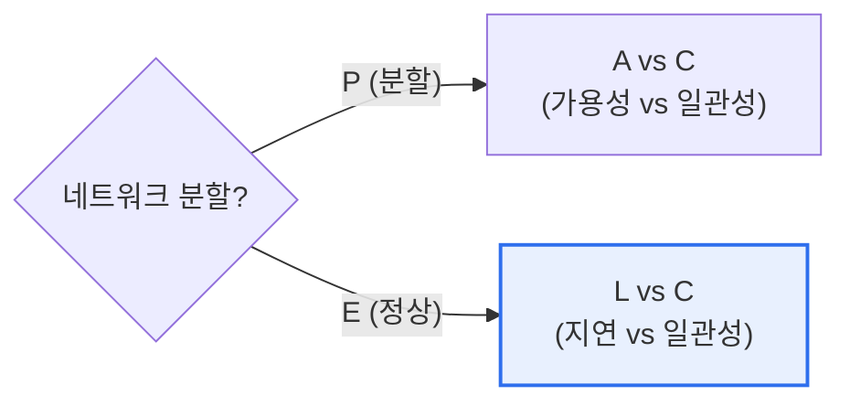

# CAP 이론의 한계와 PACELC 이론

## 1. 개요

### 가. CAP 이론과 그 한계
> **CAP 이론**은 분산 시스템이 **일관성(Consistency)·가용성(Availability)·분할내성(Partition tolerance)** 세 가지를 동시에 모두 만족할 수 없고, 네트워크 분할 시 최대 둘만 보장할 수 있다는 이론이다.

CAP 이론의 핵심 통찰은 '**네트워크가 끊기면(분할) 일관성과 가용성 중 하나를 포기해야 한다**'는 것이다. 분산 시스템에서 노드 간 통신이 끊기는 분할(P)은 언제든 일어날 수 있어 사실상 필수로 감내해야 한다. 그러면 남는 선택은 C와 A다. 분할이 생겼을 때 최신 데이터 일관성(C)을 지키려면 확신 없는 노드의 응답을 막아야 하니 가용성을 잃고, 무조건 응답(A)하려면 오래된 데이터를 줄 수 있어 일관성을 잃는다. 그런데 CAP에는 **결정적 한계**가 있다. 바로 '**분할이 일어났을 때'만 다룬다**는 점이다. 실제로 분할은 드물게 일어나고, 시스템은 대부분의 시간을 '정상 상태'로 보낸다. 정상일 때 시스템은 무엇을 선택하는가? CAP은 여기에 답하지 못한다. 이 공백을 메운 것이 PACELC다.

### 나. PACELC의 등장
CAP이 분할 상황만 설명하는 한계를 보완하여, 다니엘 아바디(Daniel Abadi)가 **정상 상태의 트레이드오프까지 포함**한 PACELC를 제안했다.

## 2. PACELC 이론

> **PACELC**: 분할(**P**)이 발생하면 가용성(**A**)과 일관성(**C**) 사이에서, 그렇지 않으면(**E**lse) 지연시간(**L**atency)과 일관성(**C**) 사이에서 선택해야 한다.

PACELC의 핵심 기여는 **정상 상태(Else)의 트레이드오프**를 드러낸 것이다. 분할이 없어도, 데이터를 여러 복제본에 강하게 일관되게 유지하려면 노드 간 동기화로 응답이 느려진다(Latency↑). 반대로 지연을 줄이려면 복제 동기화를 느슨히 해 일관성을 양보한다. 즉 시스템은 평상시에도 지연과 일관성 사이에서 늘 선택하고 있다.

| 유형 | 분할 시(PA/PC) | 정상 시(EL/EC) | 예시 |
|---|---|---|---|
| **PA/EL** | 가용성 우선 | 저지연 우선 | Cassandra, DynamoDB |
| **PC/EC** | 일관성 우선 | 강일관성 우선 | 전통 RDB, HBase |
| **PA/EC** | 가용성 우선 | 일관성 우선 | MongoDB(설정에 따라) |

## 3. CAP vs PACELC 비교

| 구분 | CAP | PACELC |
|---|---|---|
| **다루는 상황** | 분할 시에만 | 분할 시 + 정상 시 |
| **트레이드오프** | C vs A | (P)A vs C + (E)L vs C |
| **실용성** | 제한적(정상 상태 미설명) | 전체 상태 설명 |

## 4. 고려사항 및 시사점

1. **평상시 지연-일관성 선택이 실질적으로 더 중요**하다. 분할은 드물지만 시스템은 대부분 정상 상태로 동작하므로, PACELC의 Else(L vs C) 선택이 실제 사용자 경험(응답 속도·데이터 정확성)을 좌우한다.
2. **서비스 요구에 맞춰 설계**한다. 금융·재고처럼 정확성이 중요하면 EC(강일관성), SNS·추천처럼 속도가 중요하면 EL(저지연)을 택하는 식으로, 데이터 성격별로 다른 정책을 적용한다.
3. **NoSQL 선택의 나침반**이다. Cassandra(PA/EL), MongoDB 등 분산 DB를 고를 때 PACELC 분류로 트레이드오프를 명확히 이해하고, 튜닝 가능한 일관성(Tunable Consistency) 옵션으로 상황별 조정한다. [[nosql]]

---

> **한 줄 요약**: CAP은 *분할 시 C·A 중 택일* 만 설명하는 한계가 있고, PACELC는 여기에 *정상 시 지연(L) vs 일관성(C)* 트레이드오프를 더해, 분할·정상 전 상태에서의 분산 시스템 설계 선택을 안내한다.
