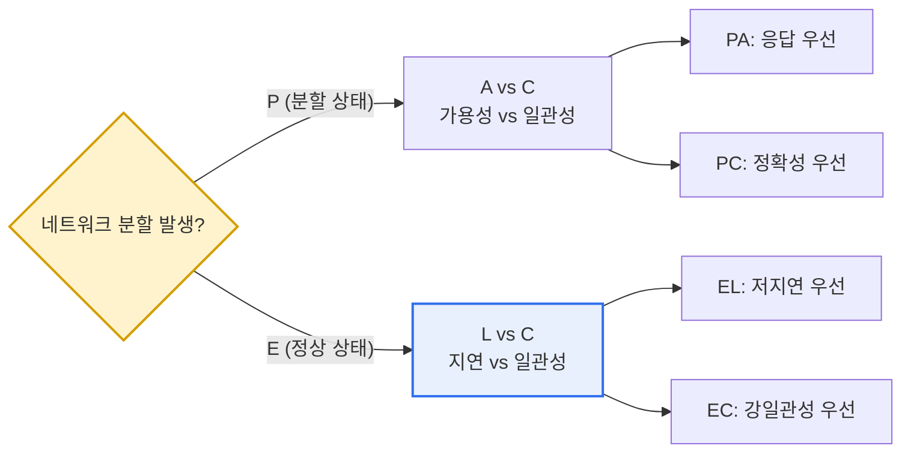
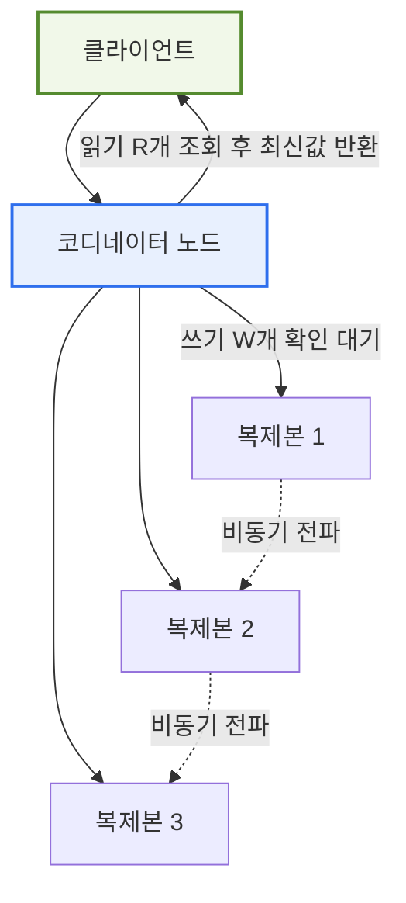

# CAP 이론의 한계와 PACELC 이론

## 1. 개요

### 가. CAP 이론과 그 한계
> **CAP 이론**은 분산 시스템이 **일관성(Consistency)·가용성(Availability)·분할내성(Partition tolerance)** 세 가지를 동시에 모두 만족할 수 없고, 네트워크 분할이 발생하면 최대 둘만 보장할 수 있다는 이론이다. 2000년 에릭 브루어(Eric Brewer)가 제시하고 2002년 길버트·린치(Gilbert·Lynch)가 형식적으로 증명했다.

CAP 이론의 핵심 통찰은 '**네트워크가 끊기면(분할) 일관성과 가용성 중 하나를 포기해야 한다**'는 것이다. 여기서 각 속성의 의미를 정확히 짚어야 오해를 피할 수 있다. 일관성(C)은 모든 노드가 같은 시점에 같은 최신 데이터를 보는 것(엄밀히는 선형화 가능성, linearizability)을 뜻하고, 가용성(A)은 정상 노드가 모든 요청에 반드시 응답하는 것을, 분할내성(P)은 노드 간 메시지가 임의로 지연·유실되어도 시스템이 계속 동작하는 것을 의미한다. 여기서 흔한 오해가 "셋 중 둘을 고른다"는 표현인데, 이는 반쪽짜리 이해다.

분산 시스템에서 노드 간 통신이 끊기는 분할(P)은 광역 네트워크·데이터센터 장애·스위치 오류 등으로 언제든 일어날 수 있어, 사실상 **선택이 아니라 감내해야 할 전제**다. 네트워크를 완벽히 신뢰할 수 있다면 모를까, 현실의 분산 시스템은 P를 포기할 수 없다. 그러면 실제 선택지는 CA가 아니라 **분할이 일어난 순간의 C와 A** 사이의 양자택일로 좁혀진다. 분할이 생겼을 때 최신 데이터 일관성(C)을 지키려면 다른 노드와 동기화를 확인할 수 없는 노드의 응답을 막아야 하므로 가용성을 잃고, 무조건 응답(A)하려면 동기화되지 못한 오래된 데이터를 반환할 수 있어 일관성을 잃는다.

그런데 CAP에는 **결정적 한계**가 있다. 바로 '**분할이 일어났을 때'만을 다룬다**는 점이다. 실제로 대규모 분산 시스템에서 네트워크 분할은 상대적으로 드문 사건이고, 시스템은 대부분의 시간을 분할이 없는 '정상 상태'로 보낸다. 그렇다면 정상일 때 시스템은 일관성과 응답 속도 사이에서 무엇을 선택하는가? CAP은 여기에 아무런 답을 주지 못한다. 즉 CAP은 시스템 수명의 99% 이상을 차지하는 정상 상태의 설계 트레이드오프를 설명하지 못하는 것이다. 이 공백을 메운 것이 PACELC다.

### 나. PACELC의 등장 배경
CAP이 분할이라는 예외 상황만 설명하는 한계를 보완하기 위해, 2010년 예일대의 다니엘 아바디(Daniel Abadi)가 **정상 상태의 트레이드오프까지 포함**한 PACELC를 제안했다. 그 문제의식은 명확했다. "분산 데이터베이스를 실제로 고를 때 개발자가 마주하는 진짜 질문은 '분할이 났을 때 무엇을 포기하느냐'보다 '평소에 얼마나 느려도 되고 얼마나 정확해야 하느냐'다"라는 것이다. 예컨대 여러 데이터센터에 복제본을 두는 시스템은 분할이 없어도 복제본 간 동기화 자체가 지연을 만든다. 이 평상시의 지연-일관성 균형은 CAP의 틀 밖에 있으므로, 아바디는 CAP을 부분집합으로 포함하는 더 넓은 틀을 세운 것이다.

## 2. PACELC 이론의 구조

> **PACELC**: 분할(**P**)이 발생하면 가용성(**A**)과 일관성(**C**) 사이에서, 그렇지 않으면(**E**lse) 지연시간(**L**atency)과 일관성(**C**) 사이에서 선택해야 한다는 이론이다. 약어 그대로 "if **P** then **A** or **C**, **E**lse **L** or **C**"로 읽는다.

```mermaid
flowchart LR
  N{"네트워크 분할 발생?"} -->|"P (분할 상태)"| AC["A vs C<br/>가용성 vs 일관성"]
  N -->|"E (정상 상태)"| LC["L vs C<br/>지연 vs 일관성"]
  AC --> PA["PA: 응답 우선"]
  AC --> PC["PC: 정확성 우선"]
  LC --> EL["EL: 저지연 우선"]
  LC --> EC["EC: 강일관성 우선"]
  style LC fill:#e8f0fe,stroke:#2f6fed,stroke-width:2px
  style N fill:#fff3cd,stroke:#d39e00,stroke-width:2px
```

이 정상/분할 분기의 저변에는 '복제(replication)' 구조가 있다. 정상 상태의 L-C 선택이든 분할 상태의 A-C 선택이든, 결국 여러 복제본에 쓰기를 어떻게 확인(acknowledge)하고 읽기를 어느 복제본에서 처리하느냐로 결정된다. 아래는 정족수(Quorum) 기반 복제에서 클라이언트·코디네이터·복제본이 상호작용하는 구조를 나타낸 것으로, 이 배치에서 R·W 값을 어떻게 잡느냐가 곧 EL/EC 스펙트럼상의 위치를 정한다.

```mermaid
flowchart TB
  CL["클라이언트"] --> CO["코디네이터 노드"]
  CO -->|"쓰기 W개 확인 대기"| R1["복제본 1"]
  CO --> R2["복제본 2"]
  CO --> R3["복제본 3"]
  R1 -.->|"비동기 전파"| R2
  R2 -.->|"비동기 전파"| R3
  CO -->|"읽기 R개 조회 후 최신값 반환"| CL
  style CO fill:#e8f0fe,stroke:#2f6fed,stroke-width:2px
  style CL fill:#f1f8e9,stroke:#558b2f,stroke-width:2px
```

이 구조에서 `W`(쓰기 확인 개수)와 `R`(읽기 조회 개수)를 크게 잡아 `R + W > N`을 만족시키면 항상 최신 값을 읽어 강일관성(EC)에 가까워지지만, 코디네이터가 더 많은 복제본의 응답을 기다려야 하므로 지연이 커진다. 반대로 `W=1, R=1`처럼 낮추면 가장 가까운 복제본 하나만 확인해 지연은 최소화되지만(EL) 아직 전파되지 않은 다른 복제본에서 오래된 값을 읽을 위험이 생긴다. 이처럼 하나의 아키텍처 위에서 파라미터만으로 PACELC 좌표가 이동한다는 점이 현대 분산 DB '튜닝 가능한 일관성'의 실체다.

### 가. 분할 상태(PA/PC) — CAP과 겹치는 영역
PACELC의 앞쪽 절반(P → A or C)은 사실상 CAP과 동일하다. 네트워크가 분할되어 노드 그룹이 서로 통신하지 못하는 상황에서, 시스템은 각 그룹이 독자적으로 요청을 받아 처리할지(PA), 아니면 다수 그룹의 확인을 받지 못한 쪽은 응답을 거부할지(PC)를 정해야 한다. 예를 들어 은행 계좌 잔액처럼 잘못된 값이 치명적인 데이터는 PC를 택해 분할된 소수 노드가 쓰기를 거부하도록 해야 하고, 장바구니나 '좋아요' 수처럼 잠깐 어긋나도 무방한 데이터는 PA를 택해 일단 응답하고 나중에 병합(conflict resolution)하는 편이 낫다.

이 선택이 실무에서 갖는 함의는 '가용성의 정의'를 명확히 하는 데 있다. PA를 택한 시스템이라도 무한정 정합성을 포기하는 것이 아니라, 분할이 해소된 뒤 벡터 클록·최종 쓰기 우선(LWW)·CRDT 같은 기법으로 데이터를 수렴시킨다. 즉 '결과적 일관성(Eventual Consistency)'을 전제로 한 가용성이다. 반대로 PC 시스템은 분할 중에는 일부 요청을 실패시키더라도, 성공한 응답만큼은 언제나 정확함을 보장한다.

### 나. 정상 상태(EL/EC) — PACELC의 고유 기여
PACELC의 진짜 핵심 기여는 뒤쪽 절반, 즉 **정상 상태(Else)의 트레이드오프**를 드러낸 데 있다. 분할이 없어도, 데이터를 여러 복제본에 강하게 일관되게 유지하려면 쓰기 요청이 모든(또는 정족수의) 복제본에 반영되었음을 확인하고 나서야 응답할 수 있어 응답이 느려진다(Latency↑). 지리적으로 떨어진 데이터센터라면 빛의 속도라는 물리적 한계 때문에 왕복 지연(RTT)이 수십~수백 ms에 이르러 이 비용이 결코 작지 않다.

반대로 지연을 줄이려면 복제 동기화를 느슨히 해, 가까운 복제본 하나만 읽고 응답하거나(비동기 복제) 쓰기를 다수 확인 없이 수락한다. 이 경우 응답은 빠르지만 방금 다른 노드에 쓴 값이 아직 전파되지 않아 오래된 값을 읽을 수 있어 일관성을 양보한다. 결국 시스템은 분할이라는 예외가 없는 평상시에도 **지연과 일관성 사이에서 끊임없이 선택하고 있는 것**이다. 정족수(Quorum) 방식에서 이 균형은 `R + W > N`(읽기·쓰기 정족수 합이 복제본 수보다 큼) 조건을 만족시키느냐로 조절되며, 이를 만족하면 강일관성(EC)에 가깝고, R·W를 낮추면 저지연(EL) 쪽으로 이동한다.

| 유형 | 분할 시(PA/PC) | 정상 시(EL/EC) | 대표 예시 | 대표 용도 |
|---|---|---|---|---|
| **PA/EL** | 가용성 우선 | 저지연 우선 | Cassandra, DynamoDB, Riak | 장바구니, 세션, 로그, 추천 |
| **PC/EC** | 일관성 우선 | 강일관성 우선 | 전통 RDBMS, VoltDB, HBase | 금융 원장, 재고, 예약 |
| **PA/EC** | 가용성 우선 | 일관성 우선 | MongoDB(설정에 따라) | 튜닝으로 균형 조정 |
| **PC/EL** | 일관성 우선 | 저지연 우선 | PNUTS(Yahoo), 일부 설정 | 지역 근접 읽기+원격 강일관 쓰기 |

여기서 주의할 점은, 위 분류가 절대적 라벨이 아니라 **기본 설정값(default)** 을 나타낸다는 것이다. 예컨대 Cassandra는 기본적으로 PA/EL이지만 읽기·쓰기 일관성 수준을 `QUORUM`으로 올리면 EC에 가깝게 튜닝된다. MongoDB 역시 `writeConcern`과 `readConcern` 설정에 따라 EC에서 EL로 스펙트럼을 이동한다. 즉 현대 분산 DB는 하나의 고정된 지점이 아니라 '튜닝 가능한 일관성(Tunable Consistency)' 축 위의 한 구간을 제공하며, PACELC는 그 축을 이해하는 좌표계 역할을 한다.

## 3. CAP과 PACELC의 비교

두 이론의 차이는 단순히 'PACELC가 더 많이 설명한다'가 아니라, **설계자가 실제로 마주하는 결정 지점을 어디까지 포착하느냐**에 있다. CAP은 분할이라는 드문 위기 상황에서의 극단적 선택을 강조하지만, 그 강조가 오히려 오해를 키웠다. 많은 개발자가 "우리 DB는 CA다"라고 말하지만, P를 포기할 수 없는 이상 CA는 분산 환경에서 성립하지 않는 조합이며, 그들이 실제로 말하려던 것은 대개 "평상시 강일관성을 유지한다(EC)"였다. PACELC는 바로 이 정상 상태의 축을 명시함으로써 그 혼란을 정리한다.

| 구분 | CAP | PACELC |
|---|---|---|
| **다루는 상황** | 분할 시에만 | 분할 시 + 정상 시 |
| **트레이드오프** | C vs A | (P)A vs C + (E)L vs C |
| **정상 상태 설명** | 불가 | 가능(L vs C) |
| **제안 시점/제안자** | 2000, E. Brewer | 2010, D. Abadi |
| **실용성** | 제한적(위기 상황 중심) | 전체 수명주기 설명 |

비교에서 얻는 실무적 함의는 두 가지다. 첫째, CAP만으로 DB를 선택하면 "분할 시 무엇을 포기하나"라는 드문 시나리오에 과도하게 매몰되어, 정작 매일의 사용자 경험을 좌우하는 지연-일관성 균형을 놓친다. 둘째, PACELC로 보면 같은 'AP 계열'이라도 정상 시 일관성 정책(EL이냐 EC냐)이 달라 실제 체감 성능과 정확성이 크게 갈린다는 점이 드러난다. 예컨대 Cassandra(PA/EL)와 이론적 PA/EC 시스템은 분할 시 행동은 같아도 평상시 읽기 최신성이 다르다.

### 가. 구체 시나리오로 본 차이
실제 상황을 하나 그려 보면 두 이론의 차이가 분명해진다. 서울과 버지니아 두 리전에 복제본을 둔 글로벌 커머스가 있다고 하자. 네트워크는 대부분 정상이지만 리전 간 왕복 지연이 약 180 ms에 이른다. CAP의 관점에서는 "두 리전이 끊기면(분할) 어느 쪽을 멈출 것인가"만 물을 수 있다. 그러나 실제 운영에서 매 순간 마주치는 문제는 "서울 사용자의 주문을 버지니아 복제본까지 확인하고 응답할 것인가(EC, +180 ms), 아니면 서울 복제본만 확인하고 즉시 응답할 것인가(EL)"다. 바로 이 평상시의 질문이 PACELC의 Else 축이며 CAP은 답하지 못한다.

이때 데이터 성격이 선택을 좌우한다. 재고 차감처럼 이중 판매가 치명적인 데이터는 EC를 택해 지연을 감수하고, 상품 조회수나 최근 본 상품처럼 잠깐 어긋나도 무방한 데이터는 EL을 택해 응답성을 살린다. 결국 하나의 서비스 안에서도 트랜잭션 종류별로 PACELC 좌표를 달리 잡는 것이 현실적 설계다.

## 4. 심화 — 설계 적용 사례와 최신 동향

### 가. 산업 적용 사례
**아마존 DynamoDB**는 PA/EL 계열의 대표로, 원래 장바구니처럼 "절대 담기 실패를 보이면 안 되는" 요구에서 출발해 가용성과 저지연을 최우선했다. 하지만 2018년 이후 강일관성 읽기 옵션(`ConsistentRead`)과 트랜잭션(TransactWriteItems)을 추가해, 하나의 시스템 안에서 데이터 성격별로 EL과 EC를 선택할 수 있게 진화했다. 이는 PACELC의 유형이 고정적이지 않고 요구에 맞춰 조합됨을 보여주는 사례다.

**구글 Spanner**는 흥미로운 위치에 있다. TrueTime이라는 정밀 시각 동기화(원자시계·GPS 기반)로 지리적으로 분산된 상태에서도 외부 일관성(external consistency)을 제공해 PC/EC를 지향한다. 다만 강일관성 쓰기에는 커밋 대기(commit-wait) 지연이 따르므로, "일관성을 위해 지연을 감수한다"는 EC의 본질을 그대로 보여준다. 즉 Spanner조차 물리 법칙과 PACELC의 트레이드오프에서 자유롭지 않으며, 다만 그 대가를 최소화하는 공학적 성취를 이룬 것으로 이해하는 편이 정확하다.

### 나. 최신 동향
최근 분산 데이터베이스 흐름은 **'상황·데이터별 일관성 선택'을 세분화**하는 방향이다. NewSQL(CockroachDB, YugabyteDB 등)은 분산 확장성과 강일관성 트랜잭션을 함께 제공하려 하며, 이는 PC/EC를 기본으로 하되 지역 근접 배치로 지연을 줄이는 절충으로 볼 수 있다. 또한 '인과적 일관성(Causal Consistency)'처럼 강일관성과 결과적 일관성 사이의 중간 모델이 주목받는데, 이는 PACELC의 L-C 축을 이분법이 아닌 연속적 스펙트럼으로 확장하려는 시도다. 다만 이런 최신 절충 모델의 성숙도와 채택 범위는 제품·버전에 따라 편차가 크므로, 도입 시에는 해당 제품의 공식 문서로 보장 수준을 확인하는 것이 안전하다.

### 다. 흔한 오해와 주의점
현장에서 자주 보이는 오해는 "우리 시스템은 CA다"라는 표현이다. 앞서 보았듯 P를 포기할 수 없는 분산 환경에서 CA 조합은 성립하지 않으며, 그렇게 말하는 시스템은 대개 단일 노드이거나(분산이 아님) 실제로는 '평상시 강일관성(EC)'을 뜻한다. 또 다른 오해는 PACELC 라벨을 제품의 불변 속성으로 여기는 것이다. 실제로는 대부분의 분산 DB가 설정으로 EL~EC 구간을 오가므로, "이 DB는 EL이다"보다 "이 DB는 기본 EL이며 정족수 설정으로 EC까지 조정된다"가 정확한 서술이다.

따라서 아키텍처 검토에서는 제품 라벨을 그대로 받아들이기보다, 실제 적용할 읽기·쓰기 일관성 설정값을 확인하고 그 조합이 각 데이터의 정확성 요구와 지연 SLA를 동시에 만족하는지 검증해야 한다.

## 5. 고려사항 및 시사점 (기술사 관점)

1. **평상시 지연-일관성 선택이 실질적으로 더 중요하다.** 분할은 드물지만 시스템은 수명의 대부분을 정상 상태로 동작하므로, PACELC의 Else(L vs C) 선택이 실제 사용자 경험(응답 속도·데이터 최신성)을 좌우한다. 설계 검토 시 "분할 시 대응"뿐 아니라 "평상시 일관성 정책"을 반드시 명시적으로 결정해야 한다.
2. **데이터 성격별로 다른 정책을 적용한다.** 금융 원장·재고·예약처럼 정확성이 결정적이면 EC(강일관성)를, SNS 피드·추천·조회수처럼 속도와 가용성이 중요하면 EL(저지연·결과적 일관성)을 택하는 식으로, 하나의 서비스 안에서도 데이터별 차등 정책(polyglot persistence)을 설계한다.
3. **NoSQL·NewSQL 선택의 나침반이다.** Cassandra(PA/EL), Spanner(PC/EC), DynamoDB(PA/EL+튜닝) 등 분산 DB를 고를 때 PACELC 분류로 트레이드오프를 명확히 이해하고, 튜닝 가능한 일관성 옵션(R·W 정족수, writeConcern 등)으로 상황별 조정한다. [[nosql]]
4. **일관성은 이분법이 아니라 스펙트럼임을 전제로 설계한다.** 강일관성과 결과적 일관성 사이에는 인과적·읽은 값 유지(read-your-writes)·단조 읽기 등 다양한 중간 모델이 있으므로, 요구에 꼭 맞는 최소한의 일관성 수준을 선택해 불필요한 지연 비용을 피한다.
5. **트레이드오프를 SLA·비용과 연결한다.** 강일관성은 지연·인프라 비용(정족수 복제, 광역 RTT)을 늘리므로, 응답시간 SLA·비즈니스 위험도·운영 비용을 함께 저울질해 과잉 일관성으로 인한 낭비나 과소 일관성으로 인한 사고를 모두 방지하는 균형점을 찾아야 한다.
6. **제품 라벨이 아니라 실제 설정으로 검증한다.** 동일 제품도 정족수·writeConcern 설정에 따라 EL~EC를 오가므로, 도입 검토 시 카탈로그의 분류를 그대로 신뢰하기보다 실제 적용할 일관성 파라미터와 그 조합의 보장 수준을 벤치마크로 확인하는 것이 안전하다.

## 참고자료
- Daniel Abadi, "Consistency Tradeoffs in Modern Distributed Database System Design", IEEE Computer, 2012: https://www.cs.umd.edu/~abadi/papers/abadi-pacelc.pdf
- Gilbert & Lynch, "Brewer's Conjecture and the Feasibility of Consistent, Available, Partition-Tolerant Web Services", 2002: https://groups.csail.mit.edu/tds/papers/Gilbert/Brewer2.pdf
- Wikipedia, PACELC theorem: https://en.wikipedia.org/wiki/PACELC_theorem

---

> **한 줄 요약**: CAP은 *분할 시 C·A 중 택일* 만 설명하는 한계가 있고, PACELC는 여기에 *정상 시 지연(L) vs 일관성(C)* 트레이드오프를 더해, 분할·정상 전 상태에서 데이터 성격에 맞는 분산 시스템 설계 선택을 안내하는 실용적 좌표계다.
