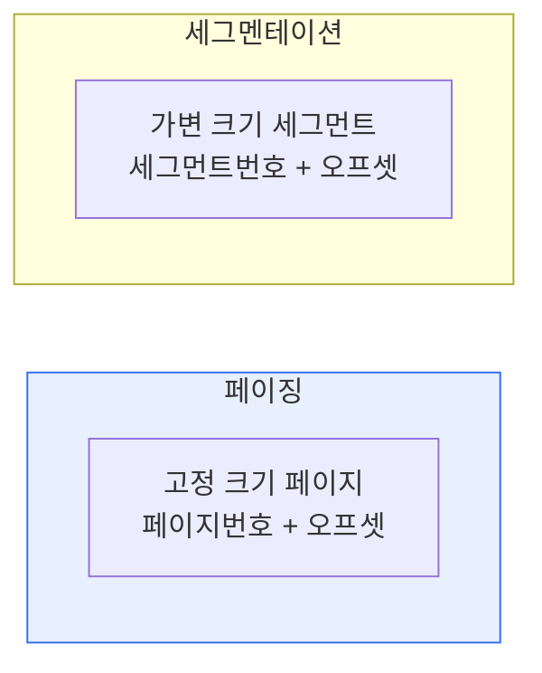

# 운영체제 메모리 관리: 페이징과 세그멘테이션

## 1. 개요

### 가. 정의
> **페이징(Paging)** 은 물리 메모리를 동일한 크기의 **페이지 프레임**으로 나누어 관리하는 기법이고, **세그멘테이션(Segmentation)** 은 프로그램을 코드·데이터·스택 같은 **논리 단위의 가변 크기 세그먼트**로 나누어 관리하는 기법이다.

두 기법 모두 가상 메모리를 구현하는 방식으로, 프로그램을 물리 메모리에 흩어 배치하고 주소 변환을 통해 마치 연속된 것처럼 보이게 한다는 공통점이 있다. 그러나 '**무엇을 기준으로 나누는가**'가 근본적으로 다르다. 페이징은 의미와 무관하게 **정해진 크기(예: 4KB)로 기계적으로** 자르고, 세그멘테이션은 프로그램의 **논리적 의미 단위**(함수·배열·스택)로 자른다. 이 차이가 단편화·보호·공유의 특성을 갈라놓는다. 페이징은 크기가 균일해 관리가 쉽지만 논리적 경계를 무시하고, 세그멘테이션은 논리적으로 자연스럽지만 크기가 제각각이라 관리가 복잡하다.

### 나. 필요성
초기의 연속 할당 방식은 프로그램 전체를 연속된 메모리에 올려야 해 단편화가 심하고 대형 프로그램을 다룰 수 없었다. 페이징·세그멘테이션은 프로그램을 잘게 나눠 흩어 배치함으로써 메모리를 효율적으로 활용하고 가상 메모리를 실현한다.

## 2. 개념 비교

주소 변환 방식도 다르다. 페이징은 가상주소를 '페이지번호 + 오프셋'으로 보고 **페이지 테이블** 로 물리 프레임을 찾는다. 세그멘테이션은 '세그먼트번호 + 오프셋'으로 보고 **세그먼트 테이블**(시작주소 base + 한계 limit)로 변환하며, 오프셋이 limit를 넘으면 오류로 처리해 보호 기능을 제공한다.

| 구분 | 페이징 | 세그멘테이션 |
|---|---|---|
| **분할 기준** | 고정 크기(물리적) | 논리 단위(가변 크기) |
| **주소** | 페이지번호 + 오프셋 | 세그먼트번호 + 오프셋 |
| **매핑 테이블** | 페이지 테이블 | 세그먼트 테이블(base·limit) |
| **단편화** | **내부 단편화** | **외부 단편화** |
| **보호·공유** | 페이지 단위(제한적) | 논리 단위로 자연스러움 |
| **관점** | 물리적 관리 | 사용자·논리적 관점 |

## 3. 단편화 문제

두 기법의 결정적 약점이 서로 다른 종류의 단편화라는 점이 중요하다. **페이징은 내부 단편화(Internal Fragmentation)** 를 낳는다. 페이지 크기가 고정이라, 프로그램의 마지막 페이지는 대개 꽉 차지 않아 그 안에 쓰이지 않는 공간이 낭비된다(최대 페이지 크기 미만). **세그멘테이션은 외부 단편화(External Fragmentation)** 를 낳는다. 세그먼트 크기가 제각각이라, 할당·해제를 반복하면 메모리 곳곳에 작은 빈 공간 조각들이 흩어져 총합은 충분해도 연속 공간이 없어 큰 세그먼트를 못 올리는 상황이 생긴다.

## 4. 페이지드 세그멘테이션(결합)

두 기법의 단점을 보완하기 위해 현대 운영체제(x86 등)는 **세그먼트를 다시 페이지로 나누는** 페이지드 세그멘테이션을 사용한다. 프로그램을 논리 단위인 세그먼트로 나눠 보호·공유의 이점을 얻되, 각 세그먼트를 고정 크기 페이지로 다시 나눠 물리 메모리에 배치함으로써 외부 단편화를 제거한다. 세그멘테이션의 논리적 장점과 페이징의 물리적 장점을 결합한 것이다.

## 5. 고려사항 및 시사점

1. **외부 단편화의 심각성 때문에 페이징 기반이 주류**가 되었다. 순수 세그멘테이션은 논리적으로 우아하지만 외부 단편화 관리가 어려워, 현대 시스템은 페이징(또는 결합 방식)을 채택한다.
2. **TLB(Translation Lookaside Buffer)** 로 주소 변환을 가속한다. 페이지 테이블 접근이 매번 메모리 접근을 유발하는 오버헤드를, 최근 변환 결과를 캐시하는 TLB로 완화한다.
3. **대용량 메모리 대응**으로 다단계 페이지 테이블, 거대 페이지(Huge Page) 등이 활용되어 테이블 크기와 TLB 효율을 개선한다.

---

> **한 줄 요약**: 페이징은 *고정 크기로 나눠 내부 단편화* 를, 세그멘테이션은 *논리 단위 가변 크기로 나눠 외부 단편화* 를 가지며, 현대 OS는 세그먼트를 페이지로 다시 나누는 페이지드 세그멘테이션으로 두 기법의 장점을 결합하고 TLB로 변환을 가속한다.
