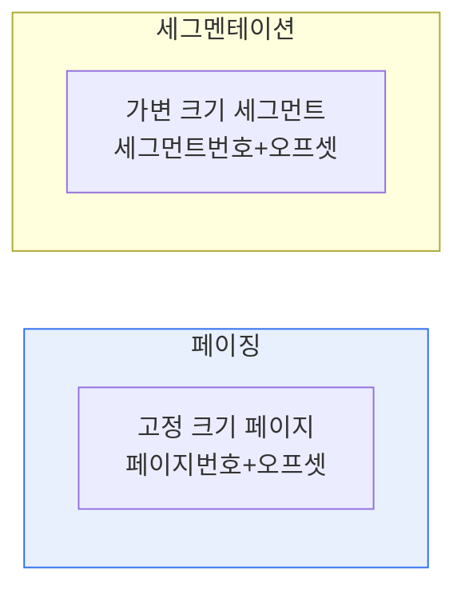

# 운영체제 메모리 관리: 페이징과 세그멘테이션

## 1. 개요

### 가. 정의
> **페이징(Paging)** 은 물리 메모리를 고정 크기 **페이지 프레임**으로 나눠 관리하는 기법이고, **세그멘테이션(Segmentation)** 은 프로그램을 논리 단위(코드·데이터·스택)인 **가변 크기 세그먼트**로 나눠 관리하는 기법이다.

두 기법 모두 프로그램을 물리 메모리에 흩어 배치하고 주소 변환으로 연속된 것처럼 보이게 하는 가상 메모리 기술이지만, '**나누는 기준**'이 다르다. 페이징은 크기(고정)로, 세그멘테이션은 의미(논리 단위)로 나눈다. 이 차이가 단편화·보호·공유 특성을 결정한다.

## 2. 개념 비교

| 구분 | 페이징 | 세그멘테이션 |
|---|---|---|
| **분할 기준** | 고정 크기(물리적) | 논리 단위(가변 크기) |
| **주소** | 페이지번호 + 오프셋 | 세그먼트번호 + 오프셋 |
| **매핑** | 페이지 테이블 | 세그먼트 테이블(base·limit) |
| **단편화** | **내부 단편화**(페이지 내 낭비) | **외부 단편화**(빈 공간 조각) |
| **보호·공유** | 페이지 단위(제한적) | 논리 단위로 자연스러움 |
| **관점** | 물리적 관리 | 사용자·논리적 관점 |

## 3. 단편화 문제
- **페이징 → 내부 단편화**: 마지막 페이지의 미사용 공간 낭비(페이지 크기 이하)
- **세그멘테이션 → 외부 단편화**: 세그먼트 할당·해제 반복으로 흩어진 빈 공간 발생

## 4. 결합: 페이지드 세그멘테이션
> 세그먼트를 다시 페이지로 나눠, **세그멘테이션의 논리적 이점**(보호·공유)과 **페이징의 물리적 이점**(외부 단편화 제거)을 결합한다. 현대 OS(x86 등)가 채택.

## 5. 시사점
- 순수 세그멘테이션의 외부 단편화 한계로 **페이징 기반**이 주류
- TLB(주소변환 캐시)로 페이지 테이블 접근 오버헤드 완화
- 다단계 페이지 테이블·거대 페이지(Huge Page)로 대용량 대응

---

> **한 줄 요약**: 페이징은 *고정 크기 페이지로 나눠 내부 단편화* 를, 세그멘테이션은 *논리 단위 가변 세그먼트로 나눠 외부 단편화* 를 가지며, 현대 OS는 둘을 결합한 페이지드 세그멘테이션을 사용한다.
