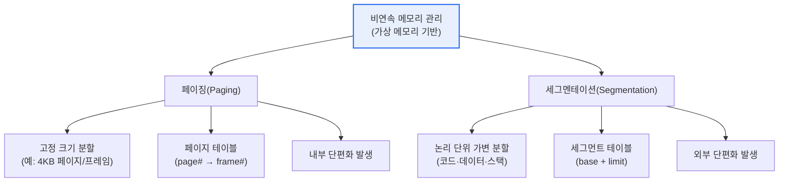
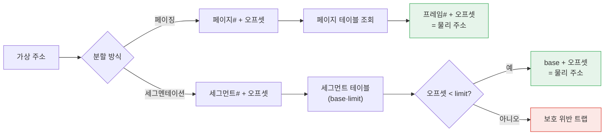

# 운영체제 메모리 관리: 페이징과 세그멘테이션

## 1. 개요

### 가. 정의
> **페이징(Paging)** 은 물리 메모리를 동일한 크기의 **페이지 프레임(frame)** 으로, 프로세스의 논리 주소 공간을 같은 크기의 **페이지(page)** 로 나누어, 페이지 단위로 물리 메모리에 흩어 배치하는 비연속 메모리 관리 기법이다. **세그멘테이션(Segmentation)** 은 프로그램을 코드·데이터·스택 같은 **논리 단위의 가변 크기 세그먼트**로 나누어 관리하는 기법이다.

두 기법 모두 **가상 메모리(Virtual Memory)** 를 구현하는 비연속 할당 방식으로, 프로그램을 물리 메모리 곳곳에 흩어 배치하고 주소 변환(address translation)을 통해 프로세스에게는 마치 연속된 것처럼 보이게 한다는 공통점이 있다. 프로세스가 사용하는 **논리(가상) 주소**를 MMU(Memory Management Unit)가 실행 시점에 **물리 주소**로 변환하며, 이 덕분에 프로그램은 물리 메모리의 실제 위치를 몰라도 되고, 실제 메모리보다 큰 주소 공간을 쓸 수 있다.

그러나 '**무엇을 기준으로 나누는가**'가 근본적으로 다르다. 페이징은 프로그램의 의미와 무관하게 **정해진 크기(예: 4KB)로 기계적으로** 자르고, 세그멘테이션은 프로그램의 **논리적 의미 단위**(함수·배열·스택 등)로 자른다. 이 한 가지 차이가 단편화·보호·공유의 특성을 모두 갈라놓는다. 페이징은 조각 크기가 균일해 빈 공간 관리가 단순하지만 논리적 경계를 무시해 보호·공유가 부자연스럽고, 세그멘테이션은 논리적으로 자연스럽고 보호·공유가 쉽지만 크기가 제각각이라 빈 공간 관리가 복잡하다.

### 나. 등장 배경과 필요성
초기의 **연속 할당(contiguous allocation)** 방식은 프로세스 전체를 물리 메모리의 '한 덩어리 연속 영역'에 올려야 했다. 이 방식은 두 가지 한계가 뚜렷했다. 첫째, 프로세스들이 올라가고 내려가기를 반복하면 메모리 곳곳에 작은 빈 공간이 흩어지는 단편화가 심해져, 총합은 충분해도 큰 프로세스를 못 올리는 상황이 생겼다. 둘째, 물리 메모리보다 큰 프로그램은 아예 실행할 수 없었다.

페이징·세그멘테이션은 프로세스를 잘게 나눠 물리 메모리에 흩어 배치함으로써 이 문제를 해결한다. 프로세스 전체가 연속으로 올라갈 필요가 없어져 메모리를 촘촘히 활용할 수 있고, 당장 필요한 조각만 메모리에 올리고 나머지는 디스크(스왑 영역)에 두는 **요구 페이징(demand paging)** 으로 물리 메모리보다 큰 주소 공간을 실현한다. 이것이 오늘날 모든 범용 운영체제가 가상 메모리를 갖게 된 토대다.

## 2. 개념과 주소 변환 구조

두 기법의 전체 구조를 먼저 조망한 뒤, 각각의 주소 변환 절차를 살펴본다.

```mermaid
flowchart TB
  V["비연속 메모리 관리<br/>(가상 메모리 기반)"] --> P["페이징(Paging)"]
  V --> S["세그멘테이션(Segmentation)"]
  P --> P1["고정 크기 분할<br/>(예: 4KB 페이지/프레임)"]
  P --> P2["페이지 테이블<br/>(page# → frame#)"]
  P --> P3["내부 단편화 발생"]
  S --> S1["논리 단위 가변 분할<br/>(코드·데이터·스택)"]
  S --> S2["세그먼트 테이블<br/>(base + limit)"]
  S --> S3["외부 단편화 발생"]
  style V fill:#e8f0fe,stroke:#2f6fed,stroke-width:2px
```

**페이징의 주소 변환.** 페이징은 가상 주소를 '**페이지 번호(page number) + 페이지 내 오프셋(offset)**'의 두 부분으로 해석한다. MMU는 프로세스별 **페이지 테이블(page table)** 에서 페이지 번호로 대응하는 **프레임 번호(frame number)** 를 찾고, 여기에 오프셋을 결합해 물리 주소를 완성한다. 페이지와 프레임 크기가 같으므로 오프셋은 그대로 쓰이며, 크기가 2의 거듭제곱(예: 4KB=2^12)이면 주소의 하위 비트가 곧 오프셋, 상위 비트가 페이지 번호가 되어 변환이 단순 비트 분할로 처리된다. 이 규칙성이 페이징을 하드웨어로 빠르게 구현할 수 있게 하는 핵심이다.

**세그멘테이션의 주소 변환.** 세그멘테이션은 가상 주소를 '**세그먼트 번호 + 세그먼트 내 오프셋**'으로 해석한다. MMU는 **세그먼트 테이블(segment table)** 에서 세그먼트 번호로 그 세그먼트의 **시작 주소(base)** 와 **한계(limit)** 를 얻는다. 오프셋이 limit 미만이면 'base + 오프셋'으로 물리 주소를 계산하고, limit 이상이면 세그먼트 경계를 벗어난 접근이므로 **트랩(예외)** 을 발생시켜 다른 프로세스의 메모리를 침범하지 못하게 막는다. 즉 세그멘테이션은 논리 단위마다 base·limit·권한(읽기/쓰기/실행)을 두어 **보호와 공유가 자연스럽게** 이루어진다는 특징이 있다.

```mermaid
flowchart LR
  A["가상 주소"] --> B{"분할 방식"}
  B -->|페이징| C["페이지# + 오프셋"]
  C --> D["페이지 테이블 조회"]
  D --> E["프레임# + 오프셋<br/>= 물리 주소"]
  B -->|세그멘테이션| F["세그먼트# + 오프셋"]
  F --> G["세그먼트 테이블<br/>(base·limit)"]
  G --> H{"오프셋 < limit?"}
  H -->|예| I["base + 오프셋<br/>= 물리 주소"]
  H -->|아니오| J["보호 위반 트랩"]
  style E fill:#e6f4ea,stroke:#34a853
  style I fill:#e6f4ea,stroke:#34a853
  style J fill:#fce8e6,stroke:#d93025
```

| 구분 | 페이징 | 세그멘테이션 |
|---|---|---|
| **분할 기준** | 고정 크기(물리적) | 논리 단위(가변 크기) |
| **가상 주소 구성** | 페이지번호 + 오프셋 | 세그먼트번호 + 오프셋 |
| **매핑 테이블** | 페이지 테이블 | 세그먼트 테이블(base·limit) |
| **단편화** | **내부 단편화** | **외부 단편화** |
| **보호·공유** | 페이지 단위(제한적·경계 부자연) | 논리 단위로 자연스러움 |
| **관점** | 물리적 관리 관점 | 사용자·논리적 관점 |
| **주소 변환** | 단순(비트 분할) | 경계 검사 수반 |

## 3. 단편화 문제: 내부 vs 외부

두 기법의 결정적 약점은 서로 다른 종류의 단편화라는 점이 대단히 중요하다. 단편화란 '쓸 수 있지만 실제로는 쓰이지 못하고 낭비되는 메모리'를 뜻하며, 어느 쪽에서 발생하느냐가 기법의 운명을 갈랐다.

**페이징은 내부 단편화(Internal Fragmentation)** 를 낳는다. 페이지 크기가 고정이므로, 프로세스의 크기가 페이지 크기의 정수배가 아니면 **마지막 페이지**는 대개 꽉 차지 않는다. 이 남는 공간은 그 페이지에 할당되어 있어 다른 프로세스가 쓸 수 없이 낭비된다. 낭비량은 프로세스당 최대 '페이지 크기 − 1'이며, 평균적으로 페이지 크기의 절반 정도다. 예컨대 4KB 페이지에서 프로세스 크기가 10KB이면 3개 페이지(12KB)가 할당되어 약 2KB가 내부 단편화로 버려진다. 이 낭비를 줄이려 페이지 크기를 줄이면 페이지 테이블이 커지는 상충이 생긴다.

**세그멘테이션은 외부 단편화(External Fragmentation)** 를 낳는다. 세그먼트 크기가 제각각이라 할당·해제를 반복하면 메모리 곳곳에 크고 작은 빈 공간 조각들이 흩어진다. 그 조각들의 **총합은 충분해도 연속된 큰 공간이 없어** 큰 세그먼트를 올리지 못하는 상황이 발생한다. 이를 완화하려면 흩어진 빈 공간을 한쪽으로 모으는 **압축(compaction)** 이 필요한데, 이는 실행 중인 프로세스를 옮기는 비용이 커서 자주 수행하기 어렵다. 바로 이 외부 단편화의 관리 난이도가 순수 세그멘테이션이 주류에서 밀려난 근본 이유다.

정리하면, 내부 단편화는 '할당한 조각 안에서 못 쓰는 공간', 외부 단편화는 '조각들 사이에 흩어져 못 쓰는 공간'이다. 페이징은 조각 크기를 균일하게 만들어 외부 단편화를 원천 제거하는 대신 소량의 내부 단편화를 감수하고, 세그멘테이션은 논리적 자연스러움을 얻는 대신 외부 단편화를 떠안는 정반대의 선택을 한 셈이다.

| 구분 | 내부 단편화 | 외부 단편화 |
|---|---|---|
| **발생 기법** | 페이징(고정 크기) | 세그멘테이션·연속 할당(가변 크기) |
| **원인** | 마지막 페이지가 꽉 안 참 | 빈 공간이 작은 조각으로 흩어짐 |
| **낭비 위치** | 할당된 페이지 내부 | 할당 블록들 사이 |
| **크기 상한** | 프로세스당 최대 '페이지 크기 − 1' | 누적될수록 증가(비결정적) |
| **완화책** | 페이지 크기 조정 | 압축(compaction), 페이지드 방식 전환 |

## 4. 페이지드 세그멘테이션(결합 기법)과 실제 적용

두 기법의 장점만 취하기 위해 현대 아키텍처는 **세그먼트를 다시 페이지로 나누는** 페이지드 세그멘테이션(Paged Segmentation)을 사용한다. 프로그램을 논리 단위인 세그먼트로 나눠 **보호·공유의 이점**을 얻되, 각 세그먼트를 다시 고정 크기 페이지로 나눠 물리 메모리에 흩어 배치함으로써 **외부 단편화를 제거**한다. 세그멘테이션의 논리적 장점과 페이징의 물리적 관리 편의를 결합한 절충이다. 이때 주소 변환은 '세그먼트 테이블 → (해당 세그먼트의) 페이지 테이블 → 프레임' 순으로 이루어져 테이블을 두 번 거친다.

**실제 사례 — x86 아키텍처.** 초기 x86(80386)은 세그먼테이션과 페이징을 계층적으로 결합한 대표 사례였다. 그러나 실무 운영체제(리눅스·윈도우)는 세그먼트의 base를 0, limit를 최대로 설정해 세그멘테이션을 사실상 무력화(flat memory model)하고 **페이징 중심**으로 운용해 왔다. 그리고 64비트(x86-64)에서는 세그멘테이션의 base·limit 검사 기능 대부분이 폐기되어, 오늘날 범용 OS의 메모리 관리는 **다단계 페이징이 절대적 주류**임을 명확히 보여준다. 이는 '논리적 우아함(세그멘테이션)'보다 '관리 단순성과 외부 단편화 제거(페이징)'가 실무에서 더 큰 가치였음을 실증한다.

**실제 사례 — 대용량 주소 공간과 다단계 페이지 테이블.** 64비트 주소 공간에서 단일 페이지 테이블은 크기가 비현실적으로 커진다. 그래서 리눅스는 4~5단계 페이지 테이블로 계층화해, 실제로 쓰이는 주소 영역의 하위 테이블만 필요할 때 만들어 테이블 메모리를 절약한다. 이는 페이징이 대규모 시스템으로 확장되는 실무적 방식이다.

**요구 페이징(Demand Paging)과 페이지 교체.** 페이징이 물리 메모리보다 큰 주소 공간을 실현하는 실제 메커니즘이 요구 페이징이다. 프로세스의 모든 페이지를 처음부터 메모리에 올리지 않고, **실제로 접근하는 순간(페이지 폴트, page fault)에야 디스크에서 해당 페이지를 적재**한다. 이 덕분에 프로세스는 자신의 전체 주소 공간이 메모리에 있는 것처럼 동작하면서도 실제로는 활성 페이지(working set)만 물리 메모리를 차지한다.

물리 메모리가 가득 찬 상태에서 새 페이지가 필요하면, 어떤 페이지를 내보낼지 결정하는 **페이지 교체 알고리즘**이 개입한다. LRU(가장 오래 참조되지 않은 페이지 교체), Clock(LRU 근사), 최적(OPT) 등이 있으며, 교체가 지나치게 빈번해 프로세스가 일을 못 하고 페이지 입출력만 반복하는 **스래싱(Thrashing)** 을 피하는 것이 성능의 관건이다. 세그멘테이션은 가변 크기 단위라 이런 균일한 교체·적재가 어렵다는 점도 페이징이 가상 메모리의 표준이 된 이유 중 하나다.

## 5. 심화: TLB와 성능, 예상 출제 방향

**TLB(Translation Lookaside Buffer)를 통한 가속.** 페이징의 근본적 오버헤드는 '주소 변환을 위해 페이지 테이블(메모리)에 접근'해야 하고, 다단계 테이블에서는 이 접근이 단계 수만큼 반복된다는 점이다. 즉 데이터 한 번 읽으려고 메모리를 여러 번 읽는 셈이다. 이를 완화하기 위해 MMU 안에 **최근 변환 결과(페이지→프레임)를 캐시하는 초고속 연관 기억장치인 TLB**를 둔다. TLB 적중(hit) 시에는 메모리 접근 없이 즉시 물리 주소를 얻고, 실패(miss) 시에만 페이지 테이블을 탐색한다. TLB 적중률이 보통 99% 이상으로 매우 높아, 페이징의 변환 비용은 실질적으로 대부분 은닉된다. **거대 페이지(Huge Page, 예: 2MB·1GB)** 는 한 TLB 항목이 더 넓은 영역을 담당하게 해 TLB 적중률을 높이고, 데이터베이스·가상화 등 메모리 집약 워크로드의 성능을 개선한다.

**최신 동향.** 가상화 환경에서는 게스트-호스트 이중 주소 변환을 하드웨어로 가속하는 **중첩 페이징(Nested/Extended Page Tables)** 이 표준이 되었고, 보안 측면에서는 페이지 단위 권한(NX 비트로 실행 방지)과 ASLR(주소 공간 배치 무작위화)이 페이징 구조 위에서 구현된다. 즉 페이징은 단순한 메모리 절약을 넘어 성능·가상화·보안을 아우르는 기반 메커니즘으로 확장되고 있다.

**예상 출제 방향.** 기술사 시험에서는 (1) 페이징과 세그멘테이션의 개념·주소 변환을 그림과 함께 설명, (2) 내부 단편화와 외부 단편화의 차이와 발생 원인을 대비, (3) 페이지드 세그멘테이션이 두 기법을 어떻게 결합하는지 논술, (4) TLB·다단계 페이지 테이블·요구 페이징의 역할을 성능 관점에서 서술하는 형태가 자주 요구된다. 답안은 **'정의→주소 변환 구조→단편화 비교→결합/실무→성능(TLB) 및 시사점'** 순으로 전개하면 완결성을 갖춘다.

## 6. 고려사항 및 시사점

기술사 관점에서 메모리 관리 기법을 설계·평가할 때 다음을 종합적으로 고려해야 한다.

1. **외부 단편화의 심각성 때문에 페이징 기반이 주류가 되었다.** 순수 세그멘테이션은 논리적으로 우아하고 보호·공유에 유리하지만, 외부 단편화 관리(압축) 비용이 커서 현대 시스템은 페이징 또는 페이지드 세그멘테이션을 채택한다. 설계 시 '논리적 자연스러움'과 '단편화 관리 비용'의 트레이드오프를 명확히 인식해야 한다.

2. **페이지 크기 선택의 트레이드오프.** 페이지가 작으면 내부 단편화는 줄지만 페이지 테이블이 커지고 TLB 효율이 떨어진다. 페이지가 크면 그 반대가 된다. 워크로드 특성(랜덤 접근 vs 순차 대용량 접근)에 따라 기본 페이지와 거대 페이지를 병행하는 것이 실무적 해법이다.

3. **주소 변환 오버헤드와 TLB 의존성.** 다단계 페이징의 변환 비용은 TLB 적중률에 좌우되므로, TLB 미스가 잦은 접근 패턴(대규모 랜덤 접근)은 성능 저하가 크다. 거대 페이지·TLB 친화적 자료구조 설계로 이를 완화해야 하며, 성능 튜닝 시 TLB 미스를 핵심 지표로 관찰해야 한다.

4. **보호·보안 기반으로서의 페이징.** 페이지 단위 권한(읽기/쓰기/실행), NX 비트, ASLR, 프로세스 간 주소 공간 격리가 모두 페이징 구조 위에서 구현된다. 메모리 관리는 단순 효율 문제가 아니라 시스템 보안·안정성의 토대이므로, 신뢰 실행·격리 요구가 큰 환경일수록 이 계층의 설계가 중요하다.

5. **가상화·클라우드로의 확장.** 중첩 페이징, 메모리 오버커밋, 페이지 공유(KSM) 등은 클라우드의 자원 밀도와 직결된다. 다중 테넌트 환경에서 성능 격리와 메모리 효율을 동시에 달성하려면 페이징 계층의 특성을 이해하고 하이퍼바이저 설정을 조율해야 한다.

## 참고자료
- A. Silberschatz, "Operating System Concepts", Memory Management 개요: https://www.os-book.com/
- Linux Kernel Documentation, "Page Tables": https://docs.kernel.org/mm/page_tables.html
- Intel 64 and IA-32 Architectures Software Developer Manuals(Paging): https://www.intel.com/content/www/us/en/developer/articles/technical/intel-sdm.html

---

> **한 줄 요약**: 페이징은 *고정 크기로 나눠 내부 단편화* 를, 세그멘테이션은 *논리 단위 가변 크기로 나눠 외부 단편화* 를 가지며, 현대 OS는 세그먼트를 페이지로 다시 나누는 페이지드 세그멘테이션과 다단계 페이징으로 두 장점을 결합하고 TLB로 주소 변환을 가속하며, 이 계층은 성능·가상화·보안의 공통 기반이 된다.
