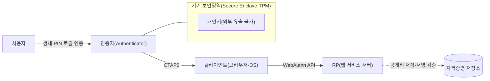
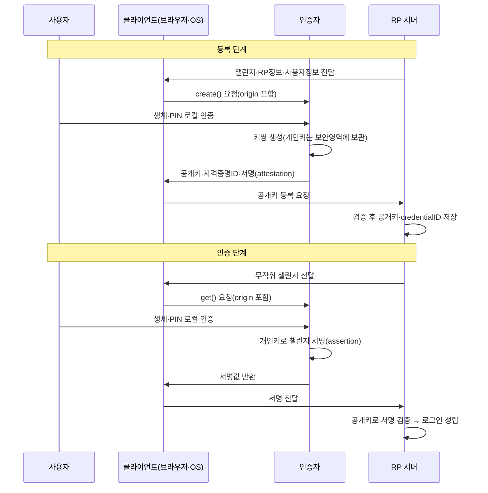

# 패스키(Passkey)와 FIDO2/WebAuthn

## 1. 개요

### 가. 정의

> **패스키(Passkey)**는 FIDO2 표준(WebAuthn + CTAP)에 기반하여, 사용자의 기기에 저장된 **공개키-개인키 쌍**으로 서비스에 로그인하는 **비밀번호 없는(Passwordless) 인증 자격증명**이다. 개인키는 기기의 보안영역(Secure Enclave·TPM 등)을 벗어나지 않고, 서비스에는 공개키만 등록되며, 인증은 생체·PIN 등 기기 잠금해제(로컬 인증)를 통해 개인키로 **챌린지에 서명**함으로써 이루어진다.

패스키는 특정 제품의 이름이 아니라, FIDO 얼라이언스와 W3C가 표준화한 **FIDO2 인증자(authenticator)로 만든 자격증명**을 소비자 친화적으로 부르는 이름이다. 전통적 비밀번호가 "사용자가 알고 있는 비밀 문자열을 서버와 공유"하는 방식이라면, 패스키는 "기기가 보관한 개인키로 서명값을 생성하고 서버는 공개키로 검증"하는 방식이어서, 공유 비밀(shared secret)이 네트워크나 서버에 존재하지 않는다는 점이 본질적 차이다.

### 나. 등장 배경과 필요성

인증 사고 통계에서 침해의 다수는 여전히 비밀번호에서 비롯된다. 사용자는 기억 부담 때문에 동일 비밀번호를 여러 서비스에 재사용하고, 이는 한 곳의 유출이 다른 서비스로 번지는 **크리덴셜 스터핑(Credential Stuffing)**의 토양이 된다. 또한 비밀번호는 **피싱(Phishing)**에 근본적으로 취약하다. 가짜 사이트가 사용자를 속여 비밀번호를 입력하게 만들면, 서버 관점에서는 정상 로그인과 구분되지 않기 때문이다. 여기에 OTP·SMS 2차 인증을 더해도, 실시간으로 코드를 가로채 중계하는 **AiTM(Adversary-in-the-Middle) 피싱**과 사용자를 지치게 만드는 **MFA 피로(fatigue) 공격**은 이를 우회한다.

이러한 한계는 비밀번호가 "공유 비밀"이라는 구조적 속성에서 나온다. 사용자·서버·(때로는)중간자가 같은 값을 알아야 하므로, 그 값은 전송·저장·재입력 과정에서 언제든 탈취될 수 있다. 서버가 비밀번호를 해시로 저장하더라도 유출 시 오프라인 크래킹의 대상이 되고, 대량 유출 사고는 반복된다. 패스키는 **공유 비밀 자체를 없앰**으로써 이 문제군을 근본적으로 제거하려는 시도다. 개인키는 결코 전송되지 않으므로 서버 유출로 훔칠 것이 없고, 인증 값이 특정 도메인에 **바인딩**되어 있어 가짜 사이트에는 서명 자체가 만들어지지 않는다.

정책적으로도 미국 NIST SP 800-63B는 피싱 저항성(phishing resistance)을 갖춘 인증수단을 최상위 보증등급(AAL3)의 요건으로 제시하며, 주요 빅테크(Apple·Google·Microsoft)는 2022~2024년에 걸쳐 패스키를 OS·브라우저·계정에 기본 탑재하였다. 이로써 패스키는 실험적 기술을 넘어 대중 서비스의 표준 로그인 수단으로 자리잡는 단계에 진입하였다.

## 2. 전체 구조와 구성요소

FIDO2는 크게 두 규격의 합으로 구성된다. 하나는 웹 애플리케이션과 브라우저 사이의 자바스크립트 API인 **WebAuthn(W3C 표준)**이고, 다른 하나는 브라우저·OS(플랫폼)와 외장 인증자(보안키·휴대폰) 사이의 통신 규약인 **CTAP2(Client to Authenticator Protocol)**다. 이 둘이 맞물려, 웹 서비스는 인증자의 물리적 형태와 무관하게 동일한 방식으로 공개키 기반 인증을 요청할 수 있다.

구성요소를 원리 관점에서 설명하면 다음과 같다. **RP(Relying Party)**는 로그인을 요구하는 웹 서비스로, 등록 시 사용자의 공개키와 자격증명 식별자를 저장하고 로그인 시 서명을 검증한다. **클라이언트**는 브라우저와 OS로서 WebAuthn API 호출을 받아 CTAP2로 인증자와 통신하며, 요청한 도메인(origin) 정보를 인증자에게 정확히 전달하는 **피싱 저항성의 핵심 매개자** 역할을 한다. **인증자**는 개인키를 생성·보관하고 서명을 수행하는 주체로, 기기에 내장된 **플랫폼 인증자**(휴대폰의 지문·얼굴, PC의 Windows Hello 등)와, USB·NFC로 연결하는 **로밍(외장) 인증자**(YubiKey 같은 보안키)로 나뉜다.

패스키의 보안이 성립하는 결정적 장치는 개인키가 **하드웨어 보안영역**을 벗어나지 않는다는 점이다. 서명 연산은 보안영역 내부에서 이루어지고 결과값만 밖으로 나오며, 이 연산을 개시하려면 사용자의 로컬 인증(생체·PIN)이 선행되어야 한다. 따라서 기기를 물리적으로 탈취하더라도 잠금해제 없이는 서명을 만들 수 없어, "소유(기기)"와 "생체/지식(잠금해제)"의 두 요소가 자연스럽게 결합된다.

## 3. 인증 절차 — 등록과 인증

패스키의 동작은 **등록(Registration/Attestation)**과 **인증(Authentication/Assertion)**의 두 단계로 이해해야 한다. 등록은 서비스에 공개키를 최초로 심는 과정이고, 인증은 이후 매 로그인마다 개인키로 서버가 낸 챌린지에 서명하여 신원을 증명하는 과정이다.

등록 단계에서 서버는 무작위 **챌린지(challenge)**와 자신의 도메인 정보(RP ID), 사용자 식별 정보를 클라이언트에 전달한다. 클라이언트는 `navigator.credentials.create()`를 호출하며 이때 실제 접속한 origin을 함께 넘긴다. 인증자는 사용자의 로컬 인증을 확인한 뒤 해당 서비스 전용 **키쌍을 생성**하고, 개인키는 보안영역에 남기고 공개키·자격증명 ID·(선택적)인증자 출처증명(attestation)을 반환한다. 서버는 이를 검증하고 공개키를 사용자 계정에 결속한다.

인증 단계에서는 서버가 매번 새로운 챌린지를 발급하는데, 이 **무작위성**이 **재전송 공격(replay attack)**을 막는 핵심이다. 이전에 캡처한 서명은 다른 챌린지에는 무효이기 때문이다. 인증자는 개인키로 "챌린지 + origin 정보 + 서명 카운터"를 묶어 서명하며, 서버는 저장된 공개키로 이를 검증한다. 여기서 **origin 바인딩**이 피싱 저항성을 만든다. 사용자가 `bank.com`에 등록한 패스키는 `bank.com`이라는 RP ID에 묶여 있어, 겉모습이 똑같은 `bank-login.com` 같은 가짜 도메인에서는 브라우저가 다른 origin을 전달하므로 인증자가 애초에 유효한 서명을 만들지 않는다. 사용자가 속더라도 프로토콜이 속지 않는 것이다.

한편 많은 인증자는 서명할 때마다 증가하는 **서명 카운터(signature counter)**를 함께 제공한다. 서버가 이전 값보다 작거나 같은 카운터를 발견하면 인증자 복제(cloning)를 의심할 수 있어, 하드웨어 인증자의 복제 탐지 수단으로 활용된다.

## 4. 유형 — 동기화 패스키와 기기 고정 패스키

패스키는 개인키의 **이동 가능성**에 따라 두 유형으로 나뉘며, 이 구분은 보안 보증수준과 사용 편의성 사이의 트레이드오프를 결정한다.

**동기화 패스키(Synced Passkey)**는 Apple iCloud 키체인, Google 비밀번호 관리자 같은 클라우드 계정을 통해 여러 기기에 개인키가 **암호화되어 복제·동기화**되는 형태다. 사용자는 새 휴대폰을 사더라도 로그인 계정만 복구하면 패스키가 따라오므로, 기기 분실이 곧 계정 상실로 이어지지 않는다는 큰 편의성을 얻는다. 대신 개인키가 클라우드 생태계 내에서 이동하므로, 보안의 신뢰 경계가 개별 하드웨어에서 **클라우드 계정과 그 복구 절차**로 확장된다. 즉 클라우드 계정 자체의 보안이 최후 방어선이 된다.

**기기 고정 패스키(Device-bound Passkey)**는 YubiKey 같은 하드웨어 보안키처럼 개인키가 특정 기기를 절대 벗어나지 않는 형태다. 복제·유출 위험이 사실상 없어 정부·금융·기업 관리자 계정 등 최고 보증등급이 필요한 곳에 적합하지만, 기기를 분실하면 해당 자격증명은 복구할 수 없으므로 반드시 **복수의 인증자를 백업으로 등록**하는 운영이 요구된다.

아래 표는 두 유형과 전통적 인증수단을 비교한 것이나, 표만으로는 선택 기준이 드러나지 않으므로 뒤이어 맥락을 설명한다.

| 구분 | 동기화 패스키 | 기기 고정 패스키 | 비밀번호+OTP |
|------|--------------|----------------|-------------|
| 개인키 이동 | 클라우드로 동기화 | 기기 밖 이동 불가 | 해당 없음(공유 비밀) |
| 피싱 저항성 | 높음(origin 바인딩) | 높음(origin 바인딩) | 낮음(AiTM 우회 가능) |
| 기기 분실 대응 | 계정 복구로 자동 승계 | 백업 키 필수 | 재설정 절차 |
| 적합 영역 | 대중 소비자 서비스 | 고보증(관리자·금융) | 레거시 전반 |

선택의 핵심은 "복구 편의성 vs 개인키 통제력"이다. 대중 서비스는 사용자 이탈(계정 잠김)이 곧 비용이므로 동기화 패스키가 현실적이고, 침해 시 피해가 막대한 특권 계정은 기기 고정 패스키로 통제력을 극대화하는 것이 합리적이다. 실무에서는 두 유형을 계정 위험도에 따라 **차등 적용**하는 설계가 권장된다.

## 5. 심화 — 기존 인증 체계와의 관계 및 도입 전략

패스키는 OAuth 2.0·OIDC를 대체하는 것이 아니라 그 **첫 관문인 사용자 인증**을 강화한다는 점을 구분해야 한다. OIDC가 "누가 로그인했는지를 다른 서비스에 안전하게 전달"하는 연합 인증(federation)의 문제를 다룬다면, 패스키는 그 IdP(Identity Provider)에서 실제로 사용자를 인증하는 **1차 인증수단**을 비밀번호에서 공개키 서명으로 바꾸는 것이다. 실제로 대형 IdP들은 로그인 방식으로 패스키를 채택하고, 그 결과를 OIDC 토큰으로 발급하는 조합을 취한다.

도입 관점에서 가장 큰 현실 과제는 **점진적 전환과 계정 복구**다. 기존 비밀번호 기반 사용자를 하루아침에 옮길 수 없으므로, 대개 (1) 비밀번호 로그인 후 패스키 등록을 유도하고, (2) 이후 로그인은 패스키를 우선 제안하되 비밀번호를 보조로 남기는 단계적 방식을 쓴다. 문제는 이때 비밀번호나 SMS 재설정 같은 **약한 복구 경로가 남아 있으면 전체 보안이 그 수준으로 낮아진다**는 점이다. 공격자는 강한 패스키를 정면 돌파하는 대신 "비밀번호 찾기"라는 뒷문을 노리기 때문이다. 따라서 복구 경로 역시 다중 패스키·검증된 기기·오프라인 복구코드 등으로 피싱 저항적으로 재설계해야 진정한 효과를 얻는다.

기업 환경에서는 인증자의 신뢰성을 검증하는 **출처증명(Attestation)** 정책이 중요하다. 규제 산업은 특정 인증 기준(예: FIPS 검증)을 만족하는 하드웨어 인증자만 허용하도록 attestation을 요구할 수 있으나, 이는 사용자가 아무 기기나 쓰지 못하게 하여 편의성을 낮추고 개인정보(기기 모델 식별) 우려를 낳는다. 반대로 대중 서비스는 attestation을 요구하지 않아 어떤 인증자든 받아들여 도입 마찰을 줄인다. 이처럼 attestation 요구 수준은 보안·편의·프라이버시의 균형점을 정하는 정책 레버다.

## 6. 고려사항 및 시사점

기술사 관점에서 패스키 도입은 단순한 로그인 UI 교체가 아니라 **인증 아키텍처와 위험관리 전략의 재설계**로 접근해야 한다.

- **적용 전략(단계적·차등적 도입)**: 전면 전환보다 위험도 기반으로 접근한다. 일반 사용자에는 동기화 패스키로 편의성을 확보하되, 관리자·재무 등 특권 계정에는 기기 고정 하드웨어 키를 의무화하는 **계정 등급별 차등 정책**이 현실적이다. 레거시 시스템과의 공존 기간에는 비밀번호를 완전히 제거하기보다 점진적으로 축소한다.

- **트레이드오프(보안 vs 복구성)**: 개인키를 기기에 가둘수록 안전하지만 분실 복구가 어렵고, 클라우드로 동기화할수록 편리하지만 신뢰 경계가 클라우드 계정으로 넘어간다. 특히 **복구 경로가 최약 링크**가 되지 않도록, 백업 인증자 복수 등록과 피싱 저항적 복구 절차를 함께 설계해야 한다. 강한 정문에 약한 뒷문을 두는 실수를 경계한다.

- **전망(비밀번호 없는 미래)**: 주요 OS·브라우저의 기본 탑재로 패스키는 향후 표준 로그인 수단으로 확산될 전망이며, 규제기관의 피싱 저항성 요구와 맞물려 금융·공공 분야로 확대될 것이다. 다만 크로스 플랫폼 이식성(서로 다른 생태계 간 패스키 이전)과 계정 복구 표준화가 대중화의 남은 과제다.

- **연계 기술 및 거버넌스**: 패스키는 제로 트러스트(Zero Trust)의 강력한 신원 검증 축으로 기능하며, MFA·이상행위 탐지·디바이스 신뢰도 평가와 결합할 때 효과가 극대화된다. 도입 시 개인정보 영향평가(생체정보는 기기 내에서만 처리되고 서버로 전송되지 않음을 명확히 고지), 접근통제 정책, 감사 로깅 체계까지 아우르는 거버넌스 관점의 통합 설계가 필요하다.

## 참고자료
- W3C, "Web Authentication: An API for accessing Public Key Credentials (WebAuthn)" — https://www.w3.org/TR/webauthn-2/
- FIDO Alliance, "Passkeys (Passwordless Authentication)" — https://fidoalliance.org/passkeys/
- NIST, "SP 800-63B Digital Identity Guidelines: Authentication and Lifecycle Management" — https://pages.nist.gov/800-63-3/sp800-63b.html

---

> **한 줄 요약**: 패스키는 FIDO2(WebAuthn+CTAP) 기반의 비밀번호 없는 인증으로, 개인키를 기기 보안영역에 두고 도메인에 바인딩된 공개키 서명으로 로그인하여 피싱·크리덴셜 스터핑·서버 유출을 근본적으로 차단하되, 동기화·기기고정 유형 선택과 복구 경로 설계가 성패를 좌우한다.
