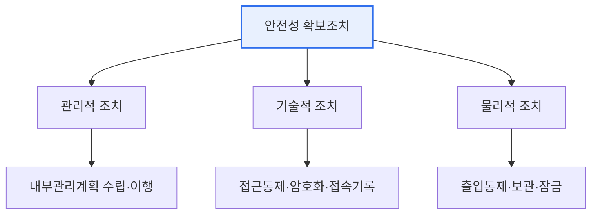

# 개인정보의 안전성 확보조치 기준

## 1. 개요

### 가. 정의
> 「개인정보 보호법」에 근거하여, 개인정보처리자가 개인정보의 **분실·도난·유출·위조·변조·훼손을 방지**하기 위해 반드시 준수해야 할 관리적·기술적·물리적 보호조치를 규정한 고시.

이 기준의 핵심 취지는 개인정보 보호를 '**추상적 노력'이 아니라 '구체적이고 최소한의 의무**'로 명문화한 데 있다. "개인정보를 잘 지켜라"는 선언만으로는 실효성이 없으므로, 내부관리계획 수립·접근권한 관리·암호화·접속기록 보관 같은 이행해야 할 최소 조치를 못 박았다. 다만 모든 조직에 획일적으로 같은 수준을 요구하는 것은 비현실적이므로, 처리하는 개인정보의 **규모와 민감도에 따라 조치 수준을 차등 적용**한다. 대량의 민감정보를 다루는 대형 사업자에게는 더 엄격한 조치가, 소규모 처리자에게는 상대적으로 완화된 조치가 적용된다.

### 나. 보호조치의 세 축
안전성 확보조치는 사람·제도를 다루는 **관리적 조치**, 기술로 통제하는 **기술적 조치**, 물리적 접근을 막는 **물리적 조치** 의 세 축으로 구성된다. 세 축이 함께 작동해야 다층 방어가 완성된다.

## 2. 안전조치 체계

## 3. 내부관리계획 수립·이행

> 개인정보의 안전한 처리를 위한 **조직 내부의 종합 관리계획**으로, 개인정보 보호책임자(CPO) 지정, 보호 조직 구성·역할, 교육, 접근권한 관리, 위탁·유출 대응 등을 문서화하고 시행하는 것이다.

내부관리계획이 관리적 조치의 핵심인 이유는, 보안 사고의 상당수가 기술적 결함이 아니라 **사람·절차의 관리 부재**에서 비롯되기 때문이다. 누가 개인정보를 책임지고(CPO), 누구에게 어떤 접근권한을 주며, 직원 교육과 사고 대응은 어떻게 하는지를 문서로 정하고 실제로 이행해야 조직적 관리가 가능하다.

| 포함 사항 | 내용 |
|---|---|
| **책임 체계** | CPO 지정, 보호 조직·역할 |
| **접근권한 관리** | 권한 부여·변경·말소 기준 |
| **교육·점검** | 정기 교육, 내부 점검·개선 |
| **대응 계획** | 유출 사고 대응·신고 절차 |

## 4. 암호화 적용방안

암호화는 기술적 조치의 핵심으로, 개인정보가 유출되더라도 내용을 알아볼 수 없게 만드는 최후의 방어선이다. 고유식별정보·비밀번호·바이오정보 등 민감한 정보는 저장 시 암호화해야 하며, 특히 **비밀번호는 복호화가 불가능한 일방향 암호화(안전한 해시)** 로 저장한다. 이는 관리자조차 원문을 알 수 없게 하여, DB가 통째로 유출되어도 비밀번호가 노출되지 않게 하기 위함이다. 또한 정보통신망으로 개인정보를 주고받을 때는 SSL/TLS로 전송 구간을 암호화하고, 암호키의 생성·보관·폐기 등 키 관리 절차를 갖춰야 한다.

| 대상 | 적용 방안 |
|---|---|
| **저장 시** | 고유식별정보·비밀번호·바이오정보 암호화 |
| **비밀번호** | 복호화 불가능한 **일방향 암호화**(해시) |
| **전송 시** | 송·수신 구간 암호화(SSL/TLS) |
| **키 관리** | 암호키 생성·이용·보관·폐기 절차 |

## 5. 고려사항 및 시사점

1. **규모·민감도에 따른 차등 적용**이 원칙이다. 처리하는 개인정보 유형·양에 맞게 조치 수준을 정해, 과도한 부담과 과소 보호를 모두 피한다.
2. **접속기록 보관·점검으로 추적성을 확보**한다. 누가 언제 어떤 개인정보에 접근했는지 기록·보관하고 정기 점검함으로써 내부자의 오남용을 억제·추적한다.
3. **가명·익명 처리(PET)와 개인정보 영향평가(PIA)로 확장**된다. 사후 방어를 넘어, 처음부터 개인정보를 최소 수집·비식별 처리하고(Privacy by Design) 위험을 사전 평가하는 방향으로 발전하고 있다.

---

> **한 줄 요약**: 개인정보 안전성 확보조치 기준은 *관리적(내부관리계획)·기술적(접근통제·암호화·접속기록)·물리적* 조치를 규모·민감도에 따라 차등 규정하며, 저장·전송 암호화와 비밀번호 일방향 암호화를 의무화해 개인정보 유출·훼손을 방지한다.
