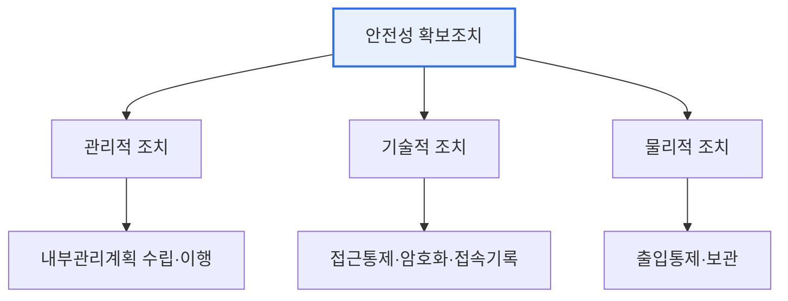

# 개인정보의 안전성 확보조치 기준

## 1. 개요

### 가. 정의
> 「개인정보 보호법」에 근거해 개인정보처리자가 개인정보의 **분실·도난·유출·위조·변조·훼손을 방지**하기 위해 준수해야 할 관리적·기술적·물리적 보호조치를 규정한 고시.

이 기준의 핵심은 개인정보 보호를 '**추상적 노력이 아니라 구체적 의무**'로 명문화한 데 있다. 처리하는 개인정보의 규모·민감도에 따라 조치 수준을 차등 적용하되, 내부관리계획 수립·접근통제·암호화·접속기록 보관 등 최소한의 안전조치를 강제한다.

## 2. 주요 안전조치 체계

## 3. 내부관리계획 수립·이행 (가)

> 개인정보의 안전한 처리를 위한 **조직 내부의 종합 관리계획**으로, 개인정보 보호책임자(CPO) 지정, 보호조직 구성·역할, 교육, 접근권한 관리, 위탁·유출 대응 등을 포함한다.

| 포함 사항 | 내용 |
|---|---|
| **책임 체계** | CPO 지정, 보호 조직·역할 |
| **접근권한 관리** | 권한 부여·변경·말소 기준 |
| **교육·점검** | 정기 교육, 내부 점검·개선 |
| **대응 계획** | 유출 사고 대응·신고 절차 |

## 4. 암호화 적용방안 (나)

| 대상 | 적용 방안 |
|---|---|
| **저장 시(암호화)** | 고유식별정보·비밀번호·바이오정보 등 저장 시 암호화 |
| **비밀번호** | 복호화되지 않는 **일방향 암호화**(해시) |
| **전송 시** | 정보통신망 송·수신 시 암호화(SSL/TLS) |
| **키 관리** | 암호키 생성·이용·보관·폐기 등 키 관리 절차 |

> 특히 비밀번호는 원문 복원이 불가능한 일방향 암호화(안전한 해시)로 저장해야 한다.

## 5. 시사점
- 처리하는 개인정보 유형·규모에 따른 **차등 적용**(안전조치 수준)
- 접속기록 보관·점검으로 내부자 오남용 추적성 확보
- 가명·익명 처리(PET), 개인정보 영향평가(PIA)와 연계

---

> **한 줄 요약**: 개인정보 안전성 확보조치 기준은 *관리적(내부관리계획)·기술적(접근통제·암호화·접속기록)·물리적* 조치를 규정하며, 저장·전송 시 암호화와 비밀번호 일방향 암호화를 의무화한다.
