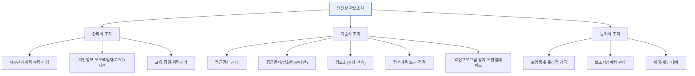
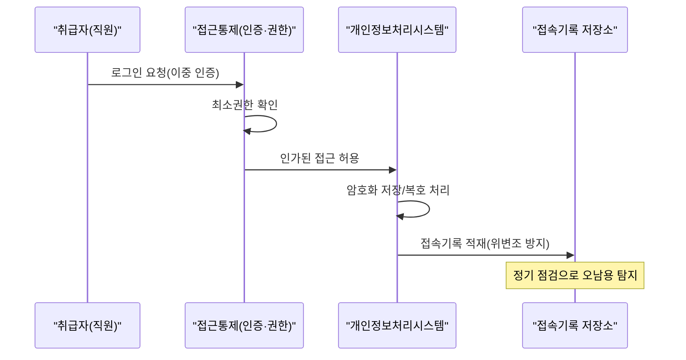

# 개인정보의 안전성 확보조치 기준

## 1. 개요

### 가. 정의

> **개인정보의 안전성 확보조치 기준** 은 「개인정보 보호법」에 근거하여, 개인정보처리자가 개인정보의 **분실·도난·유출·위조·변조·훼손을 방지**하기 위해 반드시 준수해야 할 관리적·기술적·물리적 보호조치의 최소 기준을 규정한 고시(행정규칙)다.

이 기준의 핵심 취지는 개인정보 보호를 '**추상적 노력**'이 아니라 '**구체적이고 검증 가능한 최소 의무**'로 명문화한 데 있다. 법이 "개인정보를 안전하게 관리하라"고 선언하는 것만으로는 실효성이 없다. 무엇을, 어느 수준까지 해야 안전 조치를 다한 것인지 불분명하면 사업자는 이행하기 어렵고 감독기관은 위반을 판단하기 어렵다. 그래서 이 고시는 내부관리계획 수립, 접근권한 관리, 접근통제, 암호화, 접속기록 보관·점검, 악성프로그램 방지, 물리적 안전조치, 재해·재난 대비 등 **이행해야 할 최소 항목을 못 박아** 예측 가능성과 집행력을 확보한다.

다만 모든 조직에 획일적으로 같은 수준을 요구하는 것은 비현실적이다. 연 매출 수조 원대의 대형 플랫폼과 직원 몇 명의 소상공인이 같은 보안 인프라를 갖추라는 것은 과잉 규제이자 실현 불가능한 부담이 된다. 그래서 이 기준은 처리하는 개인정보의 **규모(정보주체 수)와 민감도(민감정보·고유식별정보 포함 여부)에 따라 조치 수준을 차등 적용**한다. 대량의 민감정보를 다루는 대형 처리자에게는 더 엄격한 조치가, 소규모 처리자에게는 상대적으로 완화된 조치가 적용되는 '유형별 차등' 구조다. (구체적 유형 구분과 적용 항목은 고시 개정에 따라 달라질 수 있으므로, 실제 적용 시에는 최신 고시 별표를 확인해야 한다.)

### 나. 등장 배경과 보호조치의 세 축

개인정보 유출 사고의 상당수는 첨단 해킹이 아니라 **기본 조치의 부재** — 권한 없는 직원의 무단 조회, 퇴사자 계정 미말소, 평문 저장된 비밀번호, 방치된 접속기록 — 에서 비롯된다. 이 기준은 그런 '기본을 안 지켜 생기는 사고'를 막기 위한 최소한의 안전망이다. 안전성 확보조치는 사람·제도를 다루는 **관리적 조치**, 기술로 통제하는 **기술적 조치**, 물리적 접근을 막는 **물리적 조치** 의 세 축으로 구성되며, 어느 하나만으로는 방어가 완성되지 않는다. 최고의 암호화(기술)를 적용해도 권한 관리(관리)가 허술하면 정당한 계정으로 데이터가 유출되고, 완벽한 접근통제(기술)를 갖춰도 서버실 출입(물리)이 열려 있으면 소용없다. 세 축이 서로의 빈틈을 메우는 **다층 방어(Defense in Depth)** 로 작동해야 실효적 보호가 된다.

## 2. 안전조치 체계 — 세 축의 다층 방어

```mermaid
flowchart TB
  S["안전성 확보조치"] --> M["관리적 조치"]
  S --> T["기술적 조치"]
  S --> P["물리적 조치"]
  M --> M1["내부관리계획 수립·이행"]
  M --> M2["개인정보 보호책임자(CPO) 지정"]
  M --> M3["교육·점검·위탁관리"]
  T --> T1["접근권한 관리"]
  T --> T2["접근통제(방화벽·IP제한)"]
  T --> T3["암호화(저장·전송)"]
  T --> T4["접속기록 보관·점검"]
  T --> T5["악성프로그램 방지·보안업데이트"]
  P --> P1["출입통제·물리적 잠금"]
  P --> P2["보조저장매체 관리"]
  P --> P3["재해·재난 대비"]
  style S fill:#e8f0fe,stroke:#2f6fed,stroke-width:2px
```

위 체계는 '누가 접근하는가(권한·인증)', '어떻게 접근하는가(통제·기록)', '유출돼도 못 읽게(암호화)', '물리적으로 못 들어오게(출입통제)'라는 방어선을 겹겹이 세운 구조다. 아래에서 각 축의 핵심 조치를 원리와 함께 살펴본다.

## 3. 관리적 조치 — 내부관리계획 수립·이행

> **내부관리계획** 은 개인정보의 안전한 처리를 위한 **조직 내부의 종합 관리 지침**으로, 개인정보 보호책임자(CPO) 지정, 보호 조직 구성·역할, 접근권한 관리, 교육, 위탁·유출 대응 등을 문서화하고 실제로 시행하는 체계다.

내부관리계획이 관리적 조치의 중심인 이유는, 보안 사고의 뿌리가 기술 결함이 아니라 **사람과 절차의 관리 부재**에 있기 때문이다. 누가 개인정보를 최종 책임지고(CPO), 누구에게 어떤 접근권한을 부여·변경·말소하며, 직원 교육과 사고 대응·신고는 어떤 절차로 하는지를 **문서로 정하고 그대로 이행**해야 조직적 관리가 성립한다. 문서만 있고 이행이 없으면(이른바 '서랍 속 규정') 그 자체가 위반이며, 실제 감독 현장에서도 '계획 대비 이행 여부'가 핵심 점검 항목이 된다.

특히 접근권한 관리는 최소권한 원칙(Least Privilege)과 직무 분리에 기반해야 한다. 업무에 필요한 최소 범위만 부여하고, 인사이동·퇴사 시 지체 없이 권한을 변경·말소해야 한다. 실제 대형 유출 사고 중 상당수가 '퇴사했는데도 살아 있던 계정'이나 '필요 이상으로 넓었던 권한'에서 비롯되었다는 점에서, 권한의 생애주기(부여→변경→회수) 관리는 관리적 조치의 급소다. 또한 개인정보 처리를 외부에 위탁할 경우, 수탁자가 안전조치를 지키도록 계약에 명시하고 정기적으로 관리·감독해야 한다 — 위탁했다고 책임까지 넘어가는 것이 아니기 때문이다.

| 포함 사항 | 내용 | 실무 함의 |
|---|---|---|
| **책임 체계** | CPO 지정, 보호 조직·역할 정의 | 책임 소재 명확화, 의사결정 라인 확보 |
| **접근권한 관리** | 부여·변경·말소 기준, 최소권한 | 퇴사자·이동자 권한 즉시 회수 |
| **교육·점검** | 정기 교육, 내부 점검·개선 | 인적 실수·내부자 위협 예방 |
| **위탁 관리** | 수탁자 계약·감독 | 위탁 후에도 처리자 책임 유지 |
| **대응 계획** | 유출 사고 대응·신고 절차 | 골든타임 내 신고·통지 체계 |

## 4. 기술적 조치 — 접근통제·암호화·접속기록

기술적 조치는 관리 정책을 시스템으로 강제하는 수단이다. 첫째, **접근통제**는 개인정보처리시스템에 대한 접근을 인가된 자로 제한한다. 안전한 인증수단(예: 계정·비밀번호에 더한 이중 인증)을 적용하고, 외부에서의 접속은 VPN 등 안전한 접속수단이나 허용 IP 제한으로 통제하며, 일정 시간 미사용 시 자동 접속 차단(세션 타임아웃)을 둔다. 이는 '정당한 사람만, 정당한 경로로' 접근하게 하는 1차 방어선이다.

둘째, **암호화**는 개인정보가 유출되더라도 내용을 알아볼 수 없게 만드는 최후의 방어선이다. 고유식별정보(주민등록번호 등)·비밀번호·바이오정보 등 민감한 정보는 저장 시 암호화해야 하며, 특히 **비밀번호는 복호화가 불가능한 일방향 암호화(안전한 해시 함수)** 로 저장한다. 이는 시스템 관리자조차 원문 비밀번호를 알 수 없게 하여, 데이터베이스가 통째로 유출되어도 비밀번호 원문이 노출되지 않게 하기 위함이다. 여기에 계정별 솔트(Salt)를 더해 무지개표(Rainbow Table) 공격을 무력화한다. 또한 정보통신망으로 개인정보를 주고받을 때는 SSL/TLS로 전송 구간을 암호화하고, 암호키의 생성·이용·보관·폐기 등 **키 관리 절차**를 별도로 갖춰야 한다 — 암호화의 안전성은 결국 키 관리의 안전성에 수렴하기 때문이다.

셋째, **접속기록의 보관·점검**은 추적성과 억제력을 제공한다. 개인정보처리시스템에 접속한 기록(계정, 접속일시, 처리한 정보주체 정보, 수행 업무 등)을 일정 기간(민감정보·대량 처리 등은 더 장기) 보관하고, 위·변조·도난·분실되지 않도록 안전하게 관리하며, 정기적으로 점검해야 한다. 접속기록은 사고가 났을 때 '누가 언제 무엇을 했는지'를 밝히는 사후 추적 근거이자, '기록이 남는다'는 사실 자체로 내부자의 오남용을 사전에 억제하는 효과가 있다. 이 밖에 악성프로그램 방지(백신·보안 업데이트)와 출력·복사 시 보호조치도 기술적 조치에 포함된다.

| 대상 | 적용 방안 | 목적 |
|---|---|---|
| **접근통제** | 안전한 인증, IP제한·VPN, 세션 타임아웃 | 인가자만 접근 |
| **저장 시 암호화** | 고유식별정보·바이오정보 암호화 | 유출 시 판독 불가 |
| **비밀번호** | 복호화 불가 **일방향 암호화(해시)+솔트** | 관리자·유출자도 원문 불가 |
| **전송 시 암호화** | 송·수신 구간 SSL/TLS | 전송 중 가로채기 방어 |
| **접속기록** | 일정 기간 보관·위변조 방지·점검 | 추적성·억제력 확보 |
| **키 관리** | 암호키 생성·이용·보관·폐기 절차 | 암호화의 실효성 담보 |

## 5. 사례로 보는 조치의 실효성

세 축이 왜 함께 가야 하는지는 실제 사고 유형이 잘 보여준다. 첫째, 한 통신·유통사에서 대규모 개인정보가 유출된 사건들의 공통 원인은 상당수가 '취약점 방치·접근통제 미흡'이었다 — 기술적 조치의 기본(보안 업데이트·접근제한)만 지켰어도 막을 수 있었던 경우다. 둘째, 평문으로 비밀번호를 저장했다가 DB 유출과 동시에 전 계정 비밀번호가 노출된 사례는, 일방향 암호화라는 단 하나의 조치가 사고의 등급을 '치명적'에서 '제한적'으로 낮췄을 것임을 보여준다. 셋째, 퇴사자 계정 미말소·과다 권한으로 인한 내부자 유출은 아무리 좋은 암호화가 있어도 관리적 조치(권한 생애주기 관리)가 무너지면 소용없음을 드러낸다. 이처럼 조치들은 상호 보완적이며, 한 축의 공백이 다른 축의 노력을 통째로 무력화한다.

아래 시퀀스는 정상적인 접근이 세 축의 통제를 어떻게 차례로 통과하는지를 보여준다. 인증(관리·기술)→권한 확인(관리)→암호화된 데이터 처리(기술)→접속기록 적재(기술)의 각 단계가 하나라도 빠지면 방어선에 구멍이 생긴다.

```mermaid
sequenceDiagram
  participant U as "취급자(직원)"
  participant AC as "접근통제(인증·권한)"
  participant SYS as "개인정보처리시스템"
  participant LOG as "접속기록 저장소"
  U->>AC: 로그인 요청(이중 인증)
  AC->>AC: 최소권한 확인
  AC->>SYS: 인가된 접근 허용
  SYS->>SYS: 암호화 저장/복호 처리
  SYS->>LOG: 접속기록 적재(위변조 방지)
  Note over LOG: 정기 점검으로 오남용 탐지
```

물리적 조치 또한 이 흐름의 전제다. 전산실·자료보관실 출입을 통제하고(출입 이력 관리), 보조저장매체(USB·외장하드)의 반출입을 통제하며, 개인정보가 담긴 서류·매체를 잠금장치로 보관해야 한다. 지진·화재 같은 재해에 대비한 백업·복구 체계도 넓은 의미의 안전조치에 포함된다 — 가용성(Availability) 역시 개인정보의 안전한 처리를 구성하는 요소이기 때문이다.

## 6. 심화 — 법제 통합과 Privacy by Design으로의 확장

이 분야의 최근 흐름은 두 방향이다. 첫째, **규제의 통합·정비**다. 과거 온라인(정보통신망법)과 오프라인(개인정보 보호법)으로 이원화되어 있던 개인정보 안전조치 규율이 개인정보 보호법 체계로 일원화·정비되면서, 사업자는 하나의 통합된 기준을 따르게 되었다. 규정의 세부(유형 구분·항목·보관기간 등)는 고시 개정으로 계속 바뀌므로, 실무에서는 최신 고시와 개인정보보호위원회의 해설서를 반드시 확인해야 한다.

둘째, **사후 방어에서 사전 예방(Privacy by Design)으로의 이동**이다. 유출 후 막는 조치를 넘어, 처음부터 개인정보를 최소 수집하고 가명·익명 처리(PET, Privacy Enhancing Technologies)로 식별 위험을 낮추며, 신규 시스템 도입 전에 개인정보 영향평가(PIA)로 위험을 사전 진단하는 방향으로 무게가 옮겨가고 있다. 나아가 AI·빅데이터 시대에는 가명정보의 결합·활용이 확대되면서, '안전조치'의 범위가 전통적 접근통제를 넘어 재식별 방지·차등 프라이버시(Differential Privacy) 같은 데이터 자체의 비식별 기술로 확장되고 있다. 즉 안전성 확보조치는 고정된 체크리스트가 아니라, 기술·위협 환경과 함께 진화하는 살아있는 기준이다.

## 7. 고려사항 및 시사점 (기술사 관점)

1. **규모·민감도에 따른 차등 적용이 원칙**이다. 처리하는 개인정보의 유형·양에 맞춰 조치 수준을 정해, 소규모 사업자에 대한 과도한 부담과 대량 처리자에 대한 과소 보호를 모두 피해야 한다. 자사가 어느 유형에 속하는지 먼저 정확히 식별하는 것이 이행의 출발점이다.

2. **관리·기술·물리의 균형이 핵심**이다. 특정 축에만 투자하면 다른 축의 공백으로 방어가 통째로 뚫린다. 암호화(기술)에 집중하더라도 권한 생애주기 관리(관리)와 서버실 출입통제(물리)를 함께 갖춰야 다층 방어가 완성된다.

3. **접속기록 보관·점검으로 추적성과 억제력을 확보**해야 한다. 누가 언제 어떤 개인정보에 접근했는지 위·변조 없이 기록·보관하고 정기 점검함으로써, 내부자 오남용을 사전 억제하고 사고 시 원인 규명과 책임 소재 확인을 가능케 한다. 기록은 '남긴다'가 아니라 '점검한다'까지가 조치다.

4. **사전 예방(PbD·PIA·PET)으로의 확장이 전략적 방향**이다. 사후 대응 비용은 사전 예방 비용을 크게 웃돌므로, 최소 수집·비식별 처리·영향평가를 설계 단계에 내재화해야 한다. AI·가명정보 활용이 늘수록 재식별 방지와 차등 프라이버시 같은 데이터 중심 안전기술의 중요성이 커진다.

5. **이행의 증빙과 지속적 개선**이 감독·분쟁 대응의 관건이다. 계획 수립에 그치지 않고 교육·점검·개선의 PDCA 주기를 돌리며, 이행 근거(로그·점검 기록·교육 이력)를 남겨야 사고 발생 시 '주의의무를 다했음'을 입증할 수 있다.

6. **가용성도 안전성의 일부**임을 놓치지 말아야 한다. 유출·훼손 방지만이 아니라, 재해·재난·랜섬웨어로 인한 데이터 소실에 대비한 백업·복구 체계까지 갖춰야 '안전한 처리'가 완성된다. 기밀성·무결성·가용성(CIA)을 균형 있게 보장하는 것이 정보보호의 기본 삼각형이다.

## 참고자료
- 개인정보보호위원회, 「개인정보 보호법」 및 하위 고시(개인정보의 안전성 확보조치 기준) — https://www.pipc.go.kr
- 국가법령정보센터, 개인정보 보호법령 — https://www.law.go.kr
- 한국인터넷진흥원(KISA), 개인정보보호 안내·자료 — https://www.kisa.or.kr

---

> **한 줄 요약**: 개인정보 안전성 확보조치 기준은 *관리적(내부관리계획·권한관리)·기술적(접근통제·암호화·접속기록)·물리적* 조치를 규모·민감도에 따라 차등 규정하는 다층 방어 체계로, 저장·전송 암호화와 비밀번호 일방향 암호화를 의무화하며, 이제는 Privacy by Design·PIA·비식별 기술을 통한 사전 예방으로 확장되고 있다.
