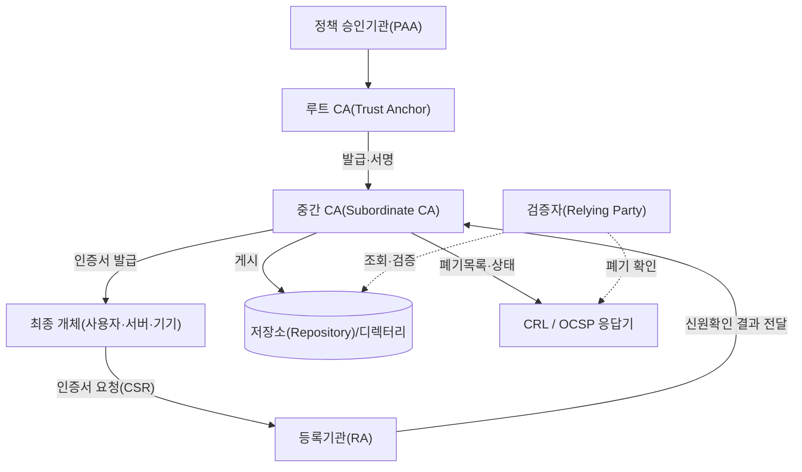
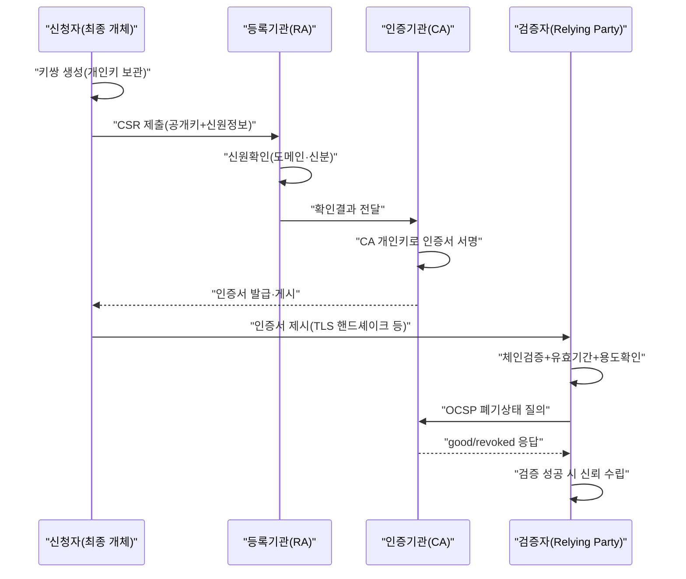

# 공개키 기반구조(PKI, Public Key Infrastructure)

## 1. 개요

### 가. 정의

> **공개키 기반구조(PKI)**는 공개키 암호(비대칭 암호)를 실제 서비스에서 신뢰 가능하게 사용하기 위해, **공개키와 그 소유자(주체)의 신원을 전자적으로 결합한 인증서(Certificate)**를 발급·관리·검증·폐기하는 데 필요한 하드웨어·소프트웨어·정책·절차·인력의 총체적 체계를 말한다. 핵심은 신뢰할 수 있는 제3자인 **인증기관(CA)**의 전자서명을 통해 "이 공개키가 정말로 이 주체의 것"임을 보증하는 데 있다.

PKI는 단일 제품이나 알고리즘이 아니라, 공개키 암호를 사회적·기술적으로 운용 가능하게 만드는 **신뢰 인프라(trust infrastructure)**다. 대칭키 암호가 사전에 안전하게 공유된 비밀키를 전제로 한다면, 공개키 암호는 누구나 볼 수 있는 공개키로 암호화·서명 검증을 수행하므로 키 배포 문제를 원리적으로 해결한다. 그러나 여기에는 결정적 함정이 있다. "내가 지금 확보한 이 공개키가 정말 통신 상대의 것인가"를 보장하지 못하면, 공격자가 자신의 공개키를 상대의 것으로 위장하는 **중간자 공격(MITM)**이 성립한다. PKI는 이 신원-공개키 결합 문제를 인증서와 CA의 서명 체인으로 풀어낸다.

### 나. 등장 배경과 필요성

인터넷이 상거래·행정·금융의 기반이 되면서, 서로 만난 적 없는 당사자 사이에 **기밀성·무결성·인증·부인방지**를 동시에 확보해야 하는 요구가 폭발적으로 늘었다. 대칭키만으로는 사전 키 공유가 불가능한 낯선 상대와 안전한 채널을 열 수 없고, 공개키만으로는 앞서 말한 신원 보증 문제가 남는다. 특히 전자상거래에서는 "이 웹사이트가 진짜 은행인가", 전자문서에서는 "이 서명이 진짜 그 사람의 것인가"라는 질문에 **기술적으로 검증 가능한 답**을 줄 수 있어야 거래가 성립한다.

이러한 요구는 곧 "신뢰를 어떻게 확장(scale)할 것인가"의 문제로 귀결된다. 모든 당사자가 서로의 공개키를 개별적으로 검증·교환하는 것은 사용자 수가 늘수록 조합적으로 폭증하여 현실성이 없다. PKI는 소수의 **신뢰 앵커(Trust Anchor, 루트 CA)**를 정점으로 하는 **계층적 신뢰 위임** 구조를 도입하여, 사용자는 극소수의 루트만 신뢰하면 그 아래로 위임된 무수한 인증서를 자동으로 검증할 수 있게 만든다. 오늘날 웹의 HTTPS(TLS), 전자서명·전자세금계산서, 코드 서명, 이메일 보안(S/MIME), VPN·기기 인증, 그리고 국내 공동인증서(구 공인인증서) 체계가 모두 PKI 위에서 돌아간다는 점에서, PKI는 디지털 신뢰의 사실상 하부구조라 할 수 있다.

## 2. 전체 구조와 구성요소

PKI는 인증서를 만드는 **정책·인증 주체**, 이를 저장·배포하는 **저장소**, 그리고 실제로 인증서를 쓰고 검증하는 **최종 개체(End Entity)**로 구성된다. 아래 구조도는 이들의 관계와 신뢰의 흐름을 나타낸다.

**인증기관(CA, Certification Authority)**은 PKI의 심장으로, 최종 개체의 공개키와 신원 정보를 담은 인증서에 **자신의 개인키로 전자서명**하여 발급한다. CA의 서명이 곧 "이 결합을 내가 보증한다"는 선언이다. 최상위의 **루트 CA**는 자기 자신을 서명한 자체서명(self-signed) 인증서를 가지며, 이 루트 공개키가 브라우저·OS의 **신뢰 저장소(trust store)**에 사전 탑재됨으로써 모든 검증의 출발점이 된다. 루트 개인키는 유출되면 전체 신뢰 체계가 붕괴하므로, 통상 오프라인 상태의 **HSM(하드웨어 보안모듈)**에 보관하고 평시에는 중간 CA만 온라인으로 운용한다.

**등록기관(RA, Registration Authority)**은 인증서를 발급하기 전에 신청자의 신원을 확인하는 창구다. CA가 신뢰를 "서명"으로 표현한다면, 그 신뢰가 근거하는 **실물 신원확인**은 RA의 몫이다. 예컨대 서버 인증서라면 도메인 소유권을, 개인 인증서라면 신분증·대면확인을 통해 신청자가 주장하는 신원이 사실인지 검증한 뒤 그 결과를 CA에 전달한다. RA의 확인 수준이 곧 인증서 신뢰등급(DV·OV·EV)을 가른다.

**저장소(Repository)와 폐기 정보 서비스**는 발급된 인증서와 그 상태를 공개·조회 가능하게 한다. 검증자는 인증서 체인을 확보하는 것에 더해, 그 인증서가 유효기간 내에 **중도 폐기(revoke)되지 않았는지**를 반드시 확인해야 한다. 이를 위해 폐기된 인증서 일련번호 목록인 **CRL(Certificate Revocation List)**과, 개별 인증서의 상태를 실시간 질의하는 **OCSP(Online Certificate Status Protocol)**가 운용된다. 마지막으로 **최종 개체(End Entity)**는 인증서를 실제로 사용하는 사용자·서버·IoT 기기 등이며, 인증서를 신뢰하고 검증하는 쪽을 특히 **검증자(Relying Party)**라 부른다.

### 가. 공개키 암호의 두 용도 — 기밀성과 부인방지

PKI가 보증하는 공개키는 크게 두 목적으로 쓰이며, 이 둘을 구분해 이해하는 것이 인증서 용도(KeyUsage) 설계의 출발점이다. 첫째, **기밀성**을 위해서는 송신자가 수신자의 **공개키로 암호화**하고 수신자만 자신의 개인키로 복호화한다. 다만 공개키 암호는 연산이 무겁기 때문에 실제로는 대칭 세션키를 공개키로 감싸 전달하는 **하이브리드 방식(전자봉투)**을 쓴다. 둘째, **인증·무결성·부인방지**를 위해서는 반대로 서명자가 자신의 **개인키로 서명**하고 누구나 그의 공개키로 검증한다. 개인키는 서명자만 보유하므로, 유효한 서명은 곧 "그 사람이 서명했고 이후 변조되지 않았다"는 증거가 된다.

여기서 PKI의 필요성이 다시 분명해진다. 서명 검증에 쓰는 공개키가 정말 그 서명자의 것인지 보증해 주는 장치가 없으면, 공격자가 자기 키로 서명한 문서를 피해자의 것으로 위장할 수 있다. 인증서는 바로 이 "공개키-신원" 결합을 CA의 서명으로 보증함으로써, 암호화와 전자서명 양쪽 모두를 신뢰 가능하게 만든다. 따라서 실무에서는 서명용 키쌍과 암호화용 키쌍을 분리 발급하는 경우가 많은데, 서명키는 부인방지를 위해 백업·복구를 금지하는 반면 암호화키는 데이터 복구를 위해 키 위탁(key escrow)이 필요할 수 있어 관리 정책이 상반되기 때문이다.

### 나. X.509 인증서의 구조

PKI에서 유통되는 인증서는 국제표준 **X.509 v3** 형식을 따른다. 인증서에는 주체(Subject)와 발급자(Issuer)의 식별정보, 주체의 공개키, 유효기간, 일련번호, 그리고 용도를 제한하는 다양한 **확장 필드(extensions)**가 담기며, 이 전체에 발급 CA의 전자서명이 붙는다. 확장 필드 중 **KeyUsage/ExtendedKeyUsage**는 해당 키를 서명용인지 암호화용인지, 서버 인증용인지 코드 서명용인지로 제한하고, **SAN(Subject Alternative Name)**은 인증서가 보증하는 도메인 목록을 명시한다. 오늘날 브라우저는 CN(Common Name) 대신 SAN을 기준으로 도메인 일치를 검증한다.

| 구성요소 | 역할 | 유출·오류 시 영향 |
|---|---|---|
| 루트 CA | 신뢰의 정점, 자체서명 | 전체 신뢰 붕괴(재구축 필요) |
| 중간 CA | 위임 발급, 온라인 운용 | 하위 인증서 대량 재발급 |
| RA | 신원확인 | 허위 인증서 발급 위험 |
| CRL/OCSP | 폐기 상태 제공 | 폐기된 인증서 오신뢰 |
| HSM | 개인키 보관·연산 | 키 탈취 시 위·변조 서명 |

## 3. 인증서 생명주기와 검증 절차

PKI 운용은 인증서의 **발급 → 사용 → 갱신 → 폐기**로 이어지는 생명주기 관리가 핵심이다. 아래는 발급과 검증의 세부 흐름이다.

**발급 단계**에서 신청자는 먼저 자신의 기기·서버에서 키쌍을 생성한다. 개인키는 결코 밖으로 내보내지 않고, 공개키와 신원정보를 담은 **CSR(Certificate Signing Request)**만 RA에 제출한다. RA의 신원확인을 거쳐 CA가 인증서에 서명하면 발급이 완료된다. 개인키가 애초에 신청자 기기를 벗어나지 않는다는 점이 부인방지(non-repudiation)의 기술적 토대가 된다.

**검증 단계**는 PKI의 실질적 가치가 발현되는 지점이다. 검증자는 제시된 인증서에서 발급자를 따라 **중간 CA → 루트 CA로 이어지는 인증서 체인(chain of trust)**을 구성하고, 각 단계의 서명을 상위 공개키로 검증하여 최종적으로 자신이 신뢰 저장소에 가진 루트에 도달하는지 확인한다. 체인이 루트까지 이어지고, 각 인증서가 유효기간 내이며, 용도(EKU)와 도메인(SAN)이 일치하고, 마지막으로 **CRL/OCSP로 폐기되지 않았음**이 확인되어야 비로소 신뢰가 성립한다. 이 중 하나라도 실패하면 브라우저는 경고를 띄우고 연결을 차단한다.

**폐기 단계**는 유효기간이 끝나기 전이라도 개인키 유출·소속 변경·오발급이 발생하면 인증서를 무효화하는 절차다. CRL은 주기적으로 배포되어 신선도가 떨어지는 한계가 있고, OCSP는 실시간이지만 매 접속마다 CA에 질의하는 부담과 프라이버시 노출 문제가 있다. 이를 보완하기 위해 서버가 OCSP 응답을 미리 받아 핸드셰이크에 첨부하는 **OCSP Stapling**이 널리 쓰인다. 두 방식의 상충점을 정리하면 다음과 같다.

| 구분 | CRL | OCSP |
|---|---|---|
| 방식 | 폐기목록 일괄 배포 | 개별 인증서 실시간 질의 |
| 신선도 | 발급주기만큼 지연 | 실시간(응답 시점 기준) |
| 검증자 부담 | 목록 다운로드 크기 증가 | 매 접속 질의(Stapling으로 완화) |
| 프라이버시 | 노출 적음 | 방문 사이트가 CA에 노출 |
| 가용성 | 캐시 가능 | 응답기 장애 시 검증 불가 |

두 방식 모두 "폐기 정보가 검증자에게 제때 도달하는가"라는 동일한 난제를 안고 있으며, 이것이 근래 **유효기간 자체를 짧게 만들어 폐기 의존도를 낮추려는** 정책 흐름의 배경이다.

### 가. 장기서명과 부인방지의 지속성

전자서명의 법적 효력은 서명 시점에 인증서가 유효했음을 **미래에도** 입증할 수 있어야 유지된다. 인증서가 만료되거나 CA가 사라진 뒤 "그때 그 서명이 유효했는가"를 다투게 되면 부인방지가 흔들린다. 이를 해결하기 위해 서명값에 **신뢰 타임스탬프(TSA)**를 붙여 서명 시각을 고정하고, 검증에 필요한 인증서 체인과 폐기정보(OCSP·CRL)를 서명에 함께 봉인하는 **장기검증(LTV, Long-Term Validation)** 포맷(예: PAdES·XAdES·CAdES)이 사용된다. 이는 전자계약·전자세금계산서·전자문서 보관처럼 수년~수십 년의 증빙이 필요한 영역에서 PKI가 실질적 법적 신뢰를 제공하는 핵심 장치다.

## 4. 신뢰모델 비교와 적용 사례

PKI의 신뢰를 조직하는 방식에는 여러 모델이 있으며, 이는 단순한 구현 차이가 아니라 **신뢰의 확장성·복원력·상호운용성**이라는 상충하는 요구에서 비롯된 선택이다.

| 신뢰모델 | 구조 | 장점 | 한계 |
|---|---|---|---|
| 계층형(Hierarchical) | 단일 루트 정점 | 검증 단순, 관리 명확 | 루트 유출 시 전면 붕괴 |
| 상호인증(Cross-cert) | CA 간 수평 인증 | 도메인 간 상호운용 | 경로 탐색 복잡 |
| 브리지(Bridge) CA | 중립 허브가 매개 | 다기관 연동에 유리 | 브리지 운영 부담 |
| 신뢰망(Web of Trust) | 사용자 간 상호서명 | 중앙기관 불필요 | 신뢰도 정량화 어려움 |

계층형은 웹 PKI가 채택한 방식으로 검증이 단순하지만 루트에 신뢰가 집중된다. 반대로 PGP의 **신뢰망(Web of Trust)**은 사용자들이 서로의 키에 서명하여 중앙기관 없이 신뢰를 형성하지만, "얼마나 신뢰할지"를 객관화하기 어려워 대규모 운용에는 부적합하다. 정부·금융처럼 서로 다른 조직의 PKI를 연동해야 하는 환경에서는 중립 허브를 두는 **브리지 CA**가 활용된다. 미국 연방 브리지 CA(FBCA)가 대표 사례로, 부처별로 독립 운영되는 PKI를 하나의 신뢰 프레임으로 묶는다.

신뢰모델의 취약점을 극적으로 드러낸 사례가 2011년 네덜란드 **DigiNotar** 사고다. 침해당한 이 CA에서 구글 등 주요 도메인에 대한 위조 인증서가 500여 건 발급되어 실제 중간자 감청에 악용되었고, 결국 브라우저들이 해당 루트를 신뢰 저장소에서 일괄 제거하면서 CA가 파산에 이르렀다. 이 사건은 계층형 신뢰의 근본 약점, 즉 **신뢰하는 수백 개 CA 중 단 하나만 뚫려도 전체 사용자가 위협받는다**는 사실과, 오발급을 사후에라도 탐지할 감시 장치(CT)의 필요성을 뼈아프게 각인시켰다. 이후 도입된 Certificate Transparency는 바로 이 교훈의 직접적 산물이다.

구체적 적용 사례로는 첫째, **웹 HTTPS/TLS**가 있다. 전 세계 웹 트래픽의 대부분이 TLS로 암호화되며, 그 신뢰는 브라우저·OS에 탑재된 수백 개 루트 CA와 이를 감독하는 **CA/Browser Forum**의 기준(Baseline Requirements)에 의해 유지된다. 둘째, 국내 **공동인증서(구 공인인증서)** 체계는 최상위인 KISA를 정점으로 금융결제원·코스콤 등 공인인증기관이 계층형 PKI를 구성하여 전자금융·전자정부에 쓰여 왔다. 셋째, **코드 서명**은 소프트웨어 배포자가 자신의 인증서로 실행파일에 서명함으로써 위·변조 여부와 출처를 사용자가 검증하게 한다. 넷째, IoT 분야에서는 수억 대 기기에 인증서를 심어 **기기 신원(device identity)**을 부여하는 사례가 늘고 있는데, 이 규모에서는 수작업 발급이 불가능하므로 자동화가 필수가 된다.

## 5. 심화 — 자동화·투명성과 최신 동향

전통적 PKI의 병목은 인증서의 **수동 발급·갱신**이었다. 유효기간 만료를 놓쳐 서비스 장애가 발생하는 사고가 반복되자, 이를 자동화하는 **ACME(Automated Certificate Management Environment) 프로토콜**이 표준화(RFC 8555)되었고, Let's Encrypt가 이를 기반으로 무료·자동 인증서를 대중화하면서 HTTPS 보급률을 크게 끌어올렸다. 최근 CA/Browser Forum은 서버 인증서의 최대 유효기간을 단축하는 방향으로 정책을 강화하고 있어(수년 → 수백 일, 그리고 장기적으로 더 짧게), 사실상 **자동화 없는 PKI 운용은 지속 불가능**해지는 흐름이다. 유효기간 단축은 폐기 정보의 신선도 한계를 보완하는 효과도 있는데, 인증서가 곧 만료되므로 유출된 키의 악용 창(window)이 자연히 좁아지기 때문이다.

신뢰의 감시 측면에서는 **CT(Certificate Transparency)**가 중요하다. 과거 일부 CA가 도메인 소유자 모르게 인증서를 오발급하거나 침해당해 위조 인증서가 발급된 사고들이 있었다. CT는 발급된 모든 서버 인증서를 공개·추가전용(append-only) 로그에 기록하도록 하여, 도메인 소유자가 자기 도메인에 대한 인증서 발급을 상시 감시(monitoring)할 수 있게 한다. 오늘날 주요 브라우저는 CT 로그에 등재되지 않은 인증서를 신뢰하지 않으므로, CT는 사후 탐지를 넘어 사실상 발급의 전제 조건이 되었다. 도메인 소유자가 어떤 CA만 자기 도메인 인증서를 발급하도록 DNS로 제한하는 **CAA(Certification Authority Authorization)** 레코드 역시 오발급 억제 장치로 함께 쓰인다.

운영 형태 측면에서는 조직 내부 전용의 **프라이빗(내부) PKI**와 공용 PKI를 구분해 운용하는 것이 최근 표준적 설계다. 브라우저가 신뢰하는 공용 PKI는 외부에 노출되는 웹 서비스에 쓰고, 내부 서버·워크로드·기기 간 mTLS에는 조직이 직접 운영하는 내부 CA로 단기 인증서를 대량 자동 발급한다. 이렇게 나누면 외부 신뢰 정책(유효기간 단축·CT 의무)과 내부 운영 자유도를 각각 최적화할 수 있고, 내부 인증서가 공용 신뢰 저장소를 오염시킬 위험도 차단된다. 클라우드 사업자의 관리형 PKI 서비스와 서비스 메시의 자동 인증서 발급이 이 흐름을 가속하고 있다.

가장 근본적인 최신 동향은 **양자내성(PQC) 전환**이다. 현행 PKI의 서명·키교환은 RSA·ECDSA에 의존하는데, 충분히 큰 양자컴퓨터가 등장하면 이들이 무력화되어 인증서 서명 자체를 위조할 수 있게 된다. 이에 미국 NIST는 2024년 격자기반 서명·키캡슐화 알고리즘(예: ML-DSA, ML-KEM)을 표준으로 확정하였고, PKI 업계는 하나의 인증서에 기존 알고리즘과 PQC 알고리즘을 함께 담는 **하이브리드 인증서**로 점진 전환을 준비하고 있다. 다만 지금 저장된 암호문을 미래에 해독하는 **"지금 수집, 나중 해독(HNDL)"** 위협을 고려하면, 장기 보존 데이터를 다루는 기관일수록 전환 시급성이 높다.

## 6. 고려사항 및 시사점

첫째, **루트 키 보호와 CA 운영의 무결성**이 최우선이다. 루트 개인키는 오프라인 HSM에 보관하고, 물리적 접근을 다수의 승인자로 분산(m-of-n 통제)하며, 정기적인 감사와 CP/CPS(인증정책·인증업무준칙)에 따른 운영을 문서화해야 한다. 신뢰의 정점이 무너지면 하위 전체가 무의미해지므로, 여기에 대한 투자는 곧 전체 체계의 복원력을 결정한다.

둘째, **폐기 검증의 실효성**을 확보해야 한다. CRL은 배포 지연으로, OCSP는 성능·가용성·프라이버시 문제로 각각 한계가 있다. OCSP Stapling·Must-Staple, 그리고 유효기간 단축을 조합하여 폐기 실패로 위조 인증서를 오신뢰하는 위험을 줄이는 설계가 필요하다. "폐기했으나 검증되지 않는" 상태는 폐기하지 않은 것과 다름없다는 점을 유념해야 한다.

셋째, **인증서 생명주기의 자동화와 가시성**이 운영 안정성의 관건이다. 만료·오발급으로 인한 대규모 서비스 장애가 반복되는 만큼, ACME 기반 자동 갱신과 함께 조직 내 모든 인증서를 발견·추적하는 **CLM(Certificate Lifecycle Management)** 도구를 도입하여 "그림자 인증서(shadow cert)"를 없애야 한다. 유효기간 단축 추세에서 수작업은 곧 사고의 원인이 된다.

넷째, **암호 민첩성(Crypto-agility)과 PQC 대비**가 전략적 과제다. 알고리즘·키 길이·CA를 신속히 교체할 수 있도록 시스템을 설계하고, 자산에 사용된 암호 목록을 인벤토리화(CBOM)하여 PQC 전환 로드맵을 수립해야 한다. 특히 장기 서명·장기 보존 문서를 다루는 공공·금융 영역은 하이브리드 인증서 도입 시점을 선제적으로 검토할 필요가 있다.

다섯째, **제로 트러스트·IoT 등 신규 수요와의 연계**를 고려해야 한다. 사용자뿐 아니라 워크로드·기기·서비스 간 상호인증(mTLS)이 확산되면서 발급 규모가 폭증하므로, 단기 인증서 자동 발급을 전제로 한 내부 PKI(예: 서비스 메시의 워크로드 신원, SPIFFE/SPIRE)와 공용 PKI를 역할에 맞게 구분·병행하는 아키텍처 설계가 요구된다.

## 참고자료

- NIST, "Post-Quantum Cryptography Standardization", https://csrc.nist.gov/projects/post-quantum-cryptography
- IETF RFC 5280, "Internet X.509 Public Key Infrastructure Certificate and CRL Profile", https://datatracker.ietf.org/doc/html/rfc5280
- IETF RFC 8555, "Automatic Certificate Management Environment (ACME)", https://datatracker.ietf.org/doc/html/rfc8555
- CA/Browser Forum, "Baseline Requirements", https://cabforum.org/baseline-requirements/
- Certificate Transparency, https://certificate.transparency.dev/

---

> **한 줄 요약**: PKI는 CA의 전자서명으로 공개키와 신원을 X.509 인증서로 결합하고, 계층적 신뢰 체인·폐기(CRL/OCSP)·저장소를 통해 이를 검증 가능하게 만드는 디지털 신뢰의 하부구조로, 오늘날 자동화(ACME)·투명성(CT)·양자내성(PQC) 전환을 축으로 진화하고 있다.
