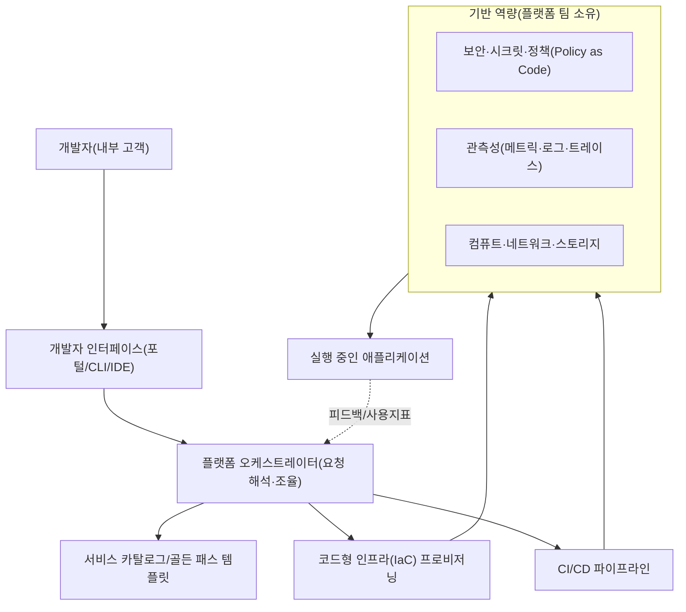
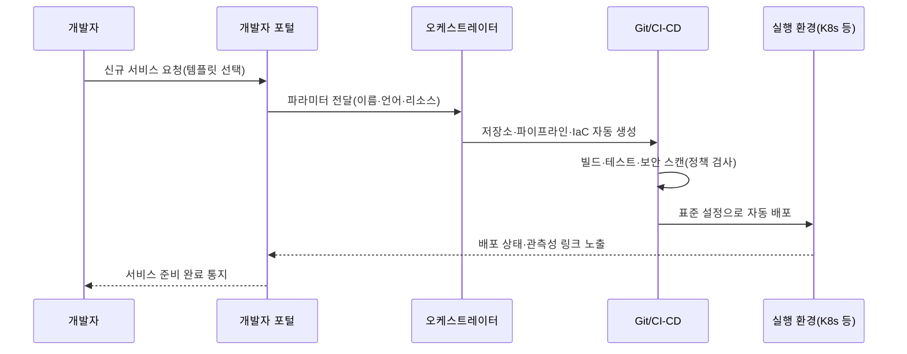

# 플랫폼 엔지니어링(Platform Engineering)

## 1. 개요

> **정의**: 플랫폼 엔지니어링은 개발자가 애플리케이션을 빌드·배포·운영하는 데 필요한 인프라·도구·표준을 셀프서비스형 **내부 개발자 플랫폼(IDP, Internal Developer Platform)** 으로 제품화하여 제공함으로써, 개발자의 인지 부하를 낮추고 소프트웨어 전달 속도와 안정성을 동시에 높이는 접근 방식이다.

플랫폼 엔지니어링은 2022년 전후 가트너와 CNCF를 중심으로 부상한 개념으로, 그 등장 배경은 DevOps의 성공이 역설적으로 낳은 한계에 있다.
DevOps는 "개발자가 자신이 만든 것을 직접 운영한다(you build it, you run it)"는 원칙으로 개발과 운영의 벽을 허물었지만, 클라우드 네이티브 환경이 복잡해지면서 개발자 한 사람이 감당해야 할 지식의 폭이 폭발적으로 넓어졌다.
쿠버네티스 매니페스트, 헬름 차트, 테라폼, CI/CD 파이프라인, 관측성 설정, 시크릿 관리, 네트워크 정책을 모든 개발자가 익혀야 한다면, 정작 비즈니스 로직을 짜야 할 개발자가 인프라 문제에 시간을 빼앗기게 된다.
이처럼 한 사람이 동시에 처리해야 하는 인지적 부담을 **인지 부하(cognitive load)** 라 하며, 플랫폼 엔지니어링은 이 인지 부하를 관리하는 것을 핵심 목표로 삼는다.

두 번째 배경은 자율성과 표준화의 상충이다.
각 팀이 자유롭게 도구를 선택하면 조직 전체적으로는 파편화(tool sprawl)가 심화되어, 보안 정책·규정 준수·비용 통제가 어려워지고 중복 투자가 발생한다.
반대로 중앙에서 모든 것을 통제하면 병목이 생기고 개발자 자율성이 훼손된다.
플랫폼 엔지니어링은 "**포장된 길(paved road / golden path)**"을 제공하여, 개발자가 그 길을 따르면 별다른 고민 없이 조직 표준·보안·모범사례를 자동으로 준수하도록 설계함으로써 자율성과 통제를 화해시킨다.

세 번째 배경은 플랫폼을 **제품(product)으로 취급**하는 사고의 전환이다.
과거의 사내 인프라 팀은 티켓을 받아 처리하는 수동적 서비스 조직이었으나, 플랫폼 엔지니어링은 내부 개발자를 '고객'으로 보고, 그들의 요구를 조사하고, 로드맵을 세우고, 채택률과 만족도를 측정하며 플랫폼을 지속적으로 개선한다.
즉 플랫폼 엔지니어링은 단순한 기술 조합이 아니라 **제품 관리(product management) 관점**을 인프라에 적용한 조직·문화·기술의 총체로 이해해야 한다.

## 2. 내부 개발자 플랫폼(IDP)의 전체 구조

플랫폼 엔지니어링의 산출물인 IDP는 여러 계층이 결합된 제품이다.
아래 개념도는 개발자가 인터페이스를 통해 요청을 넣으면, 오케스트레이터가 이를 해석하여 하부 인프라를 프로비저닝하는 전체 골격을 나타낸다.

**개발자 인터페이스** 계층은 IDP의 얼굴로서, 웹 포털(예: Backstage), CLI, IDE 플러그인, 또는 Git 저장소 자체가 될 수 있다.
핵심은 개발자가 "무엇을 원하는가(원하는 상태)"만 선언하면 되고, "어떻게 만드는가"는 몰라도 되도록 추상화하는 것이다.
예를 들어 개발자가 포털에서 "PostgreSQL 데이터베이스가 필요하다"를 클릭하면, 뒤에서 어떤 클라우드에 어떤 보안 설정으로 무엇이 만들어지는지는 플랫폼이 책임진다.

**플랫폼 오케스트레이터** 계층은 선언된 요청을 실제 리소스로 변환하는 두뇌다.
이는 표준화된 템플릿(골든 패스)을 선택하고, IaC 도구(Terraform, Crossplane 등)를 호출하며, 필요한 파이프라인을 연결한다.
여기서 중요한 설계 원칙은 개발자에게 노출하는 추상화 수준을 적절히 정하는 것이다.
너무 많이 감추면 유연성이 사라지고, 너무 적게 감추면 인지 부하가 그대로 남으므로, 대다수 사례를 단순하게 처리하되 예외적 요구는 하부 계층에 접근할 수 있게 하는 균형(escape hatch)이 필요하다.

**기반 역량** 계층은 플랫폼 팀이 소유·운영하는 공통 기능으로, 보안·관측성·컴퓨트가 여기에 속한다.
특히 보안과 규정 준수를 **정책을 코드로(Policy as Code, 예: OPA)** 구현하여 파이프라인에 내장하면, 개발자가 별도로 신경 쓰지 않아도 배포 시점에 정책 위반이 자동 차단된다.
이 지점에서 플랫폼 엔지니어링은 DevSecOps와 자연스럽게 결합한다.

## 3. 핵심 구성요소와 골든 패스

플랫폼 엔지니어링의 실질적 가치는 '골든 패스'라는 개념에 응축되어 있다.
골든 패스란 특정 유형의 작업(예: 신규 마이크로서비스 생성)을 수행하는 가장 권장되는 표준 경로로, 저장소 생성·CI 설정·보안 스캔·배포·모니터링 연결이 하나의 템플릿으로 미리 조립되어 있는 것을 말한다.
개발자는 이 템플릿을 사용하기만 하면 조직의 모든 모범사례를 자동으로 상속받는다.

아래 개념도는 신규 서비스가 골든 패스를 따라 생성·배포되는 프로세스를 나타낸다.

이 구성요소들을 정리하면 다음과 같으며, 각 항목은 단순 기능이 아니라 개발자 경험(DX, Developer Experience)을 개선하는 목적에서 선택된다.

| 구성요소 | 역할 | 대표 기술(예시) |
|---|---|---|
| 개발자 포털 | 셀프서비스 진입점·서비스 카탈로그 | Backstage, Port |
| 오케스트레이션/프로비저닝 | 선언적 리소스 생성 | Crossplane, Terraform |
| CI/CD·배포 | 지속적 통합·전달, GitOps | Argo CD, GitHub Actions |
| 정책·보안 | 정책을 코드로, 시크릿 관리 | OPA, Vault |
| 관측성 | 메트릭·로그·트레이스 표준 | OpenTelemetry, Prometheus |

여기서 유의할 점은 IDP가 곧 이 특정 도구들의 집합이 아니라는 것이다.
동일한 기능을 상용 통합 플랫폼(예: 매니지드 IDP)으로 구현할 수도, 오픈소스를 조립해 구현할 수도 있으며, 조직 규모·성숙도에 따라 적정 구성은 달라진다.
작은 조직이 대기업 수준의 완전한 IDP를 구축하려다 오히려 과잉 투자가 되는 경우가 많으므로, "가장 큰 병목부터 얇게(thin platform) 해결"하는 점진적 접근이 권장된다.

## 4. DevOps·SRE와의 관계 및 비교

플랫폼 엔지니어링은 DevOps·SRE를 대체하는 것이 아니라 이들을 **보완·구현하는 수단**으로 이해해야 하며, 이 관계를 명확히 구분하는 것이 답안의 핵심 논점이다.
DevOps가 개발과 운영의 협업이라는 '문화·철학'이라면, SRE는 신뢰성을 공학적으로 달성하는 '실천 방법론(SLO·오류예산 등)'이고, 플랫폼 엔지니어링은 이 문화와 방법론을 조직 전체가 반복 가능하게 만드는 '제품·수단'이다.
즉 DevOps가 지향점을, 플랫폼 엔지니어링이 그것을 규모 있게 실현할 도구를 제공한다.

차이가 발생하는 근본 이유는 '누가 인지 부하를 지느냐'에 있다.
순수 DevOps 모델에서는 각 개발팀이 인프라 복잡성을 스스로 감당하지만, 플랫폼 엔지니어링 모델에서는 그 복잡성을 전담 플랫폼 팀이 흡수하여 재사용 가능한 형태로 포장한다.
따라서 팀 수가 적을 때는 순수 DevOps가 효율적이지만, 조직이 커져 동일한 인프라 작업이 여러 팀에서 중복될 때 플랫폼 엔지니어링의 투자 대비 효과가 급격히 커진다.

| 구분 | DevOps | SRE | 플랫폼 엔지니어링 |
|---|---|---|---|
| 성격 | 문화·철학 | 신뢰성 공학 방법론 | 제품·수단 |
| 초점 | 개발·운영 협업 | SLO·오류예산 | 개발자 경험(DX)·셀프서비스 |
| 인지 부하 | 각 팀이 부담 | 신뢰성 관점 표준화 | 플랫폼 팀이 흡수 |
| 산출물 | 협업 프로세스 | 신뢰성 지표·자동화 | 내부 개발자 플랫폼(IDP) |

구체적 효과를 보여 주는 사례로, 다수 사례 연구에서 골든 패스 도입 후 신규 마이크로서비스의 초기 구성 시간이 수일에서 수십 분 수준으로 단축되고, 팀별로 제각각이던 파이프라인이 표준 템플릿으로 수렴하여 보안 취약점 대응이 일괄 적용되는 효과가 보고된다.
반대로 플랫폼을 개발자 요구 조사 없이 하향식으로 강제한 경우, 개발자들이 플랫폼을 우회(shadow platform)하여 오히려 파편화가 심화된 실패 사례도 자주 언급된다 — 이는 플랫폼을 '제품'이 아닌 '통제 수단'으로 오용했을 때 나타나는 전형적 안티패턴이다.

## 5. 심화: 성숙도와 최신 동향

플랫폼의 성숙도는 대체로 임시적 스크립트 모음 단계 → 표준 템플릿(골든 패스) 제공 단계 → 셀프서비스 포털을 갖춘 제품화 단계 → 사용 지표에 기반해 지속 개선되는 최적화 단계로 발전한다.
성숙도를 측정하는 지표로는 개발자 전달 성과를 보는 **DORA 지표**(배포 빈도·변경 리드타임·변경 실패율·복구 시간)와 함께, 플랫폼 채택률·골든 패스 준수율·개발자 만족도(설문) 같은 제품 관점 지표를 병행한다.

최신 동향으로는 첫째, **AI를 결합한 플랫폼(AI 지원 IDP)** 이 부상하고 있다.
자연어로 "결제 서비스를 스테이징에 배포해 줘"라고 요청하면 플랫폼이 이를 해석해 실행하거나, 장애 발생 시 관련 로그·트레이스를 요약해 주는 형태로, 앞서 다룬 AIOps와 플랫폼 엔지니어링이 접점을 넓히고 있다.
둘째, 지속가능성 관점에서 컴퓨트 사용을 최적화하는 **그린 IT·FinOps 연계**가 플랫폼 기본 기능으로 편입되는 추세다.
셋째, 표준화 측면에서 CNCF를 중심으로 플랫폼 역량 모델과 상호운용 규격 논의가 진행되어, 특정 벤더 종속을 줄이려는 흐름이 나타난다.
다만 이런 동향은 빠르게 변하므로, 답안에서는 특정 제품·버전을 단정하기보다 '방향성'으로 서술하는 것이 안전하다.

## 6. 고려사항 및 시사점

플랫폼 엔지니어링을 도입·운영할 때는 기술사 관점에서 다음을 종합적으로 고려해야 한다.

첫째, **도입 시점과 규모의 적정성**이다. 플랫폼 구축에는 전담 조직과 상당한 초기 투자가 필요하므로, 팀 수가 적고 인프라 반복이 크지 않은 조직이 성급히 대규모 IDP를 만들면 투자 대비 효과가 떨어진다. 가장 큰 병목부터 얇게 해결하는 최소기능플랫폼(MVP) 접근으로 시작해 점진적으로 확장하는 전략이 바람직하다.

둘째, **플랫폼을 제품으로 운영하는 거버넌스**다. 내부 개발자를 고객으로 보고 요구를 조사·측정하며 로드맵을 관리해야 하며, 채택은 강제가 아니라 '더 쉬운 길'을 제공해 자발적으로 이끌어야 한다. 통제 수단으로 강제하면 우회(shadow IT)로 실패하기 쉽다.

셋째, **추상화 수준의 트레이드오프**다. 과도한 추상화는 유연성을 해치고 예외 상황 대응을 어렵게 하며, 과소 추상화는 인지 부하를 남긴다. 대다수 표준 사례는 단순하게, 예외는 하부에 접근 가능하도록(escape hatch) 설계하는 균형이 필요하다.

넷째, **보안·규정 준수의 내재화와 조직 연계**다. 정책을 코드로 파이프라인에 내장(shift-left)하여 개발자가 의식하지 않아도 준수되도록 하되, 플랫폼 팀 자체가 단일 장애점·병목이 되지 않도록 셀프서비스와 문서화를 병행해야 한다. 아울러 플랫폼 팀·SRE·보안팀·개발팀 간 책임 경계(RACI)를 명확히 하여 조직 차원의 협업 체계로 정착시키는 것이 성공의 관건이다.

## 참고자료

- CNCF Platforms White Paper — https://tag-app-delivery.cncf.io/whitepapers/platforms/
- Gartner, "What Is Platform Engineering?" — https://www.gartner.com/en/articles/what-is-platform-engineering
- Backstage (오픈소스 개발자 포털) — https://backstage.io/

---

> **한 줄 요약**: 플랫폼 엔지니어링은 인프라·도구·표준을 셀프서비스형 내부 개발자 플랫폼(IDP)으로 제품화해 골든 패스를 제공함으로써, 개발자의 인지 부하를 낮추고 DevOps·SRE를 조직 규모로 실현하는 접근이다.
