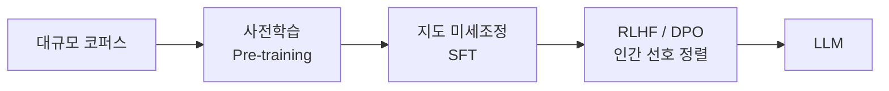

# PLM(사전학습 언어모델)에서 LLM으로의 발전

## 1. 개요

### 가. PLM 정의
> **PLM(Pre-trained Language Model)** 은 대규모 말뭉치로 **사전학습**한 뒤 다운스트림 과업에 미세조정하는 자연어 언어모델(BERT·GPT 등).

### 나. PLM 특성
- **전이학습**(사전학습→파인튜닝), **문맥 임베딩**, **자기지도학습**(MLM·NTP)

## 2. PLM → LLM 훈련 과정

| 단계 | 훈련 특성 |
|---|---|
| **사전학습(Pre-training)** | 자기지도학습(다음 토큰 예측)으로 언어·지식 획득, 막대한 파라미터·데이터 |
| **지도 미세조정(SFT)** | 지시-응답 데이터로 지시 수행 능력 부여 |
| **정렬(RLHF/DPO)** | 인간 선호 보상·선호쌍으로 유용·안전·정직하게 정렬 |

## 3. 규모의 법칙과 창발
- **Scaling Law**: 파라미터·데이터·연산 증가 → 성능 향상
- **창발적 능력(Emergent)**: 일정 규모 이상에서 추론·In-context Learning 발현

## 4. 시사점
- 파인튜닝·**RAG**로 도메인 특화, 환각·정렬 관리가 실무 핵심

---

> **한 줄 요약**: PLM은 *사전학습+미세조정* 의 전이학습 모델이며, 대규모 사전학습→SFT→RLHF/DPO 정렬 과정을 거쳐 창발적 능력을 갖춘 LLM으로 발전한다.
