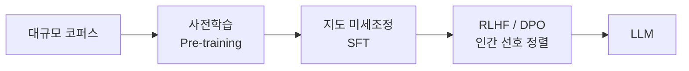

# PLM(사전학습 언어모델)에서 LLM으로의 발전

## 1. 개요

### 가. 정의
> **PLM(Pre-trained Language Model)** 은 대규모 말뭉치로 언어의 일반 패턴을 **사전학습(Pre-training)** 한 뒤, 개별 다운스트림 과업에 **미세조정(Fine-tuning)** 해 활용하는 전이학습 기반 언어모델(BERT·초기 GPT 계열)을 말한다.

PLM의 핵심 발상은 "**언어의 일반 지식을 한 번 크게 학습해 두고, 과업마다 조금씩만 조정한다**"는 전이학습이다. 과업마다 처음부터 모델을 만들던 이전 방식과 달리, 방대한 텍스트에서 얻은 문맥·문법·상식을 재사용하므로 적은 라벨 데이터로도 높은 성능을 낸다.

### 나. PLM의 특성
PLM을 가능케 한 두 축은 **자기지도학습**과 **트랜스포머**다. 자기지도학습은 사람이 라벨을 달지 않아도 텍스트 자체에서 학습 신호를 만든다. BERT는 문장 일부를 가리고 맞히는 **MLM(Masked LM)** 으로 양방향 문맥을, GPT는 다음 토큰을 예측하는 방식으로 생성 능력을 얻는다. 트랜스포머의 Self-Attention은 문장 내 모든 토큰 간 관계를 병렬로 계산해, 단어를 고정된 사전적 의미가 아니라 **문맥에 따라 달라지는 동적 임베딩**으로 표현하게 한다.

| 특성 | 내용 |
|---|---|
| **전이학습** | 사전학습→파인튜닝의 2단계 구조로 지식 재사용 |
| **자기지도학습** | MLM(BERT)·다음 토큰 예측(GPT)으로 라벨 없이 학습 |
| **문맥 임베딩** | 단어를 문맥에 따라 동적으로 표현(다의어 처리) |
| **트랜스포머** | Self-Attention 기반 병렬 학습으로 대규모화 가능 |

## 2. PLM → LLM 훈련 과정

LLM은 PLM을 단지 키운 것이 아니라, 사전학습 위에 **정렬(Alignment)** 이라는 새 단계를 얹어 완성된다. 사전학습만 마친 모델은 다음 토큰을 잘 이어붙일 뿐 "사람이 원하는 방식으로 지시를 따르지" 않기 때문이다. 각 단계는 목적이 뚜렷하게 다르다.

| 단계 | 훈련 특성 | 목적 |
|---|---|---|
| **사전학습(Pre-training)** | 자기지도(다음 토큰 예측)로 언어·세계 지식 획득, 막대한 파라미터·데이터·연산 | 지식·언어능력의 토대 형성 |
| **지도 미세조정(SFT)** | 사람이 만든 지시-응답(Instruction) 데이터로 학습 | 지시를 이해하고 수행하는 능력 부여 |
| **정렬(RLHF/DPO)** | 인간 선호 보상모델(RLHF) 또는 선호쌍 직접 최적화(DPO) | 유용·정직·무해(HHH)하게 행동 정렬 |

### 가. 사전학습
수백억~수조 토큰의 텍스트로 다음 토큰을 예측하며, 이 과정에서 문법·사실·추론 패턴이 파라미터에 압축된다. 비용의 대부분이 여기서 발생한다.

### 나. 지도 미세조정(SFT)
"질문에는 답을, 요약 요청에는 요약을" 식의 고품질 지시-응답 예시로 학습해, 사전학습 모델을 **지시를 따르는 조력자**로 바꾼다.

### 다. 정렬(RLHF/DPO)
같은 질문에 대한 여러 답변을 사람이 선호 순으로 평가한 데이터로 보상모델을 만들고 강화학습으로 최적화(RLHF)하거나, 선호쌍으로 정책을 직접 최적화(DPO)한다. 이 단계가 유해·거짓 응답을 억제하고 사용성을 결정한다.

## 3. 규모의 법칙(Scaling Law)과 창발

LLM으로의 질적 도약을 설명하는 열쇠가 **규모의 법칙**과 **창발**이다. 파라미터·데이터·연산을 키우면 성능이 예측 가능하게 향상되는데(Scaling Law), 흥미롭게도 특정 임계 규모를 넘어서면 작은 모델에는 없던 능력이 **불연속적으로 발현(창발)** 한다. 다단계 추론, 그리고 파라미터를 바꾸지 않고 프롬프트 속 예시만으로 새 과업을 푸는 **In-context Learning**이 대표적이다.

| 개념 | 내용 |
|---|---|
| **Scaling Law** | 파라미터·데이터·연산 증가 → 손실 감소가 예측적 |
| **창발적 능력(Emergent)** | 임계 규모 이상에서 추론·In-context Learning 등 발현 |
| **In-context Learning** | 가중치 갱신 없이 프롬프트 예시(Few-shot)로 과업 수행 |

예컨대 GPT-2 규모에서는 미미하던 산술·추론 능력이 GPT-3(수천억 파라미터) 규모에서 Few-shot으로 갑자기 유의미해진 것이 창발의 실제 사례다.

## 4. 고려사항 및 활용
규모가 커지며 능력과 함께 위험도 커진다. 사실과 다른 답을 그럴듯하게 만드는 **환각**, 학습 데이터의 **편향**, 의도와 어긋나는 **정렬 실패**는 정렬 단계와 레드팀 검증으로 관리해야 한다. 도메인 적용에서는 지식·형식을 보강하기 위해 전체 재학습 대신 **PEFT(LoRA 등 경량 파인튜닝)** 로 형식·능력을, **RAG** 로 최신·전용 지식을 주입하는 조합이 표준이다. 비용·지연이 문제인 현장에서는 양자화·지식 증류로 경량화한 **sLLM**을 온프레미스에 두는 전략이 늘고 있다. 기술사 관점에서는 "능력은 파인튜닝, 지식은 RAG, 안전은 정렬·거버넌스"로 역할을 분담해 신뢰성·비용·보안을 균형 있게 설계하는 것이 핵심이다.

---

> **한 줄 요약**: PLM은 *사전학습+미세조정의 전이학습* 모델이며, 여기에 SFT와 RLHF/DPO 정렬을 더하고 규모를 키우면 규모의 법칙에 따라 In-context Learning 등 창발적 능력을 갖춘 LLM으로 발전한다.
