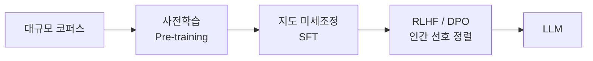

# PLM(사전학습 언어모델)에서 LLM으로의 발전

## 1. 개요

### 가. PLM 정의
> **PLM(Pre-trained Language Model)** 은 대규모 말뭉치로 **사전학습**한 뒤 다운스트림 과업에 미세조정하는 자연어 언어모델(BERT·GPT 계열).

### 나. PLM 특성

| 특성 | 내용 |
|---|---|
| **전이학습** | 사전학습→파인튜닝의 2단계 |
| **자기지도학습** | MLM(BERT)·다음토큰예측(GPT)으로 라벨 없이 학습 |
| **문맥 임베딩** | 단어를 문맥에 따라 동적 표현 |
| **트랜스포머** | Self-Attention 기반 병렬 학습 |

## 2. PLM → LLM 훈련 과정

| 단계 | 훈련 특성 |
|---|---|
| **사전학습(Pre-training)** | 자기지도학습(다음 토큰 예측)으로 언어·지식 획득, **막대한 파라미터·데이터·연산** |
| **지도 미세조정(SFT)** | 지시-응답(Instruction) 데이터로 지시 수행 능력 부여 |
| **정렬(RLHF/DPO)** | 인간 선호 보상모델·선호쌍으로 유용·안전·정직하게 정렬 |

## 3. 규모의 법칙과 창발

| 개념 | 내용 |
|---|---|
| **Scaling Law** | 파라미터·데이터·연산 증가 → 성능 예측적 향상 |
| **창발적 능력(Emergent)** | 임계 규모 이상에서 추론·In-context Learning 발현 |
| **In-context Learning** | 파라미터 갱신 없이 프롬프트 예시로 학습 |

## 4. 고려사항 및 활용
- **환각·편향·정렬** 관리, 안전성(레드팀) 필수
- 도메인 특화: **파인튜닝(PEFT)·RAG** 로 지식·형식 보강
- 비용·지연 대응: 경량화(양자화·증류), sLLM

## 5. 시사점
- PLM→LLM은 **사전학습 규모 + 정렬**의 결합으로 범용 AI 능력 확보
- 생성형 AI 시대의 핵심 기반, 신뢰성·거버넌스와 함께 발전

---

> **한 줄 요약**: PLM은 *사전학습+미세조정의 전이학습* 모델이며, 대규모 사전학습→SFT→RLHF/DPO 정렬 과정을 거쳐 규모의 법칙에 따른 창발적 능력을 갖춘 LLM으로 발전한다.
