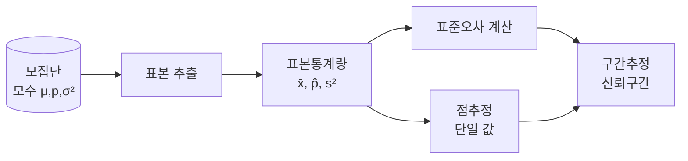

# 점추정(Point Estimation)과 구간추정(Interval Estimation)

## 1. 개요

### 가. 정의
> 모집단 전체를 조사할 수 없을 때, **표본에서 계산한 통계량으로 모집단의 모수(모평균 μ·모비율 p·모분산 σ² 등)를 추론**하는 방법이 통계적 추정이다. 이때 모수를 하나의 값으로 지목하면 **점추정**, 참값이 들어갈 범위를 확률적으로 제시하면 **구간추정**이다.

추정이 필요한 근본 이유는 우리가 실제로 알고 싶은 대상은 모집단이지만, 시간·비용·물리적 제약 때문에 전수조사가 대부분 불가능하기 때문이다. 예컨대 전국 성인의 평균 근로시간을 알려면 수천만 명을 다 조사할 수 없으므로, 수천 명 표본의 평균으로 모평균을 "가늠"한다. 이때 표본은 뽑을 때마다 값이 달라지는 **확률변수**이므로, 추정에는 필연적으로 오차가 따르고 그 오차를 어떻게 다루느냐가 점추정과 구간추정을 가른다.

### 나. 등장 배경 및 필요성
점추정은 "가장 그럴듯한 하나의 값"을 주므로 직관적이고 계산·전달이 간단하다는 장점이 있으나, **그 값이 얼마나 믿을 만한지(오차·신뢰도)를 전혀 말해 주지 못한다**는 치명적 한계가 있다. 표본평균이 47.2시간이라고 할 때 그것이 참값과 거의 같은지, ±5시간쯤 벗어날 수 있는지 점추정만으로는 알 수 없다. 구간추정은 바로 이 **불확실성의 크기까지 함께 표현**하기 위해 등장했다. 의사결정자는 "평균이 47.2"보다 "95% 신뢰수준에서 45.8~48.6 사이"라는 정보로부터 훨씬 안전한 판단을 내릴 수 있다.

## 2. 통계적 추정의 처리 흐름

추정은 모집단에서 무작위 표본을 뽑아 표본통계량을 계산하는 데서 시작한다. 이 통계량 자체가 점추정치이며, 여기에 **표준오차(추정량의 표준편차)** 를 결합해 오차한계를 붙이면 구간추정이 된다. 즉 구간추정은 점추정을 중심에 두고 좌우로 불확실성 폭을 더한 확장이지, 서로 무관한 별개 방법이 아니다.

## 3. 점추정과 좋은 추정량의 조건

점추정은 표본평균 x̄로 모평균 μ를, 표본비율 p̂로 모비율 p를 추정하듯 모수에 대응하는 통계량을 그대로 추정값으로 삼는다. 문제는 같은 모수를 추정하는 통계량이 여러 개일 수 있다는 점이다(평균 vs 중앙값). 그래서 "**좋은 추정량**"을 고르는 기준이 필요하며, 대표적으로 네 가지가 있다.

| 조건 | 의미 | 왜 중요한가 |
|---|---|---|
| **불편성(Unbiasedness)** | 추정량 기댓값 = 모수 (E[θ̂]=θ) | 체계적 치우침(편의)이 없어 평균적으로 맞음 |
| **효율성(Efficiency)** | 분산이 최소 | 같은 불편추정량이면 흔들림이 작을수록 정밀 |
| **일치성(Consistency)** | n↑ 시 모수로 수렴 | 표본을 키우면 정답에 가까워짐 |
| **충분성(Sufficiency)** | 표본의 모든 정보를 활용 | 정보 손실 없이 추정 |

핵심은 **불편성과 효율성의 조화**다. 편의가 없어도 값이 크게 흔들리면(분산 큼) 신뢰할 수 없고, 반대로 분산이 작아도 한쪽으로 치우쳐 있으면(편의) 조직적으로 틀린다. 예를 들어 표본분산을 계산할 때 n이 아닌 **n-1로 나누는 이유**가 바로 불편성 확보에 있다. n으로 나누면 모분산을 체계적으로 과소추정하기 때문에, 자유도 n-1로 보정해 E[s²]=σ²가 되도록 만든다. 그럼에도 점추정은 "이 값이 얼마나 정확한가"라는 물음에는 침묵한다.

## 4. 구간추정과 신뢰구간

구간추정은 모수가 포함될 것으로 기대되는 **신뢰구간(Confidence Interval)** 을 신뢰수준과 함께 제시한다. 모평균의 신뢰구간은 다음 형태를 가진다.

> **신뢰구간 = 점추정치 ± (임계값 × 표준오차)**, 예: μ의 95% CI = x̄ ± 1.96 · (σ/√n)

여기서 표준오차 σ/√n은 표본평균이 표본마다 얼마나 흩어지는지를 나타내고, 임계값(95%면 1.96)은 신뢰수준에 대응하는 분포상의 경계다. 흔히 오해하는 지점은 신뢰수준의 해석이다. "95% 신뢰구간"은 "참값이 이 구간에 들어갈 확률이 95%"라는 뜻이 **아니라**, "**같은 방법으로 표본추출과 구간계산을 무한히 반복하면 그중 약 95%의 구간이 참값을 포함**한다"는 절차의 신뢰도를 의미한다. 참값은 고정되어 있고 흔들리는 것은 구간이기 때문이다.

임계값을 z(정규분포)로 쓸지 t(t분포)로 쓸지는 상황에 달려 있다. **모분산 σ²를 알거나 표본이 충분히 크면(대체로 n≥30)** 중심극한정리에 기대어 z분포를 쓰지만, **모분산을 모르고 표본이 작으면** 표본표준편차 s로 대체하면서 생기는 추가 불확실성을 반영하기 위해 꼬리가 두꺼운 **t분포**를 쓴다. 구체적으로 n=25, x̄=50, s=10이라면 자유도 24의 t값(약 2.064)을 써서 50 ± 2.064·(10/5) = 50 ± 4.13, 즉 45.87~54.13이 95% 신뢰구간이 된다.

## 5. 점추정 vs 구간추정 비교

두 방법은 경쟁 관계가 아니라 **정보의 양이 다른 보완 관계**다. 점추정은 구간추정의 중심값을 제공하고, 구간추정은 그 중심에 신뢰도라는 옷을 입힌다.

| 구분 | 점추정 | 구간추정 |
|---|---|---|
| 결과 형태 | 단일 값 | 구간(하한~상한) |
| 제공 정보 | 추정치만 | 추정치 + 신뢰도·오차 |
| 정밀도 표현 | 없음 | 신뢰수준·구간폭으로 표현 |
| 표현의 강점 | 간결·직관 | 불확실성까지 전달 |
| 상호 관계 | 구간의 중심 | 점추정 ± 오차한계 |

구간폭을 결정하는 두 축은 **신뢰수준과 표본크기**다. 신뢰수준을 95%에서 99%로 높이면 더 확실히 참값을 담기 위해 구간이 넓어져 정밀도가 떨어지는 **트레이드오프**가 생긴다. 반대로 표본크기 n을 키우면 표준오차 σ/√n이 √n에 반비례해 줄어들어 **구간폭이 좁아지고 정밀도가 올라간다**. 즉 "더 확실하게(신뢰수준↑)"와 "더 정밀하게(구간폭↓)"를 동시에 얻으려면 결국 표본을 더 확보하는 수밖에 없다는 것이 구간추정이 주는 실무적 통찰이다.

## 6. 고려사항 및 시사점
- **불확실성의 정량화**: 구간추정은 추정의 오차·신뢰도까지 표현하므로, 단순 수치보다 리스크를 반영한 의사결정에 유리하다. 정책·품질관리처럼 판단의 근거가 중요한 영역에서 특히 유효하다.
- **분포·가정 점검**: 정규성·표본크기·모분산 인지 여부에 따라 z/t를 올바르게 선택해야 하며, 가정이 어긋나면 비모수·부트스트랩 방식으로 구간을 구한다.
- **AI·데이터 분석 연계**: 모델 성능지표(정확도·AUC)의 신뢰구간, A/B 테스트의 효과 구간, 예측의 불확실성 정량화 등에 직접 활용되어, "점 예측"을 넘어 신뢰 가능한 의사결정을 지원한다.

---

> **한 줄 요약**: 점추정은 *모수를 불편·효율 추정량 하나로* 간결히 제시하지만 오차 정보를 주지 못하고, 구간추정은 *점추정 ± (임계값×표준오차)* 로 신뢰수준과 함께 범위를 제시해 불확실성까지 표현하며, 두 방법은 표본크기·신뢰수준이 정밀도를 좌우하는 상호 보완 관계다.
