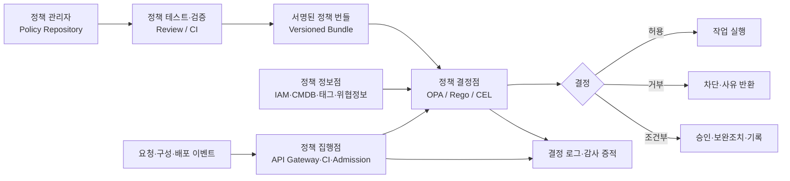
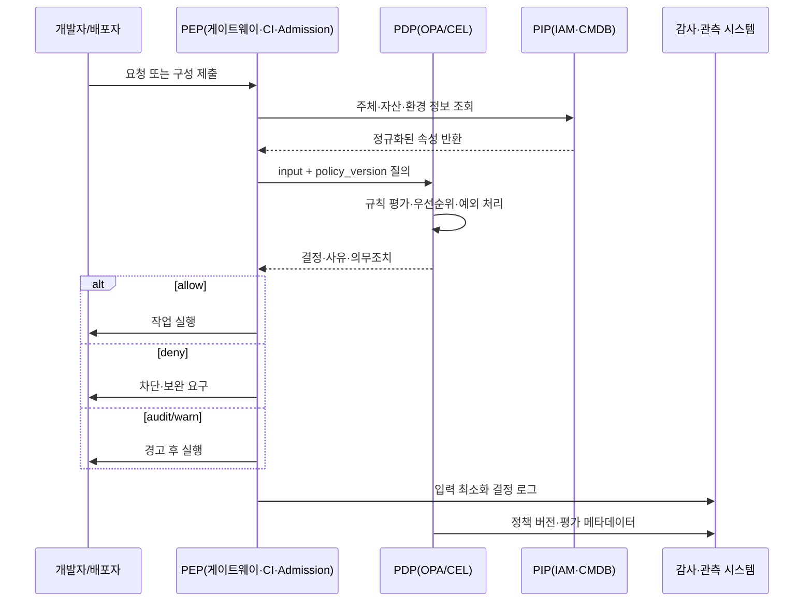

# 정책 코드화(Policy as Code)와 실행형 거버넌스

## 1. 개요

> 정책 코드화(Policy as Code)는 조직의 보안·준법·운영 규칙을 사람이 읽는 문서에만 두지 않고, 버전 관리·검증·배포·실행이 가능한 기계 판독형 코드로 표현하는 접근이다.

기업의 정보화 환경은 클라우드, 컨테이너, API, IaC, CI/CD로 분산되어 있다. 따라서 “운영자는 보안 기준을 지켜야 한다”라는 선언만으로는 실제 배포를 통제하기 어렵다. 예를 들어 인터넷에 노출되는 서비스는 TLS를 사용해야 하고, 컨테이너 이미지는 승인된 레지스트리에서 받아야 하며, 개인정보를 포함한 데이터 저장소는 암호화해야 한다. 이 규칙을 위키나 점검표에만 기록하면 점검 시점과 담당자에 따라 결과가 달라진다.

정책 코드화는 정책을 소스 코드처럼 취급한다. 요구사항을 조건과 효과로 분해하고, 규칙을 저장소에서 리뷰하며, 자동 테스트와 시뮬레이션을 통과한 정책만 실행 환경으로 배포한다. 정책을 애플리케이션 코드에 흩어 놓지 않고 별도의 결정 지점으로 분리하면, 정책 변경과 기능 변경의 생명주기를 독립적으로 운영할 수 있다.

대표적인 정책 엔진인 OPA(Open Policy Agent)는 선언형 정책 언어 Rego와 정책 질의 API를 제공한다. OPA 공식 문서는 OPA가 정책 결정과 집행을 분리하여, 마이크로서비스·Kubernetes·CI/CD 파이프라인·API 게이트웨이 등 여러 계층에서 사용할 수 있다고 설명한다. 즉 OPA가 “허용·거부” 또는 구조화된 판단을 반환하고, 호출한 시스템이 그 판단을 실제 차단·허용·수정으로 집행하는 구조다.

정책 코드화의 목표는 통제를 강화하는 것만이 아니다. 동일한 규칙을 개발·검증·배포·운영 단계에서 반복 적용하고, 누가 언제 어떤 근거로 규칙을 변경했는지 추적하여 속도와 감사 가능성을 함께 확보하는 것이 핵심이다.

### 1.1 등장 배경과 필요성

첫째, 인프라의 생성 속도가 사람의 사전 검토 속도를 앞질렀다. 개발자가 Terraform으로 네트워크와 데이터베이스를 몇 분 안에 만들 수 있는데, 보안 담당자의 수동 승인만 기다리면 병목이 된다. 정책을 파이프라인의 자동 검사로 옮기면 빠른 변경을 허용하면서도 최소 기준을 지킬 수 있다.

둘째, 동일한 업무 규칙이 여러 도구에 중복된다. 이미지 출처 제한을 CI에서 한 번, 클러스터 입구에서 한 번, 운영 감사에서 한 번 구현하면 도구별 표현 차이와 누락이 생긴다. 공통 정책 모델과 결정 인터페이스를 두고 각 집행 지점에 어댑터를 두는 편이 일관성 관리에 유리하다.

셋째, 규제와 감사는 결과뿐 아니라 근거를 요구한다. 정책 파일의 커밋, 리뷰 승인, 테스트 결과, 배포 버전, 결정 로그를 연결하면 “왜 이 요청이 차단되었는가”를 재현할 수 있다. 다만 결정 로그에 개인정보나 비밀값을 그대로 남기면 새 위험이 되므로 입력 최소화와 마스킹이 필요하다.

### 1.2 핵심 용어

| 용어 | 의미 | 기술사 답안에서의 관점 |
|---|---|---|
| 정책(Policy) | 지켜야 할 규칙과 예외, 적용 범위 | 업무 요구를 조건·효과로 형식화 |
| 정책 결정점(PDP) | 입력을 평가하여 결정을 반환하는 구성요소 | OPA와 같은 판단 엔진의 분리 |
| 정책 집행점(PEP) | 결정에 따라 허용·거부·수정하는 지점 | API 게이트웨이, CI, API 서버 등 |
| 정책 관리자(PAP) | 정책 작성·검토·승인·배포를 관리하는 체계 | 저장소와 승인 워크플로 |
| 정책 정보점(PIP) | 결정에 필요한 사용자·자산·환경 정보를 제공 | IAM, CMDB, 태그, 위협정보 연계 |
| 정책 번들 | 정책과 참조 데이터를 묶어 배포하는 단위 | 무결성·버전·롤백의 기준 |
| 관찰 모드 | 차단하지 않고 위반을 측정·기록하는 운영 모드 | 점진 도입과 오탐 조정 |

정책은 단순한 if 문이 아니라 결정의 맥락을 포함한다. 주체, 행위, 대상, 환경, 시간, 위험도, 데이터 분류가 입력에 들어가며, 결과도 allow/deny 하나로 끝나지 않을 수 있다. 예를 들어 “허용하되 사유를 기록하고 관리자 승인을 요구하라”처럼 의무 조치와 설명을 함께 반환할 수 있다.

## 2. 정책 코드화의 구성 원리와 개념도

### 2.1 정책 결정과 집행의 분리

정책 결정점은 “이 요청이 규칙을 만족하는가”를 판단하고, 정책 집행점은 “판단 결과를 어떤 기술 동작으로 옮길 것인가”를 책임진다. 이 분리를 지키면 같은 정책을 HTTP API, 메시지 소비자, IaC 검사, Kubernetes Admission에서 재사용할 수 있다.

반대로 애플리케이션마다 권한 로직을 직접 구현하면 서비스별 해석이 달라진다. 어느 서비스는 관리자 역할만 확인하고, 다른 서비스는 리소스 소유자까지 확인하는 식으로 정책이 분열된다. PDP는 공통 판단을 제공하되, PEP가 자신의 프로토콜과 실패 처리에 맞게 실행하도록 경계를 명확히 한다.

위 구조에서 PAP는 코드 저장소와 승인 절차를 의미한다. 단순히 정책 파일을 중앙에 모으는 것만으로는 충분하지 않으며, 변경 이유와 적용 범위를 함께 관리해야 한다. CI는 문법 검사, 단위 테스트, 회귀 테스트, 성능 테스트, 금지된 함수나 범위 초과 여부 검사를 수행한다.

PIP는 정책이 외부 사실을 필요로 할 때 중요하다. 사용자의 역할, 자산의 소유 조직, 데이터의 민감도, 이미지의 서명 상태가 신뢰 가능한 데이터로 들어오지 않으면 PDP의 결정도 정확할 수 없다. 따라서 PIP 데이터의 출처·갱신주기·신선도·권한을 정책의 전제조건으로 관리한다.

### 2.2 정책 입력·결정·효과 모델

정책 입력은 JSON과 같은 구조화된 요청으로 정규화한다. 일반적으로 `subject`, `action`, `resource`, `context`를 기본 축으로 두고, 클라우드에서는 계정·리전·태그·네트워크 위치를, 개인정보 처리에서는 데이터 분류·목적·보관기간을 추가한다.

결정은 최소한 `allow`와 `deny`를 포함하되, 운영에 필요한 설명을 함께 담는다. `reason`, `obligations`, `matched_rules`, `policy_version`, `risk_score`를 포함하면 PEP와 감사 시스템이 동일한 판단 결과를 활용할 수 있다.

효과(effect)는 차단만 의미하지 않는다. 값을 기본화하는 mutate, 경고를 남기는 warn, 검토 큐로 보내는 require-approval, 사후 검사 대상으로 표시하는 audit를 구분해야 한다. 효과를 섞어 쓰면 사용자는 “왜 배포가 성공했는데 나중에 위반으로 잡혔는가”를 이해하기 어려워진다.

이 흐름에서 PEP가 PIP를 직접 호출할지 PDP가 호출할지는 배치와 보안 경계에 따라 결정한다. 지연시간이 중요한 API 요청에서는 짧은 TTL 캐시를 사용하되, 권한 취소와 같은 이벤트가 캐시에 남지 않도록 무효화 전략을 둔다. 반면 고위험 데이터 접근은 최신 속성 확인을 우선하여 캐시를 제한할 수 있다.

### 2.3 선언형 규칙과 정책 언어

선언형 정책은 “어떻게 프로그램을 실행할지”보다 “어떤 상태가 허용되는지”를 표현한다. 이는 정책 작성자가 인프라 구현 세부사항을 모두 알지 않아도 통제 목표를 작성하게 한다. 다만 선언형이라는 이유로 모호성이 자동으로 사라지는 것은 아니므로 용어 사전과 입력 스키마가 필요하다.

OPA의 Rego는 계층적 구조 데이터를 대상으로 규칙을 정의하는 선언형 언어다. OPA는 입력을 평가하고 구조화된 결과를 반환하며, HTTP API·CLI·라이브러리 등으로 조회할 수 있다. 애플리케이션이 판단 로직을 직접 갖지 않고 OPA에 결정을 위임하는 것이 핵심이다.

Kubernetes에서는 Admission 단계에서 객체 생성·수정·삭제 요청을 정책으로 검사할 수 있다. API 서버가 Admission Review를 OPA에 보내고 응답을 받아 요청을 허용하거나 거부하는 방식이며, 여러 Admission Controller 중 하나라도 거부하면 전체 요청이 거부되는 “거부 우선” 특성을 고려해야 한다.

Kubernetes의 선언형 Admission Policy는 웹훅과 달리 API 서버 내부에서 CEL(Common Expression Language)을 평가하는 방식도 제공한다. 공식 문서 기준으로 `ValidatingAdmissionPolicy`는 제약 검증에, `MutatingAdmissionPolicy`는 입장 시 객체 변경에 사용하며, 정책 객체와 별도의 바인딩 객체로 대상과 범위를 연결한다.

## 3. 적용 영역과 구현 절차

### 3.1 SDLC·CI/CD 정책

개발 단계에서는 비밀키가 소스에 포함되지 않았는지, 라이선스가 승인 목록에 있는지, 의존성 취약점 기준을 초과하지 않았는지 검사한다. 이 단계의 정책은 빠른 피드백이 중요하므로 커밋·풀 리퀘스트마다 실행하고, 실패한 규칙과 수정 예시를 개발자에게 제공해야 한다.

빌드 단계에서는 산출물의 출처, 빌드 도구 버전, 의존성 목록, 테스트 통과 여부를 평가한다. 정책은 “취약점이 하나라도 있으면 무조건 실패”처럼 단순하지 않고, 심각도·악용 가능성·노출 범위·완화 조치·예외 만료일을 함께 고려해야 한다.

배포 단계에서는 승인된 이미지 레지스트리, 서명 또는 증명서(attestation), 최소 권한 서비스 계정, 네트워크 경계, 리소스 요청·제한을 확인한다. GitHub 공식 문서는 Sigstore Policy Controller를 사용하여 유효한 아티팩트 증명을 가진 이미지만 배포하도록 구성할 수 있다고 설명한다. 이러한 공급망 정책은 이미지가 어디서 어떻게 빌드되었는지를 소비자가 확인하는 근거가 된다.

정책은 파이프라인의 한 단계로만 두지 않는다. 배포 전에 검사했더라도 실제 클러스터의 수동 변경이나 드리프트가 생길 수 있으므로 Admission과 주기적 감사로 재검증한다. 사전검사와 실행 시점 검사의 규칙이 서로 다르면 통제 공백이 생기므로 동일 정책 또는 의미적으로 동등한 정책을 사용한다.

### 3.2 IaC·클라우드 거버넌스

Terraform, CloudFormation, Kubernetes 매니페스트와 같은 IaC는 실제 인프라 상태를 만들기 전에 정책 입력으로 변환할 수 있다. 공용 객체 스토리지의 공개 설정 금지, 암호화 키 지정, 허용 리전 제한, 최소 태그 부여, 과도한 권한 부여 금지 등을 계획 단계에서 검사한다.

계획(plan) 시점의 장점은 변경을 차단하기 전에 개발자가 차이를 볼 수 있다는 점이다. 반면 실제 리소스에 적용된 후의 상태와 외부 시스템이 제공하는 속성을 모두 알 수 없다는 한계가 있다. 따라서 plan 검사, apply 권한 통제, 주기적 drift 검사, 클라우드 이벤트 기반 재평가를 조합한다.

정책 입력에는 계정·조직·환경 정보를 포함해야 한다. 동일한 데이터베이스라도 개발 계정에서는 테스트용 공개 접근이 허용될 수 있지만, 운영 계정에서는 금지될 수 있다. 이런 예외는 코드에 하드코딩하기보다 환경 속성과 만료일을 가진 명시적 예외 객체로 관리한다.

### 3.3 API·마이크로서비스 인가

API 인가는 인증 성공 여부와 다르다. 인증은 주체가 누구인지 확인하고, 정책은 그 주체가 특정 리소스에 특정 행위를 할 수 있는지를 판단한다. 정책 입력에 사용자·서비스·리소스 소유자·HTTP 행위·요청 출처·시간·위험 신호를 넣어 세밀한 결정을 내린다.

RBAC는 역할에 권한을 부여하여 운영이 단순하지만 역할 폭증과 과도한 권한 문제가 생긴다. ABAC는 속성 조합으로 유연성을 확보하지만 속성 품질과 정책 복잡도가 중요해진다. 정책 코드화는 두 모델을 경쟁시키기보다, 기본 역할은 RBAC로 두고 고위험 행위·데이터 등급·환경 조건은 ABAC로 보완하는 방식으로 사용할 수 있다.

실행 시에는 기본 거부(default deny)를 원칙으로 한다. 정책 엔진 장애 때 요청을 허용하는 fail-open은 가용성은 높지만 보안 위험이 크고, 모든 요청을 거부하는 fail-closed는 안전하지만 장애 전파가 크다. 업무 중요도와 데이터 민감도에 따라 동작을 구분하고, 장애 시에도 감사 가능한 대체 경로를 마련해야 한다.

### 3.4 Kubernetes Admission과 런타임

Admission은 API 서버에 들어오는 리소스를 저장하기 전에 검사하는 경계다. 검증 정책은 조건을 만족하지 않는 요청을 거부하고, 변이 정책은 기본 라벨·보안 컨텍스트·리소스 값을 보완할 수 있다. 변이만 사용하면 사용자가 명시한 위험한 값까지 자동으로 안전하게 바뀐다고 오해할 수 있으므로, 변이 이후 검증을 연결해야 한다.

Pod Security Admission은 Kubernetes에 내장된 정책 집행 기능으로, `privileged`, `baseline`, `restricted`의 격리 수준을 네임스페이스에 적용한다. `enforce`는 위반 Pod를 거부하고, `audit`는 감사 이벤트에 표시하며, `warn`은 사용자에게 경고하지만 요청은 허용한다. 단계적 도입에서는 warn과 audit로 현황을 파악한 뒤 위험도가 낮은 네임스페이스부터 enforce로 전환한다.

웹훅 기반 정책 엔진은 확장성이 좋지만 네트워크 지연, 인증서 만료, 엔드포인트 장애, 재귀 호출을 고려해야 한다. API 서버와 정책 엔진 사이의 TLS, 타임아웃, 실패 정책, 고가용성, 정책 캐시를 운영 기준으로 정의한다. 모든 요청을 원격 엔진에 보내는 구조라면 대규모 배포 시 병목이 될 수 있으므로 평가 지연시간과 동시성을 측정한다.

### 3.5 데이터·개인정보 보호

데이터 정책은 누가 어떤 목적으로 어떤 항목을 얼마나 오래 처리할 수 있는지를 표현한다. 데이터 분류, 처리 목적, 보관기간, 국외 이전 여부, 마스킹 필요성, 파기 상태를 속성으로 정규화하면 ETL·API·분석 플랫폼에서 같은 판단을 재사용할 수 있다.

정책은 데이터 거버넌스 카탈로그와 연결되어야 한다. 카탈로그에 민감도와 소유자가 없으면 정책 엔진은 입력을 받지 못하고, 입력이 오래되면 잘못된 허용이나 과도한 차단이 발생한다. 데이터 품질·계보·소유권을 정책 정보의 신뢰성 지표로 관리해야 한다.

결정 로그에는 원문 개인정보 대신 식별자 해시, 데이터 등급, 목적 코드, 정책 버전 같은 최소 정보만 남긴다. 로그 접근 자체도 별도 정책의 대상이며, 보관기간이 지나면 파기하거나 집계한다. 정책 코드화가 개인정보 보호를 자동으로 보장하는 것은 아니고, 최소수집과 목적 제한을 실행 가능한 규칙으로 옮기는 수단이라는 점을 명확히 한다.

## 4. 정책 생명주기와 운영 거버넌스

### 4.1 요구사항을 실행 규칙으로 변환

정책 작성 전에 자연어 요구사항의 주체·행위·대상·조건·효과를 분리한다. “중요 시스템은 안전하게 운영한다”는 문장을 “운영 계정의 공개 객체 스토리지 생성 요청은 암호화 키가 있고 공개 ACL이 없을 때만 허용한다”처럼 판정 가능한 문장으로 바꾼다.

각 정책에는 적용 범위, 예외 조건, 위반 메시지, 담당자, 위험도, 시행일, 만료일을 함께 둔다. 예외 없는 정책은 현실에서 우회되기 쉽고, 만료 없는 예외는 영구적인 취약점이 된다. 예외를 별도 승인 객체로 만들어 변경 이력과 종료 조건을 추적한다.

### 4.2 테스트와 검증

정책 테스트는 정상 허용, 명백한 거부, 경계값, 누락 속성, 악성 입력, 예외 만료, 정책 충돌을 포함해야 한다. 단일 예시만 통과하는 정책은 운영 데이터의 다양성을 반영하지 못한다. 입력 스키마를 고정하고 스키마 변경 시 하위 호환성 검사를 실행한다.

회귀 테스트는 기존에 허용되던 업무가 새 정책 때문에 중단되지 않는지 확인한다. 반대로 기존 정책이 새 공격 경로를 허용하지 않는지도 테스트한다. 규칙의 커버리지와 실제 위반 발생률을 측정하여 “테스트가 많다”가 “통제가 충분하다”와 같지 않음을 관리한다.

정책 성능도 품질 항목이다. API 인가에서는 평가 지연시간, 번들 로딩 시간, 캐시 적중률, 동시 요청 처리량을 측정하고, Admission에서는 대량 배포와 API 서버 재시작 시의 안정성을 측정한다. 정책이 복잡해질수록 성능과 설명 가능성의 균형을 잡아야 한다.

### 4.3 배포·승인·롤백

정책 배포는 애플리케이션 배포와 분리하되 동일한 변경관리 원칙을 따른다. 코드 리뷰, 자동 테스트, 보안 담당자 승인, 서명된 번들 생성, 대상 환경 배포, 결과 관찰 순서로 진행한다. 정책 버전은 결정 로그에 기록하여 특정 요청이 어떤 규칙으로 평가됐는지 재현할 수 있게 한다.

처음부터 차단 모드로 적용하면 업무 중단과 우회가 발생할 수 있다. 관찰 모드에서 위반을 수집하고, 영향도와 오탐을 분석한 뒤, 일부 환경의 경고 모드와 제한적 강제 모드를 거쳐 전사 적용한다. 단, 인증 우회나 고위험 데이터 유출처럼 즉시 차단해야 하는 규칙은 예외적인 긴급 경로를 둔다.

롤백은 이전 정책 번들을 다시 배포하는 방식으로 구현한다. 롤백 권한은 운영자 단독 권한으로 두지 않고 사후 승인과 사유 기록을 요구한다. 정책 롤백이 애플리케이션의 안전하지 않은 상태를 재허용할 수 있으므로, 금지 규칙의 최소 집합은 별도 보호 영역으로 관리한다.

### 4.4 모니터링과 감사

정책 운영 지표는 허용·거부 건수만으로 부족하다. 정책별 위반률, 예외 사용률, 경고 후 수정률, 결정 지연시간, PDP 오류율, 번들 버전 분포, 정책 미적용 자산 수를 함께 본다. 지표가 급격히 변하면 정책 변경 오류와 공격 활동을 구분해 조사한다.

거부 메시지는 개발자가 수정할 수 있을 만큼 구체적이어야 하지만, 내부 구조나 민감한 정보가 노출되어서는 안 된다. 사용자에게는 규칙 ID·위반 속성·보완 방법을 제공하고, 내부 로그에는 상관관계 ID와 전체 진단 정보를 보관한다.

감사는 정책 코드, 리뷰 승인, 테스트 결과, 배포 시간, 적용 대상, 결정 로그, 예외 승인까지 연결해야 한다. 이렇게 하면 통제 설계와 실제 운영 효과를 함께 증명할 수 있다. 정책 파일만 보관하고 집행 로그를 남기지 않으면 실행형 거버넌스가 아니라 문서화된 의도에 머문다.

## 5. 비교·사례·출제 연계

### 5.1 유사 접근과 비교

| 구분 | 전통적 문서 정책 | 애플리케이션 내장 규칙 | Policy as Code |
|---|---|---|---|
| 표현 | 자연어·점검표 | 서비스별 소스 코드 | 선언형 정책 코드 |
| 변경 추적 | 수동 문서 이력 | 애플리케이션 릴리스에 종속 | 저장소 리뷰·버전·승인 |
| 적용 시점 | 사후 점검 중심 | 해당 서비스 실행 시점 | 개발·배포·실행·감사 전 단계 |
| 재사용성 | 해석에 의존 | 서비스 간 낮음 | 공통 PDP와 어댑터로 높음 |
| 실패 위험 | 담당자 편차 | 정책 중복·누락 | 중앙 장애·정책 복잡도 |
| 핵심 보완 | 점검 자동화 | 공통 라이브러리 | 테스트·관찰·롤백·고가용성 |

문서 정책은 조직의 목적과 원칙을 설명하는 데 강하다. 법적 해석, 예외 승인, 윤리적 판단처럼 완전한 자동화가 어려운 부분을 담을 수 있다. 그러나 문서만으로는 모든 시스템에 동일하게 적용되었다고 증명하기 어렵다.

애플리케이션 내장 규칙은 도메인 맥락을 깊게 이해하지만 서비스가 늘어날수록 중복과 불일치가 커진다. Policy as Code는 공통 규칙을 분리하여 일관성을 높이지만, 모든 업무 의미를 중앙 정책 엔진에 넣으면 정책 저장소가 거대한 모놀리스가 될 수 있다. 공통 보안 기준과 도메인 특화 판단의 경계를 설계해야 한다.

### 5.2 사례: 컨테이너 공급망과 클러스터 배포

가상의 금융 플랫폼이 컨테이너를 Kubernetes 운영 클러스터에 배포한다고 가정한다. 조직 정책은 승인 레지스트리 사용, 서명 또는 빌드 증명 확인, `restricted` 수준의 Pod 보안, CPU·메모리 요청 지정, 운영 네임스페이스의 공개 서비스 금지다.

첫 단계에서 CI는 매니페스트와 이미지 메타데이터를 검사한다. 승인되지 않은 레지스트리, 증명 없는 이미지, privileged 컨테이너, 리소스 제한 누락을 경고 또는 실패로 표시한다. 이때 개발자가 수정할 수 있도록 파일 경로, 규칙 ID, 보완 예시를 제공한다.

두 번째 단계에서 클러스터 Admission은 동일한 핵심 규칙을 재검증한다. CI를 우회한 수동 적용이나 다른 파이프라인에서 온 요청도 같은 경계를 통과해야 하기 때문이다. 공급망 증명을 검사하는 Policy Controller는 이미지의 증명과 신뢰 루트를 확인하여 배포 가능 여부를 판단할 수 있다.

세 번째 단계에서 운영 감사는 실제 객체와 정책 기대값을 비교한다. 정책이 바뀌었거나 기존 리소스가 수동으로 변경된 경우를 찾아 보정 티켓을 생성한다. 즉 사전검사, 입장 통제, 사후감사를 연결하여 단일 통제 실패가 전체 보호 실패로 이어지지 않게 한다.

이 사례의 핵심은 “모든 것을 차단”하는 것이 아니다. 신규 애플리케이션은 강제 모드로, 레거시 네임스페이스는 관찰·경고 모드로 시작하고, 위험도와 수정률에 따라 단계적으로 전환한다. 예외에는 서비스 오너, 사유, 보완통제, 만료일을 포함한다.

### 5.3 기술사 답안 구성 전략

논술형 답안에서는 먼저 Policy as Code의 정의와 등장 배경을 제시하고, 문서 정책과 실행 정책의 간극을 문제로 제기한다. 이어 PDP·PEP·PAP·PIP의 구성도와 입력-결정-효과 흐름을 제시하면 개념의 체계성이 드러난다.

본론에서는 SDLC, IaC, API 인가, Kubernetes Admission, 데이터 보호 중 세 가지 이상을 선택하여 적용 시점과 통제 효과를 설명한다. 각 적용 영역마다 단순 도구 소개가 아니라 어떤 정책을 어떤 입력으로 평가하고, 위반 시 어떤 효과를 내며, 어떤 로그를 남기는지 서술한다.

마지막에는 테스트·관찰·예외·롤백·고가용성·개인정보 최소화의 트레이드오프를 기술사 관점에서 정리한다. “자동화하면 안전하다”라고 결론내리지 말고 정책 품질, 입력 데이터 신뢰성, 운영 장애, 책임소재까지 언급해야 심화 답안이 된다.

## 6. 심화: 실행형 거버넌스의 발전 방향

정책 코드화는 보안팀만의 규칙 저장소가 아니라 조직의 실행형 거버넌스 기반으로 확장될 수 있다. 비용 태그 누락, 리전 제한, 데이터 보관기간, 모델 사용 조건, 아키텍처 표준을 같은 생명주기로 관리하면 기술 표준과 경영 목표를 배포 과정에 연결할 수 있다.

다만 정책이 많아지면 상호 충돌과 정책 피로가 발생한다. 조직 정책, 사업부 정책, 환경 정책, 서비스 예외의 우선순위를 명시하고, 충돌 시 거부·상위 정책 우선·관리자 승인 중 어떤 전략을 택할지 결정한다. 정책 그래프와 영향 분석으로 변경 전 영향을 예측하는 것도 필요하다.

AI 에이전트와 자동화 워크플로에서는 주체가 사람뿐 아니라 모델·에이전트·서비스 계정이 된다. 요청을 실행한 주체, 위임 체인, 도구 호출, 데이터 목적, 사람 승인 여부를 입력에 포함해야 하며, 단순한 사용자 역할만으로는 충분하지 않다. 고위험 행위에는 최소 권한·짧은 토큰 수명·명시적 승인·행위 기록을 결합한다.

정책 결정이 분산된 환경에서는 결정의 일관성이 중요하다. 지역별 PDP가 서로 다른 번들을 사용하면 같은 요청이 다른 결과를 낼 수 있으므로 번들 해시, 유효 시각, 배포 상태를 관찰한다. 네트워크가 단절된 엣지 환경은 마지막으로 승인된 정책을 제한된 기간 동안 사용할지, 안전 모드로 전환할지 사전에 정한다.

정책 코드 자체도 공급망 보호 대상이다. 정책 저장소의 브랜치 보호, 서명 커밋, 리뷰어 분리, 테스트 데이터의 비밀 제거, 번들 서명, 배포 대상 검증을 적용한다. 공격자가 정책을 바꾸면 애플리케이션 취약점을 고치지 않고도 통제를 무력화할 수 있기 때문이다.

## 7. 고려사항 및 시사점

### 7.1 정책 품질과 모호성

자연어 정책을 곧바로 코드로 옮기면 모호한 예외와 책임 공백이 남는다. 먼저 용어, 속성, 허용 범위, 금지 범위, 예외, 만료를 업무 담당자와 합의하고 판정 가능한 테스트 케이스로 만든다.

### 7.2 입력 데이터의 신뢰성

PDP가 정확해도 IAM 역할, 자산 태그, 데이터 분류가 틀리면 잘못된 결정을 내린다. 속성의 출처·최종 갱신시간·소유자를 관리하고, 중요한 속성 누락 시 안전한 기본값과 경보를 정의한다.

### 7.3 가용성과 실패 처리

중앙 정책 엔진은 공통 통제점이므로 고가용성, 지역 분산, 캐시, 타임아웃, 장애 격리를 설계한다. fail-open과 fail-closed 중 하나를 전사 공통으로 고정하지 말고 업무·데이터 위험도별로 결정한다.

### 7.4 점진적 강제와 사용자 경험

정책 위반을 모두 즉시 차단하면 현업은 정책을 우회하려 한다. 관찰→경고→부분 강제→전면 강제의 단계와 전환 기준을 정하고, 위반 메시지와 자동 수정 방법을 제공하여 정책을 개발자 경험에 통합한다.

### 7.5 예외와 책임성

예외는 현실적인 운영 장치이지만 영구 우회로 변질되기 쉽다. 승인권자, 사유, 위험 수용자, 보완통제, 만료일, 재검토 주기를 필수 필드로 만들고, 만료 임박 예외를 자동 알림한다.

### 7.6 개인정보와 감사 로그

정책 결정 로그는 감사에 유용하지만 입력 전체를 복제하면 개인정보 침해가 된다. 목적에 필요한 최소 속성만 저장하고, 민감 필드는 토큰화·마스킹하며, 로그 열람 권한과 보관기간도 정책으로 통제한다.

### 7.7 표준화와 도메인 자율성

전사 공통 보안 기준은 중앙화하되, 업무 도메인의 세부 규칙까지 하나의 팀이 독점하면 병목이 된다. 정책 인터페이스와 공통 속성 모델을 표준화하고, 도메인 팀이 소유한 정책을 중앙 거버넌스가 검증하는 연합 모델이 현실적이다.

### 7.8 성과 측정

정책 수나 코드 줄 수를 성과로 삼으면 복잡성만 늘어난다. 차단한 고위험 변경, 정책 위반 수정시간, 예외 감소율, 감사 증적 준비시간, 정책 평가 지연시간, 장애로 인한 업무 중단을 함께 측정하여 통제와 생산성의 균형을 확인한다.

## 참고자료

- Open Policy Agent, “Open Policy Agent (OPA) and policy-as-code” — https://openpolicyagent.org/docs
- Open Policy Agent, “OPA for Kubernetes Admission Control” — https://www.openpolicyagent.org/docs/kubernetes
- Kubernetes, “Pod Security Admission” — https://kubernetes.io/docs/concepts/security/pod-security-admission/
- Kubernetes, “Explore Validating and Mutating Admission Policies” — https://kubernetes.io/docs/tutorials/cluster-management/admission-policies/
- GitHub Docs, “Kubernetes admissions controller” — https://docs.github.com/en/actions/concepts/security/kubernetes-admissions-controller

---

> **한 줄 요약**: 정책 코드화는 정책을 선언형 코드로 버전·검증·배포하고 PDP의 판단과 PEP의 집행을 연결하여, 보안·준법·운영 거버넌스를 개발부터 런타임까지 반복 가능하게 만드는 실행형 통제 방식이다.
