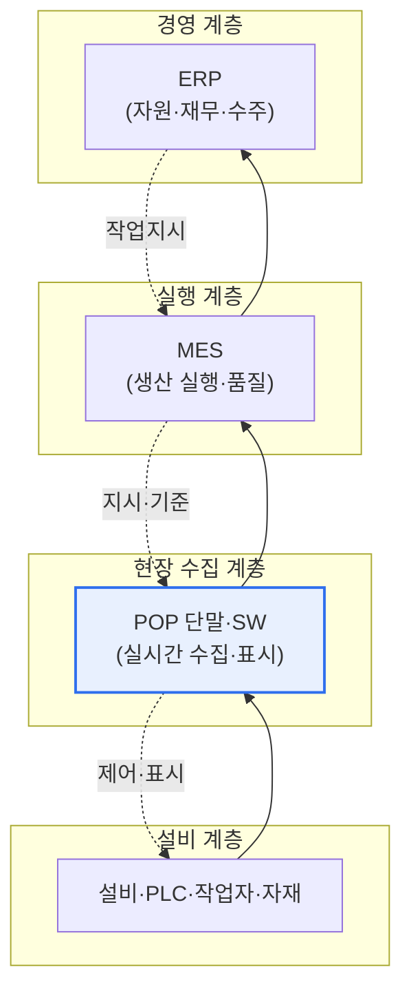

# POP(Point Of Production, 생산시점관리)

## 1. 개요

### 가. 정의

> **POP(Point Of Production, 생산시점관리)** 는 생산 현장에서 발생하는 정보를 **발생 시점(real-time)과 발생 장소(on-site)에서 즉시 수집·처리** 하여 생산 관리에 활용하는 시스템이다. 소매 판매 시점을 관리하는 POS(Point Of Sales)의 생산 버전에 해당하며, 현장 설비·작업자와 상위 정보시스템을 잇는 데이터 수집 계층이다.

POP의 핵심 가치는 '생산 현장의 실시간 가시성(shop-floor visibility) 확보'다. 과거의 공장에서는 작업자가 종이 작업일보에 생산 실적과 불량을 손으로 적고, 이를 하루나 한 교대가 끝난 뒤 사무실에서 일괄 입력했다. 이 방식에서는 관리자가 '지금 이 순간' 라인이 어떻게 돌아가는지, 어느 공정에서 불량이 얼마나 나오는지를 알 방법이 없었다. 문제를 인지했을 때는 이미 불량이 대량 발생한 뒤였고, 대응은 언제나 사후적이었다.

POP는 이 지연과 부정확을 근본적으로 없앤다. 설비·작업자·자재에서 나오는 데이터, 즉 생산량·가동상태·불량·작업시간 같은 정보를 그것이 발생하는 바로 그 순간, 그 자리에서 자동으로 수집한다. 그러면 관리자는 현장을 실시간 대시보드로 파악해 이상이 생긴 즉시 대응할 수 있고, 사람의 기억이나 필체가 아니라 기계가 기록한 정확한 데이터로 생산성·품질을 관리하게 된다. 요컨대 POP는 '보이지 않던 현장을 보이게 만드는' 계층이며, 이 실시간·정확 데이터가 있어야 그 위의 MES·ERP가 신뢰할 수 있는 판단을 내릴 수 있다.

### 나. 등장 배경과 필요성

제조업의 경쟁 축이 대량생산에서 다품종 소량생산·짧은 납기·엄격한 품질로 이동하면서, 현장을 사후에 정리하는 관리 방식으로는 시장 대응이 불가능해졌다. 수기·사후 입력은 세 가지 고질적 문제를 안고 있었다. 첫째, 데이터가 부정확했다(오기·누락·추정 기입). 둘째, 데이터가 지연되어 실시간 의사결정에 쓸 수 없었다. 셋째, 설비 가동률·불량 원인 같은 세밀한 데이터를 사람이 일일이 적기 어려웠다.

여기에 스마트 팩토리·디지털 전환의 흐름이 겹치면서, 현장 데이터를 실시간으로 확보해 생산성·품질·납기를 동시에 개선하려는 요구가 강해졌다. POP는 바로 이 요구에 대한 답으로, 현장의 최일선에서 데이터를 자동 수집해 상위 시스템에 정확하게 공급하는 역할을 맡는다. 즉 POP의 필요성은 단순한 자동화가 아니라, 데이터에 근거한 생산 관리(data-driven manufacturing)의 출발점을 마련하는 데 있다.

## 2. 시스템 구성과 계층상의 위치

POP는 현장 설비·작업자로부터 데이터를 수집하는 하드웨어 단말과, 이를 처리·표시·전달하는 소프트웨어로 구성되며, 상위의 MES(제조실행시스템)·ERP와 연계된다. 자동화 피라미드에서 POP는 최하위의 데이터 수집·현장 인터페이스 계층에 위치해, 물리 설비(센서·PLC)와 정보시스템 사이의 다리 역할을 한다.

위 그림에서 보듯 데이터는 아래에서 위로(현장 실적 → MES → ERP) 흐르고, 지시는 위에서 아래로(수주·계획 → 작업지시 → 현장 표시) 내려온다. POP는 이 양방향 흐름의 최전선 접점으로, 위로는 정확한 실적 데이터를 올리고 아래로는 작업 지시·품질 기준을 현장에 표시한다.

구성요소를 조금 더 구체적으로 보면 다음과 같다. 입력 장치는 바코드·QR·RFID 리더, 터치스크린 단말, 그리고 설비에 직접 연결되는 센서·PLC 신호선으로 이루어진다. 작업자가 작업 지시서의 바코드를 찍어 작업 시작을 알리고, 완성품 수량을 터치로 입력하며, 설비의 가동/정지 신호는 센서가 자동으로 잡아낸다. POP 소프트웨어는 이렇게 들어온 신호를 실시간으로 화면에 표시하고, 1차 가공(집계·단위 환산·이상 판정)을 거쳐 상위로 전달한다.

| 구성요소 | 역할 | 예시 |
|---|---|---|
| **입력 장치** | 현장 데이터 수집 | 바코드·RFID·터치패널·센서·PLC |
| **POP 단말·SW** | 실시간 수집·표시·1차 처리 | 현장 키오스크, 전광판, 집계 로직 |
| **상위 연계** | 데이터 전달·지시 수신 | MES·ERP 인터페이스, 통신 프로토콜 |

## 3. 수집·활용 정보와 활용 프로세스

POP가 다루는 데이터는 크게 생산 실적, 설비 상태, 작업 정보, 품질로 나뉜다. 각 항목은 단순한 숫자 수집으로 끝나지 않고, 실시간 관리 지표로 가공되어 현장 개선으로 이어진다는 점이 중요하다.

생산 실적은 생산량·양품/불량 수량·공정 진척으로, 계획 대비 실적을 실시간 비교해 납기 지연을 조기에 감지하게 한다. 설비 상태는 가동·정지·고장 신호로, 이를 누적하면 설비 가동률과 나아가 **OEE(설비종합효율, 가동률×성능×품질)** 를 산출할 수 있다. 작업 정보는 작업자·작업시간·공정 정보로, 표준 시간 대비 실제 작업 시간을 비교해 병목 공정을 찾아낸다. 품질 데이터는 불량 유형과 발생 지점으로, 어느 공정 어느 설비에서 어떤 불량이 몰리는지를 실시간으로 드러내 원인 분석의 근거가 된다.

| 구분 | 수집 내용 | 활용 지표 |
|---|---|---|
| **생산 실적** | 생산량·양품/불량·진척 | 계획 대비 실적, 납기 준수율 |
| **설비 상태** | 가동·정지·고장 | 가동률, OEE |
| **작업 정보** | 작업자·작업시간·공정 | 표준시간 대비 편차, 병목 |
| **품질** | 불량 유형·발생 지점 | 불량률, 원인 파레토 분석 |

이 수집→처리→연계→분석→개선의 순환이 실시간으로 돌면, 관리자는 '어제 무슨 일이 있었나'가 아니라 '지금 무엇이 벌어지고 있으며 무엇을 바꿔야 하나'를 다룰 수 있게 된다. 이것이 POP가 만드는 관리 패러다임의 전환이다.

## 4. POS·MES와의 비교

POP는 개념적으로 POS에서 출발했지만 대상과 목적이 다르며, MES와는 계층 관계로 구분해야 혼동을 피할 수 있다. 단순히 명칭이 비슷하다고 같은 것으로 다루면 시스템 설계에서 역할 중복이나 누락이 생긴다.

| 구분 | POS | POP | MES |
|---|---|---|---|
| 대상 시점 | 판매 시점 | 생산 시점 | 생산 실행 전반 |
| 주 목적 | 판매·재고 실시간 관리 | 현장 데이터 실시간 수집 | 생산 계획·실행·품질 통합 관리 |
| 계층 | 매장 접점 | 현장 수집 계층 | 실행 관리 계층 |
| 데이터 방향 | 판매→본사 | 현장→상위 | 지시↔실적 조율 |

POP와 MES의 관계가 특히 자주 혼동된다. POP는 '데이터를 어떻게 정확히·실시간으로 걷어 올리느냐'에 집중하는 수집 계층이고, MES는 그렇게 올라온 데이터를 바탕으로 작업 지시·일정·품질·추적을 총괄하는 실행 관리 계층이다. 비유하자면 POP는 현장의 눈과 손이고, MES는 그 감각 정보를 받아 판단하는 두뇌다. 실제 프로젝트에서 MES를 도입하려다 현장 데이터 수집 기반, 즉 POP가 부실해 MES가 헛도는 사례가 흔하다. 정확한 실적 데이터가 없으면 아무리 좋은 MES도 쓰레기 데이터를 정교하게 가공할 뿐이기 때문이다.

## 5. 심화: IoT·스마트팩토리 시대의 POP 진화

전통적 POP가 사람이 터치·바코드로 입력하는 반자동 방식이었다면, 최근의 POP는 IoT 센서와 설비 통신으로 사람 개입을 줄이는 자동 수집으로 진화하고 있다. 이 변화의 배경에는 두 가지 축이 있다.

첫째는 **연결성 표준화** 다. 과거에는 설비마다 통신 규격이 달라 이기종 설비의 데이터를 통합하기가 매우 어려웠다. 이를 해결하기 위해 **OPC-UA(Open Platform Communications Unified Architecture)** 같은 산업 표준 프로토콜이 확산되었다. OPC-UA는 벤더·플랫폼에 독립적인 정보 모델과 보안 통신을 제공해, 서로 다른 설비의 데이터를 표준 형식으로 수집·연계하도록 돕는다. 인더스트리 4.0을 주도한 독일에서는 여기에 자산 관리 셸(AAS) 등 설비 정보 표준을 더해 상호운용성을 높이고 있다. 표준화가 진전될수록 POP는 특정 설비에 종속된 수집기가 아니라, 플러그 앤 플레이에 가까운 데이터 허브로 발전한다.

둘째는 **데이터 활용의 고도화** 다. 자동 수집으로 데이터의 양과 정확도가 높아지면, 그 데이터를 실시간 모니터링에만 쓰는 것을 넘어 분석·예측으로 확장할 수 있다. 예컨대 설비 센서의 진동·온도 데이터를 축적해 고장을 사전에 감지하는 **예지보전(PdM, Predictive Maintenance)**, 공정 데이터를 학습해 불량을 예측하는 품질 예측, 나아가 현장을 가상으로 복제해 시뮬레이션하는 **디지털 트윈(Digital Twin)** 의 입력 데이터로 POP가 걷어 올린 실적이 활용된다. 실제 자동차·반도체·전자 대기업의 스마트 팩토리에서는 POP/설비 데이터가 MES와 데이터 레이크로 흘러 들어가 AI 기반 품질·설비 관리의 원천 데이터가 되고 있다.

정리하면 POP는 '사람이 적던 시대 → 단말로 찍던 시대 → 센서·IoT로 자동 수집하고 AI로 분석하는 시대'로 발전해 왔으며, 스마트 팩토리에서 POP의 위상은 단순 입력 창구에서 데이터 기반 지능화의 첫 관문으로 격상되었다.

## 6. 고려사항 및 시사점

기술사 관점에서 POP 도입·운영은 다음을 고려해야 한다.

1. **데이터 정확성·실시간성이 상위 시스템 신뢰의 전제**: POP가 부정확하거나 지연된 데이터를 올리면 MES·ERP의 모든 판단이 오염된다. 자동 수집 비중을 높이고 입력 검증·이상 판정을 두어 원천 데이터 품질을 보장하는 것이 최우선 설계 목표가 되어야 한다.

2. **표준 프로토콜 기반 상호운용성 확보**: 이기종 설비를 OPC-UA 등 표준으로 연계해야 확장·통합 분석이 가능하다. 특정 벤더에 종속된 폐쇄형 수집 구조는 장기적으로 스마트 팩토리 확장의 발목을 잡으므로, 표준화·개방형 아키텍처를 우선 검토해야 한다.

3. **MES·ERP와의 역할 분담 명확화**: POP(수집)·MES(실행 관리)·ERP(경영 자원)의 계층과 책임을 명확히 나눠야 기능 중복·누락을 피한다. 도입 순서상 견고한 POP 기반 없이 MES를 얹으면 실패하기 쉬우므로, 현장 데이터 수집 기반부터 안정화하는 단계적 로드맵이 바람직하다.

4. **분석·지능화로의 확장성 설계**: 단순 모니터링을 넘어 OEE 관리, 예지보전, 품질 예측, 디지털 트윈으로 이어질 수 있도록 데이터 모델과 저장·연계 구조를 확장 가능하게 설계해야 데이터의 재사용 가치를 극대화할 수 있다.

5. **현장 수용성과 보안**: 작업자가 실제로 쓰는 UI·운영 프로세스가 현장에 맞아야 데이터가 제대로 걷힌다. 동시에 OT(운영기술) 네트워크가 IT와 연결되면서 사이버 보안 위협이 커지므로, 네트워크 분리·인증·프로토콜 보안(OPC-UA 보안 기능 등)을 함께 설계해야 한다.

## 참고자료

- OPC Foundation, OPC-UA 개요: https://opcfoundation.org/about/opc-technologies/opc-ua/
- Plattform Industrie 4.0(독일 인더스트리 4.0): https://www.plattform-i40.de/
- 국가기술표준원/스마트제조 관련 자료(스마트 팩토리 참조 모델) 개요

---

> **한 줄 요약**: POP는 *생산 현장 정보를 발생 시점·장소에서 실시간 자동 수집* 하는 시스템으로, 설비·작업자 데이터를 걷어 MES·ERP와 연계하는 현장 수집 계층이며, OPC-UA 등 표준 기반 상호운용성과 예지보전·디지털 트윈 등 지능화 확장을 통해 스마트 팩토리의 데이터 기반이자 데이터 기반 생산 관리의 출발점이 된다.
