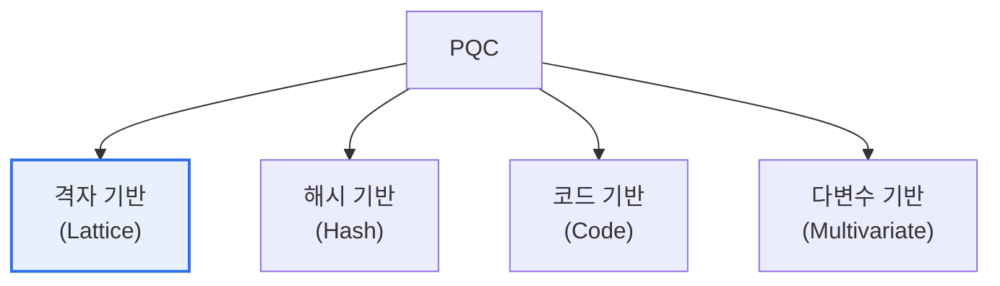

# 포스트 양자 암호(PQC, Post-Quantum Cryptography)

## 1. 개요

### 가. 정의
> **포스트 양자 암호(PQC)** 는 **양자컴퓨터로도 풀기 어려운 수학적 문제에 기반한 암호 기술**로, 양자컴퓨터가 기존 공개키 암호를 무력화하는 시대에 대비하는 '양자내성암호'다. 기존 컴퓨터에서 동작한다는 점이 양자암호통신(QKD)과 다르다.

PQC가 시급한 근본 이유는 '**양자컴퓨터가 오늘날의 공개키 암호를 통째로 깨뜨릴 수 있다**'는 데 있다. RSA·ECC 같은 공개키 암호는 소인수분해·이산대수처럼 기존 컴퓨터로는 사실상 풀 수 없는 문제에 기대어 안전을 보장한다. 그런데 양자컴퓨터가 **쇼어(Shor) 알고리즘**을 돌리면 이 문제들을 다항 시간에 풀 수 있어, RSA·ECC가 순식간에 무력화된다. 인터넷 보안의 근간(HTTPS·전자서명·VPN)이 무너지는 것이다. 더 무서운 것은 '**지금 훔쳐 나중에 푼다(Harvest Now, Decrypt Later)**'는 위협이다. 공격자가 지금 암호문을 저장해 두었다가, 양자컴퓨터가 나오면 복호화할 수 있다. 그래서 양자컴퓨터가 아직 실용화되지 않았어도 지금부터 대비해야 한다. PQC는 격자·해시·코드 기반 등 양자컴퓨터로도 어려운 새로운 수학 문제 위에 암호를 세워 이 위협에 대응한다. QKD가 양자 물리로 키를 안전하게 '분배'한다면, PQC는 소프트웨어 알고리즘으로 기존 시스템에서 바로 쓸 수 있다는 점이 실용적 강점이다. [[quantum-crypto]]

### 나. 위협 배경
쇼어 알고리즘에 의한 공개키 암호 붕괴와 'Harvest Now, Decrypt Later' 위협으로, 실용화 전부터 선제적 전환이 요구된다.

## 2. PQC 기반 문제 유형

| 유형 | 특징 |
|---|---|
| **격자 기반(Lattice)** | 격자 최단벡터 문제, 성능·범용성 우수(주류) |
| **해시 기반(Hash)** | 해시 함수 안전성 기반, 서명에 적합 |
| **코드 기반(Code)** | 오류정정부호 복호 난제, 오래 검증됨 |
| **다변수 기반(Multivariate)** | 다변수 다항식 문제 |

미국 NIST가 표준화를 주도해, 격자 기반 **CRYSTALS-Kyber**(키 교환)·**CRYSTALS-Dilithium**(전자서명) 등을 표준으로 선정했다. 격자 기반이 성능·크기 균형이 좋아 주류를 이룬다.

## 3. QKD와의 비교

| 구분 | PQC(양자내성암호) | QKD(양자키분배) |
|---|---|---|
| **기반** | 수학적 난제(SW) | 양자역학 물리(HW) |
| **동작 환경** | 기존 시스템·인터넷 | 전용 광통신 장비 |
| **적용성** | 소프트웨어 교체로 광범위 적용 | 인프라 구축 필요, 제한적 |
| **역할** | 공개키 암호 대체 | 키 분배 채널 보호 |

## 4. 고려사항 및 시사점

1. **선제적 전환(Migration)이 필요**하다. 'Harvest Now, Decrypt Later' 위협 때문에, 양자컴퓨터 실용화 전이라도 장기 보호가 필요한 데이터·시스템부터 PQC로 전환을 시작해야 한다.
2. **암호 민첩성(Crypto-Agility) 확보**가 관건이다. 알고리즘을 쉽게 교체할 수 있도록 시스템을 설계해, 표준 변화·취약점 발견에 유연하게 대응해야 한다.
3. **하이브리드 접근이 현실적**이다. 전환기에는 기존 암호와 PQC를 병행(하이브리드)해 안전성과 호환성을 모두 확보하며 점진적으로 이행하는 것이 권고된다.

---

> **한 줄 요약**: PQC는 *양자컴퓨터로도 풀기 어려운 수학 문제 기반의 양자내성암호* 로, 쇼어 알고리즘에 의한 공개키 붕괴와 선(先)수집-후(後)복호 위협에 대비하며, 격자 기반이 주류이고 암호 민첩성·하이브리드 전환이 핵심이다.
