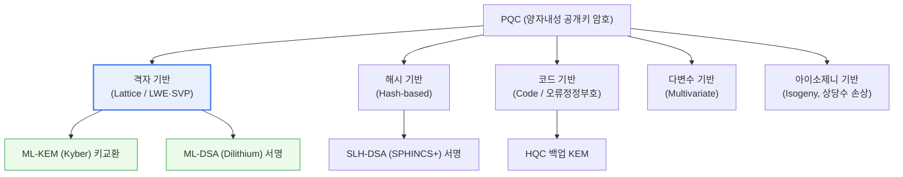
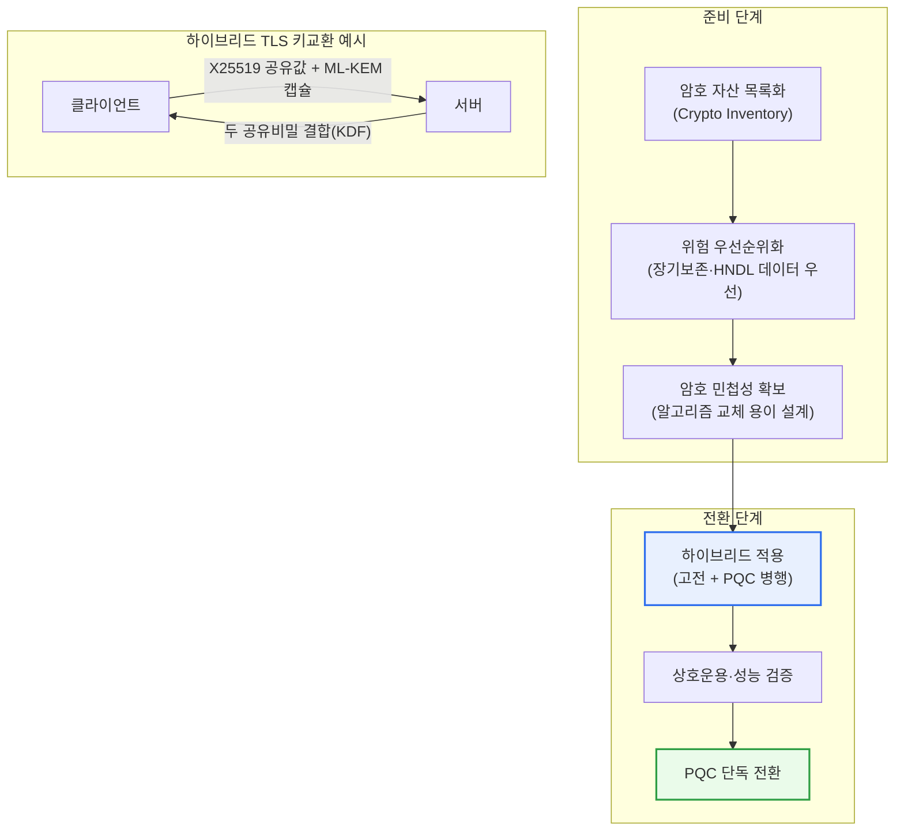

# 포스트 양자 암호(PQC, Post-Quantum Cryptography)

## 1. 개요

### 가. 정의
> **포스트 양자 암호(PQC)** 는 **대형 양자컴퓨터로도 다항 시간 안에 풀기 어렵다고 여겨지는 수학적 난제에 기반한 공개키 암호 기술**로, 양자컴퓨터가 기존 공개키 암호를 무력화하는 시대에 대비하는 '양자내성암호(Quantum-Resistant Cryptography)'다. 특수한 양자 장비가 아니라 **오늘날의 일반 컴퓨터·네트워크에서 그대로 동작**한다는 점이 양자키분배(QKD)와 본질적으로 다르다.

PQC가 시급한 근본 이유는 '**양자컴퓨터가 오늘날의 공개키 암호를 통째로 깨뜨릴 수 있다**'는 데 있다. RSA·ECC 같은 공개키 암호는 소인수분해·이산대수처럼 기존(고전) 컴퓨터로는 사실상 풀 수 없는 문제에 기대어 안전을 보장한다. 예를 들어 RSA-2048은 2048비트 합성수를 소인수분해하는 데 고전 알고리즘으로 우주의 나이를 넘는 시간이 필요하다는 점을 안전성의 근거로 삼는다. 그런데 충분히 큰 양자컴퓨터가 **쇼어(Shor) 알고리즘**을 돌리면 소인수분해와 이산대수를 **다항 시간**에 풀 수 있어, RSA·ECC·DH·DSA·ECDSA가 원리적으로 한꺼번에 무력화된다. HTTPS(TLS), 전자서명(코드 서명·전자정부 인증), VPN, 블록체인 지갑 등 인터넷 신뢰의 근간이 동시에 흔들리는 것이다.

여기서 반드시 구분할 것은 **공개키 암호와 대칭키 암호가 받는 충격의 크기가 다르다**는 점이다. 대칭키(AES)·해시(SHA-2/3)는 **그로버(Grover) 알고리즘**의 제곱근 가속만 받으므로, 탐색 공간이 2^n에서 2^(n/2)로 줄어드는 수준에 그친다. 즉 AES-128은 실효 강도가 64비트 수준으로 약화되지만 AES-256은 여전히 128비트급으로 안전하고, 해시도 출력 길이를 늘리면 방어된다.

결국 **양자컴퓨터가 정면으로 깨뜨리는 것은 '공개키' 암호이며, 대칭키는 키 길이를 2배로 늘려 대응**할 수 있다. PQC 논의가 서명·키교환(공개키) 영역에 집중되는 이유가 여기에 있다. 반대로 말하면, 조직이 양자시대에 대비할 때 '대칭키는 AES-256으로 상향, 공개키는 PQC로 대체'라는 이원(二元) 전략을 세우는 근거도 이 비대칭적 충격에서 나온다.

더 무서운 것은 '**지금 훔쳐 나중에 푼다(HNDL, Harvest Now, Decrypt Later)**'는 위협이다. 공격자가 지금 암호화된 통신을 통째로 저장해 두었다가, 훗날 양자컴퓨터가 등장하면 소급 복호화하는 시나리오다. 의료기록·국가기밀·주민등록정보·영업비밀처럼 **10~30년 이상 비밀이 유지되어야 하는 데이터**는, 양자컴퓨터가 아직 없는 오늘도 이미 위험에 노출되어 있는 셈이다. 따라서 '양자컴퓨터가 상용화되면 그때 바꾸자'는 접근은 이미 늦다. PQC는 격자·해시·코드 등 양자컴퓨터로도 어려운 새로운 수학 문제 위에 암호를 세워 이 위협에 선제적으로 대응한다. QKD가 양자 물리(관측 시 상태 붕괴)로 키를 안전하게 '분배'한다면, PQC는 순수 소프트웨어 알고리즘으로 **기존 시스템에 즉시 이식**할 수 있다는 점이 실용적 강점이다. [[quantum-crypto]]

### 나. 위협 배경과 대응의 시급성
정리하면 PQC 전환을 재촉하는 요인은 세 가지다. 첫째, 쇼어 알고리즘에 의한 **공개키 암호의 원리적 붕괴**다. 둘째, HNDL로 인해 **양자컴퓨터 상용화 이전부터 이미 시작된 위협**이다. 셋째, 대규모 인프라의 암호를 교체하는 데는 수년~십수 년이 걸리므로, '해커에게 유용한 양자컴퓨터가 나오는 시점(Q-Day)'에서 역산하면 **지금 당장 시작해도 빠듯하다**.

이 세 요인의 결합을 흔히 '**모스카의 부등식(Mosca's Theorem)**'으로 표현한다. 데이터를 지켜야 하는 기간(X)과 시스템을 PQC로 전환하는 데 걸리는 기간(Y)의 합이 양자컴퓨터 등장까지 남은 기간(Z)보다 크면(X+Y>Z) 이미 위험하다는 논리다. 예컨대 30년을 보호해야 하는 데이터(X=30)를 5년에 걸쳐 전환(Y=5)하는데 양자컴퓨터가 20년 뒤에 나온다면(Z=20), 35>20이므로 이 데이터는 오늘 이미 사실상 위험 구간에 들어와 있다는 뜻이다.

### 다. 특징
PQC의 성격은 다음 특징으로 요약된다.

- **고전 하드웨어 동작:** 특수 양자 장비 없이 기존 CPU·서버·네트워크에서 소프트웨어로 실행되어 즉시 이식 가능하다.
- **공개키 대체 중심:** 정면으로 위협받는 키교환(KEM)·전자서명 영역을 대체하며, 대칭키·해시는 키 길이 상향으로 보완한다.
- **다계열 병행:** 격자·해시·코드 등 서로 다른 수학 난제를 병행 채택해 특정 계열 파훼 시의 위험을 분산한다.
- **크기·성능 비용 수반:** 키·암호문·서명 크기가 기존 대비 커져 대역폭·지연·저장 부담이 늘어난다.
- **표준 주도 확산:** NIST·NSA 등 표준화·규제 기관의 로드맵이 도입 속도를 견인한다.

## 2. PQC 기반 문제 유형과 전체 구조

PQC는 특정 알고리즘 하나가 아니라, '양자컴퓨터로도 어렵다'고 믿어지는 서로 다른 수학 난제 위에 세운 여러 계열의 총칭이다. 계열이 여럿인 이유는 **위험 분산** 때문이다. 어느 한 계열이 미래에 뚫리더라도 다른 계열로 갈아탈 수 있어야 하므로, 표준화 기구도 성격이 다른 문제를 병행 채택한다.

```mermaid
flowchart TB
  P["PQC (양자내성 공개키 암호)"] --> L["격자 기반<br/>(Lattice / LWE·SVP)"]
  P --> H["해시 기반<br/>(Hash-based)"]
  P --> C["코드 기반<br/>(Code / 오류정정부호)"]
  P --> M["다변수 기반<br/>(Multivariate)"]
  P --> I["아이소제니 기반<br/>(Isogeny, 상당수 손상)"]
  L --> K["ML-KEM (Kyber) 키교환"]
  L --> D["ML-DSA (Dilithium) 서명"]
  H --> S["SLH-DSA (SPHINCS+) 서명"]
  C --> HQC["HQC 백업 KEM"]
  style L fill:#e8f0fe,stroke:#2f6fed,stroke-width:2px
  style K fill:#eafbea,stroke:#2f9e44,stroke-width:1px
  style D fill:#eafbea,stroke:#2f9e44,stroke-width:1px
```

**가. 격자 기반(Lattice-based).** 현재 주류다. n차원 격자에서 가장 짧은 벡터를 찾는 최단벡터문제(SVP)나, 잡음이 섞인 선형방정식을 푸는 오류학습(LWE, Learning With Errors) 및 그 변형인 Module-LWE의 난해성에 기댄다. 격자 기반이 주류가 된 이유는 명확하다. 키·암호문 크기가 코드 기반보다 훨씬 작고, 키생성·암복호 속도가 빨라 **성능과 크기의 균형이 가장 우수**하며, 키교환(KEM)과 서명을 하나의 수학 구조로 모두 구현할 수 있어 범용적이다. 다만 격자 문제의 안전성은 수학적으로 '아직 깨지지 않았다'는 경험적 신뢰에 기대는 부분이 있어, 파라미터 선택과 부채널 방어에 세심함이 요구된다.

**나. 해시 기반(Hash-based).** 안전성의 근거가 오직 '해시 함수의 충돌 저항성' 하나로 환원되어, **가정이 가장 보수적이고 신뢰가 높다**. SPHINCS+(표준명 SLH-DSA)가 대표로, 상태를 관리할 필요가 없는 무상태(stateless) 서명이다. 단점은 서명 크기가 수십 KB로 크고 서명 생성이 느리다는 점이어서, 펌웨어 서명처럼 '드물게 서명하지만 오래·확실히 검증해야 하는' 용도에 적합하다. 격자 기반이 미래에 흔들릴 경우를 대비한 안전판(보수적 대안) 역할이 크다.

**다. 코드 기반(Code-based).** 오류정정부호의 복호(decoding)가 일반적으로 NP-난해라는 점에 기댄다. 1978년 McEliece 암호로 제안되어 **40년 넘게 큰 공격 없이 살아남은** 오랜 검증 이력이 강점이지만, 공개키가 수백 KB~MB급으로 매우 커 적용이 제한된다. NIST가 뒤에 설명할 백업 KEM으로 코드 기반 HQC를 선정한 것도, 격자와 '다른 수학'에 기반한 예비수단을 확보하려는 의도다.

**라. 다변수·아이소제니 기반.** 다변수 다항식 연립방정식을 푸는 문제(Multivariate)와 타원곡선 아이소제니(Isogeny) 문제도 후보였다. 그러나 이 두 계열은 **PQC의 안전성이 결코 절대적이지 않음을 보여준 반면교사**다. 다변수 서명 Rainbow는 2022년 Beullens에 의해, 아이소제니 KEM인 SIKE는 같은 해 Castryck–Decru에 의해 **일반 노트북 수준의 계산으로 사실상 파훼**되었다. 이 사건들은 뒤의 '고려사항'에서 강조할 암호 민첩성(Crypto-Agility)의 필요성을 실증한 대표 사례로 남았다.

| 유형 | 기반 난제 | 강점 | 약점 |
|---|---|---|---|
| **격자(Lattice)** | LWE·Module-LWE·SVP | 속도·크기 균형 최상, 범용(KEM·서명) | 안전성 여유 마진 논쟁 |
| **해시(Hash)** | 해시 충돌 저항성 | 가정 최소·신뢰 최고 | 서명 크기 큼·느림 |
| **코드(Code)** | 부호 복호 난해성 | 40년 검증 이력 | 공개키 매우 큼 |
| **다변수(Multivariate)** | 다변수 다항식 | 서명 짧고 빠름 | Rainbow 파훼(2022) |
| **아이소제니(Isogeny)** | 타원곡선 아이소제니 | 키 작음 | SIKE 파훼(2022) |

## 3. NIST 표준화와 마이그레이션 아키텍처

PQC 확산의 결정적 분기점은 **미국 NIST의 표준화**였다. NIST는 2016년 공개 공모를 시작해 전 세계 암호학계의 다년간 검증을 거쳤고, **2024년 8월 최초의 PQC 표준 3종을 확정**했다. 격자 기반 키캡슐화(KEM)인 CRYSTALS-Kyber는 **FIPS 203(ML-KEM)**, 격자 기반 서명 CRYSTALS-Dilithium은 **FIPS 204(ML-DSA)**, 해시 기반 서명 SPHINCS+는 **FIPS 205(SLH-DSA)** 로 표준화되었다. 이어 격자 서명 Falcon이 **FIPS 206(FN-DSA)** 로 준비 중이며, 2025년 3월 NIST는 격자와 계열이 다른 예비 KEM으로 코드 기반 **HQC**를 추가 선정(2027년경 표준화 예정)해 위험을 분산했다. 표준 확정 이후에는 각 알고리즘의 정확한 버전·파라미터를 고정해 인용하는 것이 안전하다.

정리하면 NIST 표준 계열은 다음과 같다.

- **FIPS 203 (ML-KEM, 舊 CRYSTALS-Kyber):** 격자 기반 키캡슐화(KEM). 주력 키교환 표준으로, ML-KEM-512/768/1024 파라미터를 제공한다.
- **FIPS 204 (ML-DSA, 舊 CRYSTALS-Dilithium):** 격자 기반 전자서명. 범용 서명의 기본값으로 권고된다.
- **FIPS 205 (SLH-DSA, 舊 SPHINCS+):** 해시 기반 무상태 서명. 가정이 보수적이어 격자 계열의 안전판 역할을 한다.
- **FIPS 206 (FN-DSA, 舊 Falcon):** 격자 기반 서명. 서명 크기가 작아 대역폭이 빠듯한 환경에 유리하며 준비 중이다.
- **HQC(코드 기반 백업 KEM):** 격자와 다른 수학에 기반한 예비 키교환 수단으로 별도 표준화가 진행된다.

아래는 실제 조직이 PQC로 이행하는 **마이그레이션 프로세스와 하이브리드 배치 아키텍처**를 나타낸 세부도다. 핵심은 '한 번에 교체'가 아니라 '**목록화 → 우선순위화 → 하이브리드 병행 → 완전 전환**'의 단계적 이행이라는 점이다.

```mermaid
flowchart TB
  subgraph PREP["준비 단계"]
    A["암호 자산 목록화<br/>(Crypto Inventory)"] --> B["위험 우선순위화<br/>(장기보존·HNDL 데이터 우선)"]
    B --> AG["암호 민첩성 확보<br/>(알고리즘 교체 용이 설계)"]
  end
  subgraph TRANS["전환 단계"]
    AG --> HYB["하이브리드 적용<br/>(고전 + PQC 병행)"]
    HYB --> TEST["상호운용·성능 검증"]
    TEST --> FULL["PQC 단독 전환"]
  end
  subgraph TLS["하이브리드 TLS 키교환 예시"]
    C1["클라이언트"] -->|"X25519 공유값 + ML-KEM 캡슐"| S1["서버"]
    S1 -->|"두 공유비밀 결합(KDF)"| C1
  end
  style HYB fill:#e8f0fe,stroke:#2f6fed,stroke-width:2px
  style FULL fill:#eafbea,stroke:#2f9e44,stroke-width:2px
```

**가. 하이브리드 방식이 현실적 정답인 이유.** 전환기에 갑자기 PQC 단독으로 넘어가면, PQC 알고리즘 자체에서 미래에 결함이 발견될 위험(Rainbow·SIKE의 전례)과 구형 시스템과의 호환성 문제를 동시에 떠안게 된다. 그래서 **기존 고전 암호(예: X25519)와 PQC(예: ML-KEM-768)를 함께 수행하고 두 공유비밀을 KDF로 결합**하는 하이브리드가 권고된다. 이렇게 하면 둘 중 하나만 안전해도 세션은 보호되므로, '고전 암호는 이미 안전, PQC는 미검증'인 전환기의 리스크를 상쇄한다.

실제로 **구글·클라우드플레어는 2022~2024년 사이 TLS에 X25519+Kyber(X25519MLKEM768) 하이브리드를 대규모 배포**했고, **애플은 2024년 iMessage에 PQ3, 시그널은 2023년 PQXDH**를 도입해 메신저 종단암호에 격자 기반 키교환을 결합했다. 이는 PQC가 이미 연구실을 넘어 수억 사용자 규모로 운영되고 있음을 보여주는 구체적 사례다. 공통점은 모두 '고전+PQC'의 하이브리드로 출발했다는 점으로, 표준화 초기의 불확실성을 감안한 신중한 선택이다.

**나. 성능·크기라는 현실적 비용.** PQC 전환은 공짜가 아니다. 대표적으로 ML-KEM-768의 공개키는 약 1,184바이트, 캡슐(암호문)은 약 1,088바이트로, 수십 바이트에 불과한 ECC 키에 비해 **10~20배가량 커진다**. 이는 TLS 핸드셰이크 패킷이 커져 초기 왕복(RTT)에서 IP 단편화나 지연을 유발할 수 있음을 뜻한다. 서명도 마찬가지여서 SLH-DSA 서명은 수 KB~수십 KB에 달한다. 따라서 임베디드·IoT처럼 대역폭·메모리가 빠듯한 환경에서는 알고리즘·파라미터 선택이 곧 설계 트레이드오프가 된다.

## 4. QKD와의 비교

PQC를 QKD(양자키분배)와 혼동하기 쉬우나, 둘은 문제를 푸는 층위가 전혀 다르다. QKD는 광자의 편광 상태를 이용해 **키를 물리적으로 안전하게 분배**하는 하드웨어 기술로, 도청 시 양자 상태가 교란되어 탐지된다는 물리 법칙에 안전성을 둔다. 반면 PQC는 **연산의 어려움(계산 복잡도)에 기반한 소프트웨어**다. 이 차이는 곧 배치 방식의 차이로 이어진다. QKD는 전용 광통신 장비와 중계기가 필요해 구축비가 크고 거리 제약이 있는 반면, PQC는 소프트웨어 업데이트만으로 인터넷 전역에 적용 가능하다. 그래서 실무에서는 '**공개키 암호의 대체는 PQC, 특수 고보안 구간의 키분배는 QKD**'로 역할을 나누며, 상호 배타가 아니라 보완 관계로 본다.

| 구분 | PQC(양자내성암호) | QKD(양자키분배) |
|---|---|---|
| **기반** | 수학적 난제(계산 복잡도, SW) | 양자역학 물리(관측 시 붕괴, HW) |
| **동작 환경** | 기존 시스템·범용 인터넷 | 전용 광통신 장비·중계기 |
| **적용성** | 소프트웨어 교체로 광범위·저비용 | 인프라 구축 필요·거리 제약 |
| **역할** | 공개키 암호(키교환·서명) 대체 | 특정 구간 키 분배 채널 보호 |
| **성숙도** | NIST 표준 확정, 대규모 상용 배포 | 시범·특수망 중심 |

## 5. 심화: 국내외 동향과 예상 출제 방향

**가. 글로벌 전환 로드맵.** 미국은 국가안보시스템에 대해 NSA의 **CNSA 2.0**을 통해 2030년대 초까지 PQC 전환을 사실상 의무화하는 일정을 제시했고, 백악관 **NSM-10**과 관련 법을 통해 연방기관의 암호 목록화와 전환 계획 수립을 강제하고 있다. NIST도 전환 지침(IR 8547 초안 등)을 내며 기존 알고리즘의 단계적 폐기(deprecation) 일정을 논의 중이다. 이처럼 표준이 '만들어진' 단계에서 '강제 이행되는' 단계로 넘어가고 있다는 점이 최근 동향의 핵심이다.

**나. 국내 동향.** 국내에서도 KISA·국가정보원 등을 중심으로 한 **KpqC(Korean PQC) 공모**를 통해 국산 양자내성암호 알고리즘을 발굴·검증해 왔으며, 격자·코드 기반 등에서 국내 후보들이 선정 단계를 거쳤다. 다만 세부 선정 결과·표준화 일정은 갱신되는 사안이므로, 답안 작성 시에는 'KISA 주도로 국산 PQC 공모가 진행되어 왔다'는 사실을 중심으로 서술하고 최신 확정 내역은 최신 자료로 확인하는 편이 안전하다. 공공·금융권은 전자정부·인증서 체계가 광범위하므로, 국내 마이그레이션은 '**암호 자산 목록화 → 하이브리드 인증서 → 완전 전환**'의 장기 로드맵으로 접근할 것으로 전망된다.

**다. 예상 출제 방향 및 답안 전략.** 기술사 관점에서 PQC는 (1) 쇼어/그로버 알고리즘과 대칭·공개키 충격 차이, (2) NIST 표준 4종의 계열·용도, (3) HNDL과 모스카 부등식으로 본 전환 시급성, (4) 하이브리드·암호 민첩성 중심의 마이그레이션 전략을 묶어 논술하는 문제로 출제될 가능성이 크다. 단순 정의 나열보다 '**왜 지금 전환해야 하는가(HNDL) → 무엇으로 바꾸는가(NIST 표준) → 어떻게 바꾸는가(하이브리드·민첩성)**'의 인과 흐름으로 구성하면 심화 답안이 된다.

## 6. 고려사항 및 시사점

1. **선제적 전환(Migration)은 선택이 아닌 시점 관리의 문제다.** HNDL 위협과 모스카 부등식(X+Y>Z)에 따라, 장기 보호가 필요한 데이터·시스템부터 지금 목록화하고 전환을 개시해야 한다. '양자컴퓨터가 나오면 대응'은 이미 유출된 데이터를 지킬 수 없다.
2. **암호 민첩성(Crypto-Agility) 확보가 본질적 역량이다.** Rainbow·SIKE의 파훼가 보여주듯 특정 PQC 알고리즘도 미래에 흔들릴 수 있으므로, 알고리즘을 '하드코딩'하지 않고 설정·교체 가능하도록 아키텍처를 설계하는 것이 표준 변화·취약점 발견에 대한 근본 대응이다.
3. **하이브리드 병행이 전환기의 현실해다.** 고전 암호와 PQC를 함께 수행해 두 공유비밀을 결합하면, 둘 중 하나만 안전해도 세션이 보호되어 미검증 리스크와 호환성 문제를 동시에 완화한다. 구글·애플·시그널의 실제 배포가 이를 뒷받침한다.
4. **성능·크기·부채널이라는 실무 트레이드오프를 함께 설계해야 한다.** 키·서명 크기 증가에 따른 대역폭·지연, 임베디드 환경의 자원 제약, 그리고 격자 구현의 부채널(타이밍) 방어까지 고려해 파라미터를 선택해야 한다.
5. **PQC와 QKD, 대칭키 강화는 배타가 아니라 계층적 조합이다.** 공개키 대체는 PQC, 특수 구간 키분배는 QKD, 대칭키는 AES-256급으로 상향하는 다층 전략이 양자시대 암호 체계의 현실적 청사진이다.

## 참고자료
- NIST, "Post-Quantum Cryptography" (FIPS 203/204/205, HQC 선정): https://csrc.nist.gov/projects/post-quantum-cryptography
- NSA, "Commercial National Security Algorithm Suite 2.0 (CNSA 2.0)": https://www.nsa.gov/Press-Room/News-Highlights/Article/Article/3148990/
- Cloudflare, "The state of the post-quantum Internet": https://blog.cloudflare.com/pq-2024/
- Apple, "iMessage with PQ3": https://security.apple.com/blog/imessage-pq3/

---

> **한 줄 요약**: PQC는 *양자컴퓨터(쇼어 알고리즘)로도 풀기 어려운 격자·해시·코드 기반 수학 난제 위에 세운 양자내성 공개키 암호* 로, 'Harvest Now, Decrypt Later' 위협 때문에 지금부터 전환해야 하며, NIST 표준(ML-KEM·ML-DSA·SLH-DSA)과 하이브리드·암호 민첩성 전략이 그 핵심이다.
