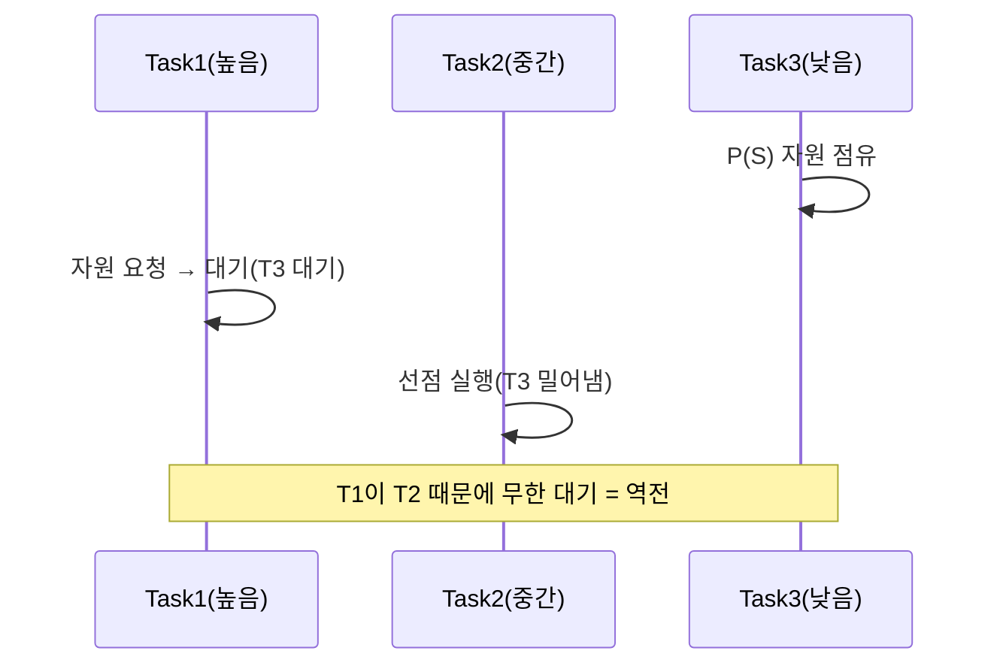

# 우선순위 역전(Priority Inversion)

## 1. 개요

### 가. 정의
> **우선순위 역전**은 실시간 스케줄링에서 **높은 우선순위 태스크가, 낮은 우선순위 태스크가 점유한 공유 자원을 기다리느라 오히려 늦게 실행되는 현상**이다. 우선순위 순서가 사실상 뒤집힌다.

우선순위 역전이 위험한 이유는 '**가장 급한 일이 가장 하찮은 일에 발목 잡힌다**'는 데 있다. 실시간 시스템은 우선순위가 높은 태스크를 먼저 처리하도록 설계된다. 그런데 공유 자원(예: 세마포어로 보호된 데이터)이 개입하면 문제가 생긴다. 낮은 우선순위 태스크(Task3)가 자원을 잠근(P 연산) 상태에서, 높은 우선순위 태스크(Task1)가 그 자원을 필요로 하면 Task1은 Task3이 자원을 풀 때까지 기다려야 한다. 여기까진 불가피하다. 진짜 문제는, 그 사이 **중간 우선순위 태스크(Task2)** 가 끼어들어 Task3을 밀어내고 CPU를 차지하는 경우다. Task3은 실행되지 못해 자원을 풀지 못하고, Task1은 Task2보다 우선순위가 높은데도 Task2 때문에 무한정 대기한다. 우선순위가 낮은 Task2가 높은 Task1을 앞지르는 역전이 벌어진 것이다. 실제로 1997년 화성 탐사선 패스파인더가 이 문제로 반복 재부팅된 유명한 사례가 있다.

### 나. 발생 조건
공유 자원(상호배제), 세 단계 이상의 우선순위, 그리고 중간 우선순위 태스크의 선점이 겹칠 때 발생한다.

## 2. 발생 사례 (P/V 연산 기반)

Task3이 P(S)로 자원을 잠근 뒤, Task1이 같은 자원을 요구해 대기에 들어간다. 이때 Task2가 나타나 Task3을 선점하면, Task3은 V(S)로 자원을 풀지 못하고 Task1은 계속 대기한다. 결국 우선순위가 낮은 Task2가 높은 Task1보다 먼저 수행된다.

## 3. 해결 기법

우선순위 역전의 해법은 자원을 점유한 낮은 우선순위 태스크의 우선순위를 일시적으로 끌어올려, 중간 태스크의 선점을 막는 것이다.

| 기법 | 원리 |
|---|---|
| **우선순위 상속(Priority Inheritance)** | 자원 점유 태스크(T3)가, 대기 중인 높은 태스크(T1)의 우선순위를 일시 상속받아 빠르게 실행·자원 반납 |
| **우선순위 상한(Priority Ceiling)** | 자원마다 상한 우선순위를 정해, 자원 점유 시 그 상한으로 즉시 승격 → 교착·역전 예방 |

**우선순위 상속**은 T3이 자원을 잠근 동안 T1의 높은 우선순위를 물려받아, T2가 선점하지 못하게 한다. 자원을 풀면 원래 우선순위로 복귀한다. **우선순위 상한**은 자원별로 미리 정한 최고 우선순위(상한)로 점유 즉시 올려, 역전뿐 아니라 교착상태(deadlock)까지 방지한다.

## 4. 고려사항 및 시사점

1. **실시간 시스템의 신뢰성 필수 요소**다. 마감시간(deadline)을 반드시 지켜야 하는 실시간 시스템에서 우선순위 역전은 치명적 지연을 낳으므로, RTOS는 우선순위 상속·상한을 기본 지원한다.
2. **기법의 트레이드오프**를 이해한다. 우선순위 상속은 구현이 단순하나 연쇄 상속·교착 가능성이 있고, 우선순위 상한은 교착까지 막지만 상한 설정·관리가 필요하다.
3. **공유 자원 최소화가 근본 예방**이다. 애초에 우선순위가 다른 태스크 간 공유 자원을 줄이거나, 임계구역을 짧게 유지하면 역전 발생 여지 자체가 줄어든다.

---

> **한 줄 요약**: 우선순위 역전은 *높은 우선순위 태스크가 낮은 태스크의 자원 점유와 중간 태스크 선점 때문에 늦게 실행되는 현상* 으로, 우선순위 상속(대기 태스크 우선순위 상속)과 우선순위 상한(자원별 상한 승격)으로 해결한다.
