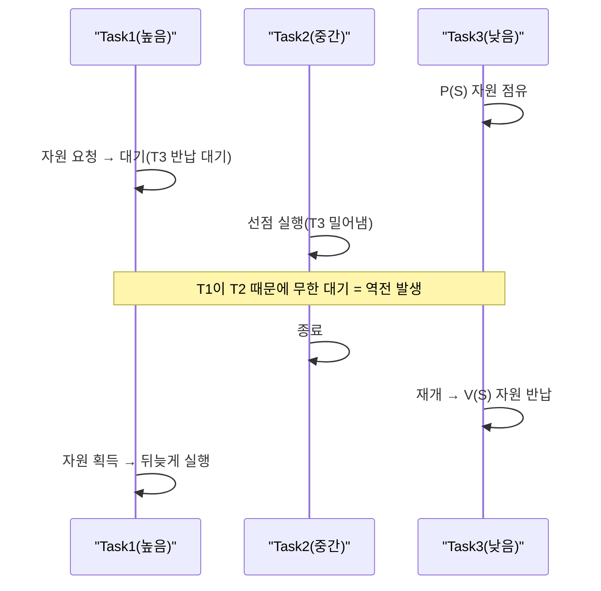

# 우선순위 역전(Priority Inversion)

## 1. 개요

### 가. 정의
> **우선순위 역전(Priority Inversion)** 은 실시간 스케줄링에서 **높은 우선순위 태스크가, 낮은 우선순위 태스크가 점유한 공유 자원을 기다리느라 오히려 더 늦게 실행되는 현상**이다. 우선순위 순서가 사실상 뒤집혀, 낮은 우선순위 작업이 높은 우선순위 작업을 앞지르게 된다.

우선순위 역전이 위험한 이유는 '**가장 급한 일이 가장 하찮은 일에 발목 잡힌다**'는 데 있다. 실시간 시스템(RTOS)은 마감시간(deadline)을 지켜야 하는 급한 태스크에 높은 우선순위를 부여하고, 스케줄러가 항상 준비된(ready) 태스크 중 우선순위가 가장 높은 것을 먼저 실행하도록 설계된다. 이 규칙이 지켜지는 한 응답 시간은 예측 가능하다. 그런데 여러 태스크가 하나의 공유 자원(예: 세마포어로 보호된 전역 버퍼)을 함께 쓰는 순간, 이 예측 가능성이 무너질 수 있다.

문제의 씨앗은 상호배제(mutual exclusion)다. 낮은 우선순위 태스크가 자원을 잠근 상태에서 높은 우선순위 태스크가 같은 자원을 요구하면, 높은 태스크는 낮은 태스크가 자원을 풀 때까지 기다릴 수밖에 없다. 여기까지는 상호배제를 쓰는 이상 불가피한 '정상적 대기'다. 진짜 문제는 그 대기 사이에 **중간 우선순위 태스크가 끼어들어** 자원을 쥔 낮은 태스크를 밀어내고 CPU를 차지할 때 발생한다. 자원을 쥔 태스크가 실행되지 못하니 자원을 풀지도 못하고, 결국 가장 높은 우선순위 태스크가 자기보다 낮은 중간 태스크 때문에 하염없이 대기하게 된다. 이 대기 시간의 상한을 예측할 수 없다는 점이 실시간 시스템에서 치명적이다.

실제로 1997년 NASA의 화성 탐사선 **마스 패스파인더(Mars Pathfinder)** 가 착륙 후 반복적으로 재부팅되는 장애를 겪었는데, 그 원인이 바로 이 우선순위 역전이었다. 자원을 쥔 낮은 우선순위 태스크가 중간 우선순위 통신 태스크에 밀려 자원을 풀지 못하자, 높은 우선순위 관리 태스크의 마감을 감시하던 워치독 타이머가 시스템을 리셋시킨 것이다. 이 사례는 우선순위 역전이 이론적 위험이 아니라 실제 임무를 위태롭게 하는 현실적 결함임을 보여 준다.

### 나. 발생 조건
우선순위 역전은 세 가지 조건이 겹칠 때 발생한다. 첫째, 태스크들이 **상호배제로 보호되는 공유 자원**을 나눠 쓴다. 둘째, 우선순위가 **세 단계 이상**(높음·중간·낮음)으로 구분된다. 셋째, 낮은 태스크가 자원을 쥔 사이 **중간 우선순위 태스크가 선점(preempt)** 할 수 있다. 이 중 하나라도 빠지면 무한 지연으로 이어지는 역전은 성립하지 않는다. 예컨대 태스크가 두 단계뿐이면 자원을 기다리는 것은 유한한 임계구역 시간 안에 끝난다.

## 2. 발생 사례 (P/V 연산 기반)

세마포어의 P(획득)·V(반납) 연산으로 역전이 벌어지는 과정을 시간 순으로 보면 다음과 같다. Task1이 가장 높고, Task2가 중간, Task3이 가장 낮은 우선순위라고 하자.

```mermaid
sequenceDiagram
  participant T1 as "Task1(높음)"
  participant T2 as "Task2(중간)"
  participant T3 as "Task3(낮음)"
  T3->>T3: P(S) 자원 점유
  T1->>T1: 자원 요청 → 대기(T3 반납 대기)
  T2->>T2: 선점 실행(T3 밀어냄)
  Note over T1,T3: T1이 T2 때문에 무한 대기 = 역전 발생
  T2->>T2: 종료
  T3->>T3: 재개 → V(S) 자원 반납
  T1->>T1: 자원 획득 → 뒤늦게 실행
```

처음에 낮은 우선순위 Task3이 실행 중 P(S)로 공유 자원을 잠근다. 그 사이 Task1이 깨어나 같은 자원을 요구하지만, 이미 Task3이 점유했으므로 Task1은 대기 상태로 들어간다. 여기까지는 Task3의 짧은 임계구역만 지나면 곧 풀릴, 감내할 만한 지연이다.

역전이 성립하는 결정적 순간은 이때 **Task2가 준비 상태가 되는 경우**다. Task2는 Task3보다 우선순위가 높으므로 스케줄러는 Task3을 밀어내고 Task2를 실행한다. Task2는 자원과 무관하게 자기 일을 하지만, 그 바람에 Task3은 CPU를 얻지 못해 V(S)로 자원을 반납할 기회조차 잃는다. 결과적으로 자원을 기다리는 Task1은 Task2가 끝날 때까지 계속 대기한다.

여기서 뒤집힘(inversion)의 본질이 드러난다. 우선순위가 가장 높은 Task1이, 자원과 아무 상관 없는 중간 우선순위 Task2보다 늦게 실행된 것이다. 게다가 Task2가 여러 개 몰리거나 반복 실행되면 Task1의 대기 시간은 이론상 무한정 늘어날 수 있어, '지연의 상한을 계산할 수 없는' 상태가 된다. 실시간 시스템의 존재 이유인 응답 시간 보장이 이 지점에서 붕괴한다.

## 3. 해결 기법

우선순위 역전의 해법은 공통적으로 '**자원을 점유한 낮은 우선순위 태스크의 우선순위를 일시적으로 끌어올려, 중간 우선순위 태스크의 선점을 막는다**'는 발상에 기반한다. 자원을 쥔 태스크가 중간 태스크에 밀리지 않고 빨리 임계구역을 벗어나 자원을 반납하게 하면, 높은 태스크의 대기 시간이 임계구역 길이로 유계(bounded)해진다.

| 기법 | 원리 | 특징 |
|---|---|---|
| **우선순위 상속(Priority Inheritance)** | 자원 점유 태스크(T3)가, 대기 중인 높은 태스크(T1)의 우선순위를 일시 상속받아 빠르게 실행·자원 반납 | 발생 시 대응, 구현 단순 |
| **우선순위 상한(Priority Ceiling)** | 자원마다 상한 우선순위를 정해, 자원 점유 시 그 상한으로 즉시 승격 → 교착·역전 예방 | 사전 예방, 교착까지 방지 |

### 가. 우선순위 상속 프로토콜
**우선순위 상속(Priority Inheritance Protocol, PIP)** 은 역전이 감지되는 순간 대응하는 방식이다. 높은 우선순위 Task1이 Task3이 쥔 자원을 기다리기 시작하면, Task3이 그 순간 Task1의 높은 우선순위를 '물려받는다'. 우선순위가 올라간 Task3은 중간 우선순위 Task2에 선점당하지 않으므로 자기 임계구역을 신속히 끝내고 V(S)로 자원을 반납한다. 자원을 반납하는 즉시 Task3은 원래의 낮은 우선순위로 복귀하고, 대기하던 Task1이 자원을 얻어 실행된다.

패스파인더 사고의 실제 해결책이 바로 이 우선순위 상속이었다. 지구에서 문제의 세마포어에 상속 옵션을 켜도록 소프트웨어를 원격 패치해 재부팅 현상을 잡았다는 점은, 이 기법의 실효성을 상징적으로 보여 준다. 다만 우선순위 상속은 여러 자원이 얽히면 상속이 꼬리를 무는 **연쇄 상속(chained blocking)** 이 생겨 지연 계산이 복잡해지고, 교착상태(deadlock) 자체를 막지는 못한다는 한계가 있다.

### 나. 우선순위 상한 프로토콜
**우선순위 상한(Priority Ceiling Protocol, PCP)** 은 문제를 사전에 예방하는 방식이다. 각 공유 자원에 대해, 그 자원을 사용할 수 있는 태스크들 중 가장 높은 우선순위를 '상한(ceiling)'으로 미리 지정해 둔다. 어떤 태스크가 그 자원을 점유하는 순간, 자기 원래 우선순위와 무관하게 즉시 그 상한 우선순위로 승격된다. 이렇게 하면 자원을 쥔 태스크는 애초에 중간 태스크에 밀리지 않고, 나아가 서로 다른 태스크가 여러 자원을 엇갈려 잠그는 상황이 원천 차단되어 **교착상태와 연쇄 블로킹까지 예방**된다.

두 기법은 성격이 다르다. 우선순위 상속이 역전이 실제로 벌어질 때 사후적으로 우선순위를 올리는 '대응형'이라면, 우선순위 상한은 자원을 잡는 즉시 최고치로 올려 두는 '예방형'이다. 예방 효과와 교착 방지 측면에서는 상한이 우수하지만, 자원별 상한을 정확히 산정·관리해야 하는 설계 부담이 따른다. 그래서 상용 RTOS(VxWorks, FreeRTOS 등)는 대개 우선순위 상속을 뮤텍스의 기본 옵션으로 제공하고, 안전이 극도로 중요한 시스템에서 상한 프로토콜을 선택적으로 쓴다.

## 4. 심화 — 실무 적용과 검증 관점

실무에서 우선순위 역전은 '증상은 뚜렷한데 원인은 숨는' 유형의 결함이다. 겉으로는 특정 고우선순위 작업이 간헐적으로 마감을 놓치는 형태로 나타나지만, 정작 그 작업의 코드에는 문제가 없고 무관한 자원 경합이 근본 원인이기 때문에 재현과 추적이 어렵다. 그래서 설계 단계에서 공유 자원별로 이를 사용하는 태스크의 우선순위 스펙트럼을 목록화하고, 세 단계 이상 걸친 자원에는 상속·상한 프로토콜을 명시적으로 적용하는 예방적 접근이 중요하다.

검증 관점에서는 **응답 시간 분석(Response Time Analysis)** 과 **최악 실행 시간(WCET, Worst-Case Execution Time)** 산정이 핵심이다. 우선순위 상속·상한을 적용하면 높은 태스크가 낮은 태스크에 의해 지연될 수 있는 시간(blocking time)의 상한이 '임계구역 길이 한 번'으로 유계되므로, 이를 스케줄 가능성 분석(예: RMA, Rate Monotonic Analysis)의 블로킹 항으로 넣어 마감 준수 여부를 정량적으로 증명할 수 있다. 항공전자(DO-178C), 자동차(ISO 26262) 같은 안전 표준을 따르는 도메인에서는 이러한 시간 유계성 증명이 인증 요건에 포함되므로, 우선순위 역전 방지는 기능이 아니라 안전의 문제가 된다.

한편 최근의 멀티코어 실시간 시스템에서는 문제가 더 복잡해진다. 코어 간에 태스크가 분산되면 한 코어의 태스크가 다른 코어가 쥔 자원을 기다리는 상황이 생기고, 이를 다루기 위해 MSRP·MrsP 같은 멀티코어용 자원 공유 프로토콜이 연구·적용되고 있다. 세부 기법과 적용 범위는 계속 발전하는 영역이므로, 실제 채택 시에는 사용 중인 RTOS와 하드웨어가 지원하는 프로토콜을 공식 문서로 확인하는 것이 바람직하다.

## 5. 고려사항 및 시사점 (기술사 관점)

1. **실시간 시스템의 신뢰성을 좌우하는 필수 요소다.** 마감시간을 반드시 지켜야 하는 실시간 시스템에서 우선순위 역전은 예측 불가능한 지연을 낳아 마감 위반으로 직결되므로, RTOS는 우선순위 상속·상한을 뮤텍스의 기본 또는 선택 기능으로 지원한다. 단순 세마포어 대신 상속 기능이 있는 뮤텍스를 쓰는 것만으로도 상당수 위험을 줄일 수 있다.
2. **기법의 트레이드오프를 정확히 이해하고 선택한다.** 우선순위 상속은 구현이 단순하고 발생 시 대응하지만 연쇄 블로킹·교착 가능성이 남고, 우선순위 상한은 교착까지 예방하지만 자원별 상한 산정·관리라는 설계 비용을 요구한다. 시스템의 안전 등급과 자원 얽힘 정도에 맞춰 선택해야 한다.
3. **공유 자원 최소화가 가장 근본적인 예방이다.** 애초에 우선순위가 다른 태스크 간 공유 자원을 줄이고, 불가피한 경우 임계구역을 최대한 짧게 유지하면 블로킹 시간 자체가 줄어 역전의 여지와 지연 상한이 함께 작아진다. 무잠금(lock-free) 자료구조나 메시지 큐 기반 설계로 공유 상태 자체를 없애는 접근도 유효하다.
4. **시간 유계성을 정량적으로 증명해야 한다.** 프로토콜 적용은 그 자체가 목적이 아니라, 최악의 블로킹 시간을 유계화해 스케줄 가능성 분석으로 마감 준수를 증명하기 위한 수단이다. 안전 필수 시스템에서는 이 증명이 인증 요건이므로 WCET 산정·응답 시간 분석과 함께 설계·검증 프로세스에 통합해야 한다.

## 참고자료
- What Really Happened on Mars? (Mike Jones, NASA JPL 사례 정리) — https://www.rapitasystems.com/blog/what-really-happened-software-mars-pathfinder-spacecraft
- FreeRTOS — Priority Inheritance/Mutexes 문서 — https://www.freertos.org/Real-time-embedded-RTOS-mutexes.html

---

> **한 줄 요약**: 우선순위 역전은 *높은 우선순위 태스크가 낮은 태스크의 자원 점유와 중간 태스크의 선점 때문에 예측 불가능하게 늦게 실행되는 현상* 으로, 우선순위 상속(대기 태스크의 우선순위 일시 상속)과 우선순위 상한(자원별 상한으로 즉시 승격, 교착까지 예방)으로 해결하며, 궁극적으로는 공유 자원·임계구역 최소화로 예방한다.
