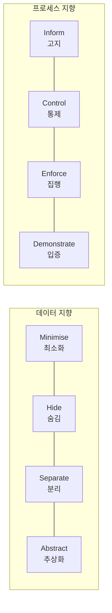

# PbD(Privacy by Design)

## 1. 개요

### 가. 정의
> Ann Cavoukian(온타리오주 정보프라이버시위원)이 창안한, 시스템·서비스·비즈니스 프로세스를 **설계하는 시점부터 프라이버시 보호를 선제적으로 내재화**하는 개인정보 보호 방법론. GDPR 제25조 "**Data Protection by Design and by Default**"로 법제화되었다.

PbD의 핵심 발상은 프라이버시를 **사후에 덧붙이는 기능이 아니라, 설계의 기본 사양(default specification)** 으로 삼는 것이다. 즉 개인정보 보호를 별도 옵션으로 두어 사용자가 켜야 하는 것이 아니라, 아무 설정도 하지 않아도 가장 보호받는 상태가 기본이 되도록 한다. 이는 "일단 만들고 문제가 생기면 고친다"는 전통적 접근을 뒤집는다.

### 나. 등장 배경 및 필요성
과거의 개인정보 보호는 유출 사고가 터진 뒤 대응하는 **사후·대증적** 방식이었다. 그러나 빅데이터·IoT·AI 환경에서는 데이터가 방대하게 수집·결합·재사용되어, 한 번 유출되면 회복이 사실상 불가능하고 사후 대응으로는 피해를 막을 수 없다. 또 시스템이 완성된 뒤 프라이버시를 끼워 넣으려면 재설계 비용이 크고 누락되기 쉽다. 그래서 **설계 단계에서 구조적으로** 보호를 심어 두어야 한다는 요구가 커졌고, 이것이 PbD가 GDPR을 비롯한 각국 규제의 원칙으로 채택된 배경이다.

## 2. PbD 7대 원칙

7대 원칙은 "언제·무엇을·어떻게" 보호할지의 철학을 규정한다. 특히 4번째 **Positive-Sum(포지티브섬)** 원칙은 PbD의 독창성을 보여준다 — 프라이버시와 보안(또는 편의)을 "하나를 얻으면 하나를 잃는" 제로섬으로 보지 않고, 설계를 잘하면 **둘 다 달성**할 수 있다는 관점이다.

| # | 원칙 | 의미 |
|---|---|---|
| 1 | **사전 예방적(Proactive)** | 사고 후가 아니라 발생 전에 대비 |
| 2 | **기본값으로서의 프라이버시(Default)** | 설정 없이도 최대 보호가 기본 |
| 3 | **설계에 내재화(Embedded)** | 부가기능이 아닌 설계 자체에 포함 |
| 4 | **완전한 기능성(Positive-Sum)** | 프라이버시-보안·편의의 양립 |
| 5 | **전 생애주기 보호(End-to-End)** | 수집~파기까지 전 구간 보호 |
| 6 | **가시성·투명성(Visibility)** | 처리 과정을 검증 가능하게 공개 |
| 7 | **이용자 프라이버시 존중(User-Centric)** | 정보주체 이익을 최우선 |

## 3. PbD 8대 전략

7대 원칙이 '철학'이라면, Jaap-Henk Hoepman의 8대 전략은 이를 실제 구현하기 위한 **엔지니어링 지침**이다. 데이터 자체를 다루는 4개(데이터 지향)와 처리 과정을 다루는 4개(프로세스 지향)로 나뉜다.

데이터 지향 전략은 "**애초에 개인정보를 적게, 안 보이게, 흩어서, 뭉뚱그려**" 다루자는 것이다. **최소화**는 목적에 꼭 필요한 데이터만 수집하고(수집 자체를 줄이면 유출 위험도 원천 감소), **숨김**은 암호화·접근통제로 노출을 막으며, **분리**는 데이터를 여러 저장소로 나눠 결합에 의한 식별을 어렵게 하고, **추상화**는 개별 값 대신 집계·범주로 다뤄 식별성을 낮춘다.

프로세스 지향 전략은 "**처리 과정을 투명하게, 주체가 통제하게, 규칙을 강제하고, 지킴을 증명**"하는 것이다. **고지**는 무엇을 왜 처리하는지 알리고, **통제**는 정보주체가 동의·열람·삭제권을 행사하게 하며, **집행**은 정책이 실제 지켜지도록 기술·조직적 통제를 두고, **입증**은 준수 사실을 로그·감사로 증명해 **책임성(accountability)** 을 확보한다.

| 구분 | 전략 |
|---|---|
| **데이터 지향** | 최소화(Minimise)·숨김(Hide)·분리(Separate)·추상화(Abstract) |
| **프로세스 지향** | 고지(Inform)·통제(Control)·집행(Enforce)·입증(Demonstrate) |

## 4. 개인정보보호법 제3조 원칙과의 비교

PbD의 전략은 우연히도 우리 **개인정보보호법 제3조(개인정보 보호 원칙)** 와 상당 부분 대응한다. 이는 두 체계가 공통적으로 **최소수집·목적제한·안전성·투명성·책임성** 이라는 보편 원칙에서 출발했기 때문이다. 예컨대 회원가입 시 서비스에 불필요한 주민등록번호를 받지 않는 것은 PbD의 Minimise이자 법 제3조의 최소수집 원칙을 동시에 만족한다.

| PbD 전략 | 개인정보보호법 제3조 |
|---|---|
| **Minimise** | 목적에 필요한 **최소 수집** |
| **Inform·Control** | 정보주체 **고지·동의·권리 보장** |
| **Enforce·Demonstrate** | **안전성 확보조치·책임성** |
| **Hide·Separate** | 안전한 관리(암호화·접근통제·분리) |
| **Abstract** | **익명·가명처리** |

## 5. 고려사항 및 시사점
- **DPIA 연계**: PbD는 **개인정보 영향평가(DPIA/PIA)** 를 통해 설계 초기에 프라이버시 리스크를 식별·완화하는 프로세스로 구체화된다. 설계와 평가가 짝을 이뤄야 실효성이 생긴다.
- **PET로 기술 구현**: 가명·익명처리, **차분 프라이버시**, **동형암호**, 연합학습 같은 프라이버시 강화기술(PET)로 8대 전략을 실제 구현한다.
- **트레이드오프**: 데이터 최소화·추상화는 프라이버시를 높이지만 데이터 분석의 정밀도(효용)를 떨어뜨린다. Positive-Sum을 지향하되, 목적별로 **프라이버시-효용의 균형점**을 설계로 찾아야 한다.
- **전망**: AI·빅데이터 시대에 데이터 활용과 보호를 동시에 요구받으면서, PbD는 선택이 아닌 **필수 설계 원칙**이자 규제 준수의 전제로 자리 잡고 있다.

---

> **한 줄 요약**: PbD는 *설계 단계부터 프라이버시를 선제·기본값으로 내재화* 하는 방법론으로, 7대 원칙(특히 Positive-Sum)과 데이터·프로세스 지향 8대 전략이 개인정보보호법 제3조의 최소수집·안전성·투명성·책임성 원칙과 상응하며 DPIA·PET로 구현된다.
