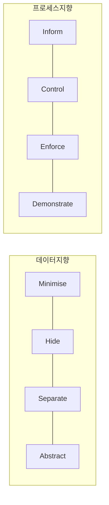

# PbD(Privacy by Design)

## 1. 개요

### 가. 정의
> Ann Cavoukian이 창안한, 시스템·서비스 **설계 단계부터 프라이버시를 선제적으로 내재화**하는 개인정보 보호 방법론. GDPR(제25조 Data Protection by Design)에 반영.

### 나. 필요성
- 사후 대응의 한계 → **선제적·구조적** 프라이버시 보호
- 광범위 네트워크·빅데이터 환경의 데이터 처리 폐해 방지

## 2. PbD 7대 원칙

| # | 원칙 |
|---|---|
| 1 | **사전 예방적**(Proactive, 사후 아닌 선제) |
| 2 | **기본값으로서의 프라이버시**(Privacy as Default) |
| 3 | **설계에 내재화**(Embedded into Design) |
| 4 | **완전한 기능성**(Positive-Sum, 프라이버시-보안 양립) |
| 5 | **전 생애주기 보호**(End-to-End Security) |
| 6 | **가시성·투명성**(Visibility·Transparency) |
| 7 | **이용자 프라이버시 존중**(User-Centric) |

## 3. PbD 8대 전략

| 구분 | 전략 |
|---|---|
| **데이터 지향** | 최소화(Minimise)·숨김(Hide)·분리(Separate)·추상화(Abstract) |
| **프로세스 지향** | 고지(Inform)·통제(Control)·집행(Enforce)·입증(Demonstrate) |

## 4. 개인정보보호법 제3조 원칙과의 비교

| PbD 전략 | 개인정보보호법 제3조 |
|---|---|
| **Minimise** | 목적에 필요한 **최소 수집** |
| **Inform·Control** | 정보주체 **고지·동의·권리 보장** |
| **Enforce·Demonstrate** | **안전성 확보조치·책임성** |
| **Hide·Separate** | 안전한 관리(암호화·분리) |
| **Abstract** | 익명·가명처리 |

- 공통: **최소수집·목적제한·안전성·투명성·책임성**을 설계에 반영

## 5. 시사점
- **DPIA(개인정보 영향평가)**·프라이버시 엔지니어링과 연계
- PET(가명·차분·동형암호)로 기술적 구현
- AI·빅데이터 시대의 필수 설계 원칙

---

> **한 줄 요약**: PbD는 *설계 단계부터 프라이버시를 선제·기본값으로 내재화* 하는 방법론으로, 7대 원칙과 8대 전략(데이터·프로세스)이 개인정보보호법 제3조의 최소수집·투명성·책임성 원칙과 상응한다.
