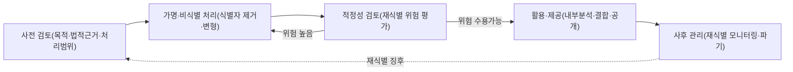
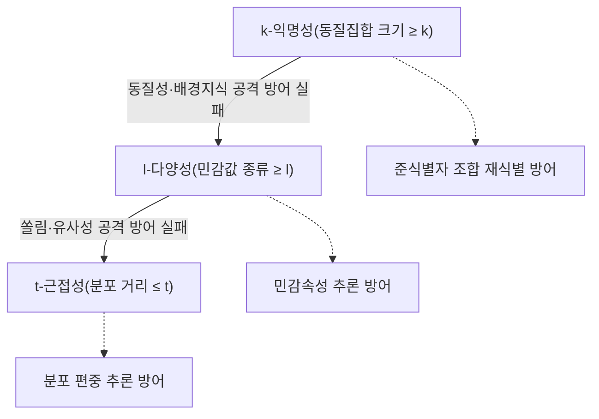

# 개인정보 비식별 조치와 프라이버시 보호 모델(k-익명성·l-다양성·t-근접성)

## 1. 개요

> **정의**: 개인정보 비식별 조치란 정보 집합물에서 특정 개인을 알아볼 수 없도록 식별자를 제거·변형하는 일련의 기술적·관리적 처리이며, k-익명성·l-다양성·t-근접성은 그 결과물이 재식별에 얼마나 견디는지를 정량적으로 판정하는 프라이버시 보호 모델(privacy protection model)이다.

데이터 경제가 확산되면서 조직은 보유한 개인정보를 통계·연구·인공지능 학습에 활용하려는 강한 유인을 갖게 되었으나, 원본을 그대로 사용하면 개인정보 보호법상 동의·목적 제한의 벽에 부딪힌다.
이를 해소하기 위해 이름·주민등록번호 같은 직접 식별자를 지우는 단순 익명화가 오랫동안 사용되어 왔지만, 실무에서는 이 방식만으로 개인이 다시 특정되는 사고가 반복적으로 발생했다.
문제의 핵심은 개인을 특정하는 힘이 하나의 식별자에 있는 것이 아니라, 성별·생년월일·우편번호 같은 여러 준식별자(quasi-identifier)의 **조합**과 외부에 이미 공개된 데이터와의 **결합**에 있다는 점이다.
따라서 오늘날의 비식별은 "무엇을 지웠는가"가 아니라 "남은 데이터로 개인을 되찾을 수 있는가"라는 재식별 위험의 관점에서 설계·검증되어야 한다.

비식별 조치는 그 자체로 목적이 아니라 데이터 활용과 개인정보 보호라는 상충하는 두 가치를 조정하는 균형 장치다.
지나치게 강하게 처리하면 데이터의 분석적 유용성(utility)이 사라져 활용 목적을 달성하지 못하고, 반대로 느슨하게 처리하면 재식별 위험이 남아 법적·윤리적 책임을 지게 된다.
기술사는 개별 알고리즘의 우열을 나열하는 데 그치지 말고, 처리 목적·데이터 민감도·이용 환경(내부 활용 vs 외부 공개)·잔여 위험 수용 수준을 종합해 적정 보호 수준을 판단하고 그 근거를 문서화하는 거버넌스를 설계해야 한다.

## 2. 비식별 조치의 처리 절차와 정보 유형

### 2.1 전체 처리 절차

우리나라의 「가명정보 처리 가이드라인」(개인정보보호위원회, 2024.2 개정)과 과거 「개인정보 비식별 조치 가이드라인」은 비식별을 단발성 변환이 아니라 **사전검토 → 처리 → 적정성 검토 → 안전한 관리**의 순환 절차로 규정한다.
이는 비식별이 데이터를 한 번 가공하면 끝나는 작업이 아니라, 결과물의 위험을 다시 측정하고 재식별 시도가 없는지 지속 관리해야 하는 통제 활동임을 의미한다.

사전 검토 단계에서는 처리 목적을 명확히 하고 그 목적에 필요한 최소 항목만 남기는 데이터 최소화를 적용한다.
목적이 통계·연구·인공지능 학습 등 개인정보 보호법 제28조의2가 허용하는 범위인지, 특정 개인을 알아보려는 시도를 배제하는 통제가 마련되어 있는지가 이 단계의 핵심 판단이다.
처리 단계에서는 뒤에서 설명할 다섯 가지 기법을 조합해 식별 위험을 낮추되, 준식별자의 조합 위험까지 함께 낮추어야 유효한 비식별이 된다.
적정성 검토는 처리 결과가 실제로 재식별에 견디는지 k-익명성 등 모델로 계량하고, 미흡하면 처리 단계로 되돌아가는 반복 구조를 형성한다.
사후 관리에서는 재식별 시도 모니터링, 접근 통제, 이용 목적 달성 후 파기, 재식별 발생 시 즉시 처리 중단·통지 등의 관리적 통제를 지속한다.

### 2.2 데이터 항목의 유형 구분

비식별을 설계하려면 먼저 각 컬럼이 재식별에서 수행하는 역할을 구분해야 한다.
같은 처리라도 대상이 식별자인지 준식별자인지 민감정보인지에 따라 위험 기여도와 처리 전략이 완전히 달라지기 때문이다.

| 유형 | 정의 | 예시 | 기본 처리 방향 |
|------|------|------|----------------|
| 식별자(Identifier) | 그 자체로 개인 특정 | 성명, 주민등록번호, 휴대전화 | 원칙적 삭제·가명처리 |
| 준식별자(Quasi-identifier) | 조합 시 개인 특정 | 성별, 생년월일, 우편번호, 직업 | 범주화·일반화로 위험 완화 |
| 민감정보(Sensitive Attribute) | 노출 시 프라이버시 침해 | 질병, 소득, 종교, 정치성향 | 값 다양성·분포 보호 |
| 비식별 무관 속성 | 개인 특정과 무관 | 계절, 제품 카테고리 | 대체로 원본 유지 |

여기서 특히 중요한 것은 준식별자다.
1997년 미국에서 스위니(L. Sweeney)는 공개된 매사추세츠 주 공무원 의료기록에서 성별·생년월일·우편번호(ZIP)만으로 주지사를 재식별해 냈고, 이 세 항목의 조합만으로 미국 인구의 약 87%가 유일하게 특정된다는 사실을 보였다.
이 사례는 "직접 식별자를 지웠으니 안전하다"는 통념을 깨고, 준식별자 조합에 대한 정량적 보호 모델(k-익명성)이 등장하는 직접적 계기가 되었다.

## 3. 비식별 조치 5대 기법

우리나라 가이드라인은 비식별 처리 기법을 크게 다섯 범주로 제시한다.
각 기법은 단독으로 완전한 안전을 보장하지 않으며, 데이터 항목별 역할과 위험에 맞추어 조합 적용하는 것이 원칙이다.

**가명처리(Pseudonymization)** 는 식별자를 다른 값으로 대체해 원래 값을 감추는 기법으로, 홍길동을 임의의 일련번호나 별칭으로 바꾸는 방식이다.
암호화·토큰화·매핑테이블 방식이 있으며, 매핑을 되돌릴 수 있는 추가 정보(가명키)를 분리 보관하면 필요 시 재연계가 가능하다는 점이 다른 기법과 구별된다.
따라서 가명정보는 "추가 정보 없이는 특정 개인을 알아볼 수 없는" 상태로, 완전 익명정보와 달리 법적으로 여전히 개인정보에 준하는 안전조치 의무가 따른다.

**총계처리(Aggregation)** 는 개별 레코드 대신 합계·평균·최댓값 등 통계값으로 변환해 개인 단위 관측을 없애는 방식이다.
예컨대 개인별 소득을 지역·연령대 평균 소득으로 대체하면 개인 추적이 어려워지지만, 표본이 극소수인 집단에서는 평균만으로도 개인값이 역산될 수 있어 최소 집계 단위를 함께 통제해야 한다.

**데이터 삭제(Data Reduction)** 는 식별 위험이 높은 항목이나 극단값(outlier)을 아예 제거하는 방식이다.
소수의 고령·고소득 이상치는 그 자체로 유일성이 높아 재식별의 출발점이 되므로, 상·하위 특이값을 잘라내거나 부분 삭제하는 처리가 필요하다.

**데이터 범주화(Generalization)** 는 구체적 값을 구간·범주로 뭉뚱그려 유일성을 낮추는 핵심 기법이다.
"1985-03-21"을 "1980년대생"으로, "서울 강남구 역삼동"을 "서울"로 일반화하면 같은 값을 갖는 사람 수가 늘어 개인 특정이 어려워지며, 이는 뒤에서 다룰 k-익명성 달성의 주된 수단이 된다.

**데이터 마스킹(Masking)** 은 값의 일부를 별표 등으로 가리는 방식으로, 주민등록번호 뒷자리나 전화번호 중간자리를 `*`로 처리하는 것이 대표적이다.
화면 표출·운영 환경에서 즉시 적용하기 쉬우나, 마스킹된 부분을 다른 데이터로 유추할 수 있으면 보호 효과가 제한된다.

## 4. 프라이버시 보호 모델: k-익명성·l-다양성·t-근접성

비식별 처리를 아무리 해도 "이 정도면 안전한가"를 판단할 기준이 없으면 자의적 처리가 된다.
프라이버시 보호 모델은 재식별 위험을 정량적으로 판정하는 잣대이며, k-익명성 → l-다양성 → t-근접성으로 갈수록 앞 모델의 허점을 보완하는 방향으로 발전했다.

### 4.1 k-익명성(k-Anonymity)

k-익명성은 스위니가 2002년에 제시한 최초의 정량 모델로, 준식별자 값이 동일한 레코드가 데이터셋 안에 항상 **k개 이상** 존재하도록 만드는 것을 목표로 한다.
같은 준식별자 조합을 공유하는 레코드 묶음을 동질집합(equivalence class)이라 하며, 동질집합의 최소 크기가 k라면 공격자는 특정 개인을 그 안의 k명 중 한 명으로밖에 좁히지 못한다.
예를 들어 k=5이면 "1980년대생·서울·남성" 조합에 해당하는 사람이 항상 5명 이상이므로, 준식별자만으로는 재식별 확률이 1/5 이하로 제한된다.

k값이 클수록 보호는 강해지지만 그만큼 범주화·삭제가 많아져 데이터 유용성은 떨어지므로, k는 보호와 활용의 대표적 트레이드오프 파라미터다.
그러나 k-익명성은 준식별자만 통제할 뿐 민감정보의 값 자체는 보지 않는다는 근본적 한계를 갖는다.
만약 어떤 동질집합 5명의 질병이 모두 "위암"이라면, 공격자는 대상이 그 집합에 속한다는 것만 알아도 질병을 100% 추론할 수 있다(동질성 공격, homogeneity attack).
또한 공격자가 배경지식으로 특정 값을 배제할 수 있으면 남은 후보가 급격히 좁아진다(배경지식 공격, background knowledge attack).

### 4.2 l-다양성(l-Diversity)

l-다양성은 마차나바잘라 등이 2007년에 제안한 보완 모델로, 각 동질집합이 민감정보에 대해 서로 **잘 구별되는 값을 l개 이상** 포함하도록 요구한다.
이는 k-익명성이 방치한 민감속성의 다양성을 강제함으로써 동질성 공격과 배경지식 공격을 완화한다.
즉 "1980년대생·서울·남성" 5명의 질병이 위암 하나로 쏠리지 않고 최소 l가지 이상으로 분포하도록 만들어, 소속만으로는 질병을 단정할 수 없게 한다.

그러나 l-다양성도 값의 "종류 수"만 볼 뿐 그 **분포와 의미적 유사성**은 고려하지 못한다.
동질집합 안에 위암·간암·폐암 세 종류가 있어 l=3을 만족하더라도, 모두 "암"이라는 민감한 사실은 그대로 드러난다(유사성 공격, similarity attack).
또한 10명 중 9명이 위암이고 1명만 감기라면 종류는 둘이지만 실제로는 위암일 확률이 압도적이어서 보호가 무력화된다(쏠림 공격, skewness attack).

### 4.3 t-근접성(t-Closeness)

t-근접성은 리(N. Li) 등이 2007년에 제시한 모델로, 각 동질집합 내 민감정보의 분포가 **전체 데이터셋의 분포와 t 이하로만 차이 나도록** 제한한다.
분포 간 거리는 흔히 EMD(Earth Mover's Distance) 같은 척도로 측정하며, t가 작을수록 개별 집합의 분포가 전체 평균과 비슷해져 소속에서 얻을 수 있는 추가 정보가 줄어든다.
이로써 l-다양성이 막지 못한 쏠림·유사성 공격까지 통제할 수 있어 세 모델 중 가장 강한 보호를 제공한다.

다만 분포를 전체와 유사하게 맞추려면 그만큼 많은 왜곡·범주화가 필요해 데이터 유용성 손실이 가장 크고, 계산 비용도 높다.
따라서 실무에서는 세 모델을 배타적으로 택하기보다, 민감정보의 성격과 활용 목적에 따라 k를 기본으로 하고 민감속성이 중요한 경우 l·t를 추가로 적용하는 단계적 설계가 일반적이다.

| 모델 | 방어 대상 공격 | 통제 대상 | 한계 |
|------|----------------|-----------|------|
| k-익명성 | 준식별자 조합 재식별 | 동질집합 크기 | 동질성·배경지식 공격 |
| l-다양성 | 동질성·배경지식 공격 | 민감값 종류 수 | 유사성·쏠림 공격 |
| t-근접성 | 유사성·쏠림 공격 | 민감값 분포 거리 | 유용성 손실·연산비용 |

## 5. 비교 및 재식별 사고 사례

세 모델의 차이는 "무엇을 통제하느냐"에서 비롯된다.
k-익명성은 준식별자의 **집합 크기**만 보므로 민감값이 한쪽으로 쏠려도 통과하고, l-다양성은 값의 **종류**를 강제하지만 분포와 의미까지는 못 보며, t-근접성은 **분포 자체**를 전체와 맞추므로 가장 강하지만 유용성 손실이 크다.
따라서 질병·소득처럼 민감속성이 분석의 핵심인 데이터에서는 t-근접성 계열의 통제가 필요하고, 준식별자 위주의 활용에서는 적정 k값만으로도 실효적 보호가 가능하다.

실제 사고들은 비식별의 필요성과 한계를 동시에 보여 준다.
2006년 미국 AOL은 사용자 식별자를 임의번호로 바꾼 검색 로그 약 2천만 건을 연구용으로 공개했으나, 검색어 조합(지명·이름·질병 검색 등)만으로 특정 개인이 언론에 의해 재식별되어 데이터가 즉시 회수되었다.
2008년에는 나라야난과 슈마티코프가 넷플릭스가 공개한 익명 영화 평점 데이터를 공개된 IMDb 평점과 결합해 다수 가입자를 재식별함으로써, 준식별 정보의 **외부 데이터 결합** 위험을 실증했다.
국내에서도 여러 기관 데이터를 결합해 활용하려는 수요가 커지면서, 개인정보보호위원회가 지정한 **결합전문기관**을 통해 서로 다른 개인정보처리자의 가명정보를 안전하게 결합하고 반출 전 적정성을 검토하도록 제도화되어 있다.

## 6. 심화: 가명정보 특례와 최신 동향

2020년 데이터 3법 개정으로 개인정보 보호법에 **가명정보** 개념이 도입되면서, 통계작성·과학적 연구·공익적 기록보존 목적에 한해 정보주체 동의 없이 가명정보를 처리할 수 있는 특례가 마련되었다.
이는 비식별을 자율 가이드라인 수준에서 법정 제도로 끌어올린 전환점으로, 가명처리→활용→결합→안전조치의 전 과정에 법적 근거와 의무를 부여했다.
가명정보는 완전 익명정보와 달리 여전히 관리 대상이므로, 추가 정보의 분리 보관, 재식별 금지, 재식별 발생 시 처리 중단·통지 등의 안전조치가 강제된다.

기술 환경도 빠르게 변하고 있다.
개인정보보호위원회의 「가명정보 처리 가이드라인」은 2024년 2월 개정을 통해 기존의 정형(테이블) 데이터를 넘어 **음성·이미지·영상 등 비정형 데이터**의 가명처리 방법과 인공지능 학습을 위한 활용 방안을 새롭게 다루었다.
비정형 데이터는 얼굴·목소리 자체가 식별자가 되므로 마스킹·블러·합성 등 도메인 특화 기법이 필요하고, 대규모 AI 학습 데이터에서는 개별 레코드가 아니라 모델이 학습 데이터를 기억(memorization)해 유출하는 새로운 위험까지 고려해야 한다.
또한 k-익명성 계열은 "공격자의 배경지식을 제한적으로 가정"하는 반면, 앞서 별도 주제로 다룬 **차등 개인정보보호(Differential Privacy)** 는 배경지식을 가정하지 않는 수학적 보장을 제공한다는 점에서 상호 보완적으로 함께 검토되는 추세다.
예상 출제 방향으로는 "비식별 5대 기법과 3대 프라이버시 모델의 관계", "가명정보 결합 절차와 결합전문기관의 역할", "비식별과 차등 프라이버시의 비교", "비정형·AI 학습 데이터의 가명처리" 등이 답안형으로 자주 요구된다.

## 7. 고려사항 및 시사점

기술사 관점에서 비식별은 기법 선택이 아니라 위험 기반 의사결정이며, 다음을 종합적으로 고려해야 한다.

- **적정 보호 수준의 위험 기반 판단**: k·l·t 값은 클수록 안전하지만 유용성을 희생하므로, 처리 목적·데이터 민감도·이용 환경(내부 폐쇄 활용 vs 외부 공개)·잔여 위험 수용 수준을 근거로 정하고 그 판단 근거를 문서화해야 한다. 외부 공개는 내부 활용보다 훨씬 높은 k와 강한 모델을 요구한다.

- **활용성과 보호의 트레이드오프 관리**: 지나친 범주화·삭제는 분석 결과를 왜곡해 잘못된 의사결정을 유발하므로, 데이터 유용성 지표(정보 손실률, 분석 정확도)를 함께 측정하고 목적 달성에 필요한 최소 처리를 지향해야 한다.

- **결합·외부 데이터 위험의 상시 통제**: 넷플릭스·AOL 사례처럼 재식별은 대개 외부 데이터 결합에서 발생하므로, 결합은 지정된 결합전문기관을 통해 통제하고 공개 이후에도 새로운 공개 데이터의 등장에 따라 재식별 위험을 재평가해야 한다.

- **생애주기 거버넌스와 사후 관리**: 비식별은 1회성 변환이 아니라 사전검토–처리–적정성검토–사후관리의 순환이므로, 접근 통제·재식별 시도 모니터링·목적 달성 후 파기·재식별 발생 시 대응 절차를 조직의 개인정보 보호 체계에 내재화해야 한다.

- **연계 기술과의 조합 전략**: 단일 모델로 모든 위험을 막을 수 없으므로 가명처리·범주화·마스킹을 조합하고, 민감속성이 핵심이거나 반복 질의가 예상되면 차등 개인정보보호·PET(개인정보 보호 강화기술)를 함께 적용하는 다층 방어를 설계해야 한다.

## 참고자료

- 개인정보보호위원회, 「가명정보 처리 가이드라인」(2024.2 개정): https://www.privacy.go.kr/front/bbs/bbsView.do?bbsNo=BBSMSTR_000000000049&bbscttNo=20658
- L. Sweeney, "k-anonymity: A Model for Protecting Privacy", 2002: https://dataprivacylab.org/dataprivacy/projects/kanonymity/kanonymity.pdf
- A. Machanavajjhala et al., "l-Diversity: Privacy Beyond k-Anonymity", 2007: https://personal.utdallas.edu/~muratk/courses/privacy08f_files/ldiversity.pdf
- N. Li et al., "t-Closeness: Privacy Beyond k-Anonymity and l-Diversity", 2007: https://www.cs.purdue.edu/homes/ninghui/papers/t_closeness_icde07.pdf

---
> **한 줄 요약**: 비식별 조치(가명처리·총계·삭제·범주화·마스킹)로 식별 위험을 낮추고, k-익명성(집합 크기)·l-다양성(값 종류)·t-근접성(값 분포)으로 재식별 위험을 정량 검증하되, 결합·외부데이터 위험과 유용성 손실을 위험 기반으로 관리하는 생애주기 거버넌스가 핵심이다.
