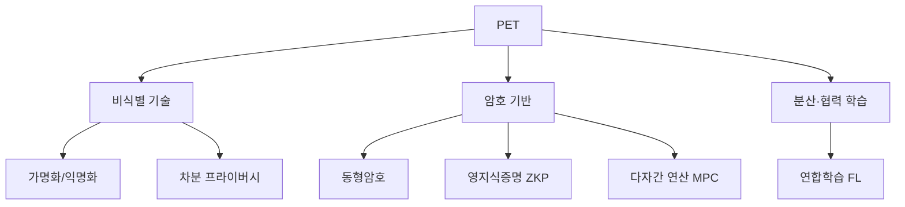

# 개인정보 보호 강화기술(PET, Privacy Enhancing Technologies)

## 1. 개요

### 가. 정의
> 데이터의 **유용성(활용성)을 유지하면서 개인정보를 보호**하기 위해 식별 위험을 제거·최소화하는 기술의 총칭. 데이터 3법·GDPR 준수와 데이터 활용을 동시에 달성한다.

### 나. 필요성
- 데이터 경제 활성화 ↔ **프라이버시 보호** 상충 해소
- AI 학습·데이터 공유 시 **재식별 위험** 방지

## 2. 분류 체계

## 3. 주요 기술

| 기술 | 설명 | 특징 |
|---|---|---|
| **가명화/익명화** | 식별자를 대체·제거 | 간단·법적 근거, 재식별 위험 잔존 |
| **차분 프라이버시(DP)** | 통계에 잡음 추가로 개인 기여 은폐 | 수학적 보장(ε), 정확도 트레이드오프 |
| **동형암호(HE)** | 암호화 상태에서 연산 | 강력한 보안, 높은 연산 비용 |
| **영지식증명(ZKP)** | 정보 노출 없이 사실만 증명 | 인증·블록체인, 검증 효율 |
| **다자간 연산(MPC)** | 데이터 공유 없이 공동 연산 | 협업 분석, 통신 오버헤드 |
| **연합학습(FL)** | 원본 대신 모델 파라미터만 공유 | 데이터 이동 없이 AI 학습 |

## 4. 적용 사례

| 분야 | 활용 |
|---|---|
| **금융** | 기관 간 사기탐지 공동분석(MPC) |
| **의료** | 병원 간 연합학습(FL) |
| **통계·공공** | 차분 프라이버시 기반 통계 공개 |
| **데이터 결합** | 가명정보 결합·데이터 안심구역 |

## 5. 고려사항 및 시사점
- 단일 기술 한계 → **기법 조합(예: FL + DP)** 으로 보안·활용 균형
- 성능 오버헤드(HE·MPC)와 정확도(DP) 손실의 **실용적 튜닝** 필요
- 제도(데이터 3법)·거버넌스와 병행, PbD와 연계

---

> **한 줄 요약**: PET는 *가명·익명화, 차분 프라이버시, 동형암호, ZKP, MPC, 연합학습* 등으로 **데이터 활용과 프라이버시 보호를 동시에** 달성하는 기술군으로, 기법 조합과 제도 병행이 관건이다.
