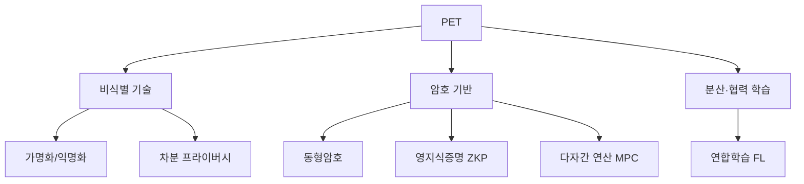

# 개인정보 보호 강화기술(PET, Privacy Enhancing Technologies)

## 1. 개요

### 가. 정의
> 데이터의 **유용성(활용성)을 유지하면서 개인정보 식별 위험을 제거·최소화**하기 위한 기술의 총칭. 데이터 3법·GDPR 준수와 데이터 활용을 동시에 달성한다.

### 나. 등장 배경 및 필요성
데이터 활용과 프라이버시 보호는 전통적으로 **제로섬 관계**로 여겨졌다. 활용하려면 데이터를 공유해야 하는데, 공유하면 개인이 노출되기 때문이다. 특히 단순 익명화만으로는 다른 데이터와 결합해 개인을 다시 특정하는 **재식별 공격**을 막지 못한다는 것이 여러 사례(예: 넷플릭스 익명 평점 데이터의 재식별)로 드러났다. PET는 이 제로섬을 깨기 위해 등장한 기술군으로, "데이터를 보여주지 않고도 계산 결과만 얻는다"거나 "개인 기여를 수학적으로 숨긴다"는 방식으로 **활용과 보호를 양립(포지티브섬)** 시킨다. AI 학습을 위한 대규모 데이터 공유 수요가 커지면서 PET는 프라이버시 규제 준수의 핵심 수단이 되고 있다.

## 2. 분류 체계

PET는 접근 원리에 따라 세 갈래로 나뉜다. **비식별 기술**은 데이터 자체를 변형해 식별성을 낮추는 계열로, 처리 후 데이터를 그대로 활용할 수 있어 간단하지만 재식별 위험이 완전히 사라지지는 않는다. **암호 기반** 계열은 데이터를 암호화한 상태로 계산하거나(동형암호), 원본을 드러내지 않고 사실만 증명하거나(ZKP), 여러 참여자가 각자 데이터를 숨긴 채 공동 계산한다(MPC). 보안 보장은 강력하나 연산·통신 비용이 크다. **분산·협력 학습** 계열은 데이터를 한곳에 모으지 않고 각자 위치에서 학습해 모델만 공유하는 연합학습으로, 데이터 이동 자체를 없앤다.

## 3. 주요 기술

각 기술은 "무엇을 숨기고 무엇을 얻는가"의 트레이드오프가 다르다. **가명화/익명화**는 이름·주민번호 같은 식별자를 가명·마스킹으로 대체하는 가장 기본적 방법으로 법적 근거가 명확하고 처리가 간단하지만, 준식별자 결합에 의한 재식별 위험이 잔존한다. **차분 프라이버시(DP)** 는 통계 결과에 정교하게 계산된 잡음을 더해 "특정 개인이 데이터에 포함됐는지 여부가 결과에 미치는 영향"을 수학적으로 제한(ε로 정량화)하며, 정확도와 보호 강도가 반비례한다. **동형암호(HE)** 는 복호화 없이 암호문 상태에서 덧셈·곱셈 연산을 수행해 클라우드에 맡겨도 원본이 노출되지 않지만 연산이 매우 느리다. **영지식증명(ZKP)** 은 비밀값을 공개하지 않고 "그 값을 안다/조건을 만족한다"는 사실만 증명해 인증·블록체인에 쓰인다. **다자간 연산(MPC)** 은 여러 기관이 각자 데이터를 공개하지 않고 공동 함수만 계산하며, **연합학습(FL)** 은 원본 대신 로컬 학습으로 얻은 모델 파라미터만 중앙에 모아 통합한다.

| 기술 | 원리 | 강점 | 한계(트레이드오프) |
|---|---|---|---|
| **가명화/익명화** | 식별자 대체·제거 | 간단·법적 근거 | 재식별 위험 잔존 |
| **차분 프라이버시(DP)** | 통계에 잡음 추가 | 수학적 보장(ε) | 정확도 손실 |
| **동형암호(HE)** | 암호 상태 연산 | 강력한 기밀성 | 높은 연산 비용 |
| **영지식증명(ZKP)** | 노출 없이 사실 증명 | 인증·블록체인 활용 | 증명 설계 복잡 |
| **다자간 연산(MPC)** | 공유 없이 공동 연산 | 다기관 협업 분석 | 통신 오버헤드 |
| **연합학습(FL)** | 파라미터만 공유 | 데이터 이동 없음 | 모델 역추론 위험 |

## 4. 적용 사례

PET는 데이터 이동이 법·경쟁상 곤란한 도메인에서 특히 진가를 발휘한다. **금융**에서는 여러 은행이 고객 데이터를 서로 넘기지 않고 MPC로 공동 사기탐지 모델을 돌려 단독으로는 못 잡던 다기관 걸친 이상거래를 탐지한다. **의료**에서는 환자 데이터를 병원 밖으로 낼 수 없으므로 각 병원이 로컬 학습만 하고 모델을 모으는 연합학습으로 질병 진단 모델을 공동 개발한다. **통계·공공**에서는 인구 통계를 공개할 때 차분 프라이버시로 잡음을 더해 개별 응답자 보호와 통계 유용성을 동시에 확보한다(미국 인구조사국이 실제 채택).

| 분야 | 활용 |
|---|---|
| **금융** | 기관 간 사기탐지 공동분석(MPC) |
| **의료** | 병원 간 연합학습(FL) |
| **통계·공공** | 차분 프라이버시 기반 통계 공개 |
| **데이터 결합** | 가명정보 결합·데이터 안심구역 |

## 5. 고려사항 및 시사점
- **단일 기술의 한계와 조합**: 어느 하나로 완결되지 않으므로 기법을 조합한다. 예컨대 연합학습(FL)만으로는 파라미터에서 원본이 역추론될 수 있어 **FL + DP**로 잡음을 더하고, MPC와 HE를 결합해 협업과 기밀성을 함께 확보하는 식이다.
- **성능-정확도의 실용적 튜닝**: HE·MPC의 연산·통신 비용과 DP의 정확도 손실은 실무 도입의 걸림돌이므로, 보호 수준(ε 등)과 성능을 업무 요구에 맞춰 조정하는 것이 관건이다.
- **제도·거버넌스 병행**: 기술만으로는 부족하고 데이터 3법·가명정보 제도와 **프라이버시 중심 설계(PbD)** 원칙을 함께 적용해, 설계 단계부터 프라이버시를 내재화해야 지속가능하다.

---

> **한 줄 요약**: PET는 *가명·익명화, 차분 프라이버시, 동형암호, ZKP, MPC, 연합학습* 등으로 **데이터 활용과 프라이버시 보호를 양립**시키는 기술군으로, 각 기법의 보안-성능 트레이드오프를 이해해 조합(FL+DP 등)하고 제도·PbD와 병행하는 것이 관건이다.
